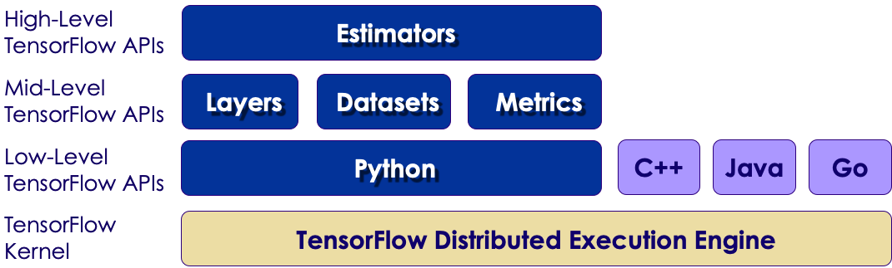

TensorFlow High-Level API
======

## TensorFlow Levels of API

 * TensorFlow has a multi-tiered API
   - Low-Level
   - Mid-Level
   - High-Level

 <!-- {"left" : 0.59, "top" : 3.34, "height" : 2.66, "width" : 9.07} -->

Notes:

---

# Datasets

[Dataset API](./TENSORFLOW-Datasets.md)

# Estimator
[Estimator API](./TENSORFLOW-Estimator.md)

# Linear Regression

[Tensorflow Regression](./TENSORFLOW-Regression.md)
