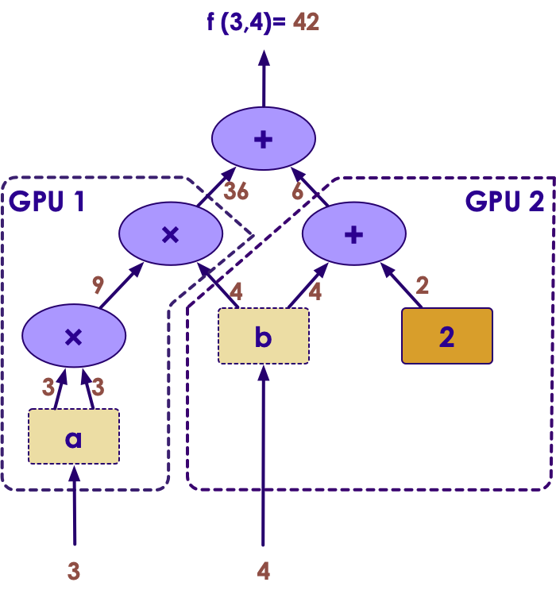

# Introduction to TensorFlow

<!-- TODO shiva -->


---

## Lesson Objectives


 * Understand the needs that TensorFlow addresses

 * Be familiar with TensorFlow's capabilities and advantages

 * Gain an understanding of a basic TensorFlow installation


Notes:


---

# TensorFlow Intro

---

## TensorFlow

<!-- TODO shiva -->


 * __Tensorflow__ is a free and open source library for deep learning with neural networks

 * Tensorflow was devloped by Google Brain team for internal Google use.  Google open sourced TensorFlow in Nov 2015

 * Gained popularity very quickly because of its
    - clean design
    - flexibility
    - scalability
    - huge community
    - and of course Google brand :-)

 * Google is actively developing and supporting TensorFlow; also offers it in Google Cloud platform

- [tensorflow.org](http://www.tensorflow.org/)

---

## TensorFlow Popularity

 * Tensorflow has outpaced its rivals in popularity
 * Here is a survey of Github Stars

<!-- TODO shiva -->

  <!-- {"left" : 0.56, "top" : 2.93, "height" : 4.88, "width" : 9.13} -->


Notes:


---

## Big Spike in Job Postings

  <!-- {"left" : 1.83, "top" : 1.52, "height" : 4.52, "width" : 6.59} -->

 Source: indeed.com

Notes:

---

## TensorFlow Features

 * Runs on all platforms (Windows, Mac, Linux), mobile devices and even in a browser (tensorflow.js)

 * Core is written in C++ ; very efficient implementation
    - Wrappers in Python for ease of use
    - Other language support improving : Java, Go, R

 * Runs on CPU, GPU and TPU (more on this later)

 * Other high level APIs are built on top of TensorFlow
    - [Keras](http://keras.io/) and [Pretty Tensor](https://github.com/google/prettytensor/)

 * Has a very nice UI called **Tensorboard** to visualize graphs and learning process

 * Great community
    - https://github.com/jtoy/awesome-tensorflow

---

## TensorFlow Noteworthy Versions

| Version | Release Date | Noteworthy Features         |
|---------|--------------|-----------------------------|
| 0.01    | 2015-11      | Initial Release from Google |
| 0.20    | 2016-05      | TensorFlow Reaches Maturity |
| 1.0     | 2017-01      | First Stable Release        |
| 1.1     | 2017-07      | Installable with Pip/conda  |
| 1.14    | 2019-02      | Stable 1.x Release          |
| 2.0     | 2019-10      | 2.0 Release (big release)   |

<!-- {"left" : 0.25, "top" : 1.7, "height" : 4.19, "width" : 9.75} -->


Notes:


---

## Tensorflow Hardware Support

<!-- TODO shiva -->

<!-- {"left" : 2.31, "top" : 4.71, "height" : 2.98, "width" : 5.64} -->

- TF can run on multiple hardware devices : CPU, GPU, TPU

- CPU : good for inference (prediction)

- GPU : lots of compute power, good for training

- TPU : highly optimized AI-chip

---

## Using GPUs


 * One of TensorFlow's most exciting features is using GPUs for compute capacity
     - ML is mainly linear algebra (matrix manipulation)
     - GPUs specialize in fast linear algebra.
     - GPUs + ML = match made in heaven.

 * Machines running with GPUs have been shown up to 10x faster.

 * TensorFlow will consume GPU + all its memory
     - So, you can't use the GPU for graphics at the same time
     - Servers don't use graphics anyway
     - Workstations should have two NVIDIA cards.

Notes:


---

## GPU Support

<!-- TODO shiva -->


 * NVIDIA GPUs are best supported
   - use CUDA library
   - very easy to get set up: install tensorflow-gpu
   - Datacenters: *Must* use **Tesla** GPU line per NVIDIA TOS
   - Workstations: Recommend **Quadro**
   - Home/PC: GeForce (Gaming) GPUs work well

 * Tensorflow 2.0 also supports AMD using OpenCL
   - Support a bit new
   - Not as fast as NVidia but hardware is more affordable.
   - Apple/Mac also uses AMD!

 * Intel GPUs not currently supported.

---


## TPU Support

<!-- TODO shiva -->


 * TPU is Google's custom chip built for AI workloads
    - 3rd generation as of March 2018
 * Use cases:
    - Processing Google Streetview photos (extract street numbers / text)
    - Image processing Google Photos
    - AlphaGo game
 * TPUs are have two very distinct use cases: Training and Inference
 * Training TPUs only available in Google Cloud Platform for now
   - High power chip
   - *Free* evaluation with Google Colaboratory
 * Edge TPUs
   - Much smaller and consumes far less power compared to 'data center TPUs'
   - Google Sells physical devices
   - Designed to be used in IOT type devices, robotics, etc

Notes:
- https://en.wikipedia.org/wiki/Tensor_processing_unit

---


## Google Colaboratory


 * Google Colaboratory is a **free** hosted environment for AI

 * Familiar Jupyter notebook environment

 * Provides GPU and TPU platforms!
   - The only **free** GPU and TPU access available!

 * Great for light workloads and evaluation

 * Serious users will want to upgrade to Google Cloud
   - Security
   - Guaranteed performance access


---

## Cloud Cost

* Cost on Google Cloud Platform: (Hourly)

 &nbsp;


| Device | Type | Gen    | Year | Memory | Cost  |
|--------|------|--------|------|--------|-------|
| T4     | GPU  | Turing | 2018 | 16GB   | $0.95 |
| P4     | GPU  | Pascal | 2016 | 16GB   | $0.60 |
| K4     | GPU  | Kepler | 2014 | 16GB   | $0.45 |
| TPU3  | TPU  | 3rd    | 2019 | 64GB   | $8.00 |
| TPU2  | TPU  | 2nd    | 2017 | 64GB   | $4.50 |

<!-- {"left" : 0.25, "top" : 2.18, "height" : 3, "width" : 9.75} -->

---

## Tensorflow vs. Scikit-learn

| TensorFlow                                                                           | Scikit-Learn                                |
|--------------------------------------------------------------------------------------|---------------------------------------------|
| Focused on Neural Networks and Deep Learning Models (Other Algorithms Available too) | Focused on a wide-variety of ML algorithms  |
| Base Framework low-level (Wrappers available for high-level)                         | Higher-level API                            |
| Distributed Execution Model                                                          | Not Distributed                             |
| Extensive GPU Optimization                                                           | Not GPU Optimized                           |
| Support for Distributed File Systems (HDFS)                                          | No Support for Hadoop                       |
| Supports Python API (primary), plus Java, C++ Go, R, etc.                            | Python Support Only                         |

<!-- {"left" : 0.25, "top" : 1.22, "height" : 4.55, "width" : 9.75, "columnwidth" : [4.88, 4.88]} -->

Notes:

---

# Tensorflow Operations

---

## Simple Helloworld (TF v1)

```python
import tensorflow as tf

# Create a Constant op
# The op is added as a node to the default graph.
hello = tf.constant('Hello, TensorFlow!')

# Start tf session
sess = tf.Session()

# Run the op
print(sess.run(hello))

```
---

## Simple Math using Tensorflow (V1)

```python
import tensorflow as tf

## define placeholders and variables
a = tf.placeholder(tf.int32)
b = tf.placeholder(tf.float32)
c = tf.constant(2)

x =  a * a * b + b + c

with tf.Session() as sess:
    output = sess.run (x,
                       feed_dict = { a : 10,
                                     b : 5.0})

## output
## x = 10 * 10 * 5.0  +  5.0 + 2
##   = 507.0

```

<!-- TODO shiva -->


---

## Tensorflow Operations

- Tensorflow represents operations as mathematical graphs

- Here is an an example of  
`x = a*a*b + b + 2`

- On left we have 'logical graph' and on the right we have 'physical graph' (how the graph is executed on 2 GPUs)

<!-- TODO shiva -->

 &nbsp;  &nbsp; &nbsp; <!-- {"left" : 0.41, "top" : 3.23, "height" : 2.61, "width" : 4.85} -->
<!-- {"left" : 5.4, "top" : 2.17, "height" : 4.72, "width" : 4.45} -->


---

## Parallel TensorFlow


 * NN's are known for being difficult to parallelize

 * But, TensorFlow can in distributed mode
    - run on multiple CPU/GPU on a single machine
    - run on distributed machines

 * Define a distributed master service plus worker services

Notes:


---


## TensorFlow + Spark = Scale

<!-- TODO shiva -->


 * Spark is a very popular distributed platform
     - Much faster
     - Better ML support

 * Yahoo / Databricks: TensorFlow on Spark (TFoS)
     - Framework for distributing TensorFlow apps on Spark / Hadoop
     - Used by DataBricks in Spark Distribution

 * Intel: Analytics Zoo
    - Allows users to do distributed tensorflow/Keras/PyTorch on Spark
    - Does not support GPU acceleration

 * Spark v3 will support distributed tensorflow natively!

Notes:


---

## Tensorflow on Spark


<!-- {"left" : 1.02, "top" : 2.15, "height" : 5.35, "width" : 8.21} -->


Notes:  
- RMDA : Remote Memory Direct Access  
- gRPC : RPC protocol

---


## Deep Learning in TensorFlow

 * Deep Learning simply means a Neural Network:

     - With more than one hidden layer

 * TensorFlow is the world's most popular engine for deep learning

     - Execution Engine is Tuned to Facilitate Deep Learning
     - Runs very fast on GPUs!

Notes:


---

## Traditional Machine Learning in TensorFlow


 * TensorFlow can also be used for traditional Machine Learning
   - `tf.estimator` API often used for this
   - Alternative to scikit-learn

 * Traditional Machine Learning Algorithms:

     - Linear Regression

     - Logistic Regression

     - Support Vector Machines

     - Decision Tree Learning

 * Other libraries are more extensive in terms of features

Notes:

---

# Tensorflow Evolution (TF2)

---

## Base TensorFlow is Low Level


 * It is more of an execution model
     - Handles the flows of Tensors
     - Does not automatically train models (We can write code to do that)

 * Tend to be verbose (lots of code for simple tasks, see below)

 *  Low Level TensorFlow does **NOT** have built-in training
    - You have to do it yourself with Tensor Transformations


```python
import tensorflow as tf

a = tf.placeholder(tf.int32)
b = tf.placeholder(tf.float32)
c = tf.constant(2)

x =  a * a * b + b + c

with tf.Session() as sess:
    output = sess.run (x, feed_dict = { a : 10, b : 5.0})
```
Notes:


---


## Tensorflow 2 (tf2)

 * Tensorflow2 (tf2) is in a *big* shift to Tensorflow

 * Goals
    - Making TF easier to use
    - Simplify and cleanup APIs that evolved over time
    - Standardize on high level Keras API

 <!-- {"left" : 1.02, "top" : 2.25, "height" : 4.56, "width" : 8.21} -->


---

## Enhancements in TF2
- (These features are explained in detail in the next few slides)

- __Standardizing on Keras style APIs__ (big change)

- Eager execution

- Garbage collection of variables

- User defined functions

- Autograph

- Dataset API

---


## tf.keras


<!-- TODO shiva -->


* Tensorflow 2.0 **encourages** use of the `tf.keras` API
    - Much easier to use

* Keras (keras.io) is an API that pre-dates tensorflow
   - The `keras.io` project is a API that can use `tensorflow`, `CNTK`, or `Theano`
   - Able to write code that is tensorflow independent.

* Tensorflow has its own re-implementation of the Keras API called __`tf.keras`__
   - Better optimized for Tensorflow than `keras.io`

* Tensorflow has said that the `tf.keras` API is **the** API going forward.

Notes:


---

## Tensorflow + Keras


<!-- TODO shiva -->


---


## Eager Execution

 * Eager Execution is now the **default** mode of execution

 * This means that code will execute like Python normally does

 * Graphs and Sessions are more like implementation details

 * We will still use the graph/session execution for production workloads

 * Allows us to set breakpoints, step through code, etc
  - `tf.config.experimental_run_functions_eagely(True)`
  - Not for production!  But great for development

---

## Globals and Garbage Collection

 * In Tensorflow 1.x, all variables were added to the global graph

 * No Garbage Collection!

 * Very difficult to keep track of old variables littering the Tensorflow Session Graph
   - much like C/C++ memory leaks!

 * Now -- If you lose a reference to a variable, it is garbage collected
   - Just like in regular Python (or Java, C#, ....)


---

## Functions

 * Tensorflow 1.x Didn't really have functions
   - You could use a **Python** function, but it was difficult to optimize
   - It was also difficult to share with other models.

 * Tensorflow 2.x allows **functions** at the tensorflow Graph Level
   - use the `@tf.function` annotation
   - Kind of like a SQL Stored Procedure
   - Allows you to embed common functionality at the *tensorflow* level
   - More efficient / better reuse

 * Allows Shared Libraries and Code
   - Common Functions
   - Can be serialized and deserialized

---

## AutoGraph

 * **AutoGraph** allows python loops like **for**, **while** to be converted into tensorflow graph code

 * Allows us to write loops that will allow dynamic placement of layers / cells

 * Example (Dynamic RNN):


```python
for i in tf.range(input_data.shape[0]): # Note the For loop
  output, state = self.cell(input_data[i], state)
  outputs = outputs.write(i, output)

```
<!-- {"left" : 0, "top" : 3.47, "height" : 1.03, "width" : 10.25} -->


---


## Dataset API

 * The Dataset API is much expanded
   - Handles Data Management side of things!
   - Very important part of Data Science

 * Used now with Keras API, not just Estimator API

 * Recommended way to handle structured data
   - or when mixing structured data with unstructured data in the same model.

 * Dataset API allows us to use very large datasets (too big for Pandas dataframes, etc)

---

# Installing TensorFlow

---


## Installation


 * Can install with pip!
    * TensorFlow 2 packages require a pip version >19.0.

 * You may need to have python-dev libraries installed.

 * Recommended to install in virtualenv (or conda environment).

 * This will install the latest TF (v2.x)


```bash
$ (sudo) pip install tensorflow keras
$ (sudo) pip install tensorflow-gpu keras  # For GPU
```
<!-- {"left" : 0, "top" : 2.95, "height" : 0.53, "width" : 6.23} -->

 * Anaconda: Now officially supported

```bash
$ conda install tensorflow keras
$ conda install tensorflow-gpu keras  # For GPU
```
<!-- {"left" : 0, "top" : 4.26, "height" : 0.53, "width" : 6.23} -->


Notes:

---

## Lab: Hello World in TensorFlow

<!-- {"left" : 6.76, "top" : 1.92, "height" : 3.66, "width" : 2.75} -->


 *  **Overview:**  
 In this lab, we will do a hello world for TensorFlow and Keras.

 *  **Approximate time:**   
 15-20 minutes

 *  **Instructions**
     - Follow  **tensorflow-1** lab
     - Follow  **tensorflow-2** lab


Notes:

---

## Review and Questions
