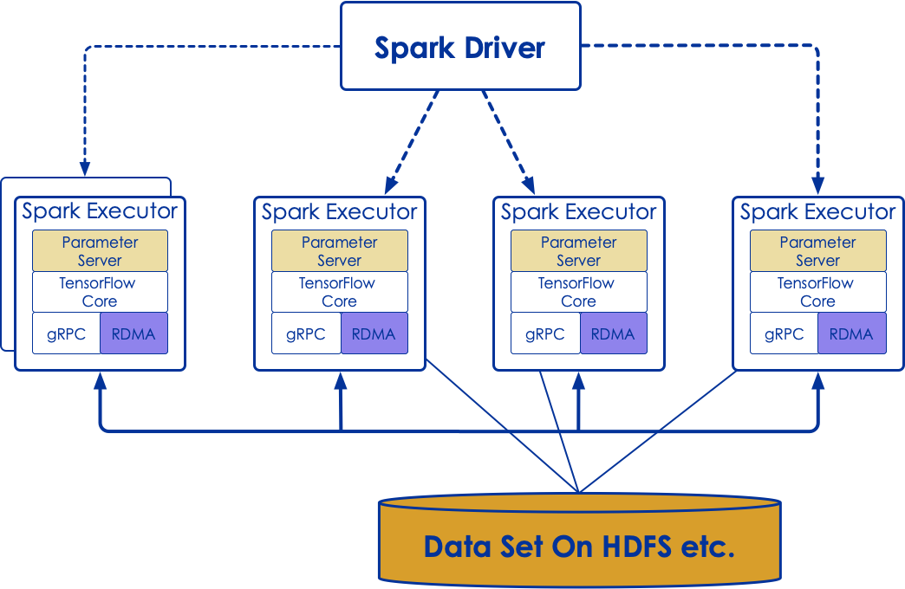

# Introduction to TensorFlow
---

## Lesson Objectives


 * Understand the needs that TensorFlow addresses

 * Be familiar with TensorFlow's capabilities and advantages

 * Gain an understanding of a basic TensorFlow installation


Notes:


---

# TensorFlow Intro

---

## TensorFlow

 * Google open sourced TensorFlow in Nov 2015

 * Gained popularity very quickly because of its
    - clean design
    - flexibility
    - scalability
    - huge community
    - and of course Google's push behind it

 * Google is actively developing and supporting TensorFlow; also offers it in Google Cloud platform ;  wants to see TensorFlow as _the_ AI software)

- [tensorflow.org](http://www.tensorflow.org/)

---

## TensorFlow Popularity

 * Tensorflow has outpaced its rivals in popularity:
 * Survey of Github Stars:

  <!-- {"left" : 0.56, "top" : 2, "height" : 4.88, "width" : 9.13} -->


Notes:


---

## Big Spike in Job Postings

  <!-- {"left" : 1.83, "top" : 1.11, "height" : 4.52, "width" : 6.59} -->

 Source: indeed.com

Notes:

---

## TensorFlow Features

 * Runs on all platforms (Windows, Mac, Linux) and mobile devices
 * Can run in-browser (tensorflow.js)

 * Core is written in C++ ; very efficient implementation
    - wrappers in Python for ease of use
    - other language support improving : Java, Go, R

 * Other high level APIs are built on top of TesnorFlow ; e.g. [Keras](http://keras.io/) and [Pretty Tensor](https://github.com/google/prettytensor/)

 * Has a very nice UI called **Tensorboard** to visualize graphs and learning process

 * Great community
    - https://github.com/jtoy/awesome-tensorflow

---

## TensorFlow Noteworthy Versions


| Version 	| Release Date 	| Noteworthy Features         	|
|---------	|--------------	|-----------------------------	|
| 0.01    	| 2015-11      	| Initial Release from Google 	|
| 0.20    	| 2016-05      	| TensorFlow Reaches Maturity 	|
| 1.0     	| 2017-01      	| First Stable Release        	|
| 1.1     	| 2017-07      	| Installable with Pip/conda  	|
| 1.12    	| 2018-12      	| x                           	|
| 1.14    	| 2019-02      	| Stable Release              	|
| 2.0RC   	| 2019-08      	| RC Release                  	|


Notes:


---


## Tensorflow 2

 * Tensorflow is in a *big* shift to Tensorflow 2

 <!-- {"left" : 1.02, "top" : 1.71, "height" : 4.56, "width" : 8.21} -->


---

## Using GPUs

 * One of TensorFlow's most exciting features is using GPUs for compute capacity
     - ML is mainly linear algebra (matrix manipulation)
     - GPUs specialize in fast linear algebra.
     - GPUs + ML = match made in heaven.

 * Machines running with GPUs have been shown up to 10x faster.

 * TensorFlow will consume GPU + all its memory
     - So, you can't use the GPU for graphics at the same time
     - Servers don't use graphics anyway
     - Workstations should have two nvidia cards.

Notes:


---

## GPU Support

 * Nvidia GPUs are best supported
   - use CUDA library
   - very easy to get set up: install tensorflow-gpu
   - Datacenters: *Must* use **Tesla** GPU line per Nvidia TOS
   - Workstations: Recommend **Quadro**
   - Home/PC: GeForce (Gaming) GPUs work well
 * Tensorflow 2.0 also supports AMD using OpenCL
   - Support a bit new
   - Not as fast as Nvidia but hardware is more affordable.
   - Apple/Mac also uses AMD!
 * Intel GPUs not currently supported.

---


## TPU Support
 * TPU is Google's custom ASIC for Tensor Processing Unit
 * TPUs are have two very distict use cases:
   - Training
   - Interence (aka Edge TPU)
 * Training TPUs only available in Google Cloud Platform for now
   - *Free* evaluation with Google Colaboratory
 * Edge TPUs
   - Google Sells physical devices
   - Designed to be used in IOT type devices, robotics, etc


---


## Google Colaboratory

 * Google Colaboratory is a **free** hosted Juyter notebook
 * Provides GPU and TPU workloads!
   - The only **free** GPU and TPU access available!
 * Great for light workloads and evaluation
 * Serious users will want to upgrade to Google Cloud
   - security
   - Guarunteed performance access


---

## Cloud Cost

* Cost on Google Cloud Platform: (Hourly)

 &nbsp;


| Device | Type | Gen    | Year | Memory | Cost  |
|--------|------|--------|------|--------|-------|
| T4     | GPU  | Turing | 2018 | 16GB   | $0.95 |
| P4     | GPU  | Pascal | 2016 | 16GB   | $0.60 |
| K4     | GPU  | Kepler | 2014 | 16GB   | $0.45 |
| TPUv3  | TPU  | 3rd    | 2019 | 64GB   | $8.00 |
| TPUv2  | TPU  | 2nd    | 2017 | 64GB   | $4.50 |

---


## Parallel TensorFlow


 * NN's are known for being difficult to parallelize

 * But, TensorFlow can in distributed mode
    - run on multiple CPU/GPU on a single machine
    - run on distributed machines

 * Define a distributed master service plus worker services

Notes:


---

## Tensorflow Parallelism


 &nbsp;  &nbsp; &nbsp; <!-- {"left" : 0.49, "top" : 2.9, "height" : 2.61, "width" : 4.85} -->
<!-- {"left" : 5.48, "top" : 1.84, "height" : 4.72, "width" : 4.45} -->


---

## TensorFlow + Hadoop


 * TensorFlow can natively read HDFS data (as a client)

     - Refer to files as hdfs://namenode:8020/path/to/your/files

 * TensorFlow can also use Hadoop YARN as a cluster manager for Distributed TensorFlow!

     - Hortonworks has a TensorFlow assembly to run yarn on its Hadoop distribution

Notes:


---

## TensorFlow + Spark

 * Spark is becoming more popular than Hadoop itself these days:

     - Much faster

     - Better ML support

     - Runs natively on Hadoop/YARN

     - Arguably, better to run TF on Spark than on Hadoop.

 * Yahoo / Databricks: TensorFlow on Spark (TFoS)
     - Framework for distributing TensorFlow apps on Spark / Hadoop
     - Used by DataBricks in Spark Distribution

 * Intel: Analytics Zoo
    - Allows users to do distributed tensorflow/keras/pytorch on Spark
    - Does not support GPU acceleration

Notes:


---

## Tensorflow on Spark


<!-- {"left" : 1.02, "top" : 1.31, "height" : 5.35, "width" : 8.21} -->


Notes:  
- RMDA : Remote Memory Direct Access  
- gRPC : RPC protocol

---

## Deep Learning in TensorFlow

 * Deep Learning simply means a Neural Network:

     - With more than one hidden layer

 * TensorFlow is the world's most popular engine for deep learning

     - Execution Engine is Tuned to Facilitate Deep Learning
     - Runs very fast on GPUs!

Notes:


---

## Traditional Machine Learning in TensorFlow


 * TensorFlow can also be used for traditional Machine Learning
   - `tf.estimator` API often used for this
   - Alternative to scikit-learn

 * Traditional Machine Learning Algorithms:

     - Linear Regression

     - Logistic Regression

     - Support Vector Machines

     - Decision Tree Learning

 * Other libraries are more extensive in terms of features

Notes:

---

# High Level TensorFlow

---

## Base TensorFlow is Low Level


 * It is more of an execution model

     - Handles the flows of Tensors

     - Does not automatically train models

     - We can write code to do that

 *  Low Level TensorFlow does **NOT** have built-in training
    - You have to do it yourself with Tensor Transformations


Notes:


---

## Tensorflow UI Tiers

 * TensorFlow has a multi-tiered API
   - Low-Level
   - Mid-Level
   - High-Level

 <!-- {"left" : 0.6, "top" : 3.32, "height" : 2.65, "width" : 9.03} -->


---

## tf.estimator API

 * Packaged With TensorFlow core as of 1.0
     - Formerly named scikit-train, then `tf.contrib.learn`
 * Designed to be familiar to scikit-learn users
     - one-line models.
 * Used together with TensorFlow Datasets API
 * Mainly used for general-purpose ML rather than Deep-Learning

Notes:


---

## Keras

 * Tensorflow 2.0 **encourages** use of the `tf.keras` API
 * Keras is an API that pre-dates tensorflow
   - The `keras.io` project is a API that can use `tensorflow`, `CNTK`, or `Theano`
   - Able to write code that is tensorflow independent.
 * Tensorflow has its own re-implementation of the Keras API:
   - `tf.keras`
   - Better optimized for Tensorflow than `keras.io`
 * Tensorflow has said that the `tf.keras` API is **the** API going forward.

Notes:


---

## Comparison With Scikit-learn

| TensorFlow                                                                           | Scikit-Learn                                |
|--------------------------------------------------------------------------------------|---------------------------------------------|
| Focused on Neural Networks and Deep Learning Models (Other Algorithms Available too) | Focused on a wide-variety of ML algorithms  |
| Base Framework low-level (Wrappers available for high-level)                         | Higher-level API                            |
| Distributed Execution Model                                                          | Not Distributed                             |
| Extensive GPU Optimization                                                           | Not GPU Optimized                           |
| Support for Distributed File Systems (HDFS)                                          | No Support for Hadoop                       |
| Supports Python API (primary), plus Java, C++ Go, R, etc.                            | Python Support Only                         |

<!-- {"left" : 0.25, "top" : 1.22, "height" : 4.55, "width" : 9.75, "columnwidth" : [4.88, 4.88]} -->

Notes:

---

## Tensorflow 2.x

 * Tensorflow is in a *big* shift to Tensorflow 2

 <!-- {"left" : 2.06, "top" : 1.52, "height" : 3.4, "width" : 6.13} -->

&nbsp;
&nbsp;

 * We will review some of the major differences

---

## Eager Execution

 * Eager Execution is now the **default** mode of execution
 * This means that code will execute like Python normally does
 * Graphs and Sessions are more like implementation details
 * We will still use the graph/session execution for production workloads
 * Allows us to set breakpoints, step through code, etc
   - `tf.config.experimental_run_functions_eagely(True)`
   - Not for production!  But great for development

---

## Globals and Garbage Collection

 * In Tensorflow 1.x, all variables were added to the global graph
 * No Garbage Collection!
 * Very difficult to keep track of old variables littering the Tensorflow Session Graph
   - much like C/C++ memory leaks!
 * Now -- If you lose a reference to a variable, it is garbage collected
   - Just like in regular Python (or Java, C#, ....)


---

## Functions

 * Tensorflow 1.x Didn't really have functions
   - You could use a **Python** function, but it was difficult to optimize
   - It was also difficult to share with other models.

 * Tensorflow 2.x allows **functions** at the tensorflow Graph Level
   - use the `@tf.function` annotation
   - Kind of like a SQL Stored Procedure
   - Allows you to embed common functionality at the *tensorflow* level
   - More efficient / better reuse

 * Allows Shared Libraries and Code
   - Common Functions
   - Can be serialized and deserialized

---

## AutoGraph

 * **AutoGraph** allows python loops like **for**, **while** to be converted into tensorflow graph code

 * Alows us to write loops that will allow dynamic placement of layers / cells

 * Example (Dynamic RNN):


```python
for i in tf.range(input_data.shape[0]): # Note the For loop
  output, state = self.cell(input_data[i], state)
  outputs = outputs.write(i, output)

```
<!-- {"left" : 0, "top" : 3.47, "height" : 1.03, "width" : 10.25} -->


---

## Keras

 * Keras is now the **recommended** API for all Tensorflow work
   - Keras API is stable (**UNLIKE** Tensorflow Core API)
   - Used in other frameworks too!

 * Keras is *much* easier to use in most cases

 * We can "wrap" low-level TF code in Keras wrappers
   - mostly for experts

 * Other tensorflow APIs (`tf.estimator`) now are just Keras layers


---

## Dataset API

 * The Dataset API is much expanded
   - Handles Data Management side of things!
   - Very important part of Data Science

 * Used now with Keras API, not just Estimator API

 * Recommended way to handle structured data
   - or when mixing structured data with unstructured data in the same model.

 * Dataset API allows us to use very large datasets (too big for Pandas dataframes, etc)

---

# Installing TesnorFlow

---


## Lab Setup


 *  **Instructions for the trainer**:
     - Run `tensorflow-labs/package-labs.sh` script
     - Provide the lab zip bundle of lab files to students
     - Explain  '.ipynb'  and '.html' files

 * Give access to virtual machines

  <!-- {"left" : 0.31, "top" : 3.54, "height" : 3.1, "width" : 9.62} -->

Notes:


---

## Installation


 * Much Easier Installation than it used to be!

 * Can install with pip!

 * You may need to have python-dev libraries installed.

 * Recommended to install in virtualenv (or conda environment).

```bash
$ (sudo) pip install tensorflow keras
$ (sudo) pip install tensorflow-gpu keras  # For GPU
```
<!-- {"left" : 0, "top" : 3.05, "height" : 0.73, "width" : 9.29} -->

 * Anaconda: Now officially supported

```bash
$ conda install tensorflow keras
$ conda install tensorflow-gpu keras  # For GPU
```
<!-- {"left" : 0, "top" : 5.1, "height" : 0.82, "width" : 9.29} -->


Notes:


---

## Installing version 2.0 RC

 * Currently version 2.0 is in Release Candidate status, but can still be installed
 * Will *not* be installed unless we specify the version specifcally

```bash
$ (sudo) pip install tensorflow==2.0.0-rc0 keras
$ (sudo) pip install tensorflow-gpu==2.0.0-rc0 keras  #GPU version
```
<!-- {"left" : 0, "top" : 2.39, "height" : 0.98, "width" : 10.25} -->

&nbsp;

 * Conda install does not support TF 2.0 (and will not until release is official)
   - Just use `pip`.

---

## Lab: Hello World in TensorFlow

<!-- {"left" : 6.76, "top" : 1.92, "height" : 3.66, "width" : 2.75} -->


 *  **Overview:** In this lab, we will do a hello world for TensorFlow and Keras.

 *  **Approximate time:** 15-20 minutes

 *  **Instructions for students:**

     - Follow  **basics/1-helloworld.ipynb** lab


Notes:

---

## Review and Questions

---
# Backup slides
---

## Lab: Installing Tensorflow and Keras

<!-- {"left" : 7.11, "top" : 2.69, "height" : 3.25, "width" : 2.44} -->

 *  **Overview:**
     - In this lab, we will become familiar with the lab environment, set up TensorFlow, and start.

 * **Note :** 
     - The training VMs are already setup, no need for this setup. You can skip to next step

 *  **Approximate time:** 15-20 minutes

 *  **Instructions for students:**

     - Follow the **install.html**


