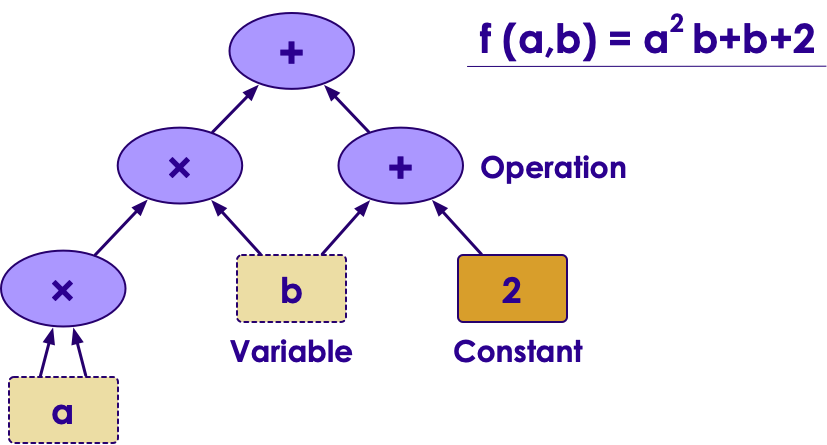

# Introduction to TensorFlow
---

## Lesson Objectives


 * Understand the needs that TensorFlow addresses

 * Be familiar with TensorFlow's capabilities and advantages

 * Gain an understanding of a basic TensorFlow installation


Notes: 


---

# TensorFlow Intro

---

## TensorFlow 

- Google open sourced TensorFlow in Nov 2015

- Gained popularity very quickly because of its 
    - clean design 
    - flexibility 
    - scalability 
    - huge community
    - and of course Google's push behind it

- Google is actively developing and supporting TensorFlow; also offers it in Google Cloud platform ;  wants to see TensorFlow as _the_ AI software)

- [tensorflow.org](http://www.tensorflow.org/)

---

## TensorFlow Popularity

 * Tensorflow has outpaced its rivals in popularity:
 * Survey of Github Stars:

  <!-- {"left" : 0.56, "top" : 2.36, "height" : 4.88, "width" : 9.13} -->


Notes: 


---


## Big Spike in Job Postings


  <!-- {"left" : 1.01, "top" : 1.41, "height" : 5.5, "width" : 8.02} -->
 
 Source: indeed.com

Notes: 

---

## TensorFlow Features 

- Runs on all platforms (Windows, Mac, Linux) and mobile devices 

- Core is written in C++ ; very efficient implementation
    - wrappers in Python for ease of use 
    - other language support improving : Java, Go, R

- Other high level APIs are built on top of TesnorFlow ; e.g. [Keras](http://keras.io/) and [Pretty Tensor](https://github.com/google/prettytensor/)

- Has a very nice UI called **Tensorboard** to visualize graphs and learning process

- Great community
    - https://github.com/jtoy/awesome-tensorflow

---


## TensorFlow Noteworthy Versions

| Version | Release Date | Noteworthy Features         |
|---------|--------------|-----------------------------|
| 0.01    | 2015-11      | Initial Release from Google |
| 0.20    | 2016-05      | TensorFlow Reaches Maturity |
| 1.0     | 2017-01      | First Stable Release        |
| 1.1     | 2017-07      | Installable with Pip/conda  |
| 1.12    | 2018-12      |                             |
| 1.13    | 2019-02      | Current Release             |
| 2.0     | 2019-??      | Future release              |

<!-- {"left" : 0.61, "top" : 1.55, "height" : 3, "width" : 9.03, "columnwidth" : [2.01, 3.03, 3.98]} -->


Notes: 


---


## TensorFlow versus NumPy


 * TensorFlow is comparable to NumPy. (Really??)

     - Both define highly optimized processing of n-dimensional arrays.

     - Both do most of their work outside of Python in optimized C++

 * But there are key differences

     - NumPy  **immediately**  processes the operation

     - TensorFlow builds a Directed Acyclic Graph of operations and executes it

Notes: 


---

## Using GPUs


 * One of TensorFlow’s most exciting features is using GPUs for compute capacity

     - ML is mainly linear algebra (matrix manipulation)

     - GPUs specialize in fast linear algebra.

     - GPUs + ML = match made in heaven.

 * Machines running with GPUs have been shown up to 10x faster.

 * TensorFlow will consume GPU + all its memory 

     - So, you can’t use the GPU for graphics at the same time

     - No problem; servers don’t use graphics anyway!! 

 * You have to use TensorFlow builds matched to your GPU

     - Nvidia CUDA

     - Installation is a bit complicated. So on dev boxes we skip it

Notes: 


---

## Parallel TensorFlow


 * NN’s are known for being difficult to parallelize

 * But, TensorFlow can in distributed mode 
    - run on multiple CPU/GPU on a single machine 
    - run on distributed machines

 * Define a distributed master service plus worker services

Notes: 


---

## Tensorflow Parallelism 


 &nbsp;  &nbsp;


---

## TensorFlow + Hadoop


 * TensorFlow can natively read HDFS data (as a client)

     - Refer to files as hdfs://namenode:8020/path/to/your/files

 * TensorFlow can also use Hadoop YARN as a cluster manager for Distributed TensorFlow!

     - Hortonworks has a TensorFlow assembly to run yarn on its Hadoop distribution

Notes: 


---

## TensorFlow + Spark


 * Spark is becoming more popular than Hadoop itself these days:

     - Much faster

     - Better ML support

     - Runs natively on Hadoop/YARN

     - Arguably, better to run TF on Spark than on Hadoop.

 * Yahoo: TensorFlow on Spark (TFoS)

     - Framework for distributing TensorFlow apps on Spark / Hadoop

     - Immature

Notes: 


---

## Tensorflow on Spark 


Notes:  
- RMDA : Remote Memory Direct Access  
- gRPC : RPC protocol

---

## Deep Learning in TensorFlow


 * Deep Learning simply means a Neural Network:

     - With more than one hidden layer

 * TensorFlow is the world’s most popular engine for deep learning

     - Execution Engine is Tuned to Facilitate Deep Learning
     - Runs very fast on GPUs!

Notes: 


---

## Traditional Machine Learning in TensorFlow


 * TensorFlow can also be used for traditional Machine Learning

 * Traditional Machine Learning Algorithms:

     - Linear Regression

     - Logistic Regression

     - Support Vector Machines

     - Decision Tree Learning

 * Other libraries are more extensive in terms of features

Notes: 

# High Level TensorFlow

---


## Base TensorFlow is Low Level


 * It is more of an execution model 

     - Handles the flows of Tensors

     - Does not automatically train models
 
     - We can write code to do that

 *  Low Level TensorFlow does **NOT** have built-in training 
    - You have to do it yourself with Tensor Transformations


Notes: 


---

## Tensorflow UI Tiers

 * TensorFlow has a multi-tiered API
   - Low-Level
   - Mid-Level
   - High-Level

 <!-- {"left" : 0.35, "top" : 3.25, "height" : 2.80, "width" : 9.53} -->


---

## tf.estimator API


 * Packaged With TensorFlow core as of 1.0

     - Formerly named scikit-train, then `tf.contrib.learn`

 * Designed to be familiar to scikit-learn users

     - one-line models.

 * Used together with TensorFlow Datasets API

Notes: 


---

## Keras


 * Mature library that pre-dates TensorFlow

 * Allows for tensorflow-independent code

     - Might want to use another underlying library?

 * Ensures stability within fast-paced TensorFlow release cycle

 * TensorFlow now includes bindings for Keras in `tf.keras` namespace

Notes: 


---

## Comparison With Scikit-learn

| TensorFlow                                                                           | Scikit-Learn                                |
|--------------------------------------------------------------------------------------|---------------------------------------------|
| Focused on Neural Networks and Deep Learning Models (Other Algorithms Available too) | Focused on a wide-variety of ML algorithms  |
| Base Framework low-level (Wrappers available for high-level)                         | Higher-level API                            |
| Distributed Execution Model                                                          | Not Distributed                             |
| Extensive GPU Optimization                                                           | Not GPU Optimized                           |
| Support for Distributed File Systems (HDFS)                                          | No Support for Hadoop                       |
| Supports Python API (primary), plus Java, C++ Go, R, etc.                            | Python Support Only                         |

<!-- {"left" : 0.25, "top" : 1.22, "height" : 4.55, "width" : 9.75, "columnwidth" : [4.88, 4.88]} -->

Notes: 

---

# Installing TesnorFlow

---


## Lab Setup


 *  **Instructions for the trainer**:
     - Run `tensorflow-labs/package-labs.sh` script
     - Provide the lab zip bundle of lab files to students
     - Explain  '.ipynb'  and '.html' files
     
 * Give access to virtual machines

  <!-- {"left" : 0.31, "top" : 2.41, "height" : 3.1, "width" : 9.62} -->


Notes: 


---

## Installation


 * Much Easier Installation than it used to be!

 * Can install with pip!

 * You may need to have python-dev libraries installed.

 * Recommended to install in virtualenv (or conda environment).

```bash
$ (sudo) pip install tensorflow keras 
```
<!-- {"left" : 0, "top" : 2.93, "height" : 0.65, "width" : 8.27} -->

 * Anaconda: Now officially supported

```bash
$ conda install tensorflow keras
```
<!-- {"left" : 0, "top" : 4.74, "height" : 0.73, "width" : 8.27} -->


Notes: 


---

## Lab: Installing Tensorflow and Keras


 *  **Overview**:   
 In this lab, we will become familiar with the lab environment, set up TensorFlow, and start.
 
 * **Note** :   
 The training VMs are already setup, no need for this setup.  You can skip to next step

 *  **Approximate time**: 15-20 minutes

 *  **Instructions for students**:

     - Follow the **install.html** 


---

## Lab: Hello World in TensorFlow


 *  **Overview**: In this lab, we will do a hello world for TensorFlow and Keras.

 *  **Approximate time**: 15-20 minutes

 *  **Instructions for students**:

     - Follow  **basics/1-helloworld.ipynb** lab


Notes: 

---


## Review and Questions
