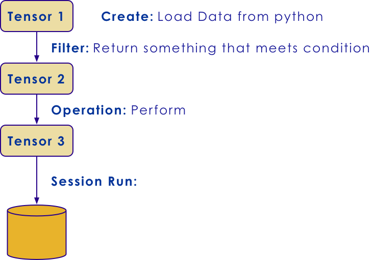

TensorFlow Low-Level API
======

# Tensors

## Tensors


 * Mathematically, a tensor is a mapping of linear spaces of rank `n`

 * In TensorFlow, a Tensor is the basic object

 *  **Everything**  in TensorFlow is a tensor

 * Object `tf.Tensor`

 * Ordinary Python objects cannot be operated on in TF


Notes: 

---


## Datatypes

 * All Datatypes in TensorFlow are from `tf.Tensor`
 * Immutable Types:
   - `tf.constant`
   - `tf.placeholder`
   - `tf.SparseTensor`
 * Mutable Type:
   - `tf.Variable`

Notes: 

---
## Immutability

 * Why are types in TF immutable?
 * Initialization
   - Immutable types don't need to be initialized 
 * Parallelization
   - Immutable types have no need for synchronization
   - no locks / blocks
   - no race conditions
 * Note `tf.Variable` is *not* immutable.

Notes: 

---
## Typing in Tensorflow

  * Tensorflow is *strongly* typed
  * Vanilla Python is dynamically typed.
  * TF variables *must* be defined as a static `tf.DType` object.
  * TF types can be *inferred*, but only at creation time.
    - Example: `10.0` : `tf.float64`
    - Exmple: `5` : `tf.int64`

Notes: 

---
## Typing in Tensorflow

  * `tf.float16`: 16-bit half-precision floating-point.
  * `tf.float32`: 32-bit single-precision floating-point.
  * `tf.float64`: 64-bit double-precision floating-point.
  * `tf.bfloat16`: 16-bit truncated floating-point.
  * `tf.complex64`: 64-bit single-precision complex.
  * `tf.complex128`: 128-bit double-precision complex.
  * `tf.int8`: 8-bit signed integer.
  * `tf.uint8`: 8-bit unsigned integer.
  * `tf.uint16`: 16-bit unsigned integer.
  * `tf.uint32`: 32-bit unsigned integer.
  * `tf.uint64`: 64-bit unsigned integer.

Notes: 

---
## Typing in Tensorflow (continuted)

  * `tf.int16`: 16-bit signed integer.
  * `tf.int32`: 32-bit signed integer.
  * `tf.int64`: 64-bit signed integer.
  * `tf.bool`: Boolean.
  * `tf.string`: String.
  * `tf.qint8`: Quantized 8-bit signed integer.
  * `tf.quint8`: Quantized 8-bit unsigned integer.
  * `tf.qint16`: Quantized 16-bit signed integer.
  * `tf.quint16`: Quantized 16-bit unsigned integer.
  * `tf.qint32`: Quantized 32-bit signed integer.
  * `tf.resource`: Handle to a mutable resource.
  * `tf.variant`: Values of arbitrary types.


Notes: 

---
## Tensor Rank

 * The Rank is the number of dimensions

| Rank | Meaning     |
|------|-------------|
| 0    | Scalar      |
| 1    | Vector      |
| 2    | Matrix      |
| 3    | Number Cube |
| n    | n-Tensor    |

<!-- {"left" : 2.47, "top" : 2.49, "height" : 3, "width" : 5.32, "columnwidth" : [2.66, 2.66]} -->

Notes: 

---
## Rank 0

 * Rank 0 is also known as a *scalar*
 * Here are some Example scalars:

```python
person = tf.Variable("Tim", tf.string)
count = tf.Variable(30, tf.int16)
floating_point = tf.Variable(5.5, tf.float64)
complex_number = tf.Variable(4.1 + 3.3j, tf.complex64)
```
<!-- {"left" : 0, "top" : 2.15, "height" : 1.4, "width" : 10.25} -->

 * Note that the scalars are converted from python types to TF types.

 * Tensorflow types are 

Notes: 

---
## Rank 1

 * Rank 1 Tensors are *vectors*
 * Here are some vectors (rank 1)
 * Initialize with Python lists or NumPy arrays

```python
counts = tf.Variable([10,20,30], tf.int16)
distances = tf.Variable([3.1,2.2,5.5], tf.float32)
```
<!-- {"left" : 0, "top" : 2.56, "height" : 0.91, "width" : 10.25} -->

Notes: 

---
## Rank 2

 * Rank 2 Tensors are *matrices*
 * Here are some *matrices (rank 2) 
 * Initialize with Python lists or NumPy arrays

```python
counts = tf.Variable([10,20,30], tf.int16)
distances = tf.Variable([3.1,2.2,5.5], tf.float32)
```
<!-- {"left" : 0, "top" : 2.56, "height" : 0.91, "width" : 10.25} -->

Notes: 

---
## Higher Ranks
 * Initialize with n-dimensional NumPy array (or list)


```python
rubiks = tf.Variable([[[1,2,3],[4,5,6],[7,8,9]], \
                      [[1,2,3],[4,5,6],[7,8,9]], \
                      [[1,2,3],[4,5,6],[7,8,9]]], \
                      tf.float32)

tf.rank(rubiks) # Will get value of rank after session runs
tf.shape(rubiks) # Will get [3,3,3] after session runs
tf.reshape(rubiks, [9,3]) # Will reshape into 9 x3 Matrix
```
<!-- {"left" : 0, "top" : 1.68, "height" : 2.39, "width" : 10.25} -->

Notes: 

---
## Slicing and Dicing
 * Use NumPy slicing rules (zero-based)
 * The `:` symbol means to leave dimension alone.

```python


rubiks = np.array([[[1,2,3],[4,5,6],[7,8,9]], \
                      [[1,2,3],[4,5,6],[7,8,9]], \
                      [[1,2,3],[4,5,6],[7,8,9]]])

rubiks[0:2,:,0]
# ([[1, 4, 7],
#   [1, 4, 7]])
```
<!-- {"left" : 0, "top" : 2.06, "height" : 2.13, "width" : 9.11} -->


Notes: 

---
## Constants

 * Constants are used for values that *never* change
   - Not model itself
   - Nor by input.
 * Constants don't have to be initialized
   - They are always there
 * Literals won't work in TF
   - can't just say `constant2 + 1`
   - Have to define a constant first. `tf.constant(1, dtype=tf.int32`
 * Used for literals mostly
 * Can be used for hyperparameters
   - But we usually want those tunable from the outside.
Notes: 

---
## Placeholders

  * Placeholders are not changable by the model
    - Can't hold state
    - Once set by the outside, they are fixed.
  * They are usually inputs to the model from *outside*.
  * Training Data and Labels are typically placeholders
  * Hyperparameter values are also placeholders.
  * Don't require initialization.

Notes: 

---
## Feed Dicts
  * How do we "feed" a series of elements into the placeholder
    - for example, training data examples

```python
placeholder_ex_one = tf.placeholder(tf.float32)
placeholder_ex_two = tf.placeholder(tf.float32)
placeholder_ex_tre = tf.placeholder(tf.float32)

print(sess.run(placeholder_summation, 
         feed_dict={placeholder_ex_one: 10,
                    placeholder_ex_two: 20,
                    placeholder_ex_tre: 30}))

```
<!-- {"left" : 0, "top" : 2.34, "height" : 2.84, "width" : 10.25} -->


Notes: 

---
## Variables

 * Type `tf.Variable` is mutable
 * Use it to store stateful variables
   - Especially things like *weights*
 * You *must* initialize variables
   - `session.run(tf.global_variables_initializer())`
   - You can also call an initializer at definition time.
 * Best way is to call `get_variable`

```python
v = tf.get_variable("v", shape=(), 
initializer=tf.zeros_initializer())
```
<!-- {"left" : 0, "top" : 4.26, "height" : 0.95, "width" : 10.25} -->

Notes: 

---
## Assigning Values to Variables

 * You *cannot* just assign a variable as `v = 1`
 * You have to call `assign_add` on the variable

```python
v = tf.get_variable("v", shape=(), 
   initializer=tf.zeros_initializer())
assignment = v.assign_add(1)
tf.global_variables_initializer().run()
sess.run(assignment)  
```
<!-- {"left" : 0, "top" : 2.26, "height" : 2.25, "width" : 10.25} -->

Notes: 

---
# Sessions

## What is a Session?


 * TensorFlow has the concept of a session

 * A session allows a series of operations on tensors to be defined

 * The session is run to create a **graph**.


Notes: 

---

## Defining a Session

 * Here is how we create a session:

```python
x = tf.constant([1., 2., 3.])
b = tf.constant(6.0)
c = x * b

with tf.Session() as sess:
   sess.run(x)
   c.eval(sess) # Have to specify session
```
<!-- {"left" : 0, "top" : 1.8, "height" : 2.8, "width" : 10.03} -->

Notes: 

---
## Interactive Sessions

 * We can define an InteractiveSession
 * Will create Session **and** make it the default
 * Can reference session without running


```python
with tf.InteractiveSession() as sess:
    c.eval()
```
<!-- {"left" : 0, "top" : 2.62, "height" : 1.06, "width" : 9.11} -->

Notes: 

---
## Tensorflow Dataflow Graph Lifecycle

* Tensor is **created** by:
  - Loading an external dataset
  - Loading a python array

* Tensor is **transformed**
  - E.g., addition operation
  - Result: a new tensor 
  - Often have a sequence 
  - of transformations

 * Data is eventually **Processed**
  - By running the session.
  - e.g, saving data

 * At right, we:
    - read/transform
    - save the result.

 <!-- {"left" : 5.27, "top" : 1.38, "height" : 5.68, "width" : 4.96} -->

Notes: 

---

## All Transformations Are Lazy

 * TensorFlow engine does not *immediately* compute results
   - Transformations stored as a dataflow graph on the session
   - They specify how to perform parallel computation 

 * The Dataflow Graph is executed when the session is run
   - When it needs to provide data

 * Allows TensorFlow to:
   - Optimize required calculations 
   - Avoid passing of data to and from python code

Notes: 

---
## Lazy Evaluation

* We read a file
  - Filter out errors
  - No Work Done (Yet)

* Client requests the first line
  - Triggers evaluation of:
    * the Dataflow Graph
  - Now the work is done
  - Result is sent to client

* Many possible optimizations
  - Stop filtering after the 
  - first ERROR line encountered

 <!-- {"left" : 4.92, "top" : 1.18, "height" : 5.68, "width" : 4.96} --> 

Notes: 

---

## Tensor Evaluation

 * We can view a Tensor using Evaluation 
 * This only works if InteractiveSession is active

```python
constant = tf.constant([1, 2, 3])
tensor = constant * constant
print tensor.eval()
```
<!-- {"left" : 0, "top" : 2.2, "height" : 1.47, "width" : 8.62} -->


Notes: 

---

## Lab: Tensorflow Sessions


 *  **Note** :

 *  **Instructions for the instructor** :

    - This lab is run with Juptyer Notebook
    - Help Students start Jupyter notebook

 *  **Overview** : In this lab, we will explore sessions in tensorflow 

 *  **Approximate time** : 15-20 minutes

 *  **Instructions for students** :

     - follow  **03-lowlevel/3.1-sessions.ipynb** file

 *  **Lab**

Notes:

---

## TensorFlow Lab Review

 * We saw that we did not **immediately** see results from a session graph.
 * We saw we had to **run** the session graph.
 * We run the session graph with `.eval()`
 * `InteractiveSession` allows us to call `.eval()` without specifiying the session

Notes: 

---
## Tensor Graphs

 * We can refer to the underlying tensor graph object
 * Get it from `sess.graph`.

```python
with tf.Session() as sess:
    graph = sess.graph
    print(g.get_operations()) # Will dump graph
```
<!-- {"left" : 0, "top" : 2.3, "height" : 1.27, "width" : 10.25} -->

Notes: 

---
## Saving Tensor Graphs

 * We can save our tensor graphs to a file
 * Easiest: Use `simple_save()` :

```python
simple_save(session,
            export_dir,
            inputs={"x": x, "y": y},
            outputs={"z": z})
```
<!-- {"left" : 0, "top" : 2.01, "height" : 2.02, "width" : 10.25} -->

Notes: 

---
## Restoring Tensor graphs  

 * We can restore our saved model graphs

```python
export_dir = '/path/to/my/file'
with tf.Session(graph=tf.Graph()) as sess:
  tf.saved_model.loader.load(sess, 
                       [tag_constants.TRAINING], 
                       export_dir)
```
<!-- {"left" : 0, "top" : 1.66, "height" : 1.83, "width" : 10.25} -->

Notes: 

---
# Low-Level Example

## MNIST Dataset

  * MNIST is a dataset of 28x28 pixel images (784 total inputs)
  * It contains greyscale handwritten digits from 0-9. (10 outputs)
  * It is often used as a hello world example for Deep Learning.

 <!-- {"left" : 2, "top" : 2.93, "height" : 4.14, "width" : 6.25} -->

Notes: 

---
## Defining some variables

 * We are going to define
   - x: This is a placeholder for our input. (784 pixels)
   - W: This is our weights for our input
   - b: THis is our bias for out input.

```python

x = tf.placeholder(tf.float32, [None, 784])
W = tf.Variable(tf.zeros([784, 10]))
b = tf.Variable(tf.zeros([10]))
```
<!-- {"left" : 0, "top" : 2.82, "height" : 1.38, "width" : 10.25} -->

Notes: 

---
## Our equation

 * Remember `Y = mx + b` from your algebra classes?
 * Here we will do `Y = wx + b`.
   - x and w are vectors of 784 pixels in size
   - y is a vector of 10 in size.
 * The output takes the softmax function
   - More on this later
   - Converts the output to array of probabilities
 * This is a *linear* model

```python
y = tf.nn.softmax(tf.matmul(x, W) + b)
```
<!-- {"left" : 0, "top" : 4.74, "height" : 0.74, "width" : 9.77} -->

Notes: 

---
## Y and Y-hat

 * We will define our `y_` (y-hat) 
   - This is the actual output (0-9)
 * `y` is our *predicted* output
 * `correct_prediction` is whether we were right or worng

```python
y_ = tf.placeholder(tf.float32, [None, 10])
correct_prediction = 
tf.equal(tf.argmax(y,1), tf.argmax(y_,1))

```
<!-- {"left" : 0, "top" : 3.17, "height" : 1.4, "width" : 10.25} -->

Notes: 

---
## Training an Model

  * We will use Gradient Descent to train
    - More about that later.
  * We will train for 1000 *epochs* 
    - with batches of 100 inputs

```python

cross_entropy = tf.reduce_mean
(-tf.reduce_sum(y_ * tf.log(y), reduction_indices=[1]))
train_step = tf.train.GradientDescentOptimizer(0.5).
minimize(cross_entropy)

sess = tf.InteractiveSession()
tf.global_variables_initializer().run()

for _ in range(1000):
  batch_xs, batch_ys = 
mnist.train.next_batch(100)
  sess.run(train_step, feed_dict=
{x: batch_xs, y_: batch_ys})

```
<!-- {"left" : 0, "top" : 2.82, "height" : 2.84, "width" : 10.25} -->

Notes: 

---
## Results

 * We only have one layer, so we are training a linear model.
 * This is basically a **logistic regression** model.

Notes: 

---
## Lab: Tensorflow MNist Example


 *  **Note** :

 *  **Instructions for the instructor** :

    - This lab is run with Juptyer Notebook
    - Help Students start Jupyter notebook

 *  **Overview** : In this lab, we will explore MNIST 

 *  **Approximate time** : 15-20 minutes

 *  **Instructions for students** :

     - follow  **03-lowlevel/3.2-NoHidden.ipynb** file

 *  **Lab**


Notes:

---

## Lab Review

 * Don't worry too much *exactly* how we trained the model
   - We will get to that!
 * Notice we loaded data in batches of 100.
   - **Question for the Class:** Why did we do this in batches?
 * And we called `.eval()` on session graph in a `for` loop.
   - We call each run through an *epoch*.
Notes: 

---
# Eager Execution


## About Eager Execution

 * TF's Session API is very efficient:
    - Lazy Evaluation
    - More efficient distribution

 * But, sometimes we just want **interactive** execution
    - Think like ordinary NumPy/Pandas
    - More interactive
    - Great for exploration

```python
import tensorflow as tf
tf.enable_eager_execution()
```
<!-- {"left" : 0, "top" : 4.26, "height" : 1.13, "width" : 7.38} -->

Notes: 


---

## Example Eager Execution

 * Here is how we enable Eager Execution:

```pycon
>>> import tensorflow as tf
>>> tf.enable_eager_execution()
>>> a = tf.constant([[1,2],[3,4]])
>>> print(a)

<tf.Tensor: id=0, shape=(2, 2), dtype=int32, numpy=
array([[1, 2],
       [3, 4]], dtype=int32)>
```
<!-- {"left" : 0, "top" : 1.49, "height" : 2.64, "width" : 10.25} -->

Notes: 

---
## Eager Execution and NumPy

  * We can use NumPy with Eager Execution

```pycon
>>> import tensorflow as tf
>>> tf.enable_eager_execution()
>>> a = tf.constant([[1, 2],
                     [3, 4]])
>>> a.numpy()
# => [[1 2]
#     [3 4]]
>>> np.multiply(a, 2)
```
<!-- {"left" : 0, "top" : 1.57, "height" : 3.55, "width" : 8.83} -->

Notes: 

---
## Models With Eager Execution 
  
  * Keras layers work well with Eager Execution
  * Here is an MNIST

```python
class MNISTModel(tf.keras.Model):
  def __init__(self):
    super(MNISTModel, self).__init__()
    self.dense1 = tf.keras.layers.Dense(units=10)
    self.dense2 = tf.keras.layers.Dense(units=10)

  def call(self, input):
    """Run the model."""
    result = self.dense1(input)
    result = self.dense2(result)
    result = self.dense2(result)
    return result

model = MNISTModel()
```
<!-- {"left" : 0, "top" : 1.96, "height" : 4.55, "width" : 10.25} -->

Notes: 

---

