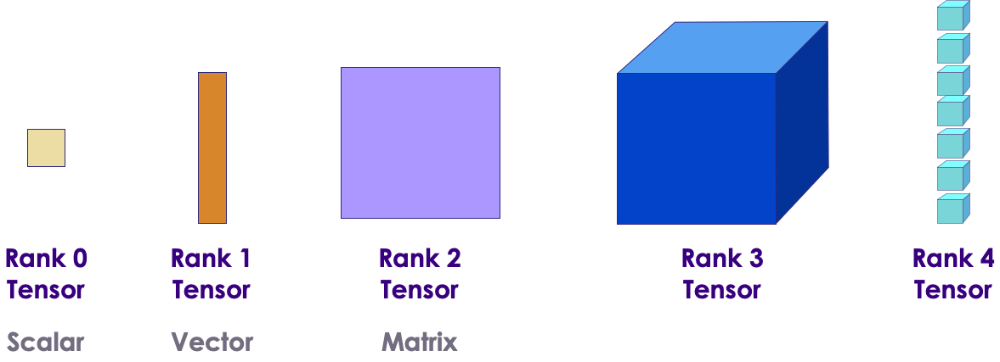
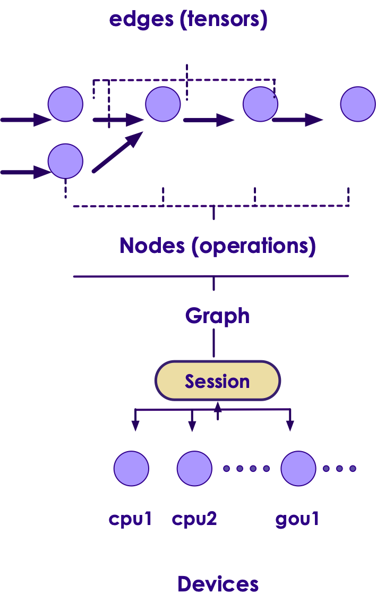
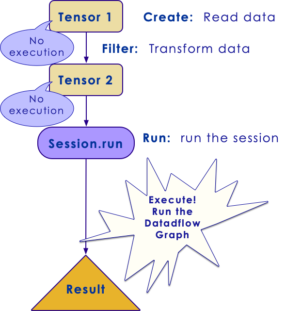

# TensorFlow Low-Level API
---

# Tensors

---

## What is a Tensor?

 * Mathematically, a tensor is linear relationship describing a multidimensional map between vector spaces.

 * Practically, a tensor is a multidimensional array.
 
 *  **Everything**  in TensorFlow is a tensor (`tf.Tensor`)
 
 *  Tensors have rank, shape, and type
    - rank: dimension of tensor
    - shape: number of rows / columns 
    - type: data type (int, float ..etc.)
    

| Rank | Tensor      |
|------|-------------|
| 0    | Scalar      |
| 1    | Vector      |
| 2    | Matrix      |
| 3    | Number Cube |
| n    | n-Tensor    |

<!-- {"left" : 2.9, "top" : 5.12, "height" : 3, "width" : 4.44, "columnwidth" : [2.22, 2.22]} -->

Notes: 


---

## Tensors


<!-- {"left" : 1.57, "top" : 1.55, "height" : 6.6, "width" : 7.15} -->


---


## Datatypes

* All Datatypes in TensorFlow are from `tf.Tensor`

* Immutable Types:
   - `tf.constant`
   - `tf.placeholder`
   - `tf.SparseTensor`
   
* Mutable Type:
   - `tf.Variable`

Notes: 

---
## Immutability

 * Why are types in TF immutable?
 
 * Initialization
   - Immutable types don't need to be initialized 
   
 * Parallelization
   - Immutable types have no need for synchronization
   - no locks / blocks
   - no race conditions
   - very fast to execute on distributed environments
   
 * Note `tf.Variable` is *not* immutable (e.g. mutable or value can change)

Notes: 

---
## Typing in Tensorflow

  * Tensorflow is *strongly* typed
  
  * Vanilla Python is dynamically typed.
  
  * TF variables *must* be defined as a static `tf.DType` object.
  
  * TF types can be *inferred*, but only at creation time.
    - Example: `10.0` : `tf.float64`
    - Example: `5` : `tf.int64`

Notes: 

---
## Tensorflow Types

|      Type     |               Description              |
|:-------------:|:--------------------------------------:|
| tf.float16    | 16-bit half-precision floating-point   |
| tf.float32    | 32-bit single-precision floating-point |
| tf.float64    | 64-bit double-precision floating-point |
| tf.bfloat16   | 16-bit truncated floating-point        |
| tf.complex64  | 64-bit single-precision complex        |
| tf.complex128 | 128-bit double-precision complex       |
| tf.int8       | 8-bit signed integer                   |
| tf.uint8      | 8-bit unsigned integer                 |
| tf.uint16     | 16-bit unsigned integer                |
| tf.uint32     | 32-bit unsigned integer                |
| tf.uint64     | 64-bit unsigned integer                |

<!-- {"left" : 0.25, "top" : 1.53, "height" : 6, "width" : 9.75} -->

Notes: 

---
## Tensorflow Types (continued)

|     Type    |            Description            |
|:-----------:|:---------------------------------:|
| tf.int16    | 16-bit signed integer             |
| tf.int32    | 32-bit signed integer             |
| tf.int64    | 64-bit signed integer             |
| tf.bool     | Boolean                           |
| tf.string   | String                            |
| tf.qint8    | Quantized 8-bit signed integer    |
| tf.quint8   | Quantized 8-bit unsigned integer  |
| tf.qint16   | Quantized 16-bit signed integer   |
| tf.quint16  | Quantized 16-bit unsigned integer |
| tf.qint32   | Quantized 32-bit signed integer   |
| tf.resource | Handle to a mutable resource      |
| tf.variant  | Values of arbitrary types         |

<!-- {"left" : 0.25, "top" : 1.53, "height" : 6.5, "width" : 9.75} -->

Notes: 

---
## Tensor Rank

 * The Rank is the number of dimensions

| Rank | Meaning     |
|------|-------------|
| 0    | Scalar      |
| 1    | Vector      |
| 2    | Matrix      |
| 3    | Number Cube |
| n    | n-Tensor    |

<!-- {"left" : 2.47, "top" : 2.49, "height" : 3, "width" : 5.32, "columnwidth" : [2.66, 2.66]} -->

Notes: 

---
## Rank 0

 * Rank 0 is also known as a *scalar*
 
 * Here are some Example scalars:

<br/>

```python
person = tf.Variable("Tim", tf.string)
count = tf.Variable(30, tf.int16)
floating_point = tf.Variable(5.5, tf.float64)
complex_number = tf.Variable(4.1 + 3.3j, tf.complex64)
```
<!-- {"left" : 0, "top" : 2.04, "height" : 1.4, "width" : 10.25} -->

 * Note that the scalars are converted from python types to TF types.


Notes: 

---
## Rank 1

 * Rank 1 Tensors are *vectors*
 
 * Here are some vectors (rank 1)
 
 * Initialize with Python lists or NumPy arrays

```python
counts = tf.Variable([10,20,30], tf.int16)
distances = tf.Variable([3.1,2.2,5.5], tf.float32)
```
<!-- {"left" : 0, "top" : 2.74, "height" : 0.91, "width" : 10.25} -->

Notes: 

---

## Rank 1 Example

```python
# Create an array using Numpy 
import numpy as np 

a = np.array([1,2,3,4])
print(a)
# > [1 2 3 4]

# first element 
print(a[0])  
# > 1

## rank 
print (a.ndim)
# > 1

## shape 
print (a.shape)
# > (4,)

## type
print(a.dtype)
# > int64

```
<!-- {"left" : 0, "top" : 1.19, "height" : 6.69, "width" : 5.78} -->

---
## Rank 1 Example

```python 
# converting to tensor
import tensorflow as tf

tensor_1d = tf.convert_to_tensor(a, dtype=tf.int64) 
print (tensor_1d)
# > Tensor("Const_3:0", shape=(4,), dtype=int64)

with tf.Session() as sess: 
    print(sess.run(tensor_1d))
# > [1 2 3 4]
```

<!-- {"left" : 0, "top" : 1.35, "height" : 3.47, "width" : 10.25} -->


Notes: 

---


## Rank 2

 * Rank 2 Tensors are *matrices*
 
 * Here are some *matrices* (rank 2) 
 
 * Initialize with Python lists or NumPy arrays

```python
a = np.array ([(1,2,3), (4,5,6), (7,8,9) ])
b = np.array ([(9, 8, 7), (6, 5, 4), (3,2,1)])
```

<!-- {"left" : 0, "top" : 2.74, "height" : 0.91, "width" : 10.25} -->

Notes: 

---

## Rank 2 Example

```python 
import tensorflow as tf
import numpy as np

a = np.array ([(1,2,3), (4,5,6), (7,8,9) ])
b = np.array ([(9, 8, 7), (6, 5, 4), (3,2,1)])

tensor_a = tf.convert_to_tensor(a, dtype=tf.int64)
print(tensor_a)
# > Tensor("Const_18:0", shape=(3, 3), dtype=int64)

tensor_b = tf.convert_to_tensor(b, dtype=tf.int64)
print(tensor_b)
# > Tensor("Const_19:0", shape=(3, 3), dtype=int64)

tensor_c = tf.matmul(tensor_a, tensor_b)
print (tensor_c)
# > Tensor("MatMul_5:0", shape=(3, 3), dtype=int64)

with tf.Session() as sess: 
    print(sess.run(tensor_c))

# >     [[ 30  24  18]
# >      [ 84  69  54]
# >      [138 114  90]]
```
<!-- {"left" : 0, "top" : 1.23, "height" : 7.28, "width" : 9.28} -->

---

## Higher Ranks
 * Initialize with n-dimensional NumPy array (or list)


```python
rubiks = tf.Variable([[[1,2,3],[4,5,6],[7,8,9]], \
                      [[1,2,3],[4,5,6],[7,8,9]], \
                      [[1,2,3],[4,5,6],[7,8,9]]], \
                      tf.float32)

tf.rank(rubiks) # Will get value of rank after session runs
tf.shape(rubiks) # Will get [3,3,3] after session runs
tf.reshape(rubiks, [9,3]) # Will reshape into 9 x3 Matrix
```
<!-- {"left" : 0, "top" : 1.84, "height" : 2.39, "width" : 10.25} -->

Notes: 

---
## Slicing and Dicing
 
 * Use NumPy slicing rules (zero-based)
 
 * The `:` symbol means to leave dimension alone.

```python


rubiks = np.array([[[1,2,3],[4,5,6],[7,8,9]], \
                      [[1,2,3],[4,5,6],[7,8,9]], \
                      [[1,2,3],[4,5,6],[7,8,9]]])

rubiks[0:2,:,0]
# ([[1, 4, 7],
#   [1, 4, 7]])
```
<!-- {"left" : 0, "top" : 2.38, "height" : 2.13, "width" : 9.11} -->


Notes: 

---
## Constants

 * Constants are used for values that *never* change
   - Not model itself
   - Nor by input.
   
 * Constants don't have to be initialized
   - They are always there
   
 * Literals won't work in TF
   - can't just say `constant2 + 1`
   - Have to define a constant first. `tf.constant(1, dtype=tf.int32)`
       
 * Used for literals mostly
 
 * Can be used for hyperparameters
   - But we usually want those tunable from the outside.
Notes: 

---
## Placeholders

  * Placeholders are not changeable by the model
    - Can't hold state
    - Once set by the outside, they are fixed.
    
  * They are usually inputs to the model from *outside*.
  
  * Training Data and Labels are typically placeholders
  
  * Hyperparameter values are also placeholders.
  
  * Don't require initialization.

Notes: 

---
## Feed Dicts
  * How do we "feed" a series of elements into the placeholder
    - for example, training data examples

```python
import tensorflow as tf

placeholder_ex_one = tf.placeholder(tf.float32)
placeholder_ex_two = tf.placeholder(tf.float32)
placeholder_ex_tre = tf.placeholder(tf.float32)
placeholder_sum = placeholder_ex_one+ placeholder_ex_two + placeholder_ex_tre

with tf.Session() as sess: 
    print(sess.run(placeholder_sum, 
         feed_dict={placeholder_ex_one: 10,
                    placeholder_ex_two: 20,
                    placeholder_ex_tre: 30}))

# > output : 60
```
<!-- {"left" : 0, "top" : 2.34, "height" : 2.84, "width" : 10.25} -->


Notes: 

---
## Variables

 * Type `tf.Variable` is mutable
 
 * Use it to store stateful variables
   - Especially things like *weights*
   
 * You *must* initialize variables
   - You can also call an initializer at definition time.
   
 * Best way is to call `get_variable`
 
```python 
import tensorflow as tf

# variables are defined, but not initialized yet
x = tf.Variable(3, name="x")
y = tf.Variable(4, name="y")
f = x*x*y + y + 2

with tf.Session() as sess:
    # perform initialization
    x.initializer.run()
    y.initializer.run()
    result = sess.run(f)
    
print(result)
#  > result 42
```
<!-- {"left" : 0, "top" : 4.08, "height" : 4.65, "width" : 8.78} -->


Notes: 

---
## Global Initialization

- Rather than initializing each variable separately, we can use **global initializer**

- This doesn't initialize variables right away, but create a node that will initialize all variables when it is run

```python
import tensorflow as tf

x = tf.Variable(3, name="x")
y = tf.Variable(4, name="y")
f = x*x*y + y + 2

init = tf.global_variables_initializer()  # prepare an init node

with tf.Session() as sess:
    init.run()  # actually initialize all the variables
    result = sess.run(f)
    
print (result)
#  > result 42
```
<!-- {"left" : 0, "top" : 3.21, "height" : 3.91, "width" : 10.25} -->

Notes: 

---

## Eager Execution vs Sessions

 * Tensorflow's *default* mode of operation is called Eager Execution
   - As of 2.0

 * It means that operations are processed **immediately**
   - Like NumPy
 
---

## About Eager Execution

 * TF's Session API is very efficient:
    - Lazy Evaluation
    - More efficient distribution

 * But, sometimes we just want **interactive** execution
    - Think like ordinary NumPy/Pandas
    - More interactive
    - Great for exploration

```python
import tensorflow as tf
tf.enable_eager_execution()
```
<!-- {"left" : 0, "top" : 4.5, "height" : 1.13, "width" : 7.38} -->

Notes: 


---

## Example Eager Execution

 * It is enabled now by default in v2.0+!
 * Here is how we enable Eager Execution:

```pycon
>>> import tensorflow as tf
>>> tf.enable_eager_execution()
>>> a = tf.constant([[1,2],[3,4]])
>>> print(a)

<tf.Tensor: id=0, shape=(2, 2), dtype=int32, numpy=
array([[1, 2],
       [3, 4]], dtype=int32)>
```
<!-- {"left" : 0, "top" : 2.02, "height" : 2.64, "width" : 10.25} -->

Notes: 

---
## Eager Execution and NumPy

  * We can use NumPy with Eager Execution

```pycon
>>> import tensorflow as tf
>>> tf.enable_eager_execution()
>>> a = tf.constant([[1, 2],
                     [3, 4]])
>>> a.numpy()
# => [[1 2]
#     [3 4]]
>>> np.multiply(a, 2)
```
<!-- {"left" : 0, "top" : 1.93, "height" : 3.55, "width" : 8.83} -->

Notes: 

---
## Models With Eager Execution 
  
  * Keras layers work well with Eager Execution
  * Here is an MNIST

```python
class MNISTModel(tf.keras.Model):
  def __init__(self):
    super(MNISTModel, self).__init__()
    self.dense1 = tf.keras.layers.Dense(units=10)
    self.dense2 = tf.keras.layers.Dense(units=10)

  def call(self, input):
    """Run the model."""
    result = self.dense1(input)
    result = self.dense2(result)
    result = self.dense2(result)
    return result

model = MNISTModel()
```
<!-- {"left" : 0, "top" : 2.26, "height" : 4.55, "width" : 10.25} -->

Notes: 

---

## Session


 * A session allows a series of operations on tensors to be defined

 * The session takes care of placing operations onto devices like CPUs, GPUs and running them
 
 * Session also holds all variables 

 * Here is how we create a session:

```python
import tensorflow as tf

a = tf.constant([1., 2., 3.])
b = tf.constant(6.0)
c = a * b

with tf.Session() as sess:
   sess.run(c)
   # session is closed here
```
<!-- {"left" : 0, "top" : 3.93, "height" : 2.9, "width" : 5.61} -->

Notes: 

---
## Interactive Sessions

 * For interactive environments like Jupyter notebooks, we prefer **InteractiveSession**
 
 * Will create Session **and** make it the default
 
 * It will rerun statements as soon as they are defined


```python
import tensorflow as tf

# interactive session becomes the default session
sess = tf.InteractiveSession()


a = tf.constant(5.0)
b = tf.constant(6.0)
c = a * b
print(c.eval()) # evaluated immediately
# output > 30

sess.close()  # be sure to close the session
```
<!-- {"left" : 0, "top" : 3.21, "height" : 4.07, "width" : 8.94} -->

Notes: 

---
## Tensorflow Graphs 

* Tensorflow executes operations as graphs

<!-- {"left" : 1.39, "top" : 2.52, "height" : 4.02, "width" : 7.47} -->


---
## Tensorflow Graphs 

<!-- {"left" : 3.06, "top" : 1.52, "height" : 6.6, "width" : 4.13} -->


---


## Tensorflow Graph Example


<!-- {"left" : 3.38, "top" : 1.71, "height" : 6.22, "width" : 3.5} -->


---


## Dataflow

 * Dataflow has several advantages that TensorFlow leverages when executing your programs:
 * **Parallelism.** By using explicit edges to represent dependencies between operations, it is easy for the system to identify operations that can execute in parallel.
 * **Distributed execution.** By using explicit edges to represent the values that flow between operations, it is possible for TensorFlow to partition your program across multiple devices (CPUs, GPUs, and TPUs) attached to different machines. TensorFlow inserts the necessary communication and coordination between devices.
 * **Compilation.** TensorFlow's XLA compiler can use the information in your dataflow graph to generate faster code, for example, by fusing together adjacent operations.
 * **Portability.** The dataflow graph is a language-independent representation of the code in your model. You can build a dataflow graph in Python, store it in a SavedModel, and restore it in a C++ program for low-latency inference.


---


## All Transformations Are Lazy

 * TensorFlow engine does not *immediately* compute results
   - Transformations stored as a dataflow graph on the session
   - They specify how to perform parallel computation 

 * The Dataflow Graph is executed when the session is run
   - When it needs to provide data

 * Allows TensorFlow to:
   - Optimize required calculations 
   - Avoid passing of data to and from python code

Notes: 

---
## Lazy Evaluation
 
 <!-- {"left" : 4.92, "top" : 1.18, "height" : 5.68, "width" : 4.96} --> 

* We read a file
  - Filter out errors
  - No Work Done (Yet)

* Client requests the first line
  - Triggers evaluation of:
    * the Dataflow Graph
  - Now the work is done
  - Result is sent to client

* Many possible optimizations
  - Stop filtering after the 
  - first ERROR line encountered


Notes: 

---

## Tensor Evaluation

 * We can view a Tensor using Evaluation 
 * This only works if InteractiveSession is active

```python
constant = tf.constant([1, 2, 3])
tensor = constant * constant
print tensor.eval()
```
<!-- {"left" : 0, "top" : 2.2, "height" : 1.47, "width" : 8.62} -->


Notes: 

---

## Lab: Tensorflow Intro

<!-- {"left" : 7.2, "top" : 1.04, "height" : 3.78, "width" : 2.83} -->


 *  **Overview:**
 In this lab, we will explore sessions in tensorflow 

 *  **Approximate time:** 15-20 minutes

 *  **Lab Instructions:**  
     - **basics-1: basics/1-hello-world.ipynb**
     - **basics-2: basics/2-sessions.ipynb**
     - **basics-3: basics/3-tensors.ipynb**
     - **basics-4: basics/4-variables.ipynb**
     - **basics-5: basics/5-tensorboard.ipynb**


Notes:

---

## TensorFlow Lab Review

 * We saw that we did not **immediately** see results from a session graph.
 * We saw we had to **run** the session graph.
 * We run the session graph with `.eval()`
 * `InteractiveSession` allows us to call `.eval()` without specifying the session

Notes: 

---
## Tensor Graphs

 * We can refer to the underlying tensor graph object
 * Get it from `sess.graph`.

```python
with tf.Session() as sess:
    graph = sess.graph
    print(g.get_operations()) # Will dump graph
```
<!-- {"left" : 0, "top" : 2.3, "height" : 1.27, "width" : 10.25} -->

Notes: 

---
## Saving Tensor Graphs

 * We can save our tensor graphs to a file
 * Easiest: Use `simple_save()` :

```python
simple_save(session,
            export_dir,
            inputs={"x": x, "y": y},
            outputs={"z": z})
```
<!-- {"left" : 0, "top" : 2.37, "height" : 2.02, "width" : 10.25} -->

Notes: 

---
## Restoring Tensor graphs  

 * We can restore our saved model graphs

```python
export_dir = '/path/to/my/file'
with tf.Session(graph=tf.Graph()) as sess:
  tf.saved_model.loader.load(sess, 
                       [tag_constants.TRAINING], 
                       export_dir)
```
<!-- {"left" : 0, "top" : 1.86, "height" : 1.83, "width" : 10.25} -->

Notes: 

---

## Lab: MNIST Dataset

  * MNIST is a dataset of 28x28 pixel images (784 total inputs)
  * It contains greyscale handwritten digits from 0-9. (10 outputs)
  * It is often used as a hello world example for Deep Learning.


<!-- {"left" : 2, "top" : 3.45, "height" : 4.14, "width" : 6.25} -->

Notes: 

---
## Defining some variables

 * We are going to define
   - x: This is a placeholder for our input. (784 pixels)
   - W: This is our weights for our input
   - b: This is our bias for out input.

```python

x = tf.placeholder(tf.float32, [None, 784])
W = tf.Variable(tf.zeros([784, 10]))
b = tf.Variable(tf.zeros([10]))
```
<!-- {"left" : 0, "top" : 3.3, "height" : 1.38, "width" : 10.25} -->

Notes: 

---
## Our equation

 * Remember `Y = mx + b` from your algebra classes?
 * Here we will do `Y = wx + b`.
   - x and w are vectors of 784 pixels in size
   - y is a vector of 10 in size.
 * The output takes the softmax function
   - More on this later
   - Converts the output to array of probabilities
 * This is a *linear* model

```python
y = tf.nn.softmax(tf.matmul(x, W) + b)
```
<!-- {"left" : 0, "top" : 5.13, "height" : 0.74, "width" : 9.77} -->

Notes: 

---
## Y and Y-hat

 * We will define our `y_` (y-hat) 
   - This is the actual output (0-9)
 * `y` is our *predicted* output
 * `correct_prediction` is whether we were right or wrong

```python
y_ = tf.placeholder(tf.float32, [None, 10])
correct_prediction = 
tf.equal(tf.argmax(y,1), tf.argmax(y_,1))

```
<!-- {"left" : 0, "top" : 3.44, "height" : 1.4, "width" : 10.25} -->

Notes: 

---
## Training an Model

  * We will use Gradient Descent to train
    - More about that later.
  * We will train for 1000 *epochs* 
    - with batches of 100 inputs

```python

cross_entropy = tf.reduce_mean
(-tf.reduce_sum(y_ * tf.log(y), reduction_indices=[1]))
train_step = tf.train.GradientDescentOptimizer(0.5).
minimize(cross_entropy)

sess = tf.InteractiveSession()
tf.global_variables_initializer().run()

for _ in range(1000):
  batch_xs, batch_ys = 
mnist.train.next_batch(100)
  sess.run(train_step, feed_dict=
{x: batch_xs, y_: batch_ys})

```
<!-- {"left" : 0, "top" : 3.4, "height" : 2.84, "width" : 10.25} -->

Notes: 

---
## Results

 * We only have one layer, so we are training a linear model.
 * This is basically a **logistic regression** model.

Notes: 

---

## Lab : Simple Linear Regression 

<!-- {"left" : 6.63, "top" : 1.1, "height" : 4.4, "width" : 3.3} -->

 *  **Overview:**  
 In this lab, we will implement a simple linear regression using Tensorflow

 *  **Approximate time:** 20-30 minutes

 *  **Lab Instructions:**

     - **lowlevel/1-linear.ipynb** file
     - bonus: **lowlevel/2-linear-tips-a.ipynb** file


---
## Lab: Tensorflow MNist Example

<!-- {"left" : 6.63, "top" : 1.1, "height" : 4.4, "width" : 3.3} -->


 *  **Overview:**   
 In this lab, we will explore MNIST 

 *  **Approximate time*:* 15-20 minutes

 *  **Lab Instructions:**

     - follow  **lowlevel/3.2-NoHidden.ipynb** file


Notes:

---

## Lab Review

 * Don't worry too much *exactly* how we trained the model
   - We will get to that!
 * Notice we loaded data in batches of 100.
   - **Question for the Class:** Why did we do this in batches?
 * And we called `.eval()` on session graph in a `for` loop.
   - We call each run through an *epoch*.
   
   
Notes: 

