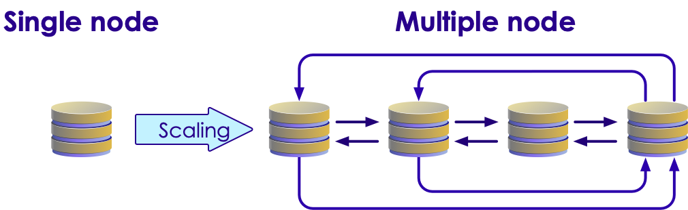
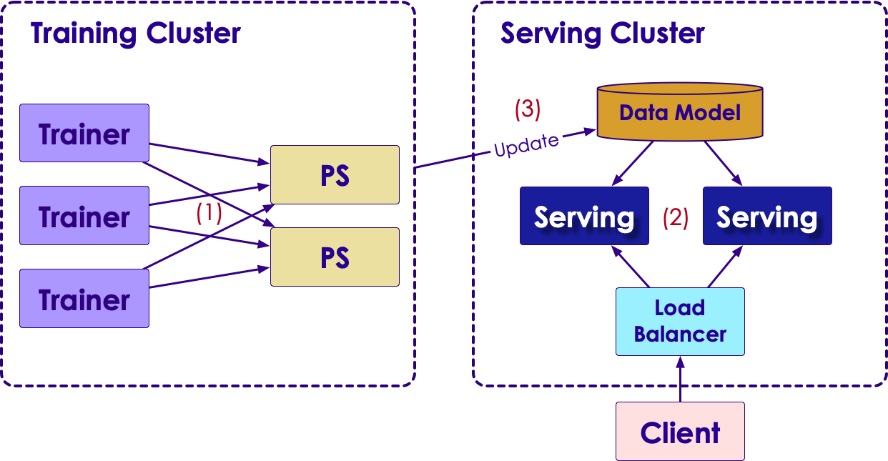
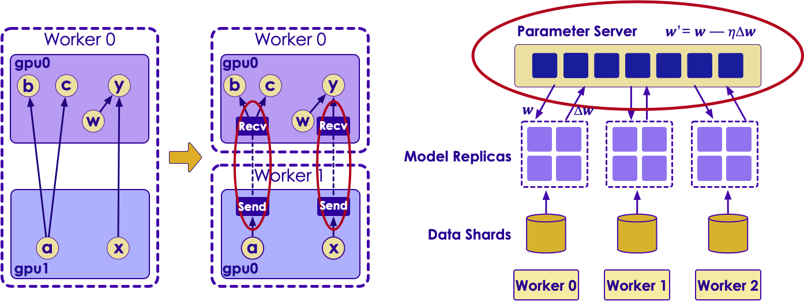
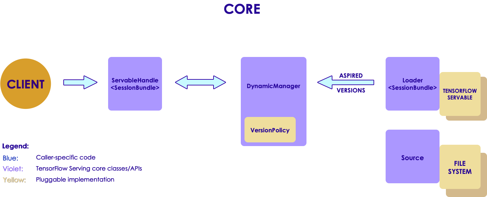
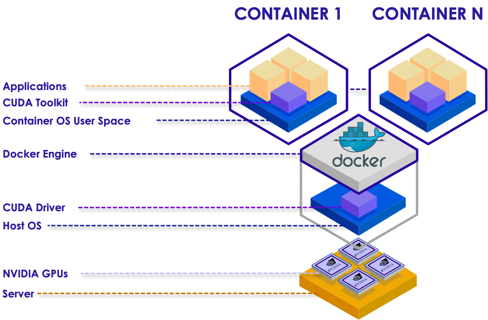
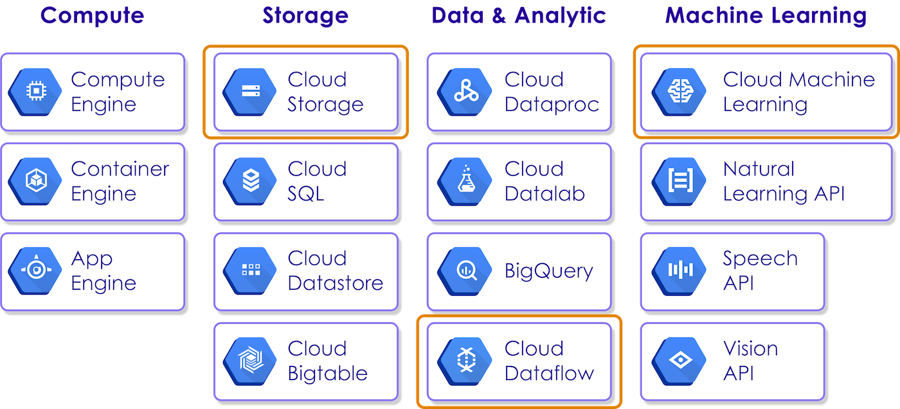

# Scaling TensorFlow

---

## Objectives


 * Review an Overview of Distributed TensorFlow 

 * Discuss How Container Cluster Orchestration can help us.

 * Explore TensorFlow integration with Big Data Ecosystem.

 * Propose Reference Architectures and Technology Stacks for:

     - Cloud Platforms

     - Open-source / On-prem

Notes: 


---

## Why Scaling TensorFlow?


 * TensorFlow is amazing

     - High performing 

     - Complete coverage

     - High-level APIs

 * Optimized for GPUs

     - Able to achieve an order of magnitude higher performance.

 * Before TensorFlow:

     - Deep learning was not practical:

     - Too much memory; too much processing time

     - Other techniques

Notes: 


---

## Why does it matter?


 * Most TF models are trained on one “big box” with lots of GPU and CPU power

     - No need for distributed (at least on training)

     - Too Complicated

     - Can still deploy trained models on distributed data.

 * Several Use Cases for distributed training.

     - Hyperparameter Tuning: iteratively running through many permutations of hyperparameters to get optimal models

     - Large Data training:  Training with massive datasets (Example: Google Translate)

     - Training for massive parallelization

Notes: 


---

## How do we scale this?


 * Most users of tensorflow don’t try to scale

 * Train model on one box with multiple GPUs (vertical)

 * Distribute model in application

 <!-- {"left" : 1.04, "top" : 3.08, "height" : 2.98, "width" : 8.17} -->


Notes: 


---

## We need horizontal scalability!


 * TensorFlow can only scale so high

 * GPUs are great but we can only have so many in one box

 <!-- {"left" : 0.81, "top" : 2.73, "height" : 2.51, "width" : 8.64} -->


Notes: 


---

# Distributed TensorFlow

---


## Google and Distributed TensorFlow


 * Google designed TensorFlow to be a parallelized framework.

     - Algorithms are designed with parallel computation in mind

     - Natively supports cluster configuration

 * Much of Google’s cluster computing framework is not part of TensorFlow

     - Rudimentary cluster management solution. 

Notes: 

 


---

## Training Cluster Versus Serving Cluster


 * Most TensorFlow configurations include a separate Training versus Serving cluster.
 (PS - Parameter Server)
 
 <!-- {"left" : 1.02, "top" : 2.09, "height" : 4.26, "width" : 8.21} -->


Notes: 


---

## Distributed TensorFlow on Sharded Data

  <!-- {"left" : 1.04, "top" : 1.08, "height" : 5.35, "width" : 8.17} -->


Notes: 

- https://stackoverflow.com/questions/39559183/what-is-the-reason-to-use-parameter-server-in-distributed-tensorflow-learning

---

## Worker Nodes for Distributed Execution

 <!-- {"left" : 0.33, "top" : 1.97, "height" : 3.56, "width" : 9.59} -->


Notes: 


---

## TensorFlow Example Model


 * Following is the outline of an example TensorFlow model

 * We can see the Following outline:

     - Layers

     - Predictions

     - Evaluations

     - Loss Function

```text
From tf.contrib import learn

def model_fn(X, Y_, mode):
  Yn = … #model layers
  predictions = {“probabilites”: …, “digits”: …}
  evaluations = {“accuracy”: metrics.accuracy(…){
  loss = …
  train = layers.optimize_loss(loss, …)
  return learn.ModelFnOps(mode, predictions,
 loss, train,    evaluations)

```
<!-- {"left" : 0, "top" : 3.84, "height" : 2.72, "width" : 10.25} -->


Notes: 

 


---

## Configuring Distributed TensorFlow


 * In Distributed TensorFlow we have to enter the cluster configuration

     - This must be shared on all nodes

     - Not easy to reconfigure cluster after the fact.

```text
tf.train.ClusterSpec({
    "worker": [
        "worker0.example.com:2222",
        "worker1.example.com:2222",
        "worker2.example.com:2222"    ],
    "ps": [           "ps0.example.com:2222",       
    "ps1.example.com:2222"    ]})

```
<!-- {"left" : 0, "top" : 2.93, "height" : 2.1, "width" : 10.25} -->


Notes: 

 


---

## TensorFlow Serving Architecture

 <!-- {"left" : 0.73, "top" : 2.38, "height" : 3.22, "width" : 8.8} -->


Notes: 


---

## Overview of TensorFlow Serving


 * TensorFlow can distributed trained models to production

 * Can allow us to run our models in a distributed fashion at scale

 * Allows us to replicate and serve TensorFlow models

Notes: 


---

## Problems with Distributed TensorFlow


 * Fault Tolerance:

     - Very limited.  If we lose a node, we have no way to automatically recover.

     - Dealing with Data issues: must be babysit

     - Back to bad-old-days of babysitting HPC cluster.

 * Hadoop Data read as a client

     - Read data, comes back

     - No Data Locality!

     - TensorFlow nodes are basically ”edge” nodes at best

 * Bottom line: Distributed TensorFlow by itself isn't enough to run a cluster.

Notes: 

---

## Dask

 * Dask is a cluster computing solution.
 * Written in Python
 * Originally designed for HPC clusters.
 * Now more often used for analytics
 * Libraries like scikit-learn, pandas, etc are *not* scalable.
 * Dask allows parallelization of these workloads
 * Target Framework can be dask-agnostic
 

---

# Container Cluster Solutions
---

## Kubernetes can help solve our problem


 * Gives us a robust clustering architecture

     - Kubernetes also a Google Project

     - Google standardized on Kubernetes for cluster solutions internally.

 * Fault-tolerant

     - At least from a compute perspective

 <!-- {"left" : 1.75, "top" : 3.93, "height" : 2.8, "width" : 6.75} -->


Notes: 


---

## Container Images


 * Google’s native container images are not released to the public.

 * Google adapted Kubernetes to use the very popular Docker image format

 * Docker has a lot of momentum in the market

 * Very good cross-platform developer tools for creating Docker Images.

 <!-- {"left" : 3.42, "top" : 3.99, "height" : 2.86, "width" : 3.4} -->


Notes: 


---

## Creating Docker Images


 * Creating Docker Images for GPUs is not easy

     - Docker doesn’t support GPUs out of the box.

     - No way to allocate GPU resources.

 * Why GPU Images?

     - No point in distributing unless we have access to GPUs.

     - ”Better to add more GPUs than CPUs”

     - Bottom Line: TF was considered unsuitable for containers.

 * The Solution: Use nvidia-docker

     - Fork of docker

     - Provides container management of GPU resources

 <!-- {"left" : 7.67, "top" : 0.58, "height" : 2.35, "width" : 2.35} -->


Notes: 


---

## Nvidia-docker

 <!-- {"left" : 1.06, "top" : 1.39, "height" : 5.2, "width" : 8.13} -->


Notes: 


---

## Kubernetes


 * Kubernetes gives us a master-worker cluster management solution 

 <!-- {"left" : 2.09, "top" : 2, "height" : 5.1, "width" : 6.07} -->


Notes: 


---

## Architecting a Kubernetes System


 * Containers should be lightweight:

     -  **One**  Technology only in each docker image

     - Based as much as possible on open-standards / default config

     - Microservice approach

 * With Kubernetes, we can then combine the images for integration.

Notes: 


---

# Distributed Data

---

## Distributed Processing vs Distributed Data


 * Kubernetes allows us to distribute our processing effectively

 * What about data?

     - What good is massively distributed processing on small data?

     - This is particularly true for TF Serving

 * ”more data usually beats better algorithms” – Anant Ramarajan

     - TF Training also needs access to large datasets.

Notes: 


---

## Running as a Hadoop Client


 * We can run TF data as a Hadoop Client

 * How do we get data locality?

     - We don’t.  There is no data locality.

     - Need very fast network connection

     - Preferably on same network as Hadoop

     - Infiniband?

 * Only suitable for compute-bound problems.

Notes: 


---

## Yarn/Hadoop and TensorFlow


 * YARN runs on the JVM. TensorFlow is native code.

     - This is a problem.

     - Have to pass native code to JVM

     - This is why TensorFlow usually accesses Hadoop Data a client.

 * Hadoop 3.x-alpha contains Native Services

     - This will allow us to have long running resident native tensorflow engine running on YARN

     - This means we can use Hadoop Services with TensorFlow

     - Unfortunately, Hadoop 3.x is alpha, so not released yet.

Notes: 


---

## TensorFlow on Spark


 * Yahoo introduced TensorFlow on Spark (TFoS)

 * Formerly called CaffeonSpark

 * Allows us to run TensorFlow on top of Spark

 * Only supports Python as language at this time.

Notes: 


---

## TensorFlow On Spark

  <!-- {"left" : 0.95, "top" : 1.27, "height" : 5.42, "width" : 8.34} -->


Notes: 

 


---

## Spark Deep Learning Pipelines


 * Spark ML pipelines on top of TensorFlow

 * Distributed Serving (not training)

 * Used for the following use cases:

     - Deploy TF or Keras models inside Spark ML pipeline

     - Transfer learning

     - Distributed Hyperparameter tuning

     - Integrating TF Models with Spark SQL as UDFs

 <!-- {"left" : 3.6, "top" : 4.1, "height" : 2.76, "width" : 3.06} -->


Notes: 


---

# Cloud Reference Architecture

---

## Becoming Google… but How??


 * Google open-sourced TensorFlow itself

 * Google’s larger ecosystem is not open-source.

 * Much of what allows TensorFlow to be distributed across massive scale at Google is proprietary to Google.

     - Doesn’t want to give away the store! 

     - Open-source tensorflow on a single node is not nearly as interesting as massively scaled tensorflow.

 * We may want to try to implement this ourselves in the cloud.

 <!-- {"left" : 7.38, "top" : 0.89, "height" : 0.85, "width" : 2.61} -->


 <!-- {"left" : 3.14, "top" : 4.62, "height" : 2.44, "width" : 3.97} -->


Notes: 


---

## What about AWS?


 * AWS is the market leader in cloud  (nearly 50% market share)

 * TensorFlow not directly supported by AWS

 * We can run TensorFlow ourselves via EC2

     - But this is not a serverless offering

     - There is no support for scaling this.

 * Better than EC2 is running a cluster on ECS

     - ECS functionality overlaps with Kubernetes but is incompatible.

     - Need to self-develop all plumbing and functionality

 * Verdict: AWS solution lacks a serverless offering at this time.

 * Engineering a solution on AWS is our responsibility.

 <!-- {"left" : 3.29, "top" : 6, "height" : 1.35, "width" : 3.63} -->


Notes: 


---

## The Alternative: Google Cloud Platform


 * Google Cloud Platform has all the support we need:

     - Massively Distributed Cloud Storage

     - Serverless data processing libraries

     - Serverless distributed machine learning on TensorFlow

     - Cluster support with Kubernetes

 * The problem:

     - Google Cloud is not widely used

     - Market share: 4.7% (2/2017) -- minor player compared to Amazon and Microsoft.

 <!-- {"left" : 3.14, "top" : 4.86, "height" : 2.45, "width" : 3.98} -->


Notes: 


---

## Google Cloud Components Used

 * We will use the following components of Google Cloud:

     - Storage

     - Dataflow

     - Cloud Machine Learning


 <!-- {"left" : 0.73, "top" : 2.96, "height" : 3.99, "width" : 8.78} -->


Notes: 


---

## Data Storage


 * First we must gather data into Cloud Storage

 <!-- {"left" : 0.73, "top" : 1.99, "height" : 3.99, "width" : 8.78} -->


Notes: 


---

## Why Cloud Storage?


 * Cloud Storage gives us virtually unlimited scalability and flexibility

     - No need to keep Hadoop or dataproc nodes running continuously

     - Ability to serve

 * No Data Locality

     - Data must be loaded onto servers at runtime

     - But it’s a worthwhile tradeoff for ML purposes

 <!-- {"left" : 2.59, "top" : 4.61, "height" : 2.6, "width" : 5.07} -->


Notes: 


---

## Dataflow


 * We need a layer to perform our feature extraction and feature engineering.  Cloud Dataflow is the ideal choice.

 <!-- {"left" : 0.73, "top" : 1.99, "height" : 3.99, "width" : 8.78} -->


Notes: 


---

## Why Cloud Dataflow?


 * It’s rare that we can plug our raw data directly into our models.

     - Normally, we have to transform the data into features

     - We call this feature extraction

 * Example: Data Encoding

     - All non-numeric data must be created as numeric features

     - Example: One-Hot Encoding transformation

  <!-- {"left" : 3.13, "top" : 4.08, "height" : 3.31, "width" : 3.99} -->


Notes: 


---

## Cloud Dataflow is Apache Beam


 * ”Collapsing Lambda” – putting both real-time and batch transformations in one framework.

 * Allows pipeline-based transformation of data

  <!-- {"left" : 0.87, "top" : 3.07, "height" : 3.21, "width" : 3.21} -->


<!--   -->
<!-- {"left" : 5.81, "top" : 2.38, "height" : 4.58, "width" : 3.34} -->


Notes: 


---

## Cloud Machine Learning


 * We want transparently scaled and sharded ML training and models.  Cloud ML is a great serverless choice.

 <!-- {"left" : 0.73, "top" : 2.36, "height" : 3.99, "width" : 8.78} -->


Notes: 


---

## Cloud ML allows distributed models


 * Parameter Servers serve:

 * Model Replicas

 * Data

  <!-- {"left" : 8.78, "top" : 0.85, "height" : 1.46, "width" : 1.38} -->


Notes: 


---

## Running Cloud ML Engine


 * We can use cloud ML engine to submit our training job

     - Result will shard data

     - Perform Distributed training

     - Scale cluster dynamically to suit

     - Run test models for evaluation

     - Tune Hyperparameters

```text
gcloud ml-engine jobs submit training $JOB_NAME \         
--scale-tier $SCALE_TIER --runtime-version 1.0 \
--job-dir $GCS_JOB_DIR \                                   
--module-name trainer.task \ 
--package-path trainer/ \                                    
--region us-central1 \                                    
--train-files $TRAIN_GCS_FILE \     --eval-files $EVAL_GCS_FILE \        --train-steps $TRAIN_STEPS

```
<!-- {"left" : 0, "top" : 3.78, "height" : 2.33, "width" : 10.25} -->
Notes: 


---

## Hyperparameter Tuning


 * Cloud ML Engine allows us to perform hyperparameter tuning

     - Will tune parameters and optimize with gradient descent.

```text
TrainingInput:  
scaleTier: CUSTOM  
parameterServerType: large_model  
workerCount: 9  
arameterServerCount: 3  
hyperparameters:
    goal: MAXIMIZE
    maxTrials: 30
    maxParallelTrials: 1
    params:
    - parameterName: hidden1
      type: INTEGER
      minValue: 40
      maxValue: 400
      scaleType: UNIT_LINEAR_SCALE

```
<!-- {"left" : 0, "top" : 1.94, "height" : 5.12, "width" : 7.78} -->


Notes: 


---

## Summary


 * Google Cloud is the best managed cloud solution for distributed machine learning on tensorflow
 * Stack:
     - Google Cloud Storage
     - Google Cloud Dataflow
     - TensorFlow (open-source)
     - Google Cloud ML
     - Kubernetes Cluster Management (open-source).
 * Services are largely proprietary
     - Not easily movable to on-prem or to other public Clouds
     - Technologies not open-source
     - Vendor lock-in
     - (The same concerns are even more true of AWS/Azure)

Notes: 


---

# On Premises Reference Architecture

---

## Problems with Google Cloud Architecture


 * Dataflow and Cloud ML are proprietary Google technologies

     - Based on open-source Apache Beam and Google TensorFlow

     - We can’t directly translate our Cloud Architecture to open-source

     - Dataflow and Cloud ML are  **serverless**  offerings.

 * Non-Google Clouds (such as AWS) do not support

     - AWS does not support TensorFlow as a serverless offering.

     - No direct support for Kubernetes 

        * AWS does have ECS… which is sort of the same thing.

Notes: 


---

## Traditional Open-Source Big Data Stack


 * Hadoop HDFS
 * Hadoop YARN
 * Spark on YARN
 * Storm (for real-time)
 * Hbase / Cassandra 

 <!-- {"left" : 1.91, "top" : 3.83, "height" : 3.45, "width" : 6.41} -->

---

## Traditional Open-Source Big Data Stack

 * TensorFlow doesn’t easily fit into this stack

 * YARN cluster management does not play well with TensorFlow (for now)


Notes: 


---

## We need a new STACK


 * We propose a new stack:

 * Spark: For Big Data processing on Kubernetes

 * TensorFlow For Deep Learning Model

 * Arrow: For In Memory Analytics

 * Cassandra: For Fast NoSQL (can use Scylla)

 * Kafka: For high speed data pub-sub:

<!--   -->
<!-- {"left" : 8.43, "top" : 1.1, "height" : 0.6, "width" : 1.12} -->


<!--   -->
<!-- {"left" : 8.56, "top" : 2.03, "height" : 0.74, "width" : 0.86} -->


<!--   -->
<!-- {"left" : 8.75, "top" : 3.07, "height" : 0.74, "width" : 0.74} -->


<!--   -->
<!-- {"left" : 8.56, "top" : 3.91, "height" : 0.76, "width" : 1.12} -->


<!--   -->
<!-- {"left" : 8.88, "top" : 4.91, "height" : 0.76, "width" : 0.48} -->


---

## Advantages of the STACK


 * Allows us to operate with Big Data 

 * Store data in real time in-memory (Arrow) or on-disk (Cassandra)

 * Perform distributed deep learning (TensorFlow)

 * High performance, scalable computing (Spark)

 * No need for proprietary cloud solutions (Google, Microsoft, Amazon)

 * Not Complete enough for you? Try the 

     - PANCAKE STACK! (next slide)

Notes: 


---

## The New Data Science Stack: Pancake Stack


 <!-- {"left" : 0, "top" : 0.77, "height" : 5.95, "width" : 10.25} -->


Notes: 


---

## PANCAKE STACK


 * Pancake stack gives us a comprehensive stack for deep learning on Big Data

 * Query: Presto (structured), ElasticSearch (unstructured)

 * Streaming: Kafka, NiFi

 * Processing: Spark, Arrow (workflow management)

 * Analytics: Spark, Algebird (aggregation API)

 * Deep Learning: TensorFlow

 * Unstructured Data/ NLP: CoreNLP

 * In-Memory: Arrow

 * Persistence: Cassandra

 * Visualize: Kibana

Notes: 


---

## Too complicated?  Enter Kubernetes…


 * Do one thing and do it well…

     - Use Microservices approach with Kubernetes

     - Each container does ONE task on One Technology

 * Kubernetes can orchestrate the stack.

 * Use docker images for each component on each node:

     - Spark master, spark worker

     - Arrow worker

     - Etc

 <!-- {"left" : 3.56, "top" : 3.85, "height" : 3.13, "width" : 3.13} -->


Notes: 


---

## Our proposal: Summary


 * Use the STACK (Spark/TensorFlow/Arrow/Cassandra/Kafka)

 * Use Docker Container Images with Kubernetes for Scalable Cluster

 * Ingest Data in Real-Time using Kafka

 * Prepare data / do feature extraction in Spark

 * Train Data at scale with TensorFlow

 * Iterate Hyperparameters at scale with TF on Spark.

 * Persist data using Arrow / Cassandra

 * Serve Model at scale using TF Serving models on Spark.

 * Use Elements of PANCAKE STACK for specific data science use cases.

Notes: 


---

## Questions?? 


 * I hope you’ve enjoyed this talk and am delighted to hear your questions.

Notes: 


---
