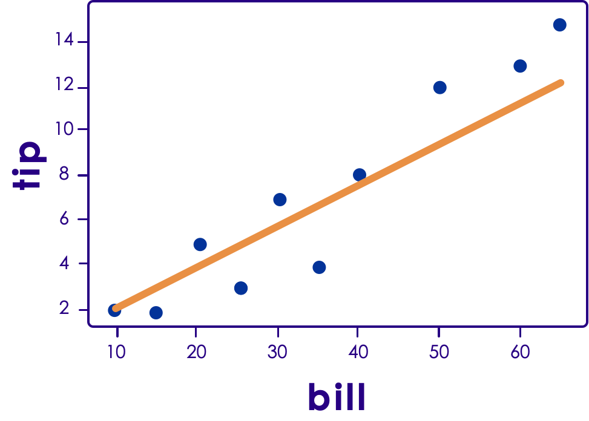

TensorFlow Regression
=====================

# Linear Regression 

## Linear Regression

 * Here we will see how to do linear regression in Tensorflow.
 * This will be using the *high-level* API.
 * Specifically, the tf.estimator API.

## Example Bill/Tip Data
 * Here is our bill and tip data: 

```python
tip_data = pd.DataFrame(
   {'bill' : [50.00, 30.00, 60.00, 
              40.00, 65.00, 20.00, 
              10.00, 15.00, 25.00, 35.00],
    'tip' : [12.00, 7.00, 13.00, 
             8.00, 15.00, 5.00, 
             2.00, 2.00, 3.00, 4.00]
    })
```

<!-- {"left" : 0.0, "top" : 1.58, "height" : 3.44, "width" : 10.25} -->


Notes:

---
## Define Our Feature Columns

 * In order for us to do training, we need feature columns
 * Here is how we can define a feature columns


```python
feature_columns = [
    tf.feature_column.numeric_column(key="bill"),
]
```
<!-- {"left" : 0.0, "top" : 2.03, "height" : 1.32, "width" : 10.25} -->


Notes:

---

## Define an Optimizer
 
  * We don't actually **need** an optimizer
  * But, if we want control, we may need to have one.

```python
my_optimizer=tf.train.GradientDescentOptimizer(
   learning_rate=0.02)
```
<!-- {"left" : 0.0, "top" : 2, "height" : 1.03, "width" : 10.25} -->


Notes:

---

## Define the LinearRegressor
  * We will use the `tf.estimator` class `LinearRegressor`.

```python
linear_regressor = tf.estimator.LinearRegressor(
    feature_columns=feature_columns,
    optimizer=my_optimizer
)
```
<!-- {"left" : 0.0, "top" : 1.6, "height" : 1.69, "width" : 10.25} -->

Notes:

---

## Define the Input Function
  * We need an input function
  * Arguments:
    -  features: pandas DataFrame of features
    -  targets: pandas DataFrame of targets
    -  batch_size: Size of batches to be passed to the model
    -  shuffle: True or False. Whether to shuffle the data.
    -  num_epochs: Number of epochs for which data should be repeated. None = repeat indefinitely


Notes:

---
## Example Input Function

  * Here it is: 

```python
def my_input_fn(features, targets, 
       atch_size=1, shuffle=True, 
       num_epochs=None):
  
    features = {key:np.array(value) \ 
      for key,value in dict(features).items()}                                           
 
    ds = Dataset.from_tensor_slices(
      (features,targets)) 
    ds = ds.batch(batch_size).repeat(num_epochs)
    
    # Return the next batch of data.
    features, labels = 
      ds.make_one_shot_iterator().get_next()
    return features, labels
```
<!-- {"left" : 0.0, "top" : 1.38, "height" : 3.05, "width" : 10.25} -->


Notes:

---

## Perform the Training
  * Here we can perform our training
  * Note that we use the input function


```python
linear_regressor.train(
    input_fn = lambda:my_input_fn(
      tip_data[['bill']], tip_data.tip),
    steps=20
)
```
<!-- {"left" : 0.0, "top" : 1.97, "height" : 2.39, "width" : 10.25} -->


Notes:

---
## Prediction Input Function

  * We need to create a prediction input fencing
  * This is called when we make the prediction
  * It is similar to the training input function

```python
prediction_input_fn =
   lambda: my_input_fn(
      tip_data[['bill']], tip_data['tip'], 
      num_epochs=1, shuffle=False)
```
<!-- {"left" : 0.0, "top" : 2.42, "height" : 1.86, "width" : 10.25} -->


Notes:

---
## Make the Prediction

  * We now call predict with our prediction function
  * We will do it as follows:

```python
# Call predict() on the linear_regressor 
# to make predictions.
predictions = linear_regressor.predict(
   input_fn=prediction_input_fn)

predictions = np.array(
   [item['predictions'][0] for item in predictions])
```
<!-- {"left" : 0.0, "top" : 1.92, "height" : 2.52, "width" : 10.25} -->


Notes:

---
## Metrics

 * We will print out the following:
   - MSE: (Mean Squared Error)
   - RMSE: (Root Mean Squared Error)

```python
mean_squared_error = metrics.
   mean_squared_error(predictions, tip_data['tip'])
   
root_mean_squared_error = math.sqrt(
   mean_squared_error)

print("Mean Squared Error: %0.3f" % 
   mean_squared_error)

print("Root Mean Squared Error: %0.3f" % 
   root_mean_squared_error)
```

<!-- {"left" : 0.0, "top" : 2.38, "height" : 3.85, "width" : 10.25} -->


Notes:

---
## Getting the Coefficients and Intercept
 * We can get the coefficients and intercept
 * This is the result of our liner model

```python
# Retrieve the final weight and bias 
# generated during training.
weight = linear_regressor.
   get_variable_value(
   'linear/linear_model/bill/weights')[0]

bias = linear_regressor.
     get_variable_value(
     'linear/linear_model/bias_weights')

print((weight[0],bias[0]))
```
<!-- {"left" : 0.0, "top" : 1.89, "height" : 4.69, "width" : 10.25} -->

Notes:

---

## Plotting the Results
 * We can plot the results

 <!-- {"left" : 1.47, "top" : 2.13, "height" : 4.93, "width" : 6.98} -->


Notes:

---
# Logistic Regression

## Logistic Regression
   * It requires a binary output
   * Used for classification


Notes:

---

## Logistic Regression Lab
   * Instructor to demo


Notes:

---

