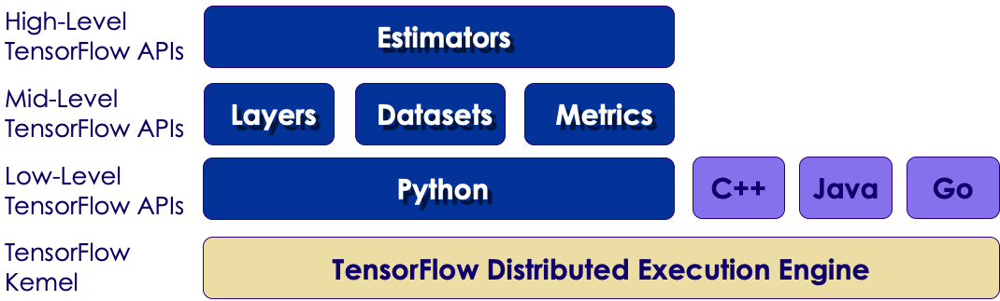

# Backup slides
---

## TensorFlow + Hadoop

 * TensorFlow can natively read HDFS data (as a client)

     - Refer to files as hdfs://namenode:8020/path/to/your/files

 * TensorFlow can also use Hadoop YARN as a cluster manager for Distributed TensorFlow!

     - Hortonworks has a TensorFlow assembly to run yarn on its Hadoop distribution

Notes:

---
## Lab: Installing Tensorflow and Keras

<!-- {"left" : 6.87, "top" : 1.27, "height" : 3.88, "width" : 2.92} -->

 *  **Overview:**
     - In this lab, we will become familiar with the lab environment, set up TensorFlow, and start.

 * **Note :**
     - The training VMs are already setup, no need for this setup. You can skip to next step

 *  **Approximate time:** 15-20 minutes

 *  **Instructions for students:**

     - Follow the **install.html**

---

## tf.estimator API

 * Packaged With TensorFlow core as of 1.0
     - Formerly named scikit-train, then `tf.contrib.learn`
 * Designed to be familiar to scikit-learn users
     - one-line models.
 * Used together with TensorFlow Datasets API
 * Mainly used for general-purpose ML rather than Deep-Learning

Notes:

---
## Tensorflow UI Tiers

 * TensorFlow has a multi-tiered API
   - Low-Level
   - Mid-Level
   - High-Level

 <!-- {"left" : 0.6, "top" : 4.32, "height" : 2.65, "width" : 9.03} -->

---
