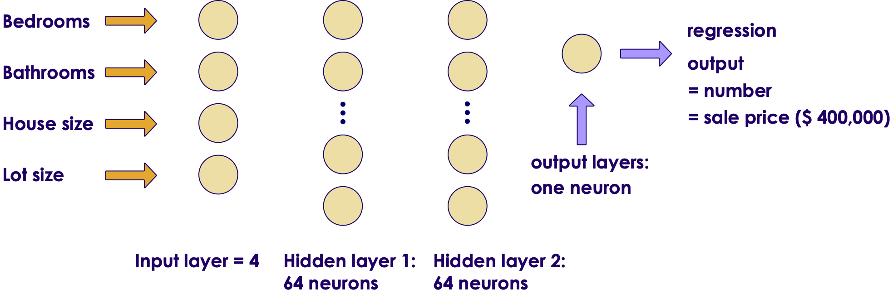
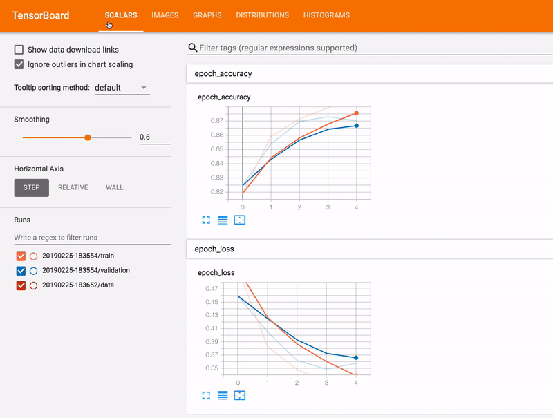
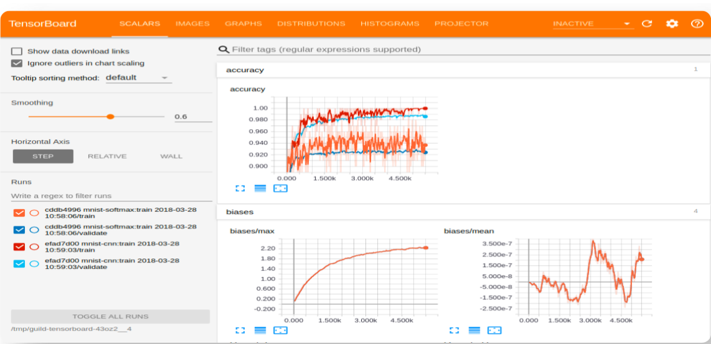
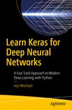

# Neural Networks in Tensorflow (v2)

<!-- {"left" : 8.59, "top" : 8.13, "height" : 2.06, "width" : 4.74} -->
 <!-- {"left" : 4.17, "top" : 7.9, "height" : 2.52, "width" : 2.96} -->

---

## Lesson Objectives

* Use TFv2 API to build neural networks

Notes:  

---

## Tensorflow Evolution

* When Tensorflow was open sourced in 2016, it caught on very quickly

* The community liked the
    - Features
    - Performance
    - and it is from Google :-)

* However, Tensorflow version 1 API was a too low level

* Keras was created to be a high level API for neural networks

---

## Keras

<!-- {"left" : 9.85, "top" : 1.89, "height" : 5.28, "width" : 7.48} -->

* Keras ([Keras.io](https://keras.io/)) - is a high level neural networks API
* It was developed by a Google engineer, Francois Chollet
* Written in Python
* Works with [Tensorflow](https://github.com/tensorflow/tensorflow)(from Google), [CNTK](https://github.com/Microsoft/cntk)(from Microsoft) and [Theano](https://github.com/Theano/Theano)


<!-- {"left" : 11.6, "top" : 8.13, "height" : 1.15, "width" : 3.98} -->

Notes:  
NVIDIA - leading GPU vendor - provides CUDA (Compute Unified Device Architecture) and cuDNN (CUDA Deep Neural Network)

---

## Keras Features

<!-- {"left" : 10.06, "top" : 2.41, "height" : 3.73, "width" : 7.07} -->

* Write high level code
    - easier to write
    - faster to experiment

* Can support multiple back-ends

* Runs seamlessly on CPU and GPU

* [Wins Machine Learning competitions](https://www.quora.com/Why-has-Keras-been-so-successful-lately-at-Kaggle-competitions)


Notes:
https://www.quora.com/Why-has-Keras-been-so-successful-lately-at-Kaggle-competitions

---

## Keras Guiding Principles

<!-- {"left" : 10.53, "top" : 1.89, "height" : 4.94, "width" : 6.6} -->

 * **User Friendliness**  
   - Offers consistent, simple APIs

 * **Modularity**  
   - Combine various modules, like Legos&reg;

 * **Easy Extensibility**  
   - Add new modules easily

 * **Works 100% in Python**  
   - No other libraries needed

 * ___"Keras is designed for human beings, not machines"___

---
## Keras and Tensorflow

 &nbsp;  &nbsp; <!-- {"left" : 13.5, "top" : 1.89, "height" : 2.63, "width" : 3.1} -->

* Keras's easy-to-use, high-level API  was widely appreciated

* So starting from Tensorflow version 2.0, TF team started standardizing on Keras style API
    - It was the perfect solution for Tensorflow's 'too low level' APIs

<!-- {"left" : 12.57, "top" : 5.48, "height" : 1.44, "width" : 4.96} -->

* Tensorflow now includes Keras; it is in **`tf.keras`** package

- **`tf.keras`** implementation has TensorFlow specific enhancements
    - Support for TPU
    - Distributed training

* __`Multi-backend Keras`__ is now (2020 January) superseded by __`tf.keras`__

---

## Using tf.keras

```python

try:
  # %tensorflow_version only exists in Colab.
  %tensorflow_version 2.x
except Exception:
  pass

## --- import tf.keras ---
import tensorflow as tf
from tensorflow import keras
print ('tensorflow version: ', tf.__version__)
print ('keras version: ', keras.__version__)
#  tf version: 2.2.0
#  keras version: 2.3.0-tf

## From this point on, when we say keras, we are using tf.keras

## continue using tf.keras APIs
model = keras.Sequential([
            keras.layers.Dense(units=input_dim, activation=tf.nn.relu, input_dim=input_dim),
            keras.layers.Dense(units=64, activation=tf.nn.relu),
            keras.layers.Dense(units=output_clases,  activation=tf.nn.softmax)
            ])

```
<!-- {"left" : 0.85, "top" : 2.5, "height" : 7.39, "width" : 15.96} -->

---


## Abstractions

<!-- {"left" : 9.64, "top" : 1.89, "height" : 3.94, "width" : 7.41} -->

<!-- {"left" : 9.68, "top" : 6.1, "height" : 4.12, "width" : 4.12} --> <!-- {"left" : 14.13, "top" : 6.1, "height" : 4.12, "width" : 2.96} -->

  * **Layer**
    - A Layer is a group of neurons.

  * **Model**
    - Model is a collection of Layers

  * **Loss Functions**
    - Help network calculate the errors
    - (Like a referee)

  * **Optimizer**
    - Helps with training
    - (Like a coach)


---
# Models
---

## Models Intro


* Models are defined in [tf.keras.model](https://www.tensorflow.org/api_docs/python/tf/keras/models) package

* There are 2 ways to build a Keras model
    - Option 1: Functional API -- simplest
    - Option 2: Extending Model class -- more work but flexible

* Most used model is **`Sequential`** model;  It adds layers in a sequence

```python
import tensorflor as tf
from tensorflow import keras

model = keras.models.Sequential()
# model.add (...)
```
<!-- {"left" : 0.85, "top" : 5.09, "height" : 2.7, "width" : 9.77} -->


---

## Creating a Model - Using Functional API

* With the "functional API", we start from Input
* And chain layer calls to specify the model's forward pass
* Finally we create your model from inputs and outputs:
* Model is a __sequence of layers__

<!-- {"left" : 11.49, "top" : 1.89, "height" : 5.23, "width" : 5.73} -->

```python
from tensorflow import keras

# a is the input layer.  Here input has 4 dimensions
a = keras.layers.Input(shape=(4,))

# now 'a' is input to 'b'
b = keras.layers.Dense(units=64, activation=tf.nn.relu) (a)

# 'b' is input to 'c'
c = keras.layers.Dense(units=32, activation=tf.nn.relu) (b)

# d is final layer, takes  'c' as input
d = keras.layers.Dense(units=1, activation=tf.nn.sigmoid) (c)

# create a model
model = Model(inputs=a, outputs=d)
```
<!-- {"left" : 0.85, "top" : 6.2, "height" : 4.8, "width" : 10.63} -->


---

## Model Creation - Functional API

* Here is another way of adding layers to model
* Start with an empty model and keep adding layers

 <!-- {"left" : 11.49, "top" : 1.89, "height" : 5.23, "width" : 5.73} -->


```python
## option 1
## explicitly defining input layer
model = keras.models.Sequential()
model.add (keras.layers.Input(shape=(4,)))
model.add (keras.layers.Dense(units=64, activation='relu'))
model.add (keras.layers.Dense(units=32, activation='relu'))
model.add (keras.layers.Dense(units=1, activation='sigmoid'))


## option 2: same as above
## no explicit input layer,
## first layer accepts 'input_shape' argument
model = keras.models.Sequential()
model.add (keras.layers.Dense(units=64, activation='relu', input_shape=(4,)))
# Afterwards, we do automatic shape inference
model.add (keras.layers.Dense(units=32, activation='relu'))
model.add (keras.layers.Dense(units=1, activation='sigmoid'))


## option 3 : same as above two
model = keras.Sequential([
          keras.layers.Dense(units=64, activation='relu', input_shape=(4,)),
          keras.layers.Dense(units=32, activation='relu')
          keras.layers.Dense(units=1, activation='sigmoid')
        ])
```
<!-- {"left" : 0.85, "top" : 4.51, "height" : 5.77, "width" : 10.38} -->

---

## Model Creation - Subclassing Model Class

* More flexible
* Define your layers in __`init`__ method
* Implement the model's forward pass in __`call`__ function

```python
import tensorflow as tf

class MyModel(tf.keras.Model):

  def __init__(self):
    super(MyModel, self).__init__()
    self.dense1 = tf.keras.layers.Dense(4, activation=tf.nn.relu)
    self.dense2 = tf.keras.layers.Dense(5, activation=tf.nn.softmax)

  def call(self, inputs):
    x = self.dense1(inputs)
    return self.dense2(x)

model = MyModel()
```
<!-- {"left" : 0.85, "top" : 4.01, "height" : 5.06, "width" : 14.05} -->


---

## Model Methods

* Models have the following methods

* We will see all these functions in detail later in examples


| Method       | Description                             |
|--------------|-----------------------------------------|
| `fit`        | Trains the model                        |
| `evaluate`   | Computes model accuracy for test        |
| `predict`    | Generates predictions for inputs        |
| `evaluate`   | Evaluates and calculates model accuracy |
| `save_model` | Saves model for later use               |
| `load_model` | Loads a previously saved model          |

<!-- {"left" : 2.32, "top" : 4.13, "height" : 1, "width" : 12.85} -->

---

# Layers

---

## Layers

  * Core layers
    - Dense
    - Dropout
  * Convolutional Layer
  * Pooling Layer
  * Recurrent Layer
  * Embedding Layer
  * Merge Layer

  * Layers are defined in **`tf.keras.layers`** package.

  * We are only going to look at few layers here.  
  * [Documentation](https://www.tensorflow.org/api_docs/python/tf/keras/layers)

---
## Core Layers: Dense

<!-- {"left" : 11.72, "top" : 1.89, "height" : 4.97, "width" : 5.14} -->

* A dense layer connects every neuron in this layer to every neuron in previous layer.

* In our diagram
    - Layer 1 has 3 neurons
    - Layer 2  has 4 neurons,
    - Layer 3  has 2 neurons,

* Total number of connections:
    - between Layer 1 and Layer 2 would be 3 x 4 = 12
    - between Layer 2 and Layer 3 would be 4 x 2 = 8

* First layer need to know the input dimensions


---

## Core Layers: Dense

```python
## API
keras.layers.Dense(
    units,   # number of neurons
    activation=None, # default is linear : f(x)=x
    use_bias=True,
    kernel_initializer='glorot_uniform',
    bias_initializer='zeros',
    kernel_regularizer=None,
    bias_regularizer=None,
    activity_regularizer=None,
    kernel_constraint=None,
    bias_constraint=None)

```
<!-- {"left" : 0.85, "top" : 2.3, "height" : 5.1, "width" : 13.72} -->


```python
## Usage

from tensorflow.keras.layers import Dense

# has 32 neurons
# Takes input array of shape [*,16]
# output array shape [*,32]
d = Dense(units=32, input_shape=(16,)))
```
<!-- {"left" : 0.85, "top" : 7.53, "height" : 3.36, "width" : 11.16} -->

---

## Core Layers: Dropout

<!-- {"left" : 11.38, "top" : 1.89, "height" : 4.84, "width" : 5.67} -->


  * The dropout layer in DL helps reduce overfitting by introducing regularization and generalization

  * The dropout layer drops out a few neurons or sets them to 0 and reduces computation in the training process.

```python
## API

keras.layers.Dropout(rate, noise_shape=None, seed=None)
```
<!-- {"left" : 0.85, "top" : 6.57, "height" : 1.37, "width" : 11.83} -->


```python
## Usage

from tensorflow.keras.layers import Dropout

d = Dropout(rate = 0.1,seed=100)
```
<!-- {"left" : 0.85, "top" : 8.19, "height" : 1.92, "width" : 8.29} -->

---

# Optimizers

---

## Optimizers

<!-- {"left" : 11.47, "top" : 1.89, "height" : 5.59, "width" : 5.59} -->

* Tensorflow implements a lot of popular optimizers
    - SGD: Stochastic Gradient Descent Optimizer
    - Momentum / Nesterov
    - Adagrad
    - RMSProp
    - Adam

* **`adam`** and **`rmsprop`** are the go to optimizers now

* See [official documentation](https://www.tensorflow.org/api_docs/python/tf/keras/optimizers) and also Appendix for some example code

---

## Using Optimizers

* We can specify the optimizers
    - by 'name'
    - or initialize the respective classes for customization

```python

# specify by name 'sgd'
model.compile(optimizer='sgd', loss='mean_squared_error')


# or initialize the class
model.compile(optimizer=tf.keras.optimizers.SGD(lr=0.01, decay=1e-6, momentum=0.9, nesterov=True),
              loss='mean_squared_error')
```
<!-- {"left" : 0.85, "top" : 4.01, "height" : 2.49, "width" : 15.95} -->


---

# Loss Functions

---

## Loss Functions

<!-- {"left" : 11.71, "top" : 1.89, "height" : 7.35, "width" : 5.31} -->

* Loss functions are defined in [tf.keras.losses](https://www.tensorflow.org/api_docs/python/tf/keras/losses) package


* For Regressions:
    - Mean Squared Error
    - Mean Absolute Error
    - more...

* For Classifications:
    - Categorical Cross-entropy
    - Binary Cross-entropy

---

## Loss Functions for Regressions


| Bedrooms | Bathrooms | Size | Sale Price (in thousands) |
|--------------------|---------------------|----------------|------------------------------------------------------|
| 3                  | 1                   | 1500           | 230                                                  |
| 3                  | 2                   | 1800           | 320                                                  |
| 5                  | 3                   | 2400           | 600                                                  |

<!-- {"left" : 1.09, "top" : 2.25, "height" : 1, "width" : 15.33, "columnwidth" : [2.73, 3.54, 3.79, 5.27]} -->

* **Mean Squared Error**

```python
model.compile(optimizer=optimizer,
              loss='mean_squared_error', # or 'mse'
              metrics = ['mean_squared_error']) # or 'mse'

model.compile(optimizer=optimizer,
              loss=tf.keras.losses.MeanSquaredError(),
              metrics = ['mse'])
```
<!-- {"left" : 0.85, "top" : 5.76, "height" : 2.66, "width" : 11.96} -->

<br/>

*  **Mean Absolute Error**


```python
model.compile(optimizer=optimizer,
              loss='mean_absolute_error',  # or 'mae'
              metrics = ['mean_absolute_error'])  # or 'mae'

model.compile(optimizer=optimizer,
              loss=tf.keras.losses.MeanAbsoluteError(),
              metrics = ['mae'])
```
<!-- {"left" : 0.85, "top" : 9.36, "height" : 2.32, "width" : 10.78} -->


---

## Loss Functions for Binary Classifications

| gre     | gpa     | rank.    | admit      |
|---------|---------|----------|------------|
| 380     | 3.6     | 3        | 0          |
| 660     | 3.67    | 3        | 1          |
| 800     | 4       | 1        | 1          |
| 640     | 3.19    | 4        | 0          |

<!-- {"left" : 1.83, "top" : 2.44, "height" : 2.5, "width" : 13.84} -->

*  **Binary Cross-entropy**
* Used when outcome is binary (true/false,  0/1)
* In this example, __`admit`__ is a boolean outcome we are trying to predict


```python
model.compile(optimizer=optimizer,
              loss='binary_crossentropy',
              metrics=['accuracy'])

model.compile(optimizer=optimizer,
              loss=tf.keras.losses.BinaryCrossentropy(),
              metrics=['accuracy'])
```
<!-- {"left" : 0.85, "top" : 7.71, "height" : 2.8, "width" : 12.22} -->


---

## Loss Functions for Multi-Class Classifications


| a   | b   | c   | d   | label |
|-----|-----|-----|-----|-------|
| 6.4 | 2.8 | 5.6 | 2.2 | 1     |
| 5.0 | 2.3 | 3.3 | 1.0 | 2     |
| 4.9 | 3.1 | 1.5 | 0.1 | 3     |

<!-- {"left" : 1.23, "top" : 2.41, "height" : 1, "width" : 15.04} -->

* **Sparse Categorical Cross-entropy**
* Used for multi-class classifications ('cat', 'dog', 'lion' ..etc)
* In this dataset, we are trying to predict __`label`__ as __`1 or 2 or 3`__


```python
model.compile(optimizer=optimizer,
              loss='sparse_categorical_crossentropy',
              metrics=['accuracy'])

model.compile(optimizer=optimizer,
              loss=tf.keras.losses.SparseCategoricalCrossentropy(),
              metrics=['accuracy'])
```
<!-- {"left" : 0.85, "top" : 7.01, "height" : 2.76, "width" : 14.24} -->


---

## Loss Functions for Multi-Class Classifications

| a   | b   | c   | d   | label    |
|-----|-----|-----|-----|----------|
| 6.4 | 2.8 | 5.6 | 2.2 | [1,0,0]  |
| 5.0 | 2.3 | 3.3 | 1.0 | [0,1,0]  |
| 4.9 | 3.1 | 1.5 | 0.1 | [0,0,1]  |

<!-- {"left" : 1.23, "top" : 2.41, "height" : 1, "width" : 15.04} -->


* **Categorical Cross-entropy**
* Used for multi-class classifications ('cat', 'dog', 'lion' ..etc)
* In this dataset, we are trying to predict __`label`__ as __`1 or 2 or 3`__
* Labels must be __`one-hot`__ encoded (like `[1,0,0],  [0,1,0], [0,0,1]`)

```python
model.compile(optimizer=optimizer,
              loss='categorical_crossentropy',
              metrics=['accuracy'])

model.compile(optimizer=optimizer,
              loss=tf.keras.losses.CategoricalCrossentropy(),
              metrics=['accuracy'])
```
<!-- {"left" : 0.85, "top" : 8.25, "height" : 2.85, "width" : 13.47} -->


---

# Activation Functions

---

## Activation Functions

* Activation functions are defined in [tf.keras.activations](https://www.tensorflow.org/api_docs/python/tf/keras/activations)

* Here are the popular ones:   
`Linear, Sigmoid, Tanh,  ReLU,  Softmax`

* Activation functions can be specified by 3 ways:
    - by using simple name: **`relu`**
    - name: **`tf.nn.relu`**
    - full class:  **`tf.keras.activations.relu`**

```python
import tensorflow as tf
from tensorflow import keras
from keras.layers import Dense

model.add(Dense(units=64, activation='relu', input_dim=100))
model.add(Dense(units=64, activation=tf.nn.relu, input_dim=100))
model.add(Dense(units=10, activation='softmax'))

# --------------------------

## Also can initialize using classes
act = tf.keras.activations.softmax(x, axis=-1)
model.add(Dense(units=10, activation=act))

```
<!-- {"left" : 0.85, "top" : 5.73, "height" : 4.66, "width" : 13.1} -->


---

## Activation for Regressions

| Bedrooms | Bathrooms | Size | Sale Price (in thousands) |
|--------------------|---------------------|----------------|------------------------------------------------------|
| 3                  | 1                   | 1500           | 230                                                  |
| 3                  | 2                   | 1800           | 320                                                  |
| 5                  | 3                   | 2400           | 600                                                  |

<!-- {"left" : 1.09, "top" : 2.25, "height" : 1, "width" : 15.33, "columnwidth" : [2.73, 3.54, 3.79, 5.27]} -->

* For regressions, the last layer will have
    - __`ONE`__ neuron
    - __`LINEAR`__ activation

```python

from tensorflow import keras

model = keras.models.Sequential()
# model.add (...)

## Last layer
model.add(keras.layers.Dense(units=1, activation='linear'))

# or
model.add(Dense(units=1,
                activation=tf.keras.activations.linear()))


```
<!-- {"left" : 0.85, "top" : 7.04, "height" : 4.21, "width" : 12.81} -->

---

## Activation for Binary Classifications


| gre     | gpa     | rank.    | admit      |
|---------|---------|----------|------------|
| 380     | 3.6     | 3        | 0          |
| 660     | 3.67    | 3        | 1          |
| 640     | 3.19    | 4        | 0          |

<!-- {"left" : 1.87, "top" : 2.22, "height" : 2, "width" : 13.76} -->


* Used when outcome is binary (true/false,  0/1)
* For binary classifiers, the last layer will have
    - __`ONE`__ neuron
    - __`SIGMOID`__ activation
    - Sigmoid provides output between __0 and 1__ representing probability


```python
# model.add (...)

## Last layer
model.add(Dense(units=1, activation='sigmoid'))

# or
model.add(Dense(units=1,
                activation=tf.keras.activations.linear()))

```
<!-- {"left" : 0.85, "top" : 8.14, "height" : 2.32, "width" : 10.61} -->

---

## Activation for Multi-class Classifiers

| a   | b   | c   | d   | label |
|-----|-----|-----|-----|-------|
| 6.4 | 2.8 | 5.6 | 2.2 | 1     |
| 5.0 | 2.3 | 3.3 | 1.0 | 2     |
| 4.9 | 3.1 | 1.5 | 0.1 | 3     |

<!-- {"left" : 1.23, "top" : 2.41, "height" : 1, "width" : 15.04} -->

* In this dataset, we are trying to predict __`label`__ as __`1 or 2 or 3`__
* Last layer will have
    - Number of neurons matching possible outputs
    - Activation function is __`softmax`__
    - Softmax provides an array of numbers representing probabilities for each class (sum is 1.0)
    - Sample output: [0.1, 0.8, 0.1] (so label 2 is the winner)

```python
## Last layer
# 3 units to match 3 output classes
model.add(Dense(units=3, activation='softmax'))

# or
model.add(Dense(units=3,
                activation=tf.keras.activations.softmax()))
```
<!-- {"left" : 0.85, "top" : 8.94, "height" : 2.5, "width" : 11.45} -->

---

# Neural Network for Regression

---

## Workflow

<!-- {"left" : 13.55, "top" : 1.89, "height" : 8.16, "width" : 3.36} -->

* Here is a typical workflow.  

* Step 1 - Define the network
    - Step 1A - Create a model
    - Step 1B - Stack layers using the **`.add()`** method

* Step 2 - Configure the learning process using the **`compile()`** method

* Step 3 - Train the model on the train dataset using the **`.fit()`** method

* Step 4 - Evaluate the network

* Step 5 - Predict

---

## Regression: Predicting House Prices


| Sale Price $ | Bedrooms | Bathrooms | Sqft_Living | Sqft_Lot |
|--------------|----------|-----------|-------------|----------|
| 280,000      | 6        | 3         | 2,400       | 9,373    |
| 1,000,000    | 4        | 3.75      | 3,764       | 20,156   |
| 745,000      | 4        | 1.75      | 2.06        | 26,036   |
| 425,000      | 5        | 3.75      | 3,200       | 8,618    |
| 240,000      | 4        | 1.75      | 1,720       | 8,620    |
| 327,000      | 3        | 1.5       | 1,750       | 34,465   |
| 347,000      | 4        | 1.75      | 1,860       | 14,650   |

<!-- {"left" : 0.96, "top" : 2.27, "height" : 1, "width" : 15.58} -->

* Inputs: Bedrooms, Bathrooms, Sqft_Living, Sqft_Lot
* Output: Sale Price

---

## Step 0: Preparing Data

```python
import pandas as pd
from sklearn.model_selection import train_test_split

house_prices = pd.read_csv('house_sale.csv')

x = house_prices [['Bedrooms', 'Bathrooms', 'SqFtTotLiving', 'SqFtLot']]
y = house_prices[['Sale Price']]

# --- x ----
# Bedrooms  Bathrooms  SqFtTotLiving  SqFtLot
# 0         6       3.00           2400     9373
# 1         4       3.75           3764    20156
# 2         4       1.75           2060    26036
# 3         5       3.75           3200     8618
# 4         4       1.75           1720     8620
# --- y ----
# 0     280000
# 1    1000000
# 2     745000
# 3     425000
# 4     240000


## split train/test = 80% / 20%
x_train, x_test, y_train, y_test = train_test_split(x, y, test_size = 0.2, random_state = 0)

# x_train.shape :  (21650, 4)
# y_train.shape :  (21650, 1)
# x_test.shape :  (5413, 4)
# y_test.shape :  (5413, 1)
```
<!-- {"left" : 0.85, "top" : 2.34, "height" : 9.03, "width" : 16.11} -->

---

## 1: Network Design


<!-- {"left" : 14.33, "top" : 1.89, "height" : 6.46, "width" : 2.66} -->


* We will do __4 layers__
* First layer: Input layer with __shape=4__ (to match number of input dimensions)
* Two hidden layers, __64 neurons__ each, with __ReLU__ activation
* Output layer: __1 neuron__ with __linear__ activation

<!-- {"left" : 3.32, "top" : 7.57, "height" : 3.58, "width" : 10.85} -->


---

## 1: Network Design

<!-- {"left" : 13.64, "top" : 1.89, "height" : 7.3, "width" : 3.01} -->


```python
import tensorflow as tf
from tensorflow import keras

model = keras.Sequential([
                keras.layers.Dense(units=64, activation='relu', input_shape=(4,)),
                keras.layers.Dense(units=64, activation='relu'),
                keras.layers.Dense(units=1, activation='linear')
            ])

keras.utils.plot_model(model, to_file='model.png', show_shapes=True)
```
<!-- {"left" : 0.85, "top" : 1.99, "height" : 2.97, "width" : 12.48} -->

<!-- {"left" : 5.75, "top" : 5.65, "height" : 5.48, "width" : 6} -->


---

## 2: Compile Network

<!-- {"left" : 13.63, "top" : 1.89, "height" : 8.06, "width" : 3.32} -->

* We are using __`mean_squared_error (mse)`__ for loss
* We are tracking two metrics: __`mean_squared_error`__ and __`mean_absolute_error`__

* Both __`RMSProp`__ and __`Adam`__ are pretty good optimizers, that can self-adjust parameters as they learn

```python
optimizer = tf.keras.optimizers.RMSprop(0.01)
#optimizer = 'adam'

model.compile(loss='mean_squared_error', # or 'mse'
              optimizer=optimizer,
              metrics=['mean_squared_error', 'mean_absolute_error']) # or 'mse', 'mae'
```
<!-- {"left" : 0.85, "top" : 7.07, "height" : 1.71, "width" : 12.78} -->

---

## 3: Fit Network

<!-- {"left" : 13.94, "top" : 1.89, "height" : 7.36, "width" : 3.04} -->


* We train on __training_data__ (__`x_train`__ and __`y_train`__)
* Output may look like below; we did 100 epochs in about 3m 34 secs

```python
%%time

epochs = 100  ## experiment 100, 500, 1000

print ("training starting ...")

history = model.fit(x_train, y_train, epochs=epochs)

print ("training done.")
```
<!-- {"left" : 0.85, "top" : 4.87, "height" : 3.06, "width" : 9.94} -->


```text
Train on 21650 samples

Epoch 1/100
21650/21650 [==============================] -  loss: 219936094589.5996 -  
mean_squared_error: 219936030720.0000
...
...
Epoch 100/100
21650/21650 [==============================] -  loss: 52353343859.5725 --
mean_squared_error: 52353351680.0000

training done.

CPU times: user 18min 53s, sys: 29min 51s, total: 48min 44s
Wall time: 3min 34s
```
<!-- {"left" : 0.85, "top" : 8.13, "height" : 3.48, "width" : 9.94} -->

---

## 3.5: Visualize Training History

<!-- {"left" : 13.72, "top" : 1.89, "height" : 7.72, "width" : 3.18} -->


```python
%matplotlib inline
import matplotlib.pyplot as plt

plt.figure(figsize=(15,5))
plt.subplot(1,2,1)
plt.plot(history.history['mean_squared_error'], label='mse')
plt.subplot(1,2,2)
plt.plot(history.history['mean_absolute_error'], label='mae')
plt.legend()
plt.show()
```
<!-- {"left" : 0.85, "top" : 1.89, "height" : 3.04, "width" : 12.4} -->

<!-- {"left" : 1.48, "top" : 6.65, "height" : 3.6, "width" : 5.17} -->
<!-- {"left" : 7.31, "top" : 6.65, "height" : 3.6, "width" : 5.17} -->


---
## 4: Evaluate Network

 <!-- {"left" : 13.63, "top" : 1.89, "height" : 8.06, "width" : 3.32} -->

* __`model.evaluate`__ is returning a few metrics, displayed below

```python
metric_names = model.metrics_names
print ("model metrics : " , metric_names)
metrics = model.evaluate(x_test, y_test, verbose=0)

for idx, metric in enumerate(metric_names):
    print ("Metric : {} = {:,.2f}".format (metric_names[idx], metrics[idx]))
```
<!-- {"left" : 0.85, "top" : 3.87, "height" : 1.9, "width" : 12.58} -->


```text
model metrics :  ['loss', 'mean_absolute_error', 'mean_squared_error']
Metric : loss = 63,529,597,115.28
Metric : mean_absolute_error = 132,878.83
Metric : mean_squared_error = 63,529,586,688.00
```
<!-- {"left" : 0.85, "top" : 5.92, "height" : 1.46, "width" : 12.58} -->


---

## 5: Predict

 <!-- {"left" : 13.63, "top" : 1.89, "height" : 8.06, "width" : 3.32} -->


* We predict on __`x_test`__
* That gives us __`predictions`__ or __`y_pred`__
* And compare that with __`y_test`__ (expected output)
* See output below, we calculate __`error`__ or __`residual`__

```python
predictions = model.predict(x_test)
# predictions is just an array [324716.38, 491426.2, 504381.22]

# lets do some pretty output
# comparing actual vs. predicted prices
predictions_df = pd.DataFrame(x_test)  
predictions_df['actual_price'] = y_test
predictions_df['predicted_price'] = predictions
predictions_df['error'] = predictions_df['actual_price'] -
                          predictions_df['predicted_price']
```
<!-- {"left" : 0.85, "top" : 6.09, "height" : 3.01, "width" : 10.63} -->


<!-- {"left" : 4.3, "top" : 9.48, "height" : 2.15, "width" : 8.9} -->


---

## 5: Predict - Analyze Error

 <!-- {"left" : 14.93, "top" : 1.89, "height" : 5.56, "width" : 2.29} -->

* We are analyzing error, just displaying a error-distribution


```python
%matplotlib inline
import matplotlib.pyplot as plt

predictions_df_filtered =
 predictions_df[predictions_df['error'].abs() < 100000]

plt.hist (predictions_df_filtered['error'], bins=10, rwidth=0.8)
plt.xlabel("Prediction Error [$]")
_ = plt.ylabel("Count")
```
<!-- {"left" : 0.85, "top" : 4.05, "height" : 2.8, "width" : 11.05} -->

<!-- {"left" : 12.53, "top" : 7.9, "height" : 3.17, "width" : 4.79} -->


---

## 5: Predict - Analyze Error

 <!-- {"left" : 13.63, "top" : 1.89, "height" : 8.06, "width" : 3.32} -->

* Inspect the biggest erorr and smallest error.  Can you explain?

```python
## which house we got really wrong?
print ("biggest error: ")
predictions_df.loc[predictions_df['error'].abs().idxmax()]
```
<!-- {"left" : 0.85, "top" : 3.65, "height" : 1.15, "width" : 10.44} -->


```text
biggest error :
Bedrooms                   6.00
Bathrooms                  6.50
SqFtTotLiving          7,560.00
SqFtLot               44,000.00
actual_price      11,000,000.00
predicted_price    2,582,545.50
error              8,417,454.50
```
<!-- {"left" : 0.85, "top" : 5, "height" : 2.61, "width" : 5.94} -->


```python
## which house we are spot on?
print ("lowest error")
predictions_df.loc[predictions_df['error'].abs().idxmin()]
```
<!-- {"left" : 0.85, "top" : 7.81, "height" : 1.15, "width" : 10.44} -->


```text
lowest error
Bedrooms                3.00
Bathrooms               2.00
SqFtTotLiving       1,310.00
SqFtLot             5,040.00
actual_price      385,000.00
predicted_price   385,004.03
error                  -4.03
```
<!-- {"left" : 0.85, "top" : 9.16, "height" : 2.61, "width" : 5.44} -->


---

## Lab: Regressions Using NN

 <!-- {"left" : 12.79, "top" : 1.89, "height" : 5.51, "width" : 4.14} -->

* **Overview:**
    - Solve regression problems with Tensorflow

* **Approximate run time:**
    - 40 - 60 mins

* **Instructions:**
    - Please follow instructions for
        - **Regression-1:** Bill and Tips
        - **Regression-2:** House Prices

Notes:

---

# Metrics

---

## Metrics - Console

* During training metrics are printed out on console
* Controlled by __`verbose`__ flag
    - verbose=0: silent
    - verbose=1: progress bar
    - verbose=2: one line per epoch
* Pros:
    - Easy to understand
    - No extra setup required
* Cons:
    - Can get verbose
    - If we are doing 100s of epochs, it can clutter the program output

```python
model.fit (x_test, y_test, verbose=1)
```
<!-- {"left" : 0.85, "top" : 8.35, "height" : 0.77, "width" : 9.37} -->

```text
Train on 96 samples, validate on 24 samples

Epoch   1/100 [==============================] - loss: 2.1204 - accuracy: 0.9023
...
...
Epoch 100/100 [==============================] - loss: 0.2375 - accuracy: 0.9583
```
<!-- {"left" : 0.85, "top" : 9.31, "height" : 1.98, "width" : 13.83} -->

---

## Metrics - History

* The __`fit()`__ method on a Keras Model returns a __`History`__ object.

* The __`History.history`__ attribute is a dictionary recording training loss values and metrics values at successive epochs

```python
# training
history = model.fit (x_test, y_test, verbose=1)

# plot
plt.plot(history.history['acc'])
if 'val_acc' in history.history:
     plt.plot(history.history['val_acc'])
# ...
plt.show()
```
<!-- {"left" : 0.85, "top" : 3.91, "height" : 3.1, "width" : 9.17} -->

<!-- {"left" : 2.63, "top" : 7.12, "height" : 4.49, "width" : 6.04} -->
<!-- {"left" : 8.78, "top" : 7.09, "height" : 4.53, "width" : 6.09} -->

---

## Metrics - History

* Pros:
    - Better visualization than plain text
    - Just takes a few extra lines of code

* Cons:
    - History object available __only after__ the training is __complete__
    - So we won't

<!-- {"left" : 1.92, "top" : 6.23, "height" : 5.07, "width" : 6.81} -->
<!-- {"left" : 8.77, "top" : 6.19, "height" : 5.08, "width" : 6.81} -->

---

# TensorBoard

---

## TensorBoard

* [TensorBoard](https://www.tensorflow.org/tensorboard) is a tool for visualizing machine learning

* It is part of TensorFlow library

* TB features:
    - Tracking and visualizing metrics such as loss and accuracy
    - Visualizing the model graph (ops and layers)
    - Viewing histograms of weights, biases, or other tensors as they change over time
    - Projecting embeddings to a lower dimensional space
    - Displaying images, text, and audio data
    - Profiling TensorFlow programs

* See next slide for animation

---

## TensorBoard


<!-- {"left" : 4.27, "top" : 1.89, "height" : 6.78, "width" : 8.96} -->


[Image source](https://www.tensorflow.org/tensorboard/images/tensorboard.gif)


---

## Keras and TensorBoard

<!-- {"left" : 2.55, "top" : 2.32, "height" : 9.06, "width" : 12.39} -->


---

## Setting up TensorBoard

```bash
## Step 1: Run Tensorboard app - it will be monitoring a logs directory
$   tensorboard --logdir=/tmp/tensorboard-logs
```
<!-- {"left" : 0.85, "top" : 2.45, "height" : 0.86, "width" : 12.61} -->


```python
## Step 2: Setup Tensorboard in our application
import datetime
import os

app_name = 'classification-iris-1' # you can change this, if you like

tb_top_level_dir= '/tmp/tensorboard-logs' # this is the top level log dir

# Create an 'app dir' within logdir
tensorboard_logs_dir= os.path.join (tb_top_level_dir, app_name,
                                    datetime.datetime.now().strftime("%Y-%m-%d--%H-%M-%S"))
print ("Saving TB logs to : " , tensorboard_logs_dir)
# Saving TB logs to :  /tmp/tensorboard-logs/classification-iris-1/2020-02-05--18-47-10
```
<!-- {"left" : 0.85, "top" : 3.51, "height" : 4.07, "width" : 15.96} -->


```python
## Step 3: provide tb-callback function during training
tb_callback = tf.keras.callbacks.TensorBoard(log_dir=tensorboard_logs_dir, histogram_freq=1)

model.fit(x, y, epochs=5,
          callbacks=[tb_callback])  ## <-- here is the linkup

```
<!-- {"left" : 0.85, "top" : 7.78, "height" : 1.74, "width" : 16.11} -->


---

## TensorBoard Log Directory

<!-- {"left" : 8.85, "top" : 1.89, "height" : 4.04, "width" : 8.33} -->


* Each application will write their own directory within logs directory

* It is also recommended, that each run is its own directory;  so we can compare runs

* Each run is timestamped

* Here we see two runs of __'app1'__; check timestamps


```text
tensorboard-logs/
├── app1__2020-01-01--12-30-10
├── app1__2020-01-01--12-32-30
└── app2__2020-01-01--12-33-00

```
<!-- {"left" : 0.85, "top" : 8.14, "height" : 1.99, "width" : 8} -->


---

## Lab: Using TensorBoard

<!-- {"left" : 12.63, "top" : 1.89, "height" : 6.08, "width" : 4.57} -->


* **Overview:**
    - Incorporate TensorBoard into NN

* **Approximate run time:**
    - 20 mins

* **Instructions:**
    - **Metrics-2:** TensorBoard

Notes:

---

# Classifications with Neural Networks

---
## Workflow

<!-- {"left" : 13.59, "top" : 1.89, "height" : 8.35, "width" : 3.44} -->

* Here is a typical workflow  

* Step 1 - Define the network
    - Step 1A - Use a model class from **`keras.models`**
    - Step 1B - Stack layers using the **`.add()`** method

* Step 2 - Configure the learning process using the **`compile()`** method

* Step 3 - Train the model on the train dataset using the **`.fit()`** method

* Step 4 - Evaluate the network

* Step 5 - Predict


---

## Let's use IRIS Dataset

<!-- {"left" : 12.34, "top" : 1.89, "height" : 3.89, "width" : 4.83} -->

* IRIS is a very simple dataset (a ML classic)

* 4 inputs (a,b,c,d) - representing dimensions of the flower, like 'petal width'
* and 3 output classes `label` (1,2,3)
* Total samples: 150
* Well balanced, each label (1,2,3) has 50 samples each


| a   | b   | c   | d   | label |
|-----|-----|-----|-----|-------|
| 6.4 | 2.8 | 5.6 | 2.2 | 3     |
| 5.0 | 2.3 | 3.3 | 1.0 | 2     |
| 4.9 | 3.1 | 1.5 | 0.1 | 1     |

<!-- {"left" : 3.88, "top" : 8.78, "height" : 1, "width" : 9.75} -->

Notes:
Image by <a href="https://pixabay.com/users/pixel2013-2364555/?utm_source=link-attribution&amp;utm_medium=referral&amp;utm_campaign=image&amp;utm_content=2339883">S. Hermann &amp; F. Richter</a> from <a href="https://pixabay.com/?utm_source=link-attribution&amp;utm_medium=referral&amp;utm_campaign=image&amp;utm_content=2339883">Pixabay</a>

---

## Step 0 - Data Prep

```python
### --- read input ----
iris = pd.read_csv('iris.csv')
x = iris [['SepalLengthCm', 'SepalWidthCm', 'PetalLengthCm', 'PetalWidthCm']]
y = iris[['Species']]
# SepalLengthCm  SepalWidthCm  PetalLengthCm  PetalWidthCm
# 0            5.1           3.5            1.4           0.2
# 4            5.0           3.6            1.4           0.2
# -----
#      Species
# 0  Iris-setosa
# 1  Iris-virginica

# ---- pre processing ----
from sklearn.preprocessing import LabelEncoder
encoder =  LabelEncoder()
y1 = encoder.fit_transform(y.values) ## need y.values which is an array
# [0 0 0 ...  1 1 1 ... 2 2 2]

# --- train test split ----
from sklearn.model_selection import train_test_split
x_train,x_test, y_train,y_test = train_test_split(x,y1,test_size=0.2,random_state=0)

print ("x_train.shape : ", x_train.shape)
print ("y_train.shape : ", y_train.shape)
print ("x_test.shape : ", x_test.shape)
print ("y_test.shape : ", y_test.shape)

# x_train.shape :  (120, 4)
# y_train.shape :  (120,)
# x_test.shape :  (30, 4)
# y_test.shape :  (30,)

```
<!-- {"left" : 0.85, "top" : 2.33, "height" : 9.42, "width" : 14.9} -->


---


## 1: Network Design

<!-- {"left" : 14.42, "top" : 1.89, "height" : 5.59, "width" : 2.31} -->


- Input layer will have __`4 neurons`__ to match input dimensions (a,b,c,d)

- Hidden layer will have __`8 neurons`__, with __`ReLU`__ activation

- Output layer will have __`3 neurons`__ with __`SoftMax`__ activation

<!-- {"left" : 11.14, "top" : 7.85, "height" : 3.6, "width" : 5.82} -->


---

## Step 1: Define Model

<!-- {"left" : 13.45, "top" : 1.89, "height" : 7.86, "width" : 3.23} -->

```python
from tensorflow.keras.models import Sequential
from tensorflow.keras.layers import Dense

model = Sequential()
model.add(Dense(8, input_dim=4, activation='relu'))
model.add(Dense(3, activation='softmax'))

keras.utils.plot_model(model, to_file='model.png', show_shapes=True)
```
<!-- {"left" : 0.85, "top" : 2.44, "height" : 2.7, "width" : 12.51} -->

 <!-- {"left" : 5.92, "top" : 6.35, "height" : 4.99, "width" : 5.66} -->


---

## Step 2: Compile the Model

 <!-- {"left" : 13.45, "top" : 1.89, "height" : 7.86, "width" : 3.23} -->

* We are using __`sparse_categorical_crossentropy`__ for loss, because this is a __multi-class classifier__
* We are tracking metric  __`accuracy`__
* __`Adam`__ is a pretty good optimizer, that can self-adjust parameters as they learn


```python
model.compile( optimizer = 'adam',
               loss = 'categorical_crossentropy',
               metrics = ['accuracy'] )
```
<!-- {"left" : 0.85, "top" : 6.37, "height" : 1.38, "width" : 11.52} -->

---

## Step 3: Train the Network

* We train on __training_data__ (__`x_train`__ and __`y_train`__)
* Output may look like below; we did 100 epochs in about 10 seconds

 <!-- {"left" : 13.45, "top" : 1.89, "height" : 7.86, "width" : 3.23} -->


```python
## without validation
history = model.fit(x_train, y_train, epochs = 100, batch_size = 2**4)

## with validation
history = model.fit(x_train, y_train, epochs = 100, batch_size = 2**4,
validation_split=0.25)
```
<!-- {"left" : 0.85, "top" : 4.64, "height" : 2.02, "width" : 12.42} -->

```text
training starting ...

Train on 96 samples, validate on 24 samples

Epoch 1/100 [==============================] - loss: 2.1204 - accuracy: 0.2708 -
val_loss: 1.5499 - val_accuracy: 0.4583
...
...
Epoch 100/100 [==============================] - loss: 0.2375 - accuracy: 0.9583 -
val_loss: 0.2986 - val_accuracy: 0.9167

training done.

CPU times: user 14.3 s, sys: 18.9 s, total: 33.3 s
Wall time: 10.1 s
```
<!-- {"left" : 0.85, "top" : 6.83, "height" : 4, "width" : 12.42} -->

---

## Step 3.5: Visualize Training History

 <!-- {"left" : 13.45, "top" : 1.89, "height" : 7.86, "width" : 3.23} -->


* The __`fit()`__ method on a Keras Model returns a __`History`__ object.
* The __`History.history`__ attribute is a dictionary recording training loss values and metrics values at successive epochs

```python
import matplotlib.pyplot as plt

plt.plot(history.history['acc'])
if 'val_acc' in history.history:
     plt.plot(history.history['val_acc'])
plt.title('Model accuracy')
plt.ylabel('Accuracy')
plt.xlabel('Epoch')
plt.legend(['Train', 'Test'], loc='upper left')
plt.show()
```
<!-- {"left" : 0.85, "top" : 5.31, "height" : 2.88, "width" : 7.79} -->

<!-- {"left" : 3.38, "top" : 8.7, "height" : 2.95, "width" : 4.13} -->   &nbsp; &nbsp; <!-- {"left" : 7.68, "top" : 8.7, "height" : 2.95, "width" : 4.2} -->


---

## Step 4: Evaluate network

 <!-- {"left" : 13.45, "top" : 1.89, "height" : 7.86, "width" : 3.23} -->


* __`model.evaluate`__ is returning a few metrics, displayed below

```python
metric_names = model.metrics_names
print ("model metrics : " , metric_names)

metrics = model.evaluate(x_test, y_test, verbose=0)

for idx, metric in enumerate(metric_names):
    print ("Metric : {} = {:,.2f}".format (metric_names[idx], metrics[idx]))
```
<!-- {"left" : 0.85, "top" : 4.17, "height" : 2.1, "width" : 12.2} -->


```text
model metrics :  ['loss', 'accuracy']
Metric : loss = 0.27
Metric : accuracy = 0.93
```
<!-- {"left" : 0.85, "top" : 6.6, "height" : 1.29, "width" : 7.79} -->

---

## Step 4.5: Training Accuracy & Loss

<!-- {"left" : 5.95, "top" : 2.44, "height" : 4.18, "width" : 5.6} --><br clear="all;"/>
<!-- {"left" : 5.95, "top" : 7.09, "height" : 4.18, "width" : 5.6} -->


---

## Step 4.5: Visualizing Training History With Tensorboard

* Tensorboard allows us to view training metrics live

```python
## Step 1: Setup Tensorboard
import datetime
import os

app_name = 'classification-iris-1' # you can change this, if you like

tb_top_level_dir= '/tmp/tensorboard-logs'
tensorboard_logs_dir= os.path.join (tb_top_level_dir, app_name,
                                    datetime.datetime.now().strftime("%Y-%m-%d--%H-%M-%S"))
print ("Saving TB logs to : " , tensorboard_logs_dir)
# Saving TB logs to :  /tmp/tensorboard-logs/classification-iris-1/2020-02-05--18-47-10

tensorboard_callback = tf.keras.callbacks.TensorBoard(log_dir=tensorboard_logs_dir, histogram_freq=1)
```
<!-- {"left" : 0.85, "top" : 2.82, "height" : 3.69, "width" : 15.95} -->

```bash
## Step 2: Run Tensorboard
$   tensorboard --logdir=/tmp/tensorboard-logs
```
<!-- {"left" : 0.85, "top" : 6.81, "height" : 1.11, "width" : 10.86} -->


```python
# Step 3: Use tensorboard callback during training
history = model.fit( x_train, y_train,
              epochs=epochs, validation_split = 0.2, verbose=1,
              callbacks=[tensorboard_callback]) # <-- here is the TB callback

```
<!-- {"left" : 0.85, "top" : 8.23, "height" : 1.57, "width" : 14.84} -->

---

## TensorBoard Visualization

<!-- {"left" : 2.67, "top" : 2.41, "height" : 8.9, "width" : 12.17} -->


---

## Step 5: Predict

<!-- {"left" : 13.93, "top" : 1.89, "height" : 7.54, "width" : 3.12} -->

* __`model.predict`__ is run on __`x_test`__

* It returns __`predictions`__ which is a __`softmax`__ output

* Softmax output is an array of probabilities for each output class (in our case 3);  
They should add up to 1.0 (total probability)

```python
np.set_printoptions(formatter={'float': '{: 0.3f}'.format})

predictions = model.predict(x_test)
predictions
```
<!-- {"left" : 0.85, "top" : 6.7, "height" : 1.63, "width" : 11.92} -->


```text
array([[ 0.002,  0.249,  0.749], # winner class-3 (0.749)
       [ 0.023,  0.602,  0.375], # winner class-2 (0.602)
       [ 0.987,  0.012,  0.000], # winner class-1 (0.987)
       [ 0.000,  0.111,  0.889],
       [ 0.965,  0.034,  0.001],
       [ 0.000,  0.151,  0.849],
```
<!-- {"left" : 0.85, "top" : 8.59, "height" : 2.34, "width" : 11.92} -->


---

## Step 5: Predict

 <!-- {"left" : 14.45, "top" : 1.43, "height" : 6.6, "width" : 2.73} -->


* Here we convert softmax output actual class label

```python
predictions = model.predict(x_test)
y_pred = np.argmax(predictions, axis=-1)
print ('prediction classes: ', y_pred)
```
<!-- {"left" : 0.85, "top" : 4.15, "height" : 1.47, "width" : 10.48} -->


```text
array([2, 1, 0, 2, 0, 2, 0, 1, 1, 1, 2, 1, 2, 1, 2, 0, 1, 2, 0, 0, 2, 2,
       0, 0, 2, 0, 0, 1, 1, 0])
```
<!-- {"left" : 0.85, "top" : 5.75, "height" : 0.92, "width" : 13.41} -->


---

## Evaluation - Confusion Matrix

```python
## plain confusion matrix

from sklearn.metrics import confusion_matrix
import matplotlib.pyplot as plt
import seaborn as sns

cm = confusion_matrix(y_test, y_pred, labels = [0,1,2])

plt.figure(figsize = (8,5))
# colormaps : cmap="YlGnBu" , cmap="Greens", cmap="Blues",  cmap="Reds"
sns.heatmap(cm, annot=True, cmap="Reds", fmt='d').plot()
```
<!-- {"left" : 0.85, "top" : 1.89, "height" : 3.12, "width" : 11.3} -->


<!-- {"left" : 12.78, "top" : 1.89, "height" : 3.12, "width" : 4.58} -->


* __To the Instructor:__  You may want to cover __Confusion Matrix__ from __ML Concepts__

* Can you interpret the confusion matrix?
---

## Lab: Classifier with NN

<!-- {"left" : 12.95, "top" : 1.89, "height" : 5.45, "width" : 4.09} -->

  * **Overview:**
     - Build a classification network with NN

  * **Depends on:**
     - None

  * **Runtime:**
     - 40-60 mins

  * **Instructions:**
     - Follow instructions for
        - __Classification-1:__ IRIS
        - __Classification-2:__ Propser Loan

---

# Monitoring Training

[../generic/DL-Monitoring-Training.md](../generic/DL-Monitoring-Training.md)

---


# Callbacks

---

## Callbacks

<!-- {"left" : 10.73, "top" : 1.89, "height" : 4.76, "width" : 6.43} -->

* In our previous lab runs we have noticed with increased epochs the network accruacy increases

* However after certain epochs, the accuracy hardly increases

* Here in IRIS classification, after epoch=60 we don't see much improvement in accuracy

* So can we stop training if accuracy doesn't improve?

* **Callbacks** can help!


---

## Standard Callbacks

* Tensorflow provides following callbacks
    - **`EarlyStopping`:** Stop training when a monitored metric has stopped improving
    - **`ModelCheckpoint`:** Callback to save the Keras model or model weights at some frequency
    - **`TensorBoard`:** Enable visualizations for TensorBoard.
    - and more...

* [Callback reference](https://www.tensorflow.org/api_docs/python/tf/keras/callbacks/)

---

## Early Stopping

* This can stop training when a metric has stopped improving

* [Reference](https://www.tensorflow.org/api_docs/python/tf/keras/callbacks/EarlyStopping)


```python

cb_early_stop = tf.keras.callbacks.EarlyStopping(monitor='val_accuracy', min_delta=0.5, patience=3)

## Arguments
##    - monitor: metric to monitor;  here it is 'loss'
##    - min_delta: The minimum change in monitored metric that qualifies as improvement
##    - patience: number of consecutive epochs where the metric didn't improve

## This callback will stop the training when there is no improvement in
## the validation accuracy for 3 consecutive epochs.


## Supply the callback during training
history = model.fit (x, y, epochs=100,
                     callbacks = [cb_early_stop]) ## <-- here

```
<!-- {"left" : 0.85, "top" : 3.4, "height" : 4.1, "width" : 16.23} -->


---

## Using More Than One Callback

* We can provide more than one callbacks


```python

## Tensorboard callback
cb_tensorboard = tf.keras.callbacks.TensorBoard(log_dir='tblogs', histogram_freq=1)

## Early stopping callback
cb_early_stop = tf.keras.callbacks.EarlyStopping(monitor='val_accuracy', min_delta=0.5, patience=3)

## Supply the callbacks during training
history = model.fit (x_train, y_train, epochs=100,
                     callbacks = [cb_tensorboard, cb_early_stop]) ## <-- here

```
<!-- {"left" : 0.85, "top" : 2.71, "height" : 2.76, "width" : 16.44} -->


---

## Custom Callbacks

* We can also provide our own callbacks!

* Extend **`tf.keras.callbacks.Callback`**

* [Reference](https://www.tensorflow.org/api_docs/python/tf/keras/callbacks/Callback)

```python
on_epoch_end: logs include `acc` and `loss`, and
    optionally include `val_loss`
    (if validation is enabled in `fit`), and `val_acc`
    (if validation and accuracy monitoring are enabled).

on_batch_begin: logs include `size`,
    the number of samples in the current batch.

on_batch_end: logs include `loss`, and optionally `acc`
    (if accuracy monitoring is enabled).

```
<!-- {"left" : 0.85, "top" : 3.99, "height" : 4, "width" : 12.67} -->


---

## Implementing a Custom Callback

<br/>

```python
class CustomCallback(keras.callbacks.Callback):
    def on_train_begin(self, logs=None):
        keys = list(logs.keys())
        print("Starting training; got log keys: {}".format(keys))

    def on_train_end(self, logs=None):
        keys = list(logs.keys())
        print("Stop training; got log keys: {}".format(keys))

    def on_epoch_begin(self, epoch, logs=None):
        keys = list(logs.keys())
        print("Start epoch {} of training; got log keys: {}".format(epoch, keys))

    def on_epoch_end(self, epoch, logs=None):
        keys = list(logs.keys())
        print("End epoch {} of training; got log keys: {}".format(epoch, keys))

    def on_test_begin(self, logs=None):
        keys = list(logs.keys())
        print("Start testing; got log keys: {}".format(keys))

    def on_test_end(self, logs=None):
        keys = list(logs.keys())
        print("Stop testing; got log keys: {}".format(keys))


model.fit(x_train, y_train, epochs=2,
            callbacks=[CustomCallback()])
```
<!-- {"left" : 0.85, "top" : 1.85, "height" : 7.49, "width" : 12.25} -->


* Output next slide

---

## Implementing a Custom Callback

```console
Starting training; got log keys: []
...
Start epoch 0 of training; got log keys: []
...

Start testing; got log keys: []
...
Stop testing; got log keys: []
...
End epoch 0 of training; got log keys:
    ['loss', 'mean_absolute_error', 'val_loss', 'val_mean_absolute_error']
...

Start epoch 1 of training; got log keys: []
...
Start testing; got log keys: []
...
Stop testing; got log keys: []
...
End epoch 0 of training; got log keys:
    ['loss', 'mean_absolute_error', 'val_loss', 'val_mean_absolute_error']

...
Stop training; got log keys: []
```
<!-- {"left" : 0.85, "top" : 2.43, "height" : 7.92, "width" : 14.28} -->

---

## Implementing a Custom Callback

* We will implement a custom callback that will stop training if a desired accuracy is reached

```python
class MyCallback(tf.keras.callbacks.Callback):

  def on_epoch_end(self, epoch, logs={}):
    if(logs.get('accuracy')>0.6):
      print("\nReached 60% accuracy so cancelling training!")
      self.model.stop_training = True
# end class: MyCallback


## Supply custom callback
model.fit(x_train, y_train, epochs=2,
            callbacks=[MyCallback()])
```
<!-- {"left" : 0.85, "top" : 3.42, "height" : 4.62, "width" : 13.39} -->

---
## Implementing a Custom Callback

 <br/>

```python
import tensorflow as tf

class myCallback(tf.keras.callbacks.Callback):
  def on_epoch_end(self, epoch, logs={}):
    if(logs.get('accuracy')>0.6):
      print("\nReached 60% accuracy so cancelling training!")
      self.model.stop_training = True

mnist = tf.keras.datasets.fashion_mnist

(x_train, y_train),(x_test, y_test) = mnist.load_data()
x_train, x_test = x_train / 255.0, x_test / 255.0

callbacks = myCallback()

model = tf.keras.models.Sequential([
  tf.keras.layers.Flatten(input_shape=(28, 28)),
  tf.keras.layers.Dense(512, activation=tf.nn.relu),
  tf.keras.layers.Dense(10, activation=tf.nn.softmax)
])
model.compile(optimizer=tf.optimizers.Adam(),
              loss='sparse_categorical_crossentropy',
              metrics=['accuracy'])

model.fit(x_train, y_train, epochs=10, callbacks=[callbacks])
```
<!-- {"left" : 0.85, "top" : 1.89, "height" : 7.9, "width" : 11.42} -->

 <br/>

* Output next slide
* [Reference](https://colab.research.google.com/github/lmoroney/dlaicourse/blob/master/Course%201%20-%20Part%204%20-%20Lesson%204%20-%20Notebook.ipynb)

---

## Implementing a Custom Callback

* We ran training with **`epochs=10`**

* How ever our callback stops training, as the desired accuracy (60%) is reached

```console
Downloading data from https://storage.googleapis.com/tensorflow/tf-keras-datasets/train-labels-idx1-ubyte.gz
...

Epoch 1/10
1872/1875 [============================>.] - ETA: 0s - loss: 0.4773 - accuracy: 0.8299

Reached 60% accuracy so cancelling training!

1875/1875 [==============================] - 6s 3ms/step - loss: 0.4771 - accuracy: 0.8299

<tensorflow.python.keras.callbacks.History at 0x7f63ad143c88>

```
<!-- {"left" : 0.85, "top" : 4.04, "height" : 2.99, "width" : 16.13} -->

---

## Lab: Callbacks

<!-- {"left" : 12.58, "top" : 1.89, "height" : 5.95, "width" : 4.47} -->

  * **Overview:**
     - Implement a custom callback

  * **Depends on:**
     - None

  * **Runtime:**
     - 20 mins

  * **Instructions:**
    - __Callback-1__  

---

## Review and Q&A

<!-- {"left" : 13.07, "top" : 1.89, "height" : 2.69, "width" : 3.63} -->


* Let's go over what we have covered so far

* Any questions?

* See following slides for 'resources'

<!-- {"left" : 4.62, "top" : 5, "height" : 5.53, "width" : 8.31} -->

---

# Resources

---

## Resources

  * [Hands-on Machine Learning with Scikit-Learn, Keras, and TensorFlow, 2nd Edition (https://learning.oreilly.com/library/view/hands-on-machine-learning/9781492032632/)by Aurélien Géron (ISBN: 9781492032649)

  * [Practical Deep Learning for Cloud and Mobile](https://learning.oreilly.com/library/view/practical-deep-learning/9781492034858/) by Meher Kasam, Siddha Ganju, Anirudh Koul (ISBN: 9781492034841)


<!-- {"left" : 4.75, "top" : 6.08, "height" : 4.69, "width" : 3.57} --> &nbsp;&nbsp; <!-- {"left" : 9.18, "top" : 6.08, "height" : 4.69, "width" : 3.57} -->

---

## Resources

  * [Keras Deep Learning Cookbook](https://learning.oreilly.com/library/view/keras-deep-learning/9781788621755/)by Manpreet Singh Ghotra, Rajdeep Dua (ISBN: 9781788621755)

  * [Learn Keras for Deep Neural Networks:A Fast-Track Approach to Modern Deep Learning with Python](https://learning.oreilly.com/library/view/learn-keras-for/9781484242407/)by Jojo Moolayil (ISBN : 9781484242407)very good book that explains concepts pretty well

 &nbsp;&nbsp; <!-- {"left" : 5.39, "top" : 6.7, "height" : 4.18, "width" : 3.18} --><!-- {"left" : 8.93, "top" : 6.7, "height" : 4.18, "width" : 3.18} -->
---
## Resources

  * [Deep Learning with Keras: Implement various deep-learning algorithms in Keras and see how deep-learning can be used in games](https://learning.oreilly.com/library/view/deep-learning-with/9781787128422/)by Sujit Pal, Antonio Gulli (ISBN: 9781787128422)

  * [Safari books online, Keras books](https://learning.oreilly.com/topics/keras)

<!-- {"left" : 13.29, "top" : 1.89, "height" : 5.67, "width" : 3.72} -->

---

# Appendix

---

# Loss Function API

---

## Optimizer: SGD

```python

# Use default values
model.compile(optimizer='sgd', loss='mean_squared_error')

# ~~~~~~~~~

# or Customize
from tensorflow.keras.optimizers import SGD
sgd = SGD(lr=0.01,
          decay=1e-6,
          momentum=0.9,
          nesterov=True)  # using Nestrov momentum
model.compile(optimizer=sgd, loss='mean_squared_error')

```
<!-- {"left" : 0.85, "top" : 1.89, "height" : 4.25, "width" : 11.55} -->

<br/>

  * Arguments
    - `lr`: float >= 0. Learning rate.
    - `momentum`: float >= 0. Parameter that accelerates SGD in the relevant direction and dampens oscillations.
    - `decay`: float >= 0. Learning rate decay over each update.
    - `nesterov`: boolean. Whether to apply Nesterov momentum.

---

## Optimizer: Adagrad

```python
# use defaut args
model.compile(optimizer='adagrad', ...)

# ~~~~~~~~~

# or Customize
from tensorflow.keras.optimizers import Adagrad
adagrad = keras.optimizers.Adagrad(lr=0.01,
                                   epsilon=None,
                                   decay=0.0)
model.compile(optimizer=adagrad, ...)

```
<!-- {"left" : 0.85, "top" : 1.89, "height" : 3.77, "width" : 9.48} -->


<br/>

  * Arguments
    - `lr`: float >= 0. Initial learning rate.
    - `epsilon`: float >= 0. If None, defaults to K.epsilon().
    - `decay`: float >= 0. Learning rate decay over each update.


---

## Optimizer: RMSProp

```python
# use default values
model.compile(optimizer='rmsprop', ...)

# ~~~~~~~~~

# or customize
from tensorflow.keras.optimizers import RMSprop
rmsprop = keras.optimizers.RMSprop(lr=0.001,
                                   rho=0.9,
                                   epsilon=None,
                                   decay=0.0)
model.compile(optimizer=rmsprop, ...)

```
<!-- {"left" : 0.85, "top" : 1.89, "height" : 3.73, "width" : 8.67} -->

<br/>

  * Arguments
    - `lr`: float >= 0. Learning rate.
    - `rho`: float >= 0.
    - `epsilon`: float >= 0. Fuzz factor. If None, defaults to K.epsilon().
    - `decay`: float >= 0. Learning rate decay over each update.

---

## Optimizer: Adam

```python
# use default values
model.compile(optimizer='adam', ...)

# or customize
from tensorflow.keras.optimizers import Adam
adam = keras.optimizers.Adam(lr=0.001,
                             beta_1=0.9,
                             beta_2=0.999,
                             epsilon=None,
                             decay=0.0,
                             amsgrad=False)
model.compile(optimizer=adam, ...)


```

<!-- {"left" : 0.85, "top" : 2.31, "height" : 4.85, "width" : 10.19} -->

---

## Optimizer: Adam

  * Arguments
    - `lr`: float >= 0. Learning rate.
    - `beta_1`: float, 0 < beta < 1. Generally close to 1.
    - `beta_2`: float, 0 < beta < 1. Generally close to 1.
    - `epsilon`: float >= 0. Fuzz factor. If None, defaults to K.epsilon().
    - `decay`: float >= 0. Learning rate decay over each update.
    - `amsgrad`: boolean. Whether to apply the AMSGrad variant of this algorithm from the paper "On the Convergence of Adam and Beyond".

