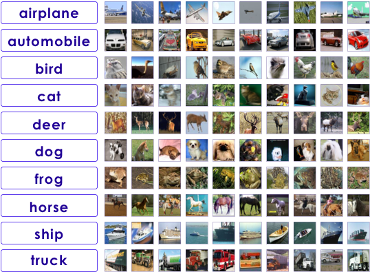
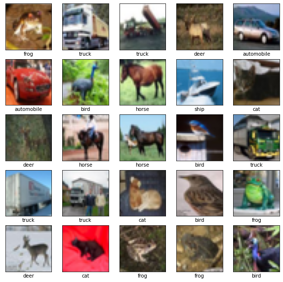
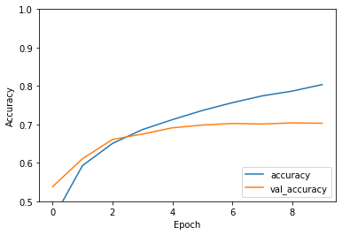

# Convolutional Neural Networks (CNNs) in TensorFlow

<!-- {"left" : 7.34, "top" : 7.61, "height" : 2.4, "width" : 2.82} -->


---

## Objectives
* Learn about CNNs
* Implement CNNs in TensorFlow and Keras

---

# Introduction to CNNs

[../generic/DL-CNNs.md](../generic/DL-CNNs.md)

---

# CNNs in TensorFlow

 <!-- {"left" : 13.07, "top" : 5.12, "height" : 2.16, "width" : 2.53} -->

---
## CNN Example 1 - CIFAR

 <!-- {"left" : 10.94, "top" : 2.23, "height" : 4.61, "width" : 6.27} -->

* CIFFAR-10 dataset consists of
    - 60,000 color images
    - 32x32 pixels, color
    - 10 classes (6,000 per class)
* 50,000 training images; 10,000 test images
* 5 training batches, 1 test batch
    - 10,000 images per batch  
    - Each batch has 1000 random images from each class
* **Size ~160 MB**

---

## CNN Example 1 - CIFAR

* __`tensorflow.datasets`__ package has convenient way to download CIFAR dataset

```python
import tensorflow as tf
from tensorflow.keras import datasets, layers, models
import matplotlib.pyplot as plt

(train_images, train_labels), (test_images, test_labels) = datasets.cifar10.load_data()

# Normalize pixel values to be between 0 and 1
train_images, test_images = train_images / 255.0, test_images / 255.0
```
<!-- {"left" : 0.85, "top" : 3.25, "height" : 2.82, "width" : 16.47} -->

---

## CNN Example 1 - CIFAR

* Explore CIFAR dataset
* [Reference](https://www.tensorflow.org/tutorials/images/cnn)

<!-- {"left" : 12.17, "top" : 1.77, "height" : 5.08, "width" : 5.09} -->


```python
class_names = ['airplane', 'automobile', 'bird', 'cat', 'deer',
               'dog', 'frog', 'horse', 'ship', 'truck']

plt.figure(figsize=(10,10))
for i in range(25):
    plt.subplot(5,5,i+1)
    plt.xticks([])
    plt.yticks([])
    plt.grid(False)
    plt.imshow(train_images[i], cmap=plt.cm.binary)
    # The CIFAR labels happen to be arrays,
    # which is why you need the extra index
    plt.xlabel(class_names[train_labels[i][0]])
plt.show()
```
<!-- {"left" : 0.85, "top" : 3.62, "height" : 4.25, "width" : 10.99} -->


---

## CNN Example 1 - CIFAR

* Here we are creating a convolutional layer
    - __`CONV2D (filters=64, kernel=(3,3), input_shape=(32,32,3))`__
    - filters=64 (filters are initialized randomly from a 'uniform distribution' and learned during training - just like any other weights)
    - kernel / convolution size = 3x3
* Input shape is equivalent to image dimensions (32, 32, 3)
    - 32 x 32 pixels
    - 3 channels (RGB) - color images
    - [Reference](https://www.tensorflow.org/api_docs/python/tf/keras/layers/Conv2D)

```python
model = models.Sequential()
model.add(layers.Conv2D(64, (3, 3), activation='relu', input_shape=(32, 32, 3)))
model.add(layers.MaxPooling2D((2, 2)))
model.add(layers.Conv2D(64, (3, 3), activation='relu'))
model.add(layers.MaxPooling2D((2, 2)))
model.add(layers.Conv2D(64, (3, 3), activation='relu'))

```
<!-- {"left" : 0.85, "top" : 7.17, "height" : 2.26, "width" : 15.73} -->


---
## CNN Example 1 - CIFAR

* So far the model looks like this

* **Can you understand how the input is shaped through the network?**

```python
model.summary()
```
<!-- {"left" : 0.85, "top" : 3.37, "height" : 0.73, "width" : 4.19} -->


```text
Model: "sequential"
_________________________________________________________________
Layer (type)                 Output Shape              Param #   
=================================================================
conv2d (Conv2D)              (None, 30, 30, 32)        896       
_________________________________________________________________
max_pooling2d (MaxPooling2D) (None, 15, 15, 32)        0         
_________________________________________________________________
conv2d_1 (Conv2D)            (None, 13, 13, 64)        18496     
_________________________________________________________________
max_pooling2d_1 (MaxPooling2 (None, 6, 6, 64)          0         
_________________________________________________________________
conv2d_2 (Conv2D)            (None, 4, 4, 64)          36928     
=================================================================
Total params: 56,320
Trainable params: 56,320
Non-trainable params: 0
_________________________________________________________________
```
<!-- {"left" : 0.85, "top" : 4.39, "height" : 6.83, "width" : 14.35} -->

---
## CNN Example 1 - CIFAR

* We will add __`Dense layers`__ on top
* We need these layers to classify the images
* The final layer will be a __`Softmax`__ layer

```python
model.add(layers.Flatten())
model.add(layers.Dense(64, activation='relu'))
model.add(layers.Dense(10, activation='softmax'))
```
<!-- {"left" : 0.85, "top" : 4.01, "height" : 1.55, "width" : 11.99} -->


---
## CNN Example - CIFAR

* Final model shape
* Note __`Trainable params: 122,570`__

```python
model.summary()
```
<!-- {"left" : 0.85, "top" : 3.25, "height" : 0.71, "width" : 4.09} -->

```text
Model: "sequential"
_________________________________________________________________
Layer (type)                 Output Shape              Param #   
=================================================================
conv2d (Conv2D)              (None, 30, 30, 32)        896       
_________________________________________________________________
max_pooling2d (MaxPooling2D) (None, 15, 15, 32)        0         
_________________________________________________________________
conv2d_1 (Conv2D)            (None, 13, 13, 64)        18496     
_________________________________________________________________
max_pooling2d_1 (MaxPooling2 (None, 6, 6, 64)          0         
_________________________________________________________________
conv2d_2 (Conv2D)            (None, 4, 4, 64)          36928     
_________________________________________________________________
flatten (Flatten)            (None, 1024)              0         
_________________________________________________________________
dense (Dense)                (None, 64)                65600     
_________________________________________________________________
dense_1 (Dense)              (None, 10)                650       
=================================================================
Total params: 122,570
Trainable params: 122,570
Non-trainable params: 0
_________________________________________________________________
```
<!-- {"left" : 0.85, "top" : 4.14, "height" : 7.64, "width" : 12.19} -->


---
## CNN Example 1 - CIFAR

* Compile and run the model

```python
model.compile(optimizer='adam',
              loss=tf.keras.losses.SparseCategoricalCrossentropy(from_logits=True),
              metrics=['accuracy'])

history = model.fit(train_images, train_labels, epochs=10,
                    validation_data=(test_images, test_labels))
```
<!-- {"left" : 0.85, "top" : 2.74, "height" : 2.23, "width" : 16.06} -->


```text
Train on 50000 samples, validate on 10000 samples
Epoch 1/10
50000/50000 [==============================] - 7s 141us/sample - loss: 1.5074 - accuracy: 0.4526 -
            val_loss: 1.2683 - val_accuracy: 0.5378
Epoch 2/10
50000/50000 [==============================] - 5s 98us/sample - loss: 1.1462 - accuracy: 0.5928 -
            val_loss: 1.0982 - val_accuracy: 0.6108
...
...
Epoch 9/10
50000/50000 [==============================] - 5s 99us/sample - loss: 0.6014 - accuracy: 0.7867 -
        val_loss: 0.8803 - val_accuracy: 0.7040
Epoch 10/10
50000/50000 [==============================] - 5s 98us/sample - loss: 0.5582 - accuracy: 0.8037 -
        val_loss: 0.9265 - val_accuracy: 0.7030
```
<!-- {"left" : 0.85, "top" : 5.34, "height" : 4.37, "width" : 16.06} -->

---
## CNN Example 1 - CIFAR

* Evaluate the model
* We can see from the training history plot, the accuracy is steadily increasing during each epoch
* Final accuracy after 10 epochs, is 0.70 (70%)

```python
plt.plot(history.history['accuracy'], label='accuracy')
plt.plot(history.history['val_accuracy'], label = 'val_accuracy')
plt.xlabel('Epoch')
plt.ylabel('Accuracy')

test_loss, test_acc = model.evaluate(test_images,  test_labels, verbose=2)
# 10000/10000 - 1s - loss: 0.9265 - accuracy: 0.7030
```
<!-- {"left" : 0.85, "top" : 6.71, "height" : 2.57, "width" : 14.54} -->


<!-- {"left" : 11.06, "top" : 1.89, "height" : 4.29, "width" : 6.23} -->


---

## Lab: CNN lab

<!-- {"left" : 12.91, "top" : 1.89, "height" : 5.49, "width" : 4.12} -->


* **Overview:**
    - Implement CNNs in TensorFlow

* **Approximate run time:**
    - 30-40 mins

* **Instructions:**
    - Try these labs
    - **Computer Vision 1** - MNIST Intro
    - (optional)**Computer Vision 2** - Fashion MNIST Intro
    - **Computer Vision 3** - MNIST CNN
    - **Computer Vision 4** - CIFAR CNN


Notes:

---

## Review and Q&A

<!-- {"left" : 13.07, "top" : 1.89, "height" : 2.69, "width" : 3.63} -->


* Let's go over what we have covered so far

* Any questions?

<!-- {"left" : 4.62, "top" : 5, "height" : 5.53, "width" : 8.31} -->
