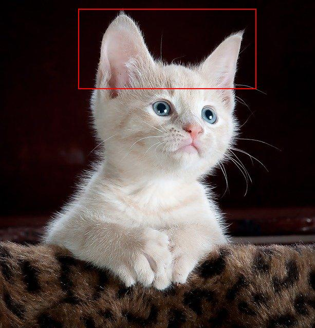
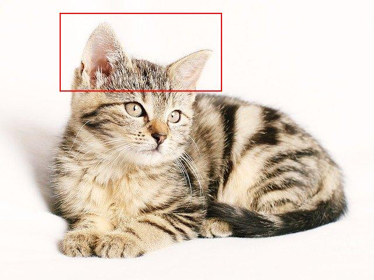
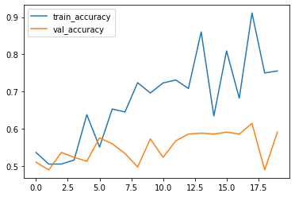
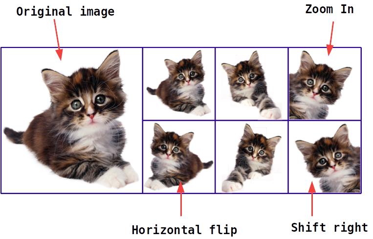
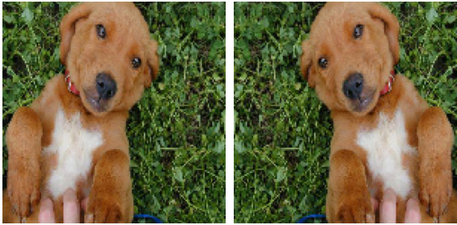
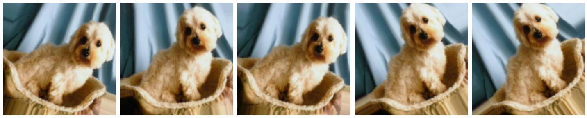
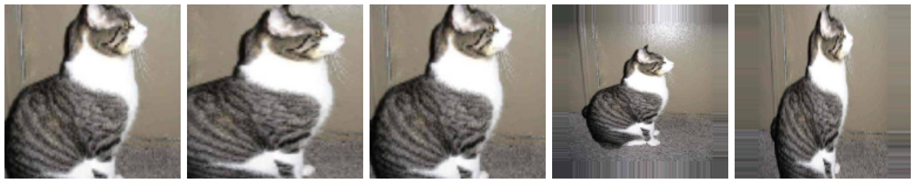
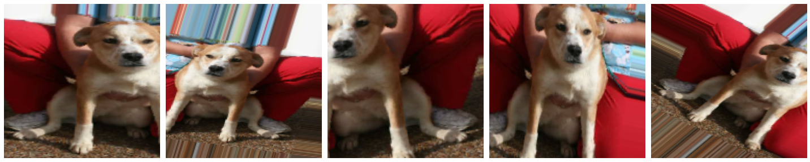
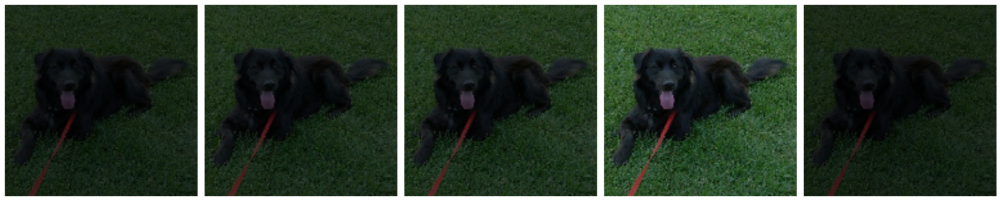
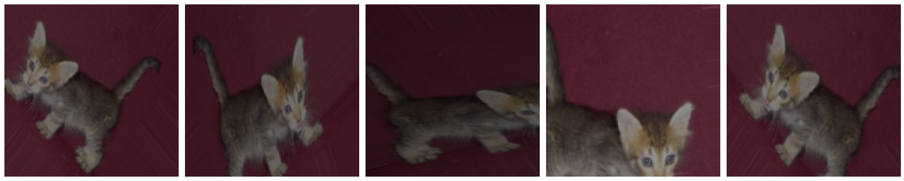

# Advanced Image Processing With Tensorflow

 <!-- {"left" : 7.34, "top" : 7.61, "height" : 2.4, "width" : 2.82} -->

---

## Objectives
* Learn image processing capabilities in Tensorflow

---

# Handling Image Datasets

---

## MNIST / Fashion-MNIST

* So far we have seen MNIST/FASHION-MNIST datasets

* They are very popular as 'hello world' examples

* And using them is very easy, as they are basically included with the frameworks

* See below how we can load MNIST data very easily

```python
import tensorflow as tf

(train_images, train_labels), (test_images, test_labels) =
                tf.keras.datasets.mnist.load_data()  # <-- one liner
```
<!-- {"left" : 0.85, "top" : 5.1, "height" : 1.91, "width" : 16.06} -->

Notes:

---

## Handling Image Datasets

* Usually we will be working with image datasets that are
    - custom
    - and quite possibly large (100s of MB or Gigs)

* There are several modestly large datasets that are  publicly available; we will start with these
    - Cat-dog dataset : about 2500 images, 58 M size
    - Flowers dataset : 3,600 files, 230 M size
    - Horse or Human : 1,200 files, 150 M size


Notes:

---

## Image Folder Structure

* The data is split into **training** and **validation** sets
* The directory names are automatically inferred as **labels**  (e.g. : **`daisy, dandelion, roses, sunflowers, tulips`**)
* Label numbers are assigned in alphabetical order;     
__`daisy=0,   dandelion=1, roses=2,  sunflowers=3,  tulips=4`__

```text

flowers/
├── training
│   ├── daisy
│   │   ├── daisy-1.jpg
│   │   ├── daisy-2.jpg
│   ├── dandelion
│   │   ├── dandelion-1.jpg
│   │   ├── dandelion-2.jpg
│   ├── roses
│   ├── sunflowers
│   └── tulips
└── validation
    ├── daisy
    │   ├── daisy-11.jpg
    │   ├── daisy-12.jpg
    ├── dandelion
    │   ├── dandelion-11.jpg
    │   ├── dandelion-12.jpg
    ├── roses
    ├── sunflowers
    └── tulips

```
<!-- {"left" : 0.85, "top" : 5.05, "height" : 6.4, "width" : 5.44} -->


---

## Image Folder Structure

* Flowers dataset has total of 3,671 files, size of 230 M

* Training set has 3087 files,size of 201M

* Validation set has 583 files,size of 29 M


```text
./flowers : files= 3671 , size= 230M
./flowers/training : files= 3087 , size= 201M
./flowers/training/dandelion : files= 776 , size= 43M
./flowers/training/daisy : files= 533 , size= 30M
./flowers/training/tulips : files= 677 , size= 49M
./flowers/training/sunflowers : files= 588 , size= 48M
./flowers/training/roses : files= 513 , size= 33M
./flowers/validation : files= 583 , size= 29M
./flowers/validation/dandelion : files= 122 , size= 5.6M
./flowers/validation/daisy : files= 100 , size= 4.3M
./flowers/validation/tulips : files= 122 , size= 5.8M
./flowers/validation/sunflowers : files= 111 , size= 6.4M
./flowers/validation/roses : files= 128 , size= 6.5M
```
<!-- {"left" : 0.85, "top" : 4.03, "height" : 6.33, "width" : 15.99} -->

---

## Calculating Image Folder Sizes

* Here is a very handy shell script to calculate image directory sizes

```bash
#!/bin/bash
find . -type d -exec bash -c 'echo "{} : files=" `find "{}" -type f | wc -l`  ", \
    size=" `du -skh "{}" | cut -f 1`' \;


## Run this script ('dir-stats.sh') as follows
$   bash dir-stats.sh .

```
<!-- {"left" : 0.85, "top" : 2.96, "height" : 2.59, "width" : 16.11} -->


---

## Downloading Images

* Images are stored as compressed zip/tar archives
    - Easier to download than thousands of individual images

* Luckily `tf.keras.utils` has a handy method to download the files

* This utility will only download the files once, and will cache it locally

---
## Downloading Images

```python
import os
import tensorflow as tf

data_location = 'https://elephantscale-public.s3.amazonaws.com/data/images/cat-dog-redux.zip'

## This will only download the file once
## The zip file is saved as `~/.keras/datasets/cat-dog-redux.zip`
## And the zip archive is extracted
data_location_local = tf.keras.utils.get_file(fname=os.path.basename(data_location),
                                           origin=data_location, extract=True)

data_dir = os.path.join(os.path.dirname(data_location_local), 'cat-dog-redux')
# /home/ubuntu/.keras/datasets/cat-dog-redux

train_dir = os.path.join(data_dir, 'train')
# /home/ubuntu/.keras/datasets/cat-dog-redux/train

validation_dir = os.path.join(data_dir, 'val')
# /home/ubuntu/.keras/datasets/cat-dog-redux/val
```
<!-- {"left" : 0.85, "top" : 2.56, "height" : 5.82, "width" : 16.28} -->


---
## Lab: Working With Images

<!-- {"left" : 12.44, "top" : 1.89, "height" : 6.16, "width" : 4.62} -->


* **Overview:**
    - Download and explore image datasets

* **Approximate run time:**
    - 20-30 mins

* **Instructions:**
    - Lab : **IMG-1:** Working with images
    - **Instructor:** Demo this lab and explain steps


Notes:

---

# Image Data Generator

---

## Image Data Generator

* Training with images entails lot of processing:
    - Read images from disk, in batches  (we don't want to read all images at once and run out of memory)
    - Convert the color image data in right RGB format
    - Scale the image into tensors (usually 0 to 1), as neural networks prefer to deal with small input values

* All these tasks can be done by **`ImageDataGenerator`**

* Reference: [tf.keras.preprocessing.image.ImageDataGenerator](https://www.tensorflow.org/api_docs/python/tf/keras/preprocessing/image/ImageDataGenerator)


---

## Using Image Data Generator

* Let's start with simple cat-dog data

* The data is structured like this

<br/>

```text
cat-dog-redux
├── train
│   ├── cat
│   │   ├── cat-0001.jpg
│   │   ├── cat-0002.jpg
│   └── dog
│   │   ├── dog-0001.jpg
│   │   ├── dog-0002.jpg
└── val
    ├── cat
    │   ├── cat-1001.jpg
    │   └── cat-1002.jpg
    └── dog
        ├── dog-1001.jpg
        └── dog-1002.jpg
```
<!-- {"left" : 0.85, "top" : 3.2, "height" : 4.88, "width" : 5.01} -->

* Download link: [cat-dog-redux.zip](https://elephantscale-public.s3.amazonaws.com/data/images/cat-dog-redux.zip)

---
## Using Image Data Generator

```python
# Download data

import tensorflow as tf
from tensorflow import keras

import os

data_location = 'https://elephantscale-public.s3.amazonaws.com/data/images/cat-dog-redux.zip'

data_location_local = keras.utils.get_file(fname=os.path.basename(data_location),
                                           origin=data_location, extract=True)
# data_location_local:  /home/ubuntu/.keras/datasets/cat-dog-redux.zip

data_dir = os.path.join(os.path.dirname(data_location_local), 'cat-dog-redux')
# data dir:  /home/ubuntu/.keras/datasets/cat-dog-redux

train_dir = os.path.join(data_dir, 'train')
validation_dir = os.path.join(data_dir, 'val')
# train_dir: /home/ubuntu/.keras/datasets/cat-dog-redux/train
# validation_dir: /home/ubuntu/.keras/datasets/cat-dog-redux/val

```
<!-- {"left" : 0.85, "top" : 2.5, "height" : 6.11, "width" : 16.28} -->

---
## Using Image Data Generator

```python

BATCH_SIZE = 128
EPOCHS = 10
IMG_HEIGHT = 150
IMG_WIDTH = 150

from tensorflow.keras.preprocessing.image import ImageDataGenerator

## Here we are rescaling images by dividing it by 255
## We are shuffling the images to increase randomness
## Images are reshaped to 150x150
## Since we have two image classes, the class_mode is binary

train_image_generator = ImageDataGenerator(rescale=1./255) # Generator for our training data
validation_image_generator = ImageDataGenerator(rescale=1./255) # Generator for our validation data

train_data_gen = train_image_generator.flow_from_directory(
                    batch_size=BATCH_SIZE, # <-- we read images as batches
                    directory=train_dir,  # <-- read images from TRAINING directory
                    shuffle=True,
                    target_size=(IMG_HEIGHT, IMG_WIDTH), # <-- images are resized
                    class_mode='binary') # <-- 2 classes, so binary

val_data_gen = validation_image_generator.flow_from_directory(
                    batch_size=BATCH_SIZE,
                    directory=validation_dir,  # <-- read images from VALIDATION directory
                    target_size=(IMG_HEIGHT, IMG_WIDTH),
                    class_mode='binary') # <-- 2 classes, so binary

## Here you see the generator is detecting images from directories
# Found 500 images belonging to 2 classes.
# Found 500 images belonging to 2 classes.
```
<!-- {"left" : 0.85, "top" : 2.55, "height" : 8.6, "width" : 15.95} -->

---
## Using Image Data Generator (Properties)

```python
## directory
print ('image dir :', train_data_gen.directory)
# image dir : /home/ubuntu/.keras/datasets/cat-dog-redux/train

## Image count
print ("total training images : ", train_data_gen.n)
# total training images :  500

## Class indexes
print ("Class indices : ", train_data_gen.class_indices)
# Class indices :  {'cat': 0, 'dog': 1}

## Some file names
print ('file names : ', train_data_gen.filenames[:5])
# file names :  
#  ['cat/cat.10033.jpg', 'cat/cat.10050.jpg',
#   'cat/cat.10051.jpg', 'cat/cat.10066.jpg', 'cat/cat.10076.jpg']

## file paths
print ('file paths : ', train_data_gen.filepaths[:5])
# file paths :  
#  ['/home/ubuntu/.keras/datasets/cat-dog-redux/train/cat/cat.10033.jpg',
#   '/home/ubuntu/.keras/datasets/cat-dog-redux/train/cat/cat.10050.jpg',
#   '/home/ubuntu/.keras/datasets/cat-dog-redux/train/cat/cat.10051.jpg',
#   '/home/ubuntu/.keras/datasets/cat-dog-redux/train/cat/cat.10066.jpg',
#   '/home/ubuntu/.keras/datasets/cat-dog-redux/train/cat/cat.10076.jpg']
```
<!-- {"left" : 0.85, "top" : 2, "height" : 9.38, "width" : 15.45} -->

---
## Using Image Data Generator (Training)

* The **`steps_per_epoch`** argument defines how many batches of images defines a single epoch

* For example, if we have 1,000 images in the training dataset (across all classes) and a batch size of 64, then the `steps_per_epoch` would be about 16, or 1000/64

* **`model.fit`** is the new API,  **`model.fit_generator`** is now deprecated

<br/>

```python

history = model.fit(
    train_data_gen,
    steps_per_epoch= train_data_gen.n // train_data_gen.batch_size,
    epochs=EPOCHS,
    validation_data=val_data_gen,
    validation_steps=val_data_gen.n // val_data_gen.batch_size
)

```
<!-- {"left" : 0.85, "top" : 5.47, "height" : 2.93, "width" : 15.11} -->

* **//** is integer division in python ( `10/4 = 2.5 ;    10 // 4 = 2` )


---

## Using Image Data Generator (Eval)

* Here we evaluate on **`val_data_gen`** to supply test data
* The **`steps`** is important; without it the validation will take lot longer!
* We are using `ceil` function to make sure there are enough steps to cover all validation data points
    - We had 1000 data points with batch size 64
    - 1000 // 64 will give 15 (remember integer division)
    - But 64*15 = 960  (leaving a few samples not evaluated)
    - so we round-up using `ceil` to make sure steps=16

```python

from math import ceil

metric_names = model.metrics_names
print ("model metrics : " , metric_names)
# > model metrics :  ['loss', 'accuracy']

metrics = model.evaluate(val_data_gen,
         batch_size=val_data_gen.batch_size,
         steps=ceil(val_data_gen.n // val_data_gen.batch_size) ) # <-- important param!

for idx, metric in enumerate(metric_names):
    print ("Metric : {} = {:,.3f}".format (metric_names[idx], metrics[idx]))
# > Metric : loss = 0.500
# > Metric : accuracy = 0.760
```
<!-- {"left" : 0.85, "top" : 6.45, "height" : 4.6, "width" : 16.11} -->

---

## Using Image Data Generator (Prediction)

```python
import numpy as np
from math import ceil


print ("predicting on {:,} test images".format(val_data_gen.n))
# > predicting on 1,000 test images

## we need a ceiling for steps
predictions = model.predict(val_data_gen,
                    batch_size=val_data_gen.batch_size,
                    steps=ceil(val_data_gen.n / val_data_gen.batch_size) )

print( 'predictions.shape: ', predictions.shape)
# > predictions.shape:  (1000, 2)
## prediction is softmax format [0.85, 0.15]

## This converts softmax array to a class
predictions2 = [ np.argmax(p) for p in predictions]
## predictions2 will be : 0 or 1

##    prediction = [0.90, 0.10]  --> prediction2 = [0]
##    prediction = [0.30, 0.70]  --> prediction2 = [1]


## Ensure all validation data is predicted
assert(len(predictions) == len(predictions2) == len(val_data_gen.classes) )
```
<!-- {"left" : 0.85, "top" : 2, "height" : 9.1, "width" : 15.37} -->

---

# Image Augmentation

---

## Overfitting During Training

* When training with images, often times we encounter **overfitting** problem
    - The network is **memorizing** the images instead of **learning** from them

* This happens when we don't have enough training images, or not enough variations in training images

* For example, if our model always trains on cats with **ears pointing up**, will it recognize a cat that is lying down?

<!-- {"left" : 1.85, "top" : 6.72, "height" : 3.47, "width" : 3.32} --><!-- {"left" : 5.49, "top" : 6.72, "height" : 3.47, "width" : 4.63} --><!-- {"left" : 10.43, "top" : 6.72, "height" : 3.47, "width" : 5.21} -->


---
## Detecting Overfitting

* We can detect overfitting by observing the learning curves

* Here we see **training accuracy** goes up, but **validation accuracy** is not improving much.  

* This is a classic sign of overfitting

<!-- {"left" : 4.9, "top" : 5.74, "height" : 5.16, "width" : 7.74} -->


---

## Augmenting Images

* One way to avoid overfitting is to train on variations of images

* Here is an example of original picture slightly altered or **augmented**

* Variations are: flipped horizontally, rotated left and right, zoomed-in

* By training on augmented images, the model becomes more resilient; learning to detect features (like eyes or ears) instead of memorizing the images

<!-- {"left" : 3.37, "top" : 6.55, "height" : 4.39, "width" : 10.77} -->


---

## Using Image Data Generator to Augment Images

* Image Data Generator can augment images **on they fly**!
* The following transformations are supported:
    - Horizontal flip
    - Vertical flip
    - Shifts the image vertically and/or horizontally
    - Zoom in the image

 <!-- {"left" : 4.41, "top" : 5.94, "height" : 5.56, "width" : 8.68} -->

---

## Augmentation Example: Horizontal Flip

* Let's start with **horizontal flip**

```python
from tensorflow.keras.preprocessing.image import ImageDataGenerator

train_image_generator2 = ImageDataGenerator(rescale=1./255,
                                            horizontal_flip=True) # <-- enable horizontal flip

train_data_gen2 = train_image_generator2.flow_from_directory(batch_size=batch_size,
                                               directory=train_dir,
                                               shuffle=True,
                                               target_size=(IMG_HEIGHT, IMG_WIDTH))

augmented_images = [train_data_gen2[0][0][0] for i in range(2)]
plotImages (augmented_images)
```
<!-- {"left" : 0.85, "top" : 2.78, "height" : 3.78, "width" : 16.44} -->


 <!-- {"left" : 4.57, "top" : 7.09, "height" : 4.13, "width" : 8.37} -->


---
## Augmentation Example: Rotation

* A rotation augmentation randomly rotates the image clockwise by a given number of degrees from 0 to 360

* `rotation_range = 0 to 360`

```python
from tensorflow.keras.preprocessing.image import ImageDataGenerator

train_image_generator2 = ImageDataGenerator(rescale=1./255,
                                            rotation_range=45) # <-- rotation from 0 to 45 degrees

train_data_gen2 = train_image_generator2.flow_from_directory(batch_size=batch_size,
                                               directory=train_dir,
                                               shuffle=True,
                                               target_size=(IMG_HEIGHT, IMG_WIDTH))

augmented_images = [train_data_gen2[0][0][0] for i in range(2)]
plotImages (augmented_images)
```
<!-- {"left" : 0.85, "top" : 3.83, "height" : 3.62, "width" : 16.4} -->


<!-- {"left" : 0.86, "top" : 7.91, "height" : 3.19, "width" : 15.79} -->

---
## Augmentation Example: Zooming

* Images can be zoomed-in (enlarge) or zoomed-out (reduce)

* **`zoom_range`** is a float number or a range

* Zoom is calculated as a range of `[1-value, 1+value]`
    - For example if zoom_range=0.4
    - The range would be : `[0.6 to 1.4]`

* Zoom factor may not be intuitive :-)
    - For example, zoom value < 1.0 will zoom in!
    - zoom value = 0.5 means the image will be 50% enlarged
    - Zoom value of 1.5, will zoom out the image by 50%
    - Zoom = 1.0 has no effect

* [Good tutorial](https://machinelearningmastery.com/how-to-configure-image-data-augmentation-when-training-deep-learning-neural-networks/)

```python
# zoom_range from 0 - 1 where 1 = 100%.
train_image_generator2 = ImageDataGenerator(rescale=1./255,
                                            zoom_range=0.5) # <-- zoom range
```
<!-- {"left" : 0.85, "top" : 8.55, "height" : 1.4, "width" : 16.36} -->

---
## Augmentation Example: Zooming

* Images can be zoomed-in (enlarge) or zoomed-out (reduce)


```python
from tensorflow.keras.preprocessing.image import ImageDataGenerator

# zoom_range from 0 - 1 where 1 = 100%.
train_image_generator2 = ImageDataGenerator(rescale=1./255,
                                            zoom_range=0.5) # <-- zoom range

train_data_gen2 = train_image_generator2.flow_from_directory(batch_size=batch_size,
                                               directory=train_dir,
                                               shuffle=True,
                                               target_size=(IMG_HEIGHT, IMG_WIDTH))

augmented_images = [train_data_gen2[0][0][0] for i in range(5)]
plotImages (augmented_images)
```
<!-- {"left" : 0.85, "top" : 2.76, "height" : 4.52, "width" : 16.23} -->

<!-- {"left" : 0.55, "top" : 7.9, "height" : 3.31, "width" : 16.41} -->


---

## Augmentation Example: Shearing

* Images are 'stretched out'

```python
from tensorflow.keras.preprocessing.image import ImageDataGenerator

# zoom_range from 0 - 1 where 1 = 100%.
train_image_generator2 = ImageDataGenerator(rescale=1./255,
                                            shear_range=0.2) # <-- shear range

train_data_gen2 = train_image_generator2.flow_from_directory(batch_size=batch_size,
                                               directory=train_dir,
                                               shuffle=True,
                                               target_size=(IMG_HEIGHT, IMG_WIDTH))

augmented_images = [train_data_gen2[0][0][0] for i in range(5)]
plotImages (augmented_images)
```
<!-- {"left" : 0.85, "top" : 2.81, "height" : 4.32, "width" : 15.5} -->


<!-- {"left" : 0.55, "top" : 7.46, "height" : 3.31, "width" : 16.4} -->


---
## Augmentation Example: Brightness

* Images can be brightened or darkened
* **`brightness_range`** is a float value
* Values over 1.0 will brighten the image; values less than 1.0 will darken the image;  1.0 no change

```python
from tensorflow.keras.preprocessing.image import ImageDataGenerator

train_image_generator2 = ImageDataGenerator(rescale=1./255,
                                            brightness_range=[0.2,0.7])

train_data_gen2 = train_image_generator2.flow_from_directory(batch_size=batch_size,
                                               directory=train_dir,
                                               shuffle=True,
                                               target_size=(IMG_HEIGHT, IMG_WIDTH))

augmented_images = [train_data_gen2[0][0][0] for i in range(5)]
plotImages (augmented_images)

```
<!-- {"left" : 0.85, "top" : 4.38, "height" : 3.56, "width" : 13.78} -->


<!-- {"left" : 0.58, "top" : 8.17, "height" : 3.3, "width" : 16.35} -->


---

## Putting it All Together

```python
from tensorflow.keras.preprocessing.image import ImageDataGenerator

train_image_generator2 = ImageDataGenerator(
                            rescale=1./255,
                            rotation_range=45,
                            width_shift_range=.15,
                            height_shift_range=.15,
                            horizontal_flip=True,
                            zoom_range=0.5,
                            brightness_range=[0.2,0.7]
                            )

train_data_gen2 = train_image_generator2.flow_from_directory(batch_size=batch_size,
                                               directory=train_dir,
                                               shuffle=True,
                                               target_size=(IMG_HEIGHT, IMG_WIDTH))

augmented_images = [train_data_gen2[0][0][0] for i in range(5)]
plotImages (augmented_images)

```
<!-- {"left" : 0.85, "top" : 2.37, "height" : 5.82, "width" : 14.61} -->

<!-- {"left" : 1.13, "top" : 8.48, "height" : 3.08, "width" : 15.24} -->


---

## Image Data Generator Takeaways

* We usually **augment training images;** not validation images
    - The goal is to expose the network to various images  to learn from

* The original images are **NOT** modified

* The generator will generate the images **at run time**

* Note, the generator does not increase the training image set; it provides variations for each batch of data
    - So if we had 1000 training images, the network will see 1000 training images.  Some of the images will be augmented during training phase

---


## Review and Q&A

<!-- {"left" : 13.07, "top" : 1.89, "height" : 2.69, "width" : 3.63} -->


* Let's go over what we have covered so far

* Any questions?

<!-- {"left" : 4.62, "top" : 5, "height" : 5.53, "width" : 8.31} -->


---
## Lab: Image Data Generator

<!-- {"left" : 13.09, "top" : 1.89, "height" : 5.31, "width" : 3.98} -->

* **Overview:**
    - Learn to use Image Data Generator

* **Approximate run time:**
    - 20-30 mins

* **Instructions:**
    - **IMG2:** image-generator-lab


Notes:

---

## Image Data Generator: Further Reading

* https://www.pyimagesearch.com/2019/07/08/keras-imagedatagenerator-and-data-augmentation/

* https://www.tensorflow.org/tutorials/images/classification

* https://machinelearningmastery.com/how-to-configure-image-data-augmentation-when-training-deep-learning-neural-networks/

* https://machinelearningmastery.com/image-augmentation-deep-learning-keras/

* https://machinelearningmastery.com/how-to-load-large-datasets-from-directories-for-deep-learning-with-keras/

---

## Lab/Demo: Image Classification 1: Cats and Dogs

 <!-- {"left" : 13.09, "top" : 1.89, "height" : 5.31, "width" : 3.98} -->


* **Overview:**
    - Build an image classifier with real world images

* **Approximate run time:**
    - 30-40 mins

* **Instructions:**
    - **IMG3:** Cats and Dogs classifier
    - **Instructor** Demo this lab step by step and explain


Notes:

---
## Lab/Demo: Using Trained Models

 <!-- {"left" : 13.09, "top" : 1.89, "height" : 5.31, "width" : 3.98} -->


* **Overview:**
    - Learn how to use already trained models

* **Approximate run time:**
    - 20-30 mins

* **Instructions:**
    - **IMG4:** Reusing a model
    - **Instructor** Demo this lab step by step and explain


Notes:

---

## Lab: Image Classification 2: Horse or Human

 <!-- {"left" : 13.09, "top" : 1.89, "height" : 5.31, "width" : 3.98} -->

* **Overview:**
    - Build an image classifier with real world images

* **Approximate run time:**
    - 30-40 mins

* **Instructions:**
    - **Exercise-1:** Horse and Human
    - This is an exercise to be completed by students.  Use the cat-dog example we just discussed, and work through this lab!


Notes:

---

## Lab: Image Classification 3: Flowers

 <!-- {"left" : 13.09, "top" : 1.89, "height" : 5.31, "width" : 3.98} -->


* **Overview:**
    - Build an image classifier with real world images
    - Here we are going to expand from doing binary classification (0/1) to multi-class classifications (0/1/2/3/4)

* **Approximate run time:**
    - 30-40 mins

* **Instructions:**
    - **Exercise-2:** Flowers **multi classifier**
    - This is an exercise to be completed by students.  Use the cat-dog example we just discussed, and work through this lab!


Notes:

---

## Lab: Reuse Trained Flowers Model

 <!-- {"left" : 13.09, "top" : 1.89, "height" : 5.31, "width" : 3.98} -->


* **Overview:**
    - Reuse the trained model from previous lab

* **Approximate run time:**
    - 30-40 mins

* **Instructions:**
    - Use the model saved in the previous lab, and load it to classify flowers
    - Adopt the previous reuse lab
    - This is an exercise to be completed by students.  


Notes:

