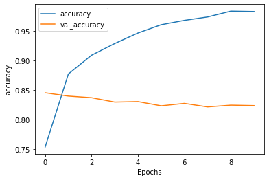

# LSTMs in TensorFlow

<!-- {"left" : 4.98, "top" : 6.78, "height" : 1.61, "width" : 1.89} -->

---

## Objectives

* Learn to implement LSTMs in TensorFlow

---

## Introduction to RNNs

[../generic/DL-LSTMs.md](../generic/DL-LSTMs.md)

---

# LSTMs in TensorFlow

---

## LSTMs in TensorFlow

* LSTMs are implemented in [tf.keras.layers.LSTM](https://www.tensorflow.org/api_docs/python/tf/keras/layers/LSTM)

```python
import tensorflow as tf
from tensorflow import keras

model = keras.models.Sequential()

## Add LSTM layer
model.add (tf.keras.layers.LSTM(units=4))

```

* Using **`bidirectional LSTM`**

```python
model.add (tf.keras.layers.Bidirectional(tf.keras.layers.LSTM(64)) )
```

Notes:

---

## LSTMs in TensorFlow

* We can use multiple LSTM layers
  - Note LSTM layers except the the last one will have **`return_sequences=True`**

```python
model = tf.keras.Sequential([


    tf.keras.layers.LSTM(64, return_sequences=True),
    tf.keras.layers.LSTM(64),

])
```

* Using **`GRU`** Units

```python
model = tf.keras.Sequential([

    tf.keras.layers.GRU(64),

])
```

---

## LSTM Walkthrough - IMDB Movie Reviews

* We will use a LSTM to predict sentiment of IMDB movie reviews

* **Instructor**: You may walk through the example here or use the lab **`LSTM-2-IMDB-sentiment`**

* [Reference](https://www.tensorflow.org/tutorials/text/text_classification_rnn)

Notes:

---

## Step 1 - Grab Data

```python
import tensorflow_datasets as tfds

imdb, info = tfds.load("imdb_reviews", with_info=True, as_supervised=True)

train_data, test_data = imdb['train'], imdb['test']

print ("train_data: ", len(train_data))
# > train_data:  25000

print ("test_data: ", len(test_data))
# > test_data:  25000
```

---

## Step 2 - Shaping Data

```python
import numpy as np

training_sentences = []
training_labels = []

testing_sentences = []
testing_labels = []

# str(s.tonumpy()) is needed in Python3 instead of just s.numpy()
for s,l in train_data:
  training_sentences.append(s.numpy().decode('utf8'))
  training_labels.append(l.numpy())
  
for s,l in test_data:
  testing_sentences.append(s.numpy().decode('utf8'))
  testing_labels.append(l.numpy())
  
training_labels_final = np.array(training_labels)
testing_labels_final = np.array(testing_labels)

```

---

## Step 3 - Explore Data

```python
import random

index = random.randint(0, len(training_sentences)-1)

print ('training_labels_final[{}]\n{}'.format(index, training_labels_final[index]))
print()
print ('training_sentences[{}]\n{}'.format(index, training_sentences[index]))
```

```text
training_labels_final[15868]
0

training_sentences[15868]

(A possible spoiler or two) <br /><br /> "Soul Survivors" is quite possibly the
worst theatrical released movie ever. Nothing makes sense at all, there's some
plot about a girl who has strange visions of people who may or may not be dead.
The entire movie is just a bunch of random shots of things that don't really tie
together, by the end of the film. <br /><br /> Tha acting is non-existent, the
camera work is jerky and the script is so confusing, it just makes the movie
even harder to watch.<br /><br /> I kept waiting for something to tie the movie
together but nothing came. Definitely the worst film of the year. -****1/2
stars.

```

---

## Step 4 - Vectorize Text

```python
from tensorflow.keras.preprocessing.text import Tokenizer
from tensorflow.keras.preprocessing.sequence import pad_sequences

VOCAB_SIZE = 10000 # consider top-N words
OOV_TOK = "< OOV >"
EMBEDDING_DIM = 32
MAX_SEQ_LENGTH = 120
TRUNC_TYPE='post'
PADDING_TYPE='post'


tokenizer = Tokenizer (num_words=VOCAB_SIZE, oov_token=OOV_TOK)
tokenizer.fit_on_texts(training_sentences)


training_sequences = tokenizer.texts_to_sequences(training_sentences)

max_seq_length_actual = max([len(x) for x in training_sequences])


training_sequences_padded = pad_sequences(training_sequences, maxlen=MAX_SEQ_LENGTH, 
                                          truncating=TRUNC_TYPE) 

testing_sequences = tokenizer.texts_to_sequences(testing_sentences)
testing_sequences_padded = pad_sequences(testing_sequences,maxlen=MAX_SEQ_LENGTH)

```

---

## Step 5 - Text Vectors

```python
index = random.randint(0, len(training_sentences)-1)

print ('training sentence [{}]\n{}'.format(index,training_sentences[index]))
print ('training seq [{}]\n{}'.format(index,training_sequences[index]))
print ('training padded [{}]\n{}'.format(index, training_sequences_padded[index]))
```

```text
training sentence [14467]
Interesting mix of comments that it would be hard to add anything constructive
to. However, i'll try. This was a very good action film with some great set
pieces. You'll note I specified the genre.  I didn't snipe about the lack of
characterisation, and I didn't berate the acting. Enjoy if for what it is
people, a well above average action film. I could go on but I've made my
comment.

training seq [14467]
[219, 1492, 5, 794, 13, 10, 60, 28, 252, 6, 761, 230, 1, 6, 188, 635, 351, 12, 14, 4, 53, 50, 204,
20, 17, 47, 85, 268, 1326, 488, 852, 11, 1, 2, 510, 11, 159, 1, 42, 2, 581, 5, 7370, 3, 11, 159, 1,
2, 114, 356, 45, 16, 49, 10, 7, 82, 4, 71, 750, 857, 204, 20, 11, 98, 138, 21, 19, 205, 91, 59, 927]

training padded [14467]
[   0    0    0    0    0    0    0    0    0    0    0    0    0    0 0    0    0    0    0    0 0
0    0    0    0    0    0    0 0    0    0    0    0    0    0    0    0    0    0    0    0 0 0
0    0    0    0    0    0  219 1492    5  794   13   10   60 28  252    6  761  230    1 6  188
635  351   12   14    4   53 50  204   20   17   47   85  268 1326  488  852   11    1    2 510 11
159    1   42    2  581    5 7370    3   11  159    1    2  114 356   45   16   49   10    7 82    4
71  750  857  204   20   11 98  138   21   19  205   91   59  927]

```

---

## Step 6 - Build a Model

```python
model = tf.keras.Sequential([
    tf.keras.layers.Embedding(VOCAB_SIZE, EMBEDDING_DIM, input_length=MAX_SEQ_LENGTH),
    tf.keras.layers.LSTM(64),
    tf.keras.layers.Dense(64, activation='relu'),
    tf.keras.layers.Dense(1, activation='sigmoid')
])
model.compile(loss='binary_crossentropy',optimizer='adam',metrics=['accuracy'])

model.summary())
```

```text
Layer (type)                 Output Shape              Param #   
=================================================================
embedding (Embedding)        (None, 120, 32)           320000    
_________________________________________________________________
lstm (LSTM)                  (None, 64)                24832     
_________________________________________________________________
dense (Dense)                (None, 64)                4160      
_________________________________________________________________
dense_1 (Dense)              (None, 1)                 65        
=================================================================
Total params: 349,057
Trainable params: 349,057
Non-trainable params: 0
```

---

## Step 7 - Training

```python
num_epochs = 10
history = model.fit(training_sequences_padded, training_labels_final,
                    epochs=num_epochs,
                    validation_data=(testing_sequences_padded, testing_labels_final))
```

```text
Epoch 1/10
782/782 [==============================] - 10s 13ms/step - loss: 0.4888 - accuracy: 0.7534 
                                                         - val_loss: 0.3765 - val_accuracy: 0.8452
Epoch 2/10
782/782 [==============================] - 10s 13ms/step - loss: 0.3038 - accuracy: 0.8771 
                                                         - val_loss: 0.3699 - val_accuracy: 0.8396
...
Epoch 10/10
782/782 [==============================] - 12s 16ms/step - loss: 0.0520 - accuracy: 0.9828 
                                                         - val_loss: 0.7797 - val_accuracy: 0.8234

Wall time: 1min 42s
```

<!-- TODO shiva -->
<!-- {"left" : 6.76, "top" : 0.88, "height" : 4.37, "width" : 3.28} -->

Notes:

---

## Step 8 - Training Review

<!-- TODO shiva -->
<!-- {"left" : 6.76, "top" : 0.88, "height" : 4.37, "width" : 3.28} -->

* We are at validation accuracy of 85%; and training accuracy is approaching 100%

* It is a classic sign of over fitting!

---

## BiDirectional LSTM

```python
model = tf.keras.Sequential([
    tf.keras.layers.Embedding(VOCAB_SIZE, EMBEDDING_DIM, input_length=MAX_SEQ_LENGTH),

    ## BiDirectional LSTM
    tf.keras.layers.Bidirectional(tf.keras.layers.LSTM(64)),

    tf.keras.layers.Dense(64, activation='relu'),
    tf.keras.layers.Dense(1, activation='sigmoid')
])
model.compile(loss='binary_crossentropy',optimizer='adam',metrics=['accuracy'])

model.summary()
```

```text
_________________________________________________________________
Layer (type)                 Output Shape              Param #   
=================================================================
embedding (Embedding)        (None, 120, 32)           320000    
_________________________________________________________________
bidirectional (Bidirectional (None, 128)               49664     
_________________________________________________________________
dense (Dense)                (None, 64)                8256      
_________________________________________________________________
dense_1 (Dense)              (None, 1)                 65        
=================================================================
Total params: 377,985
Trainable params: 377,985
Non-trainable params: 0
```

---

## Two LSTM Layers

* Note, all but the last LSTM layers  will have **`return_sequences=True`**

```python
model = tf.keras.Sequential([
    tf.keras.layers.Embedding(VOCAB_SIZE, EMBEDDING_DIM, input_length=MAX_SEQ_LENGTH),

    ## Two bidirectional LSTM
    tf.keras.layers.Bidirectional(tf.keras.layers.LSTM(64, return_sequences=True)),
    tf.keras.layers.Bidirectional(tf.keras.layers.LSTM(64)),

    tf.keras.layers.Dense(64, activation='relu'),
    tf.keras.layers.Dense(1, activation='sigmoid')
])
model.compile(loss='binary_crossentropy',optimizer='adam',metrics=['accuracy'])
```

```text
_________________________________________________________________
Layer (type)                 Output Shape              Param #   
=================================================================
embedding (Embedding)        (None, 120, 32)           320000    
_________________________________________________________________
bidirectional (Bidirectional (None, 120, 128)          49664     
_________________________________________________________________
bidirectional_1 (Bidirection (None, 128)               98816     
_________________________________________________________________
dense (Dense)                (None, 64)                8256      
_________________________________________________________________
dense_1 (Dense)              (None, 1)                 65        
=================================================================
Total params: 476,801
Trainable params: 476,801
Non-trainable params: 0
```


---

## Lab: Implementing LSTMs in TensorFlow

<!-- {"left" : 6.76, "top" : 0.88, "height" : 4.37, "width" : 3.28} -->

* **Overview:**
  - Work with LSTM

* **Approximate run time:**
  - ~45 - 60 mins

* **Instructions:**
  - **LSTM-1** - Basic sine wave
  - **LSTM-2** - Stock prediction
  - **LSTM-3** - IMDB movie review sentiment analysis
  - (BONUS) **LSTM-4** - Tweet sentiment analysis

Notes:

---

## Review and Q&A

<!-- {"left" : 8.56, "top" : 1.21, "height" : 1.15, "width" : 1.55} -->
<!-- {"left" : 6.53, "top" : 2.66, "height" : 2.52, "width" : 3.79} -->

* Let's go over what we have covered so far

* Any questions?
