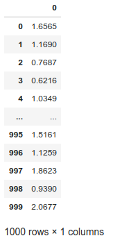
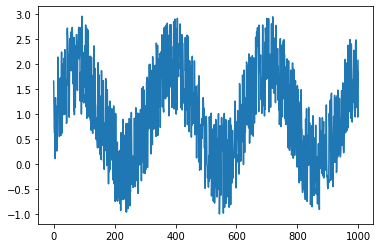
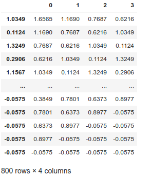
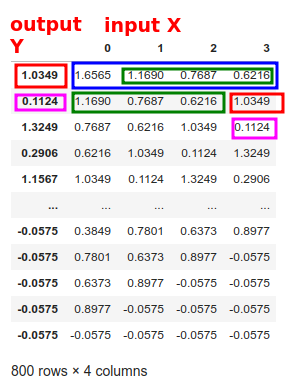
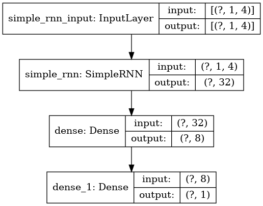
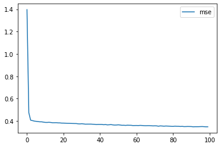
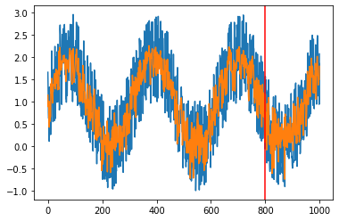

# Recurrent Neural Networks (RNNs) in TensorFlow

<!-- {"left" : 2.93, "top" : 5.51, "height" : 2.94, "width" : 1.26} -->
<!-- {"left" : 4.98, "top" : 6.78, "height" : 1.61, "width" : 1.89} -->

---

## Objectives

* Learn about RNNs
* Implement RNNs in TensorFlow and Keras

---

## Introduction to RNNs

[../generic/DL-RNNs.md#RNN Intro](../generic/DL-RNNs.md#RNN Intro)

---

# RNNs in TensorFlow

<!-- {"left" : 2.93, "top" : 5.51, "height" : 2.94, "width" : 1.26} -->
<!-- {"left" : 4.19, "top" : 5.95, "height" : 1.36, "width" : 1.6} -->

---

## RNNs in TensorFlow

* RNNs are implemented in [tf.keras.layers.SimpleRNN](https://www.tensorflow.org/api_docs/python/tf/keras/layers/SimpleRNN)

```python
import tensorflow as tf
from tensorflow import keras

model = keras.models.Sequential()

# here is RNN
model.add(keras.layers.SimpleRNN(
                                units=32,
                                input_shape=(1,step),
                                activation="relu"))

## add any other layers
```
<!-- {"left" : 0, "top" : 1.84, "height" : 4.03, "width" : 10.25} -->

---

## A Simple RNN Walkthrough

* Let's walk through a very simple RNN

* We will build a simple RNN to predict a **SINE Wave**


Notes:
* Source: https://www.datatechnotes.com/2018/12/rnn-example-with-keras-simplernn-in.html

---

## RNN Example: Sine Wave Prediction

<!-- {"left" : 7.96, "top" : 1.19, "height" : 4.16, "width" : 1.96} -->


```python
# Generate 1000 samples
samples = 1000    
training_samples = 800    

t=np.arange(0,samples)

## Generating a sine wave, with some noise
x=np.sin(0.02*t)+2*np.random.rand(samples)

## print data
df_orig = pd.DataFrame(x)
## plot data
plt.plot(df_orig)
df_orig
```
<!-- {"left" : 0, "top" : 1.09, "height" : 4.36, "width" : 7.78} -->


<!-- {"left" : 2.96, "top" : 5.62, "height" : 2.83, "width" : 4.34} -->


---
## Shaping Data for RNN

* RNN takes sequence of input and produces output

* This is called **`step`**

* Consider the following sequence:  
`x = [1,2,3,4,5,6,7,8,9,10]`

* For **`step=1`** the input(x) and prediction(y) looks like this

| X | Y |
|---|---|
| 1 | 2 |
| 2 | 3 |
| 3 | 4 |
| 4 | 5 |
| 5 | 6 |

<!-- {"left" : 0.25, "top" : 4.23, "height" : 3, "width" : 9.75} -->


---
## Shaping Data for RNN

* Input:   
`x = [1,2,3,4,5,6,7,8,9,10]`

* Step=2

* Input, Output looks like this:

| X   | Y |
|-----|---|
| 1,2 | 3 |
| 2,3 | 4 |
| 3,4 | 5 |
| 4,5 | 6 |
| 5,6 | 7 |

<!-- {"left" : 0.25, "top" : 3.37, "height" : 3, "width" : 9.75} -->

---

## Shaping Data for RNN

* Input:   
`x = [1,2,3,4,5,6,7,8,9,10]`

* Step=3

* Input, Output looks like this:

| X     | Y |
|-------|---|
| 1,2,3 | 4 |
| 2,3,4 | 5 |
| 3,4,5 | 6 |
| 4,5,6 | 7 |
| 5,6,7 | 8 |

<!-- {"left" : 0.25, "top" : 3.03, "height" : 3, "width" : 9.75} -->

---

## Shape Data

```python
## vectorize the data

def convertToMatrix(data, step):
 X, Y =[], []
 for i in range(len(data)-step):
  d=i+step  
  X.append(data[i:d,])
  Y.append(data[d,])
 return np.array(X), np.array(Y)

x_train,y_train =convertToMatrix(train,step)
x_test,y_test =convertToMatrix(test,step)

print ("x_train.shape", x_train.shape)
print ("y_train.shape", y_train.shape)
print ("x_test.shape", x_test.shape)
print ("y_test.shape", y_test.shape)

## See data
df = pd.DataFrame(x_train, y_train)
df

## Finally, we'll reshape trainX and testX to fit with the Keras model.
## RNN model requires three-dimensional input data.

x_train = np.reshape(x_train, (x_train.shape[0], 1, x_train.shape[1]))
x_test = np.reshape(x_test, (x_test.shape[0], 1, x_test.shape[1]))

print ("x_train.shape", x_train.shape)
print ("y_train.shape", y_train.shape)
print ("x_test.shape", x_test.shape)
print ("y_test.shape", y_test.shape)
```
<!-- {"left" : 0, "top" : 1.29, "height" : 7.07, "width" : 9.28} -->

---

## Shaping Data

```text
x_train.shape (800, 4)
y_train.shape (800,)
x_test.shape (200, 4)
y_test.shape (200,)

x_train.shape (800, 1, 4)
y_train.shape (800,)
x_test.shape (200, 1, 4)
y_test.shape (200,)
```
<!-- {"left" : 0, "top" : 1.38, "height" : 2.9, "width" : 4.94} -->

<!-- {"left" : 1.54, "top" : 4.59, "height" : 3.78, "width" : 3.2} --> <!-- {"left" : 5.51, "top" : 4.31, "height" : 4.07, "width" : 3.2} -->


---

## Creating the Model

* Now the data is ready, we can create the model

```python

import tensorflow as tf
from tensorflow import keras

model = keras.models.Sequential()
model.add(keras.layers.SimpleRNN(units=32, input_shape=(1,step), activation="relu"))
model.add(keras.layers.Dense(8, activation="relu"))
model.add(keras.layers.Dense(1))
model.compile(optimizer='rmsprop', loss = 'mse', metrics=['mse'])

model.summary()
tf.keras.utils.plot_model(model, to_file='model.png', show_shapes=True)

```
<!-- {"left" : 0, "top" : 1.84, "height" : 2.42, "width" : 10.25} -->

---

## Model Shape

```text
Model: "sequential"
_________________________________________________________________
Layer (type)                 Output Shape              Param #   
=================================================================
simple_rnn (SimpleRNN)       (None, 32)                1184      
_________________________________________________________________
dense (Dense)                (None, 8)                 264       
_________________________________________________________________
dense_1 (Dense)              (None, 1)                 9         
=================================================================
Total params: 1,457
Trainable params: 1,457
Non-trainable params: 0

```
<!-- {"left" : 0, "top" : 1.17, "height" : 2.98, "width" : 8.5} -->

<!-- {"left" : 2.81, "top" : 4.66, "height" : 3.64, "width" : 4.64} -->


---

## Training

<!-- {"left" : 3.41, "top" : 1.21, "height" : 1.95, "width" : 2.93} -->


```python
%%time

# Fitting the RNN to the Training set
history = model.fit(x_train, y_train, epochs=100, batch_size=16)

%matplotlib inline
import matplotlib.pyplot as plt

plt.plot(history.history['mse'], label='mse')
plt.legend()
```
<!-- {"left" : 0, "top" : 3.46, "height" : 1.97, "width" : 7.07} -->


<br clear="all" />

```text
training starting ...
Train on 800 samples
Epoch 1/100
800/800 [==============================] - 1s 1ms/sample - loss: 1.3962 - mse: 1.3962
Epoch 2/100
800/800 [==============================] - 0s 231us/sample - loss: 0.4745 - mse: 0.4745
...
Epoch 99/100
800/800 [==============================] - 0s 194us/sample - loss: 0.3482 - mse: 0.3482
Epoch 100/100
800/800 [==============================] - 0s 295us/sample - loss: 0.3485 - mse: 0.3485
training done.
CPU times: user 1min 56s, sys: 2min 54s, total: 4min 51s
Wall time: 20.5 s
```
<!-- {"left" : 0, "top" : 5.8, "height" : 2.02, "width" : 7.07} -->

---

## Scoring

```python

predict_train = model.predict(x_train)
predict_test= model.predict(x_test)
predicted=np.concatenate((predict_train,predict_test),axis=0)

train_score = model.evaluate(x_train, y_train, verbose=0)
test_score = model.evaluate(x_test, y_test, verbose=0)

metric_names = model.metrics_names
print ("model metrics : " , metric_names)

train_metrics = model.evaluate(x_train, y_train, verbose=0)
for idx, metric in enumerate(metric_names):
    print ("Train Metric : {} = {:,.2f}".format (metric_names[idx], train_metrics[idx]))

test_metrics = model.evaluate(x_test, y_test, verbose=0)
for idx, metric in enumerate(metric_names):
    print ("Test Metric : {} = {:,.2f}".format (metric_names[idx], test_metrics[idx]))
```
<!-- {"left" : 0, "top" : 1.29, "height" : 3.31, "width" : 9.75} -->

```text
model metrics :  ['loss', 'mse']
Train Metric : loss = 0.34
Train Metric : mse = 0.34
Test Metric : loss = 0.46
Test Metric : mse = 0.46
```
<!-- {"left" : 0, "top" : 4.97, "height" : 1.74, "width" : 6.11} -->

---

## Plot Predictions

* Blue is original data

* Orange is prediction

* It is tracking pretty close!

```python
index = df_orig.index.values
plt.plot(index,df_orig)
plt.plot(index,predicted)
plt.axvline(df_orig.index[training_samples], c="r")
plt.show()
```
<!-- {"left" : 0, "top" : 2.7, "height" : 1.74, "width" : 9.28} -->


<!-- {"left" : 2.49, "top" : 5.04, "height" : 3.44, "width" : 5.28} -->


---

## Lab: RNN lab

<!-- {"left" : 6.76, "top" : 0.88, "height" : 4.37, "width" : 3.28} -->


* **Overview:**
    - Implement RNNs in TensorFlow

* **Approximate run time:**
    - 30-40 mins

* **Instructions:**
    - Try these labs
    - (Instructor to Demo) **RNN-1** - RNN Intro: Sinewave
    - **RNN-2** - Stock price prediction
    - **RNN-3** - Text generation with RNN


Notes:

---

## Review and Q&A

<!-- {"left" : 8.24, "top" : 1.21, "height" : 1.28, "width" : 1.73} -->


* Let's go over what we have covered so far

* Any questions?

<!-- {"left" : 2.69, "top" : 4.43, "height" : 3.24, "width" : 4.86} -->
