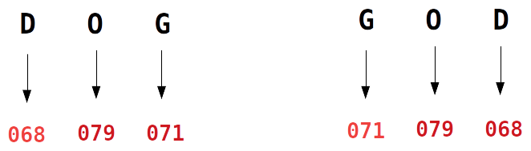
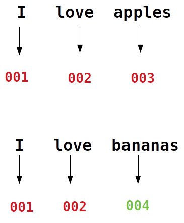
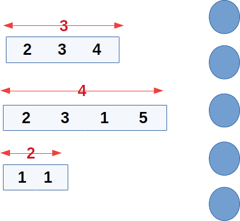
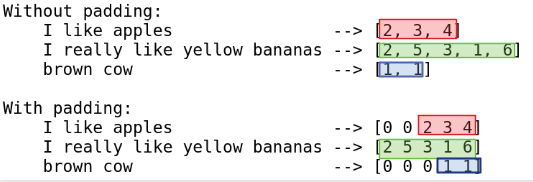

# Natural Language Processing  With Tensorflow

  <!-- {"left" : 5.88, "top" : 6.56, "height" : 1.23, "width" : 1.45} -->

---

## Objectives
* Learn NLP capabilities in Tensorflow

---

## Text Encodings

* Before we can machine learning algorithms on text, we need convert the text data into vectors (numbers)
    - Because ML algorithms work with numbers/vectors

* In the next section we will look at some text encoding schemes

Notes:

Because ML algorithms works on vectors (or numbers), having a good vector representation is essential for doing NLP.

---

## Character Based Encodings

* We can break the text into characters and convert each character to a number

* For example, we can use a simple encoding like ASCII

* Each letter has a unique ASCII code

* Here we are encoding two words **DOG** and **GOD**
    - They map to the same numbers

* So here the sematics of the text is lost!

<!-- TODO shiva -->
<!-- {"left" : 8.56, "top" : 1.21, "height" : 1.15, "width" : 1.55} -->

Notes:

ASCII stands for American Standard Code for Information Interchange.   
English ASCII code had 128 codes.  
https://en.wikipedia.org/wiki/ASCII.  
https://www.w3schools.com/charsets/ref_html_ascii.asp

---

## Word Based Encodings

<!-- TODO shiva -->
<!-- {"left" : 8.56, "top" : 1.21, "height" : 1.15, "width" : 1.55} -->

* Let's try word based encodings

* Each word is assigned a unique code

* So **I love apples** is encoding to  **001 ,  002 ,  003**

* When we encode **I love bananas**,
    - we reuse the already assigned encodings  for words **I, love**
    - new encoding (**004**) is created for new word **bananas**

* So here are the encodings:
    - **`I love apples  --> 001    002    003`**
    - **`I love bananas --> 001    002    004`**

---

## Text Encodings with Tensorflow

* We are telling Tokenizer to consider top-100 words by volume.  In large text we can limit the words to consider

* If you look at the output, we see text is lower cased (**I --> i**)
    - This keeps the encoding simpler

* Also punctuation is stripped out (here **bananas!** and **bananas** are the same)

<!-- TODO shiva -->
```python
from tensorflow import keras
from tensorflow.keras.preprocessing.text import Tokenizer

sentences = [
    'I like apples',
    'I like bananas',
    'bananas!' ]

## Consider top 100 unique words
tokenizer = Tokenizer(num_words=100)

## encodes text, assignes unique encoding for each words
tokenizer.fit_on_texts(sentences)

##  Let's see the mapping of word <--> token
print (tokenizer.word_index)
```

```text
{'i': 1, 'like': 2, 'bananas': 3, 'apples': 4}
```


---

## Text to Sequence

* Once the text is encoded, we can convert text into sequences
    - We use **`tokenizer.texts_to_sequences`**

```python
from tensorflow import keras
from tensorflow.keras.preprocessing.text import Tokenizer

sentences = [
    'I like apples',
    'I like bananas',
    'bananas!' ]

tokenizer = Tokenizer(num_words=100)

tokenizer.fit_on_texts(sentences)

## map sentences --> sequences
sequences = tokenizer.texts_to_sequences(sentences)

for i, line in enumerate(sentences):
    print (line, '-->' , sequences[i] )

```

```console
I like apples --> [1, 2, 4]
I like bananas --> [1, 2, 3]
bananas! --> [3]
```
---

## Missing Encodings

* Here we are encoding new sentences that have some words that tokenizer hadn't seen before

* Notice what happens to words tokenizer doesn't know about:
    - 'green' and 'yellow'
    - They are **skipped**
    - Look at the last sentence :-)

<!-- TODO shiva -->
```python
test_sentences = [
    'I like green apples',
    'I love yellow bananas',
    'brown cow' ]

## map sentences --> sequences
sequences = tokenizer.texts_to_sequences(test_sentences)

for i, line in enumerate(test_sentences):
    print (line, '-->' , sequences[i] )
```

```console
I like green apples --> [1, 2, 4]   # missing encoding for green

I love yellow bananas --> [1, 3]   # missing encoding for yellow

brown cow --> []  # all words missing
```

---

## Handling Missing Vocabulary

* In the previous example, we saw if the tokenizer didn't recognize a word, it is simple ignoring it in the generated sequence
    - This is not a desired outcome

* We are going to put a **special marker** to indicate missing vocabulary
    - We can do this by specifying **`oov_token`** parameter in Tokernizer
    - We will need to make sure this special marker is unique and does not occur in the text

```python
from tensorflow.keras.preprocessing.text import Tokenizer

## Specifying 'Out of Vocabulary' marker
tokenizer = Tokenizer(num_words=100, oov_token="OOV")

```

---
## Handling Missing Vocabulary

<!-- TODO shiva -->
```python
from tensorflow import keras
from tensorflow.keras.preprocessing.text import Tokenizer

sentences = [
    'I like apples',
    'I like bananas' ]

## Specifying 'Out of Vocabulary' marker
tokenizer = Tokenizer(num_words=100, oov_token='OOV')

## encodes text, assignes unique encoding for each words
tokenizer.fit_on_texts(sentences)
print (tokenizer.word_index)
## output :
## {'OOV': 1, 'i': 2, 'like': 3, 'apples': 4, 'bananas': 5}

test_sentences = [
    'I like apples',
    'I like yellow bananas',
    'brown cow' ]

## map sentences --> sequences
sequences = tokenizer.texts_to_sequences(test_sentences)

for i, line in enumerate(test_sentences):
    print (line, '-->' , sequences[i] )

## output
## I like apples --> [2, 3, 4]
## I like yellow bananas --> [2, 3, 1, 5]
## brown cow --> [1, 1]
```

---

## Tokenizer API

* Tensorflow Tokernizer is  [tf.keras.preprocessing.text.Tokenizer](https://www.tensorflow.org/api_docs/python/tf/keras/preprocessing/text/Tokenizer)

```python
tf.keras.preprocessing.text.Tokenizer(
                            num_words=None,
                            filters='!"#$%&()*+,-./:;<=>?@[\\]^_`{|}~\t\n',
                            lower=True,
                            split=' ',
                            char_level=False,
                            oov_token=None,
                            document_count=0,
                            **kwargs )
```

* **`filters`**: a string where each element is a character that will be
    filtered from the texts. The default is all punctuation, plus
    tabs and line breaks, minus the `'` character.

* **`lower`**: boolean. Whether to convert the texts to lowercase.

* **`char_level`**: if True, every character will be treated as a token.

* **`split_str`**. Separator for word splitting

* **`oov_token`**: if given, it will be added to word_index and used to
    replace out-of-vocabulary words during text_to_sequence calls

---

## Sequence Lengths

* We are encoding each sentence separately; thus the encodings will have different lenghts

```code
I like apples         --> [2, 3, 4]
I like yellow bananas --> [2, 3, 1, 5]
brown cow             --> [1, 1]
```

<br />

<!-- TODO shiva -->
<!-- {"left" : 8.56, "top" : 1.21, "height" : 1.15, "width" : 1.55} -->

* When feeding data into neural networks, the input dimensions have to match neural network Input layer

* We like to keep the encodings the same length

* This is called **padding**

---

## Padding


```python
from tensorflow.keras.preprocessing.text import Tokenizer
from tensorflow.keras.preprocessing.sequence import pad_sequences

sentences = [
    'I like apples',
    'I really like bananas' ]

tokenizer = Tokenizer(num_words=100, oov_token='OOV')
tokenizer.fit_on_texts(sentences)
print ("word index: ", tokenizer.word_index)

## without padding
sequences = tokenizer.texts_to_sequences(sentences)
print ("Without padding:")
for i, line in enumerate(sentences):
    print (line, '-->' , sequences[i] )

## with padding
padded = pad_sequences(sequences)
print ("With padding:")
for i, line in enumerate(sentences):
    print (line, '-->' , padded[i] )
```

```text
word index:  {'OOV': 1, 'i': 2, 'like': 3, 'apples': 4, 'really': 5, 'bananas': 6}

Without padding:
I like apples         --> [2, 3, 4]
I really like bananas --> [2, 5, 3, 6]

With padding:
I like apples         --> [0 2 3 4]
I really like bananas --> [2 5 3 6]
```

---

## Customizing Padding

* By default padding, pads the **front of the sentence**  
Here we see 0 added in front of the first sentence

```python
test_sentences = [
    'I like apples',
    'I really like yellow bananas',
    'brown cow' ]

## without padding
sequences = tokenizer.texts_to_sequences(test_sentences)
print ("Without padding:")
for i, line in enumerate(test_sentences):
    print (line, '-->' , sequences[i] )

## with padding
padded = pad_sequences(sequences)
print ("With padding:")
for i, line in enumerate(test_sentences):
    print (line, '-->' , padded[i] )
```

<!-- TODO shiva -->
<!-- {"left" : 8.56, "top" : 1.21, "height" : 1.15, "width" : 1.55} -->


Notes:

Output  
Without padding:  
    I like apples                --> [2, 3, 4]  
    I really like yellow bananas --> [2, 5, 3, 1, 6]  
    brown cow                    --> [1, 1]  

With padding:   
    I like apples                --> [0 0 2 3 4]   
    I really like yellow bananas --> [2 5 3 1 6]   
    brown cow                    --> [0 0 0 1 1]   

---

## Padding to the Back

* Let's add padding to the **back of the sentence**  

* We see 0s being added at the back

```python
test_sentences = [
    'I like apples',
    'I really like yellow bananas',
    'brown cow' ]

## without padding
sequences = tokenizer.texts_to_sequences(test_sentences)
print ("Without padding:")
for i, line in enumerate(test_sentences):
    print (line, '-->' , sequences[i] )

## with padding
padded = pad_sequences(sequences, padding='post') # <-- post padding
print ("With padding:")
for i, line in enumerate(test_sentences):
    print (line, '-->' , padded[i] )
```

```text
Without padding:
    I like apples                --> [2, 3, 4]
    I really like yellow bananas --> [2, 5, 3, 1, 6]
    brown cow                    --> [1, 1]

With padding:
    I like apples                --> [2 3 4 0 0]
    I really like yellow bananas --> [2 5 3 1 6]
    brown cow                    --> [1 1 0 0 0]
```

---

## Padding Length

* By default, padded sequence takes the length of longest sentence

* We can specified a desired sequence length

```python
test_sentences = [
    'I like apples',
    'I really like yellow bananas',
    'brown cow' ]

## without padding
sequences = tokenizer.texts_to_sequences(test_sentences)
print ("Without padding:")
for i, line in enumerate(test_sentences):
    print (line, '-->' , sequences[i] )

## with padding
padded = pad_sequences(sequences, padding='post', maxlen=10) # <-- setting padded length
print ("With padding:")
for i, line in enumerate(test_sentences):
    print (line, '-->' , padded[i] )
```

```output
Without padding:
    I like apples                --> [2, 3, 4]
    I really like yellow bananas --> [2, 5, 3, 1, 6]
    brown cow                    --> [1, 1]

With padding:
    I like apples                --> [2 3 4 0 0 0 0 0 0 0]
    I really like yellow bananas --> [2 5 3 1 6 0 0 0 0 0]
    brown cow                    --> [1 1 0 0 0 0 0 0 0 0]
```

---
## Padding Length Truncating

* What if our maxlen is less than the longest sentence?

* Sequence will be truncated, here is how

```python
test_sentences = [
    'I like apples',
    'I really like yellow bananas',
    'brown cow' ]

## without padding
sequences = tokenizer.texts_to_sequences(test_sentences)
print ("Without padding:")
for i, line in enumerate(test_sentences):
    print (line, '-->' , sequences[i] )

## with padding
padded = pad_sequences(sequences, padding='post',
                        truncating='post', maxlen=4) # <-- setting padded length and truncation
print ("With padding:")
for i, line in enumerate(test_sentences):
    print (line, '-->' , padded[i] )
```

```output
Without padding:
    I like apples                --> [2, 3, 4]
    I really like yellow bananas --> [2, 5, 3, 1, 6]
    brown cow                    --> [1, 1]

With padding:
    I like apples                --> [2 3 4 0]
    I really like yellow bananas --> [2 5 3 1]  # <-- truncated
    brown cow                    --> [1 1 0 0]
```

---

## Review and Q&A

<!-- {"left" : 8.56, "top" : 1.21, "height" : 1.15, "width" : 1.55} -->
<!-- {"left" : 6.53, "top" : 2.66, "height" : 2.52, "width" : 3.79} -->


* Let's go over what we have covered so far

* Any questions?

---

## Lab: String Tokenizer

<!-- {"left" : 6.76, "top" : 0.88, "height" : 4.37, "width" : 3.28} -->


* **Overview:**
    - Get acquainted with Tokenizer

* **Approximate run time:**
    - ~15 mins

* **Instructions:**
    - **TEXT-1:** Tokernizer


Notes:

---
## Lab: Padding

<!-- {"left" : 6.76, "top" : 0.88, "height" : 4.37, "width" : 3.28} -->


* **Overview:**
    - Get acquainted with Padding

* **Approximate run time:**
    - ~15 mins

* **Instructions:**
    - **TEXT-2:** Text Padding


Notes:

---
## Lab: Text Exercise

<!-- {"left" : 6.76, "top" : 0.88, "height" : 4.37, "width" : 3.28} -->


* **Overview:**
    - Process text data with Tokenizer and padding

* **Approximate run time:**
    - ~20 mins

* **Instructions:**
    - **TEXT-3:** Text exercise 1


Notes:

---
