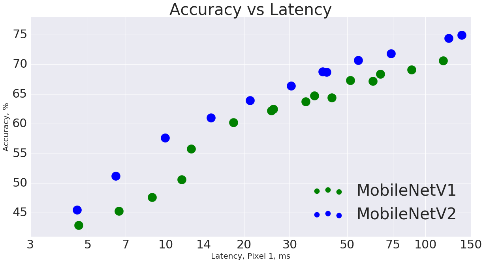
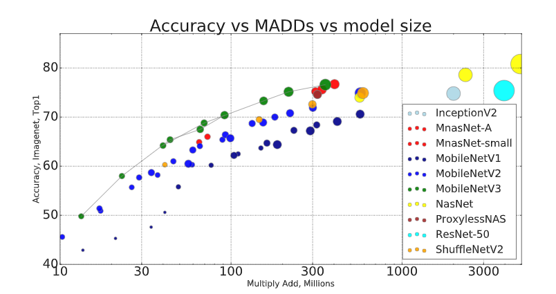
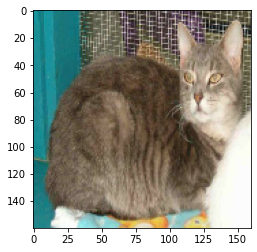
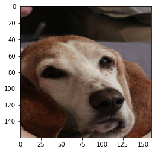
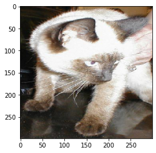
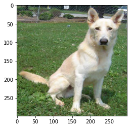
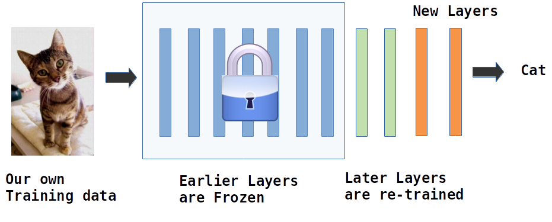
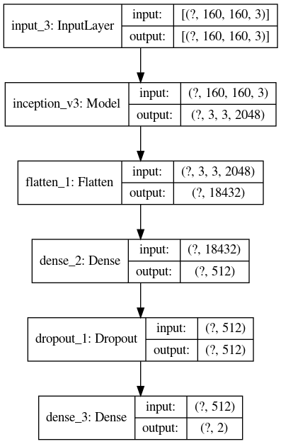
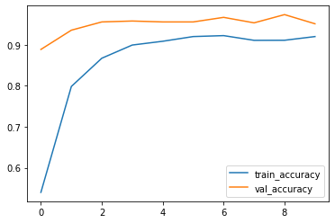

# Transfer Learning With Tensorflow

  <!-- {"left" : 5.88, "top" : 6.56, "height" : 1.23, "width" : 1.45} -->    &nbsp; &nbsp;

---

## Objectives

* Learn about 'transfer learning'

* How to 'transfer learning' in Tensorflow

* Understand Pre-Trained Models

* Customize pre-trained models

Notes:


---

# Transfer Learning

[../generic/DL-Transfer-Learning.md](../generic/DL-Transfer-Learning.md)

---

# Transfer Learning in Tensorflow

  <!-- {"left" : 5.88, "top" : 6.56, "height" : 1.23, "width" : 1.45} -->    &nbsp; &nbsp;

---

## Pre-trained Computer Vision Models

* ImageNet trained models
* Source : [Practical Deep Learning for Cloud and Mobile](https://learning.oreilly.com/library/view/practical-deep-learning/9781492034858/ch01.html#image_classification_with_keras), Ch 2

<br />

| Model               | Size  | Top 1 Accuracy | Top 5 Accuracy | Parameters  | Depth |
|---------------------|-------|----------------|----------------|-------------|-------|
| Inception-ResNet-V2 | 215MB | 0.804          | 0.953          | 55,873,736  | 572   |
| Xception            | 88MB  | 0.79           | 0.945          | 22,910,480  | 126   |
| Inception-V3        | 92MB  | 0.788          | 0.944          | 23,851,784  | 159   |
| DenseNet-201        | 80MB  | 0.77           | 0.933          | 20,242,984  | 201   |
| ResNet-50           | 99MB  | 0.759          | 0.929          | 25,636,712  | 168   |
| DenseNet-169        | 57MB  | 0.759          | 0.928          | 14,307,880  | 169   |
| DenseNet-121        | 33MB  | 0.745          | 0.918          | 8,062,504   | 121   |
| VGG-19              | 549MB | 0.727          | 0.91           | 143,667,240 | 26    |
| VGG-16              | 528MB | 0.715          | 0.901          | 138,357,544 | 23    |
| MobileNet           | 17MB  | 0.665          | 0.871          | 4,253,864   | 88    |

<!-- {"left" : 0.15, "top" : 1.87, "height" : 5.86, "width" : 9.95, "columnwidth" : [1.66, 1.66, 1.66, 1.66, 1.66, 1.66 ]} -->


Notes:

Source : [Practical Deep Learning for Cloud and Mobile](https://learning.oreilly.com/library/view/practical-deep-learning/9781492034858/ch01.html#image_classification_with_keras), Ch 2---

---

## Pre-trained Models in Tensorflow

* Tensorflow already has pre-trained models packaged

* This makes them very easy to use

* Implemented in **`tf.keras.applications`** package

* [Reference](https://www.tensorflow.org/api_docs/python/tf/keras/applications/)

---

## MobileNet

<!-- TODO shiva -->
<!-- {"left" : 6.76, "top" : 0.88, "height" : 4.37, "width" : 3.28} -->
<!-- {"left" : 6.76, "top" : 0.88, "height" : 4.37, "width" : 3.28} -->


* MobileNet is (relatively) light weight:
    - Layers : 157
    - Size : ~15 MB
    - Parameters : ~3.5 Million

* Achieves reasonable accuracy : ~ 70%

* There are 3 versions (as of 2020): V1, V2, V3

* References:
    - [github for models](https://github.com/tensorflow/models/tree/master/research/slim/nets/mobilenet)
    - [MobileNetV2 paper](https://arxiv.org/abs/1801.04381)
    - [MobileNetV3 paper](https://arxiv.org/abs/1905.02244)
    - [MobileNetV2: The Next Generation of On-Device Computer Vision Networks](https://ai.googleblog.com/2018/04/mobilenetv2-next-generation-of-on.html   )

---

## Using MobileNet

* Here we are downloading the model; It will be automatically downloaded
    - They will be cached under **`~/.keras/models/`** directory

* **`include_top=True`** : includes the full model and classifying layers (last few layers)

* **`weights='imagenet'`** : we are initializing the weights imagenet trained

* To use imagenet trained weights, the image dimensions are to be one of 96, 128, 160, 192, 224(default).

```python

model = tf.keras.applications.MobileNetV2(input_shape=(160,160,3),
                                                      include_top = True,
                                                      weights = 'imagenet')
model.summary()  # large output

# print out the size
! du -skh ~/.keras/models/*

```

---
## Using Mobile Net

```python
from tensorflow.keras.preprocessing.image import load_img
from tensorflow.keras.preprocessing import image
from tensorflow.keras.preprocessing.image import img_to_array
import numpy as np
import matplotlib.pyplot as plt

## Load and resize the image
img = image.load_img('cat1.jpg', target_size = (160, 160))
img_data = image.img_to_array(img)

## The networks accept a 4-dimensional Tensor as an input of the form
## ( batchsize, height, width, channels).
img_data = np.expand_dims(img_data, axis = 0)

## Preprocess the input by subtracting the mean value from each channel of the images in the batch.
## Mean is an array of three elements obtained by the average of R, G, B pixels
## of all images obtained from ImageNet.
## The values for ImageNet are : [ 103.939, 116.779, 123.68 ].
## This is done using the preprocess_input() function.
## Using a copy here, because the function modifies the array
processed_image = tf.keras.applications.mobilenet.preprocess_input(img_data.copy())

## prediction will be a 1000 wide softmax array!
## Remember, ImageNet has 1000 classes
prediction = model.predict (processed_image)

## This tells us a little about prediction
decoded_predictions = model_pkg.decode_predictions(prediction)
print (decoded_predictions)
plt.imshow(img)
plt.show()

```

---

## Using Mobile Net

<!-- TODO shiva -->
<!-- {"left" : 6.76, "top" : 0.88, "height" : 4.37, "width" : 3.28} -->

```text
image_file: cat-1.jpg
predicted class:  281 , probability: 0.5209749

Top-5 predictions:
    Class Id   Description  Probability (high to low)
0  n02123045         tabby                   0.520975
1  n02124075  Egyptian_cat                   0.136530
2  n02123159     tiger_cat                   0.135872
3  n02123394   Persian_cat                   0.012930
4  n02127052          lynx                   0.009831
```

<br clear="all" />

<!-- TODO shiva -->
<!-- {"left" : 6.76, "top" : 0.88, "height" : 4.37, "width" : 3.28} -->

```console
image_file: dog-1.jpg
predicted class:  162 , probability: 0.49582803

Top-5 predictions:
    Class Id         Description  Probability (high to low)
0  n02088364              beagle                   0.495828
1  n02088238              basset                   0.332110
2  n02089867        Walker_hound                   0.078867
3  n02099712  Labrador_retriever                   0.008504
4  n02089973    English_foxhound                   0.007416
```

---

## Using Inception

<!-- TODO shiva -->
<!-- {"left" : 6.76, "top" : 0.88, "height" : 4.37, "width" : 3.28} -->

* Versions: v1, v2, v3, v4

* Inception was developed at Google

* Stats (v3)
    - Achieves 78% accuracy on ImageNet
    - 313 Layers
    - ~ 92 MB size
    - 23 Million parameters

* References:
    - [Rethinking the Inception Architecture for Computer Vision](http://arxiv.org/abs/1512.00567)
    - [https://github.com/google/inception](https://github.com/google/inception)
    - [A Simple Guide to the Versions of the Inception Network](https://towardsdatascience.com/a-simple-guide-to-the-versions-of-the-inception-network-7fc52b863202)

---

## Using Inception V3

```python
from tensorflow.keras.preprocessing.image import load_img
from tensorflow.keras.preprocessing import image
from tensorflow.keras.preprocessing.image import img_to_array
import numpy as np
import matplotlib.pyplot as plt

model = tf.keras.applications.InceptionV3(input_shape=(299, 299, 3),
                                                      include_top = True,
                                                      weights = 'imagenet')
## Load and resize the image
img = image.load_img('cat1.jpg', target_size = (299, 299))
img_data = image.img_to_array(img)

## The networks accept a 4-dimensional Tensor as an input of the form
## ( batchsize, height, width, channels).
img_data = np.expand_dims(img_data, axis = 0)

## Preprocess the input by subtracting the mean value from each channel of the images in the batch.
## Mean is an array of three elements obtained by the average of R, G, B pixels
## of all images obtained from ImageNet.
## The values for ImageNet are : [ 103.939, 116.779, 123.68 ].
## This is done using the preprocess_input() function.
## Using a copy here, because the function modifies the array
processed_image = tf.keras.applications.inception_v3.preprocess_input(img_data.copy())

## prediction will be a 1000 wide softmax array!
## Remember, ImageNet has 1000 classes
prediction = model.predict (processed_image)

## This tells us a little about prediction
decoded_predictions = tf.keras.applications.inception_v3.decode_predictions(prediction)
print (decoded_predictions)
plt.imshow(img)
plt.show()
```

---

## Using Inception

<!-- TODO shiva -->
<!-- {"left" : 6.76, "top" : 0.88, "height" : 4.37, "width" : 3.28} -->

```text
image_file: cat-1.jpg
predicted class:  284 , probability: 0.989312

Top-5 predictions:
    Class Id   Description  Probability (high to low)
0  n02123597   Siamese_cat                   0.989312
1  n02127052          lynx                   0.001900
2  n02124075  Egyptian_cat                   0.000669
3  n02441942        weasel                   0.000569
4  n02125311        cougar                   0.000385
```

<br clear="all" />

<!-- TODO shiva -->
<!-- {"left" : 6.76, "top" : 0.88, "height" : 4.37, "width" : 3.28} -->

```console
image_file: dog-1.jpg
predicted class:  273 , probability: 0.18333238

Top-5 predictions:
    Class Id      Description  Probability (high to low)
0  n02115641            dingo                   0.183332
1  n02109961       Eskimo_dog                   0.138134
2  n02114548       white_wolf                   0.133320
3  n02110185   Siberian_husky                   0.114638
4  n02106662  German_shepherd                   0.095230
```
---
## Lab: Explore Pre-trained Models

<!-- TODO shiva -->
<!-- {"left" : 6.76, "top" : 0.88, "height" : 4.37, "width" : 3.28} -->


* **Overview:**
    - Explore pre-trained models

* **Approximate run time:**
    - 15 mins

* **Instructions:**
    - **TRANSFER-1**: Explore pre-trained model


Notes:

---
## Lab: Using Pre-trained Models

<!-- TODO shiva -->
<!-- {"left" : 6.76, "top" : 0.88, "height" : 4.37, "width" : 3.28} -->


* **Overview:**
    - Use pre-trained models

* **Approximate run time:**
    - 40 mins

* **Instructions:**
    - **TRANSFER-2**: Using pre-trained model


Notes:

---

# Re-training a Pre-Trained Model


---

## Re-training a Pre-Trained Model

* Pre-trained models are trained on certain datasets (e.g. Imagenet)

* We will re-train the model using our own data, to customize for our own needs

* We will add a couple of layers of our own to the base model

* Base model layers are frozen; only our layers are trained

<!-- TODO shiva -->
 <!-- {"left" : 0.34, "top" : 4.7, "height" : 2.36, "width" : 9.58} -->


---

## Transfer Learning Example

* Here we will use **`InceptionV3`** model and re-train it on our own examples
* **`include_top=False`** means we are only loading the base model, without the classification layer
* And we are initializing it with imagenet weights
* The model has 21 Million params!

<!-- TODO shiva -->
```python
pre_trained_model = tf.keras.applications.InceptionV3(input_shape=(IMG_WIDTH,IMG_HEIGHT,3),
                                                      include_top = False,
                                                      weights = 'imagenet')

# custom function just to print model summary
print_model_summary_compact(pre_trained_model)

# getting the size
! du -skh ~/.keras/models/* | grep inception

```

```python
# ~~~~~~~~ output ~~~~~~
# * Model: "inception_v3"
# * Total params: 21,802,784
# * Trainable params: 21,768,352
# * Non-trainable params: 34,432
# * layers:  311
#
# 92M	/home/sujee/.keras/models/inception_v3_weights_tf_dim_ordering_tf_kernels.h5
# 84M	/home/sujee/.keras/models/inception_v3_weights_tf_dim_ordering_tf_kernels_notop.h5
```

---
## Transfer Learning Example

* Here we are freezing the base model layers, so their weights are not trainable

* Note the difference between **`Total params = 21 Million`**  vs. **`Trainable params = 0`**  !

```python
## Freeze all layers
# for layer in pre_trained_model.layers:
#   layer.trainable = False

# or this works too
pre_trained_model.trainable = False

print_model_summary_compact (pre_trained_model)
```

```python
# ~~~~~~~~ output ~~~~~~
# * Model: "inception_v3"
# * Total params: 21,802,784
# * Trainable params: 0
# * Non-trainable params: 21,802,784
# * layers:  311
```

---
## Transfer Learning Example

* Note how we are creating a new model with **`pre_trained_model`**

* And note the new **`Trainable params (9.4 Million)`** - these are from our layers

```python
from tensorflow.keras.models import Sequential
from tensorflow.keras.layers import Input, Dense, Softmax, Flatten, GlobalAveragePooling2D, Dropout
from transfer_learning_utils import print_model_summary_compact

model = Sequential ([
                    Input (shape=(160, 160, 3)),
                    pre_trained_model,
                    Flatten(),
                    Dense(512, activation='relu'),
                    Dropout(0.5),
                    Dense(NUM_CLASSES, activation='softmax')
            ])

model.compile (loss='categorical_crossentropy',
                  optimizer= 'adam',
                  metrics=['accuracy'])

print_model_summary_compact(model)
```

```python
# ~~~~~~~~ output ~~~~~~
# * Model: "sequential"
# * Total params: 31,241,506
# * Trainable params: 9,438,722
# * Non-trainable params: 21,802,784
# * layers:  5
```

---
## Transfer Learning Example


<!-- TODO shiva -->
<!-- {"left" : 8.56, "top" : 1.21, "height" : 1.15, "width" : 1.55} -->

* Our image size is (160,160,3)  (3 for RGB channels because of color images)

* That is fed into the base Inception model

* Then we flatten the output to feed it to fully connected network

* And then finally we are producing a Softmax output of 2 classes (cat/dog)

```python
model = Sequential ([
                    Input (shape=(160, 160, 3)),
                    pre_trained_model,
                    Flatten(),
                    Dense(512, activation='relu'),
                    Dropout(0.5),
                    Dense(NUM_CLASSES, activation='softmax')
            ])
```

---

## Transfer Learning Example

<!-- TODO shiva -->
<!-- {"left" : 8.56, "top" : 1.21, "height" : 1.15, "width" : 1.55} -->

* We now train the model
* Training 10 epochs took about 1 minute in an Nvidia GTX 2070 GPU system
* You can see the accuracy starts out at 88%, and then climbs to 95%
* This is far better result than training cat-dog model from scratch;  
 We achieved around 75% accuracy after training 100 epochs
* And the final model is 125 MB in size (base model was 84 MB)

```python
history = model.fit( ...)
```

```python
# Epoch  1/10 -  loss: 29.5414 - accuracy: 0.5402 - val_loss: 2.2663 - val_accuracy: 0.8884
# Epoch  2/10 -  loss: 5.6050 - accuracy: 0.7982 - val_loss: 0.7580 - val_accuracy: 0.9353
# Epoch  3/10 -  loss: 2.4032 - accuracy: 0.8670 - val_loss: 0.8108 - val_accuracy: 0.9554
# ...
# Epoch  9/10 -  loss: 0.3259 - accuracy: 0.9107 - val_loss: 0.0825 - val_accuracy: 0.9732
# Epoch 10/10 -  loss: 0.2010 - accuracy: 0.9197 - val_loss: 0.1300 - val_accuracy: 0.9509
# ...

# CPU times: user 1min 1s, sys: 1.25 s, total: 1min 3s
# Wall time: 57.9 s
```

---
## Lab: Re-training a Pre-trained Model

<!-- TODO shiva -->
<!-- {"left" : 6.76, "top" : 0.88, "height" : 4.37, "width" : 3.28} -->


* **Overview:**
    - Customize a pre-trained model

* **Approximate run time:**
    - 40 mins

* **Instructions:**
    - **TRANSFER-3**: Retrain a pre-trained model


Notes:

---

## Review and Q&A

<!-- TODO shiva -->
<!-- {"left" : 8.56, "top" : 1.21, "height" : 1.15, "width" : 1.55} -->
<!-- {"left" : 6.53, "top" : 2.66, "height" : 2.52, "width" : 3.79} -->


* Let's go over what we have covered so far

* Any questions?
