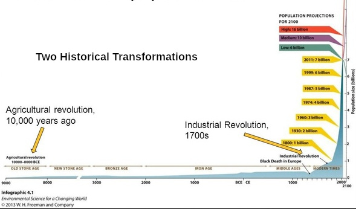
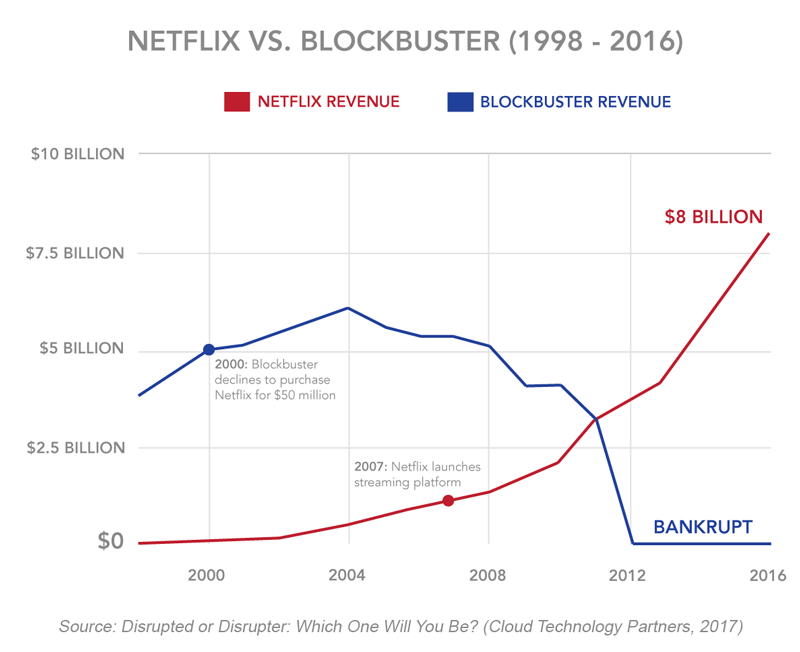
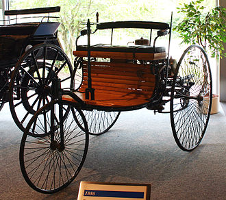
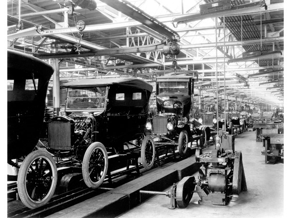
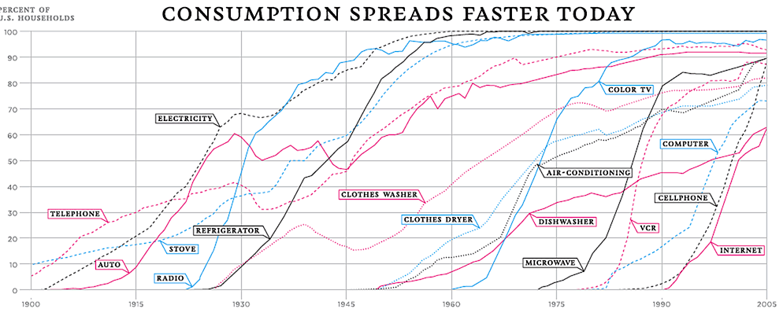
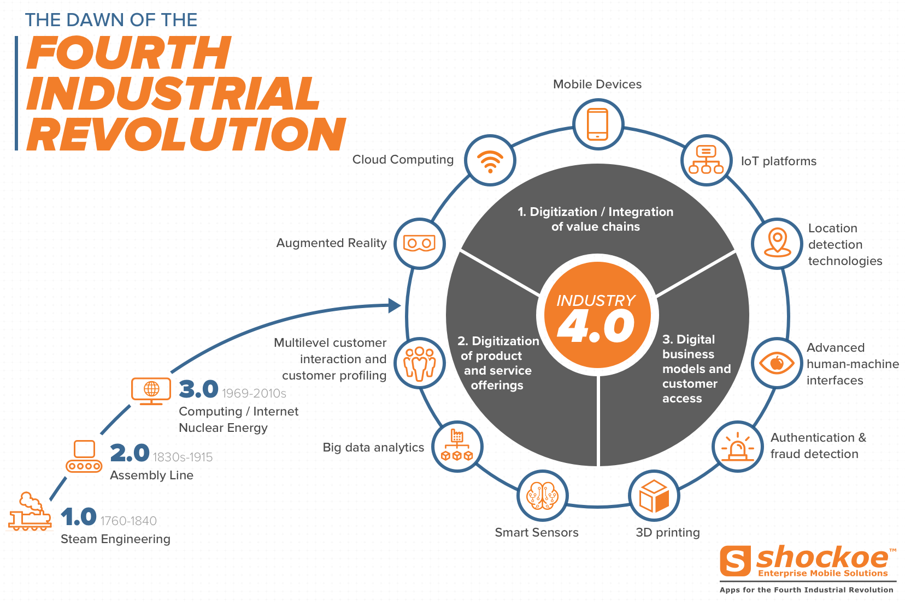
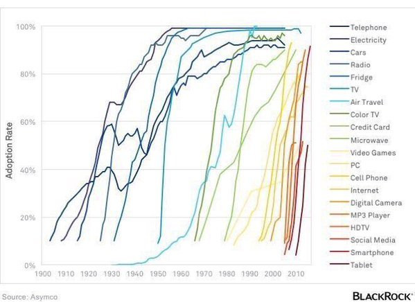
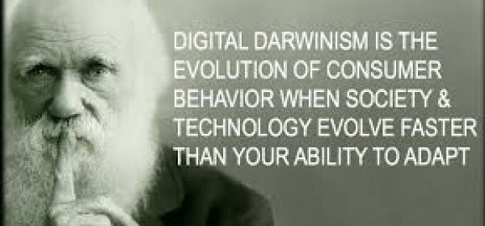

# Introduction to Digital Transformation

Notes:

This initial module is a general overview of the lessons.  It sets up the learning objective for the session and a brief introduction to what will be covered in each module. As well as the takeaways the students can expect from the session.

I have not included the standard intro to the instructor since I am assuming this will be added to individualize specific sessions.

---

## Digital Transformation

    

**"The only constant in life is change;   but even the nature of change is always changing."**

_Heraclitus, 530-470 BC_

---

## Session Objectives

* To understand:

  - What the "Digital Transformation" is
  - Why it's _not_ optional
  - Why it's happening now and will accelerate
  - What some of the key technologies are that are driving it
  - How it will affect markets, industries and the economy
  - How it will affect your business and career
  - How to plan for and succeed in the new digital economy

Notes:

These points are gleaned from the brief overview provided but they seem to make sense to me although they could easily be tweaked to bring a slightly different focus

---

## Social Transformations

* Human society has undergone two major transformations

* The third major transformation is now underway - the digital transformation

Notes:

Image Credit: https://www.quora.com/What-were-the-effects-produced-by-the-Neolithic-Revolution

The point of this slide and the next few are to hopefully establish that this is not just some marketing concept but that there are real and massive changes taking place.

Although I am not presenting this course, I will attest as both an cultural anthropologist and sociologist that this is real.  But there is no time in this presentation to do more than just state this fact as a given without proof.

---

## How Transformations Happen

* Innovative technology allows people live and work in new and novel ways

* When enough people adopt the technology, their mass change in behavior causes a disruption in an industry

Notes:

Image Credit: https://strategyjourney.com/2019/04/25/winning-the-customer-journey-battle-netflix-vs-blockbuster-case-study/

This is one of the classic case studies.  It may require explanation for younger students as to what "Blockbuster Video"  is.

---

## Innovation is Not Disruption

* The Car: Not Disruptive

  - 1885 Benz Patent-Motorwagen with an internal combustion engine
               

* The Assembly Line: Disruptive

  - Allowed for mass adoption of the car

Notes:

Image Credit: https://www.daimler.com/company/tradition/company-history/1885-1886.html

Image Credit: https://www.american-automobiles.com/Ford/1913-Ford.html

Lots of innovative technologies do not disrupt markets because they are never adopted by a sufficient percentage of the population. The reasons are varied, sometimes people just don't like the tech, sometimes it's badly marketed, or as in the case of the car, it isn't affordable or available to be adopted en mass.

---

## Adoption is Disruption

* Technology has to produce an overwhelming change of behavior in order to be disruptive

Notes:

Image Credit: https://www.slideserve.com/necia/production-and-long-term-growth

The point that we will return to in the following modules is that these sorts or transformation are not caused technology but rather by the adoption of technology en mass.  Historically, we see disruption when adoption reaches a critical mass or tipping point, but no one seems to ever be able to predict what exactly that point will be or even if it will occur.

---

## Technological Revolutions

* When multiple disruptive technologies are integrated and combined, then we have a technological revolution

Notes:

Image Credit: https://medium.com/predict/charting-your-own-pathway-to-professional-success-in-the-4th-industrial-revolution-ec5287a1b242

There is cumulative effect of disruptive technologies, and when enough change takes place across industries, we get revolutionary change.  A good example is that the disruptive effects of the use of trucks and ships along with the use of refrigeration were able to transform the grocery industry to enable global sourcing.

---

## It's Happening Faster

* Compared to previous revolutions, the rate of adoption, disruption and transformation is accelerating

Notes:

Image Credit: http://www.theequitykicker.com/2016/01/22/new-technology-adoption-curves-show-accelerating-pace-of-change/

This is the important point. Unlike the past, the rate of innovation, adoption and transformation are exponentially faster than the past.  You snooze, you lose.

---

## Adapt or Die

* We are seeing the winners and losers of digital transformation in every segment of the economy

* The important question we want to address is how to be on the winning side

Notes:

Image Credit: www.onlinemarketing-trends.com

---

## The Economic Reality

* According to the World Economic Forum (2019)

> We stand on the brink of a technological revolution that will fundamentally alter the way we live, work, and relate to one another. In its scale, scope, and complexity, the transformation will be unlike anything humankind has experienced before. We do not yet know just how it will unfold, but one thing is clear: the response to it must be integrated and comprehensive, involving all stakeholders of the global polity, from the public and private sectors to academia and civil society.

---

## The Road Ahead

* We will look at
  - Some of the main disruptive technologies
  - What sort of impact they will have
  - Strategies for being leaders in this new economy  

Notes:

Image Credit: https://www.picpedia.org/highway-signs/c/changes-ahead.html

I put these at the end of this module since I feel that now that the context has been set, it should grab the students' interest.  I hope.

---

## Digital Darwinism

Notes:

Image Credit: https://www.parleyconsulting.com/digital-darwinism/

This meme of digital Darwinism will be returned to in later modules.
