 # Blueprint for Digital Transformation

Notes:

The basic theme of this lesson is to look at the digital transformation from a macro level.  Then, in the technology modules, we drill down a bit more into the specifics of the enabling technologies.  Responses to this transformation are in the next lesson.

---

## Session Objectives

* To understand:

  - How the 4th Industrial Revolution is happening
  - How and why the technological changes are taking place
  - What some of these new technologies are
  - Why it's inevitable and ongoing

Notes:

As with the last lesson, these points are gleaned from the brief overview provided but they seem to make sense to me although they could easily be tweaked to bring a slightly different focus

---

## Fourth Industrial Revolution

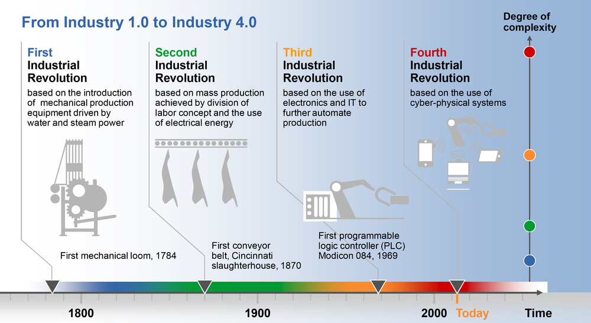

* The 3rd revolution was the rise of a digital cyberspace

* The 4th revolution is the integration of cyberspace with the real world

Notes:

Image Credit: https://www.tritoninnovation.com/industry40

---

## Fourth Industrial Revolution

* The 3rd revolution was the development of a digital cyberspace that was separate from the real world

* Overtime, technologies started integrating parts of the physical world with cyberspace

* These fusions created disruptive technologies

* As the disruption grew, it became a cyber-physical revolution

Notes:

This is the crux of the whole point of transformation -- the digital world had to evolve in capability in order to manage the actual integration with the physical world through robotics, big data etc.  It was when the distinction between cyber and physical broke down, we had the revolution taking place.

---
## Cyber-Physical Systems

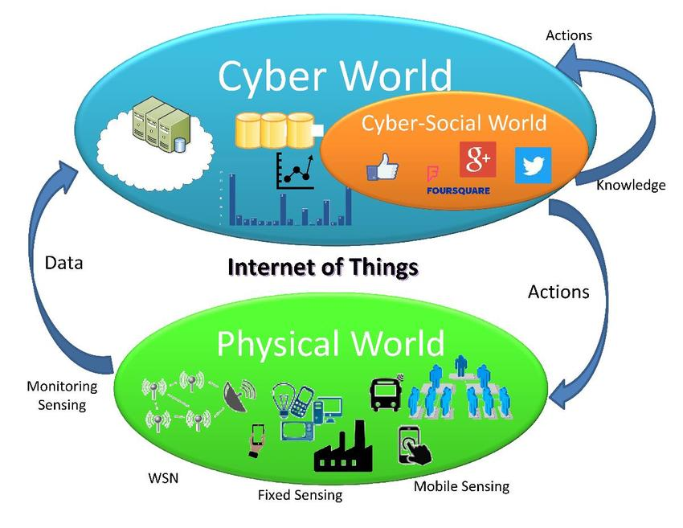

* Digital technology developed to the point where it became feasible to integrate it with the physical world - and economically viable

* And it enabled organizations and people to do things they had never been able to do before

Notes:

Image Credit: https://www.researchgate.net/

Those "things they could never do before" are what we will be talking about in the technology lessons.

---

## Wave 1: Digitization

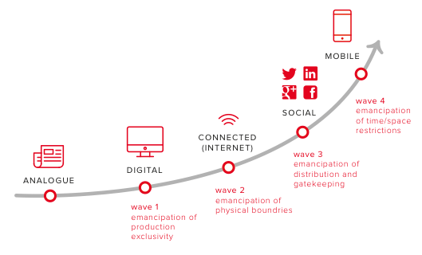

* The 4th revolution was enabled by a series of Waves

* The first was the transition from analogue information and data to digital form  

Notes:

Image Credit: https://www.digitaltransformationbook.com/

Without data, we can't have a digital age.  This is a critical first step.

---

## Wave 2: Connectivity

* The second wave was the establishment of networks to allow collection and sharing of data

* The Internet was a one of the main drivers of connectivity  

Notes:

Image Credit: https://www.digitaltransformationbook.com/

Once we have all of this data, the next step is to share it and make it accessible. The Internet is historically a main driver, but this was happening with many different networks developing in the 1980s and 1990s -- the Internet just sort of swallowed them all up.  But it would have still happened even without the Internet.

---

## Wave 3: Adoption

* The third was the adoption by users of the interconnected and digital world

* Driven by social networking, mobile apps, e-commerce and other applications

* This was the steep adoption curve we saw in the first lesson

Notes:

Image Credit: https://www.digitaltransformationbook.com/

This is the critical step -- until there was adoption by society of the interconnected digital world, it would never have become disruptive

---

## Wave 4: Cyber-Physical Integration

* We are in the fourth wave - the merging of the physical and digital

* It's ubiquitous and real time -- AI, VR, mobile tech, etc

Notes:

Image Credit: https://www.digitaltransformationbook.com/

The liberation of space means that we can connect anywhere and the liberation of time means we don't have to wait -- it's all in real time.

---

## How Fast?

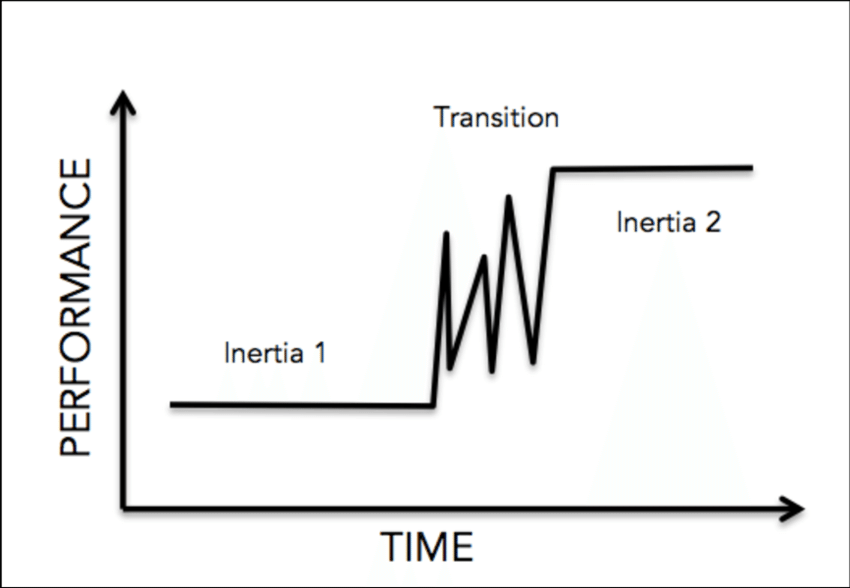

* Social transformations are not slow and gradual but follow a punctuated equilibrium model

* Changes slowly accumulate building up tension and stress, then there is a period of explosive and chaotic change as the transformed society emerges

Notes:

Image Credit:  https://www.researchgate.net/

The point to this is to press home the urgency of responding to the changes that are taking place.  The punctuated equilibrium model is well attested in social changes and is one of the main models to explain revolutions etc.

Everyone is familiar with this model.  Like when a couple is having marital problems and things build until they finally explode, and the outcome of that explosion may be radical new form or the relationship or the end of it. Nothing esoteric here.

---

## Where are We Now?

* We are in the transition phase

* But we are able to make good estimates of what is to come

Notes:

Image Credit:  https://www.researchgate.net/

---

## Where are We Going?

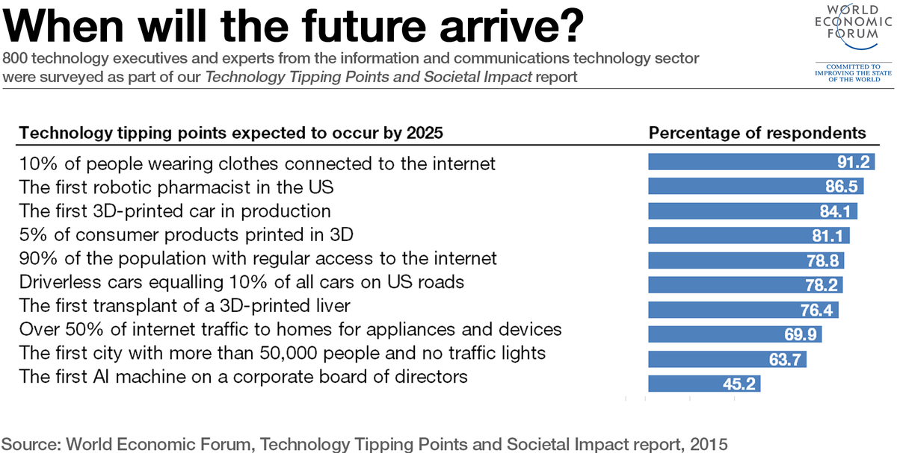

Notes:

Image Credit: https://www.weforum.org/agenda/2015/11/what-a-smart-fridge-tells-us-about-the-fourth-industrial-revolution

The interesting fact to point out is that most of these are cyber-physical technologies.

---

## Some Projections
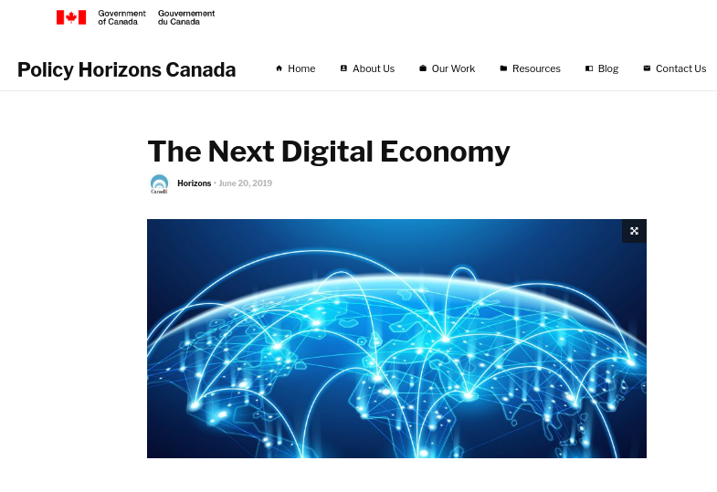

* A representative projection: there are many similar analyses

* Eight maturing technologies are identified that are changing the economy

Notes:

From the Canadian Government report https://horizons.gc.ca/en/2019/06/20/the-next-digital-economy/

---

## #1 The Internet of things
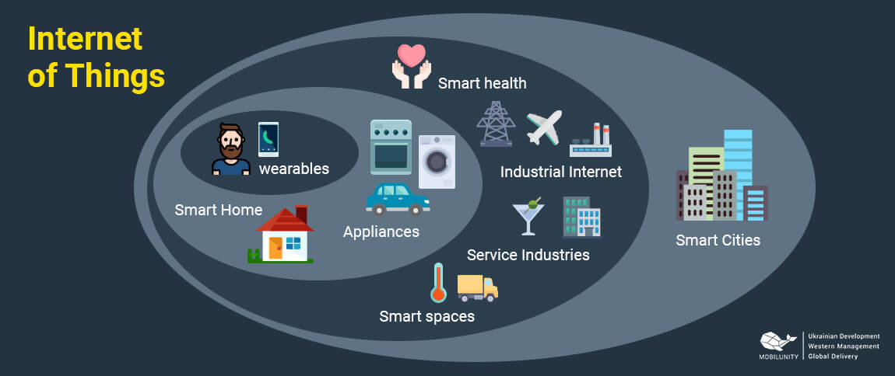

> The Internet of Things  will collect vast amounts of data and bring it to bear on the physical world.

Notes:

Image Credit: https://internetofthingswiki.com/
All quotes taken from the Canadian Horizon Study

---

## #2 AI and Automated Cognition

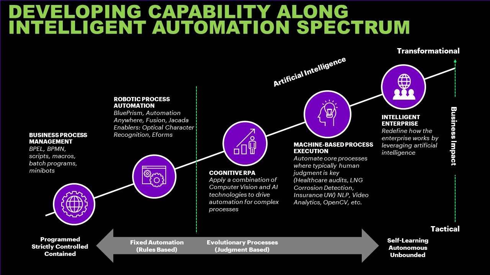

>  Artificial intelligence (AI) and automated cognitive tasks will introduce new economic actors.

Notes:

Image Credit: https://www.accenture.com/us-en/blogs/blogs-better-with-bots

---

## #3 Robotics

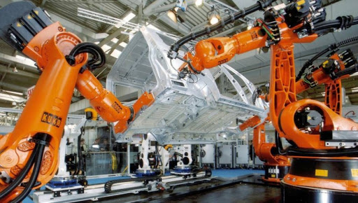

>  Robotics will perform physical labour and provide an embodied platform for AI.

Notes:

Image Credit: http://tadviser.com/index.php/Article:Industrial_robots

---

## #4 Advanced Telepresence

>  Advanced telepresence will allow us to project ourselves and our expertise anywhere in the world that is connected to networks

Notes:

Image Credit: https://www.therobotreport.com/ava-telepresence-robot-autonomously-navigates/

---

## #5 Virtual Reality

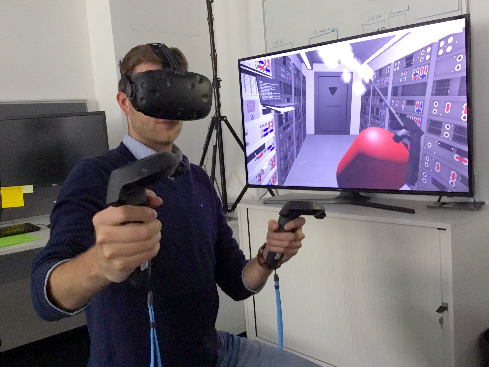

>  Virtual reality will offer immersive non-physical worlds, while mixed reality will combine physical and virtual worlds, creating a third space distinct from both.

Notes:

Image Credit:https://en.wikipedia.org/wiki/Virtual_reality

---

## #6 Advanced Materials

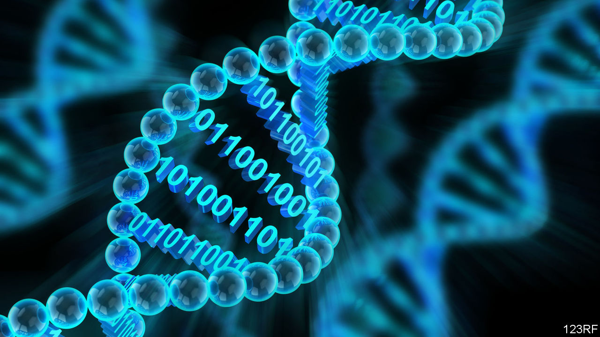

>  Advanced materials are enabling the production of micro- and nanoscale devices that can bring digitization to many new areas at low power.

Notes:

Image Credit: https://www.economist.com/science-and-technology/2018/10/20/dna-may-soon-be-used-to-store-computer-data

---

## #7 Decentralized Production

>  Decentralized production technologies such as 3D printing could use locally available inputs, including new biomaterials, to manufacture countless products on demand for local markets.

Notes:

Image Credit: https://www.youtube.com/watch?v=wCzS2FZoB-I

---

## #8 Blockchain

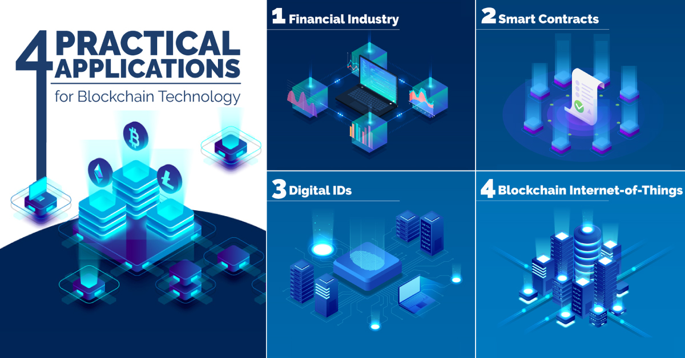

> Blockchain technologies create unique, non-copyable digital assets. This enables secure, low-cost transactions between parties who do not know each other.

Notes:

Image Credit: https://www.visualcapitalist.com/exploring-the-practical-applications-of-blockchain-technology/

---

## It's Here

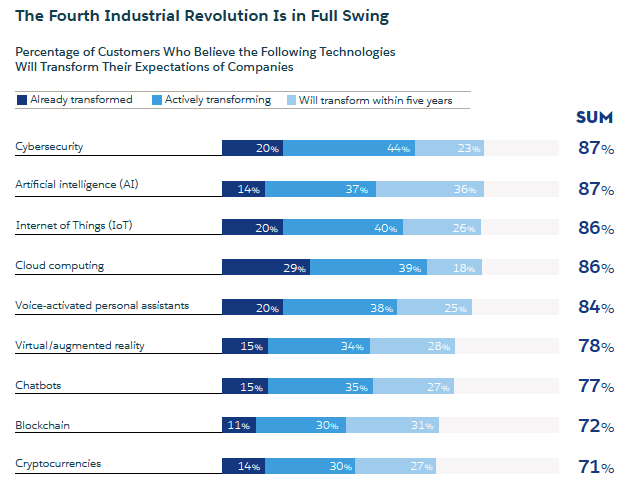

* The 4th Industrial Revolution is not coming, it's already happening right now

Notes:

Image Credit: https://www.salesforce.com/blog/2018/12/what-is-the-fourth-industrial-revolution-4IR.html

---

## The Increasing Rate of Change

* The rate at which the transition is happening is increasing exponentially

Notes:

Image Credit: https://crossingzebras.com/the-turn-of-the-tide/

---

   

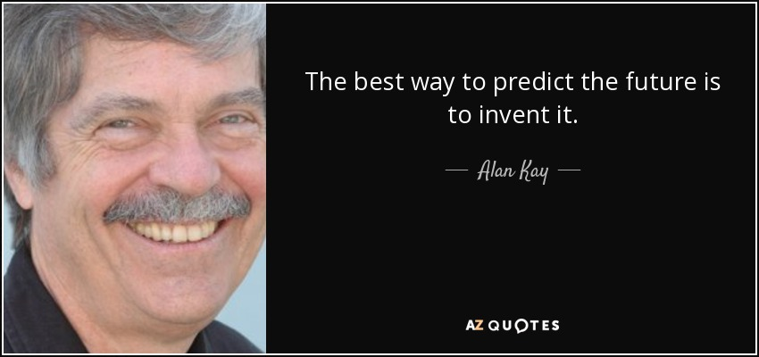

Notes:

Alan Kay is the inventor of SmallTalk and created the term "Object Oriented Programming"
