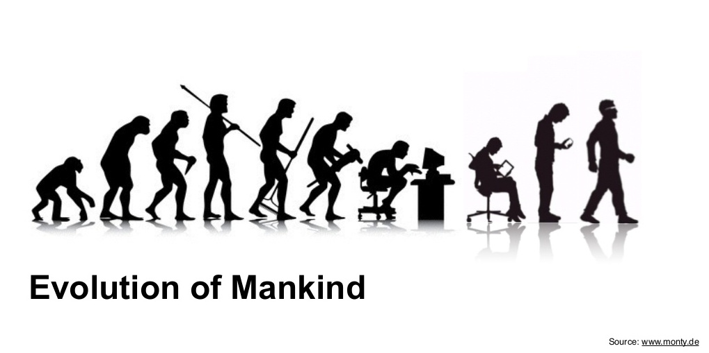
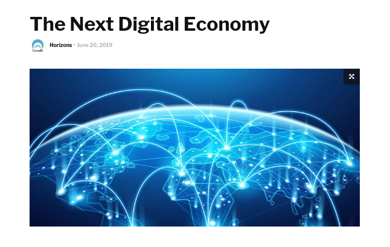
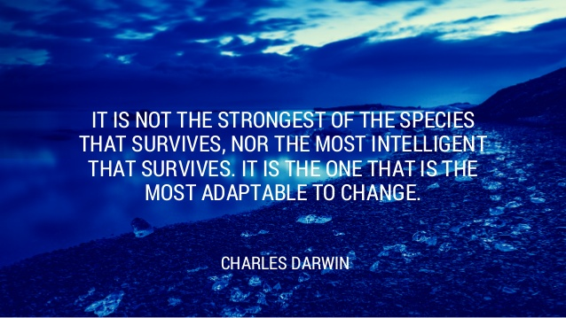

# Driving a Digital Culture and Mindset

Notes:
This module's original title is a bit ambiguous so there are two main sections in this lesson.  The first is a high level look at the social and economic impact that the digital transformation is having, and the second is a look at how we adapt to those changes both at a personal and organizational level.

---

## Lesson objectives

* Left for later

---

## Digital Transformation Impact

* The new digital economy changes how we work and live

Notes:

Image Credit: https://www.slideshare.net/montymetzger/the-future-of-digital-health/23-2014_Ahead_of_Time_GmbHAhead

I think this image is quite cook because it does recap all the great transformations

---

## Projected Changes

* There are a number of significant changes already taking place that will continue to grow and accelerate

* These are the changes that will affect businesses, markets and society

Notes:

From the Canadian Government report https://horizons.gc.ca/en/2019/06/20/the-next-digital-economy/

The next few slides on "Changes" transitions the presentation from talking about what the digital transformation is to what the impacts are it is having. Not "Will have" but "is having" because we can see these changes happening right now.  Some have been underway for years in one form or another.

---

## Changes to Jobs  

* Cognitive and physical labor is unbundled and networked

>‘Old-fashioned’ jobs are unbundled into tasks, many of which can be automated. Others are available as an on-demand service on tasking platforms.

Notes:

This has already happened and is often referred to as the "gig economy".  One of the negative impacts this has had is an erosion of the earning power of workers, however this is not a result of unbundling per se but rather an example of where regulatory frameworks have not responded yet to the prevent the exploitation of gig workers.

However it is unlikely that we will ever return to the traditional employment model and this sort of unbundling will continue, especially when we couple this with changes to where work happens.

---
## Changes to Manufacturing

* Manufacturing and distribution are automated and multifunctional

>Multipurpose machines – such as 3D printers that can use many materials – produce a wide range of goods by simply adjusting the digital programming. These manufacturing centers replace many individual single purpose-built factories. They are widely distributed, and production can occur wherever standard materials are available. Efficient and largely automated logistics services could get materials to manufacturing sites and deliver products to end users.

Notes:

This has incredible implications for the entire economy, a large section of which is built around servicing supply chains, from transportation to warehousing etc.

For example, consider the entire infrastructure that was in place to support horses as transportation prior to the car.  That entire segment of the economy was decimated.

---

## Changes to Resources

* Some raw materials, as well as some complex organic products, can be grown almost anywhere using synthetic biology

>Pulp is produced without forests, meat without animals and pasture, and combustible fuels without wells or mining.

Notes:

As costs come down, this again threatens entire resource based economies, however it also has created a demand for other resources that are used as the inputs to they synthetic processes.  In other words, we are not eliminating the need for resources but rather the type or resources in demand.  

Again, think of the resources that were in demand when the horse was the dominant means of transportation versus now when the car is.

---

## Changes to Where Work Happens

*  Knowledgeable workers or machines operate remotely anywhere in the physical world

> This is done by teleoperation of a machine or remote guidance of a person connected through a mixed reality device anywhere that is connected to networks.

Notes:

This has already happened.  Outsourcing work becomes increasingly attractive as teleoperation become economically viable.

---

## Changes to Markets

* Economies of scale give way to economies of scope

>Instead of focusing on specialized production at scale, new strategies are emerging that build value by offering a broad range of goods and services where, when, and how they are needed.

Notes:

Starting to happen more as the costs of 3d printing and other technologies are dropping dramatically.

---

## Changes to Products

* Standard goods and services are replaced by customized offerings

>Customization is achieved at little or no additional cost. Locally printed customized objects can compete on price with batch-produced ones. They use less material, perform to the user’s specifications, and decrease the need for warehousing and long-distance transportation.

Notes:

Studies show that consumers prefer to have more control and input in the products they buy, such as customization. At the business level, this is mastered by customizing marketing using big data and micro-targeting of ads to individuals.

---

## Changes in Business Models

* Value chains are more ephemeral

>Customized products require short production runs. As the cost of customization decreases, specific value chains for producing goods and services might become very short-lived. Individual consumer preferences could draw customized value chains into being.

Notes:

This is also a direct result of those faster rates of adoption. The converse to this is that the faster things are adopted, the faster the things they replace become obsolete and unprofitable.  This is where market forces actually force business to shift to customized offerings in order to avoid investing in quickly obsolescent products.

---

## Change in Workforce

* AI replaces human intermediaries

> All transactions in the networks generate data that can help train AI applications. As they improve, consumer and supplier AIs take over many aspects of the research, advice, design, marketing, and decision-making roles currently played by humans.

Notes:

More likely to happen in the 80% of routine interactions that are relatively standardized and predictable.  A high percentage of work people do is routine "grunt" work so that we often hear sentiments like "A trained monkey could do my job."

---

## Changes in Production Costs

* Production costs are lower due to a combination of factors

>More goods and services are purely digital, and many others have a growing digital component. The value of digital portions of these products and services can be replicated at low – or even zero – marginal cost. Automation is also inexpensive, and the replacement of human labor by machines offers greater production efficiency.

Notes:

This is often overlooked but as functionality is migrated to the digital aspects of a product, the costs go down.

---

## Winners and Losers

* The digital transformation has produced a series of challenges for business and individuals

* Many businesses are failing because they are not responding to the challenges of the new economy

* The winners will be those organizations and individuals who do adapt successfully

* New businesses that exploit the new economy are becoming very successful

Notes:

This is just a transitional slide to set up the next section.

---

## Challenge 1: Creative Destruction

* The Next Digital Economy may create a turbulent period of ‘creative destruction’ and fierce competition among firms

>Firms based on traditional models may struggle to survive as new entrants arise or move in from other sectors. Only a few firms might win big in this network-effect economy. In such a world, firms may avoid taking on future liabilities to stay nimble.

Notes:

This is also a reference back to punctuated equilibrium and the transitional period.

---

## Challenge 2: "On Demand"

* Firms transform to take advantage of low-friction access to on-demand labor and production resources

>Smart, agile, and virtual firms could be more successful and resilient in global on-demand value chains than larger, more capital-intensive traditional firms.

Notes:

Already happening with outsourcing, globalization and the gig economy.

---

## Challenge 3: Labor Markets

* Businesses could have fewer full-time personnel as they outsource many functions to online-sourced gig workers or to other specialized firm

>Some firms that perform routine services that can be handled entirely by AI could become largely automated with very few or even no workers.  This would significantly reduce labor costs for competitive advantage.

Notes:

Again, already happening.

---

## Challenge 4: In House AI

* Larger firms may have their own AI-driven platforms

>These would amass vast amounts of personal and business data that can be leveraged for competitive advantage.

Notes:

Again, already happening but note that there is some push against this as society become more aware of exactly how much data companies have on them and how unregulated this whole process is.

---

## Challenge 5: The Cloud

* Cloud based computing eliminates the need for capital investments i computing technology

>Software on the cloud could allow small- and medium-sized enterprises, micro-corporations, and entrepreneurs to contribute to new value chains that could be either standardized and ongoing or short-term and customized (even one-offs). These firms could also efficiently assemble their own value chains from on-demand online human and physical production resources distributed around the globe.

Notes:

---

## Challenge 6: Business Longevity

* Many firms may not be designed to persist and grow.

>With near-zero friction in bespoke value chains and relatively cheap replication or substitution of goods and services, some firms might be designed to last only a few weeks or months.

Notes:

This is a very interesting one because it challenges a lot of the accepted models of how business is done where companies were designed for longevity.  This has serious implications for the whole business infrastructure like law, accounting, finance, etc.

---

## Challenge 7: Blockchain and Smart Contracts

* Smart contracts and blockchain tracking may eliminate firms that are primarily intermediaries providing trust and payment systems

> Automating the whole system of contractual and financial transactions has a highly disruptive effect on whole industries from law to accounting to banking and financial services. Competition and data protection laws will have a profound effect on what business ecosystems and value-capture models will emerge in the Next Digital Economy.

Notes:

---

## Individual Challenges

* It's not just businesses but also individuals who will have to face challenges in the digital economy

Notes:

Image Credit: https://media.istockphoto.com

---

## Future Work

* AI and automation could reduce demand for existing human work long before these technologies replace entire jobs

* 'Centaur work' in which machines closely support – not replace – humans may change many workers’ experience

* Robot-centric workplace design makes it easier for robots but harder for humans to function  

* Where people work and earn may not be where they live and spend

* Both white- and blue-collar workers could find themselves in a global, competitive talent pool

Notes:

Not going into a lot of detail since it is pretty self explanatory at this point

---

## Future Work

* Increased demand for knowledge workers who can use digital tools

* Combined digital technologies could reduce the role of and need for human intermediaries

* Compensation for work could move from being time-based to task-based

* Traditional employee-employer relationships may be less common

* Increased wage polarization is likely

Notes:

The increased wage polarization means that those that have digital skills will do well while more traditional non-digital professions will not -- assembly line workers, manufacturing jobs, bookkeepers etc

We come back to these issues in the last module as we discuss how to respond to them.

---

##   

Notes:

---
