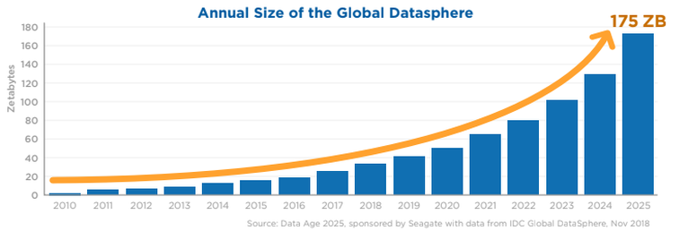
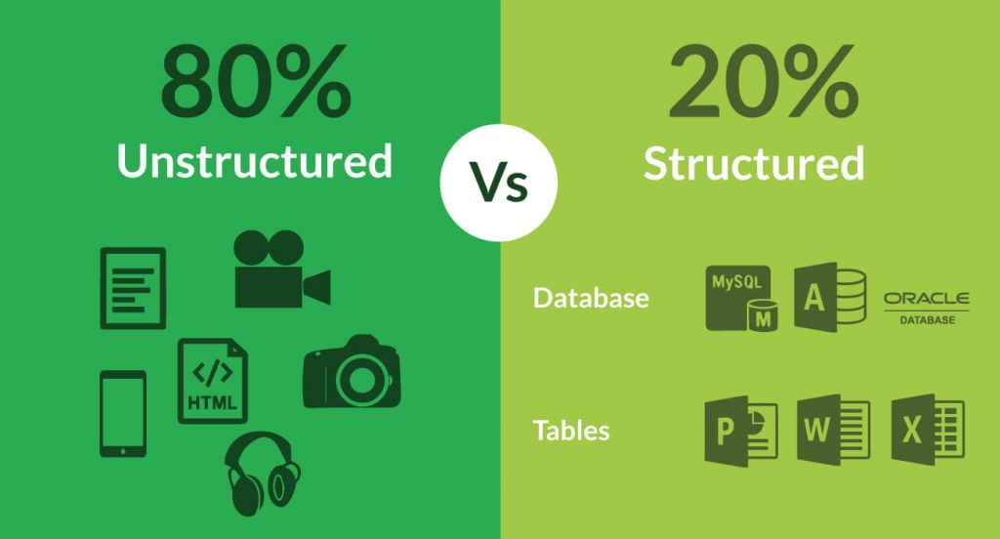
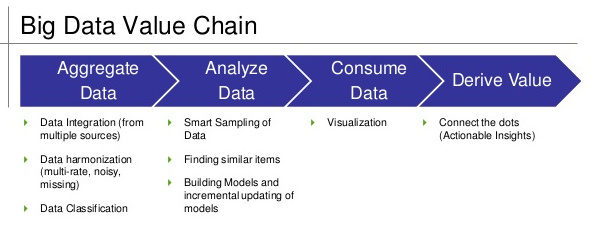
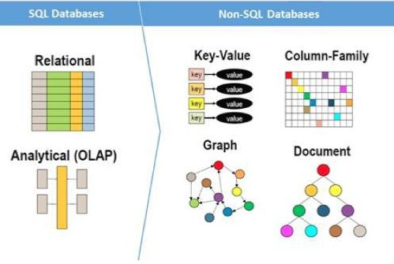
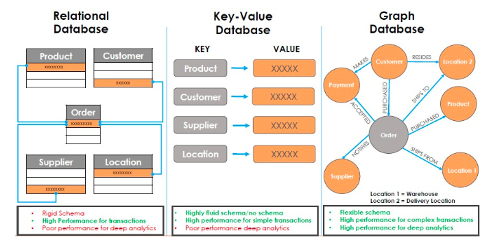
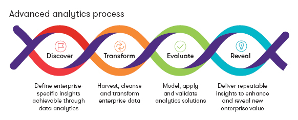
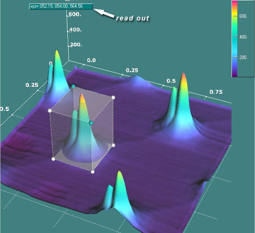
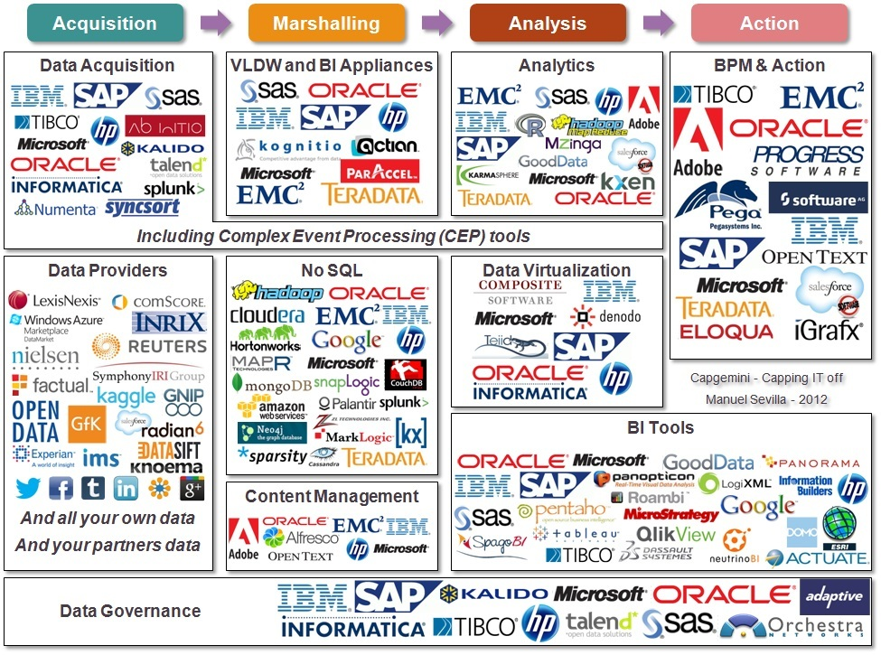
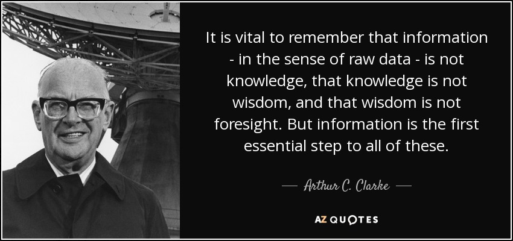

# Business Analytics and Big Data

Notes:

This lesson introduces the idea of big data and analytics, the specific technologies are not going into in detail since this would take longer than we have and it would also probably not be appropriate for this audience.

---

## Big Data

* Big data is the name for the explosion of _available_ digital data

* 175 Zettabytes is 175 trillion gigabytes

* Digitization and connectivity created Big Data

* Every activity in a digital world generates data which is captured, stored and can be potentially used

Notes:

Image Credit: https://www.zdnet.com/article/by-2025-nearly-30-percent-of-data-generated-will-be-real-time-idc-says/

Slide ties back to original thesis pointing out that Big Data would not be possible without the wave on digitization and the wave of connectivity

---

## The V's of Big Data  
 

 * Big Data is defined by a number of "V" characteristics.

 * The number of Vs cited ranges between 4-10

 Notes:

 Image Credit: https://www.kdnuggets.com/2017/05/must-know-common-data-quality-issues-big-data.html

I picked this 4V model since it seems to have that "value" component that is probably important for this audience.

---

##  Big Data - Volume

* Today there are 40 Zettabytes of data in the datasphere

* Every person currently creates 1.7 megabytes of data per second

* Internet users generate 2.5 quintillion bytes of data each day

* Every 2 days more data is created than all the years before 2003 combined

* 90% of all data was created within the last 2 years

* The amount of data stored by business doubles every year

Notes:

Source: https://techjury.net/stats-about/big-data-statistics/

Source: https://www.internetlivestats.com/one-second/

Just some "golly gee" numbers on how much data there actually is

---

## Big Data - Velocity
   

* Every second:
  - 972 Instagram photos uploaded
  - 8,857 tweets are sent
  - 4,438 Skype calls
  - 87.5 Terabytes of Internet traffic
  - 81,000 Google searches
  - 83,000 YouTube videos playing
  - 2.9 million emails sent

Notes:

Image Source: https://www.commondreams.org/views/2013/10/08/data-hackers-mining-your-information-big-brother

As opposed to volume which is data amount, this contrasts the rate at which data is created. Point to make is that this is created in real time

---

## Big Data - Velocity
   

* Precious slide does not include amounts of passive data collected like:

  - GPS location data
  - Data from devices like phones, cars, CCTV etc
  - Data from embedded sensors, monitors, etc
  - Transaction data, browsing history etc.

Notes:

Image Source: https://www.commondreams.org/views/2013/10/08/data-hackers-mining-your-information-big-brother

As opposed to volume which is data amount, this contrasts the rate at which data is created. Point to make is that this is created in real time

---

## Big Data - Variety

 

 * Most of the data nowadays is unstructured
  - Text, tweets, GPS data, clicks, videos, images, sensor data, etc.
  - Requires technologies like AI and Machine Learning to interpret and extract value from the data
  - Otherwise it is unusable

Notes:

Image Credit: https://ndimensionz.com/kb/volume-velocity-and-variety-three-vs-of-big-data-management/

A couple of points that can be made are that big data cannot be utilized unless you an process images, video, raw device data and the like.  This is one of those points of convergence that we spoke of earlier where innovations in different technologies conspire to help produce a revolution.

---

## Big Data - Value

 

 * Data is only useful when actionable information is extracted
  - Done by technologies like Machine Learning and Data Analytics

 * Big Data is concerned with acquiring, storing and managing all this data

Notes:

Image Credit: https://www.slideshare.net/shilpis6878/big-data-101-slide-share-121512

---

## Big Data Tools - Storage

* Hadoop is an example of a Big Data management tool

* Hadoop is actually a suite of tools to manage large amounts of distributed data and the whole Big Data process

Notes:

Image Credit: https://bloggingskg.blogspot.com/2019/01/big-data-analytics-tools.html

These three sides are a couple of examples of Big Data tools.  Since we have talked about the management of big data, there are a few examples of what we use to do that management.

---

## Big Data Tools - NoSql Databases

* NoSql databases, like MongoDB, are use to store unstructured data and documents

Notes:

Image Credit: https://bloggingskg.blogspot.com/2019/01/big-data-analytics-tools

---

## Big Data Tools - Graph Databases

* These databases store data about the relationships between things

* Much of Big Data is about how "things" are connected together

Notes:

Image Credit: researchgate.net

---

## Data Analytics

* Data Analytics is what we do with all that data

  - Analytics extracts usuable insights from the data
  - Analytics is a cover term for a number of related techiniques

Notes:

Image Credit: https://www.grantthornton.com/services/advisory/business-risk/data-analytics.aspx

Since time is limited, I think that the simple message is that analytics is just a collection of techniques we use to understand our data.  Data mining is also in this group but I didn't pull it out specifically.

---

## Types of Analtyics

* Analytics looks at the past to understand what happened and why

* Then applies those insights to predict what is likely to happen in the future based on what happened in the past

Notes:

Image Credit: https://www.clickz.com/how-can-ai-allow-marketers-to-predict-the-future/112268/gartner-analytic-ascendancy-model/

---

## Data Visualzation

* Data tends to be so complex that we often can only understand patterns and trends when we see them graphically

* This is called "data visualization" and is a critical part of analytics

Notes:

Image Credit: http://www.sciencegl.com/3Dsurf/Shots/screenShots.htm

---

## Data Analytics Tools

* There is a profusion of analytics tools, products, services and programming environments in use today

* Many organizations create their own analytics using libraries for R, Python and other programming languages

Notes:

Image Credit: https://www.houseofbots.com/news-detail/11466-1-top-10-data-&-analytics-technology-trends-for-2019-according-to-gartner-report

Not really time in the presentation to do the range of tools justice.. The graphic also includes a lot of other tools other than just analytics but I couldn't find one that just had analytics tools.

---

## Big Data Wins

* An early adopter of big data analytics, Amazon has a patent that allows them to ship goods before an order has even been placed (predictive analytics!)

* Recommendation system uses big data analytics to determine what a customer is likely to be genuinely interested in

* Used to create a very accurate profile of a customer's probable future behavior

Notes:

Source Credit: https://channels.theinnovationenterprise.com/articles/80-top-5-analytics-success-stories

This should be familiar to any students who have used Amazon

---

## Big Data Wins

* Nissan uses localized websites where they record what kinds of cars customers are looking at and querying about online.

* By analyzing these data points from individual customers, Nissan were able identify which vehicles were popular in specific regions

* Advertising campaigns and production could then be tailored to specific regions

Notes:

There is an old saying that 9 out of ten advertising dollars are wasted, but nobody knows which ones they are. This is the sort of cost issue that Nissan addressed.

---

## Big Data Wins

* FIFA World Cup Germany used analytics to win in 2014

* Opposing team and player performances were analyzed to identify ways to improve Germany's performance against them

* For example, using analytics, they cut down average possession time from 3.4 seconds to 1.1 seconds which was a critical difference in several wins

Notes:

Image Credit: https://www.britannica.com/topic/FIFA-World-Cup-2014-1993692

There are other examples of sports teams using analytics to improve performance

---

##   

Notes:
