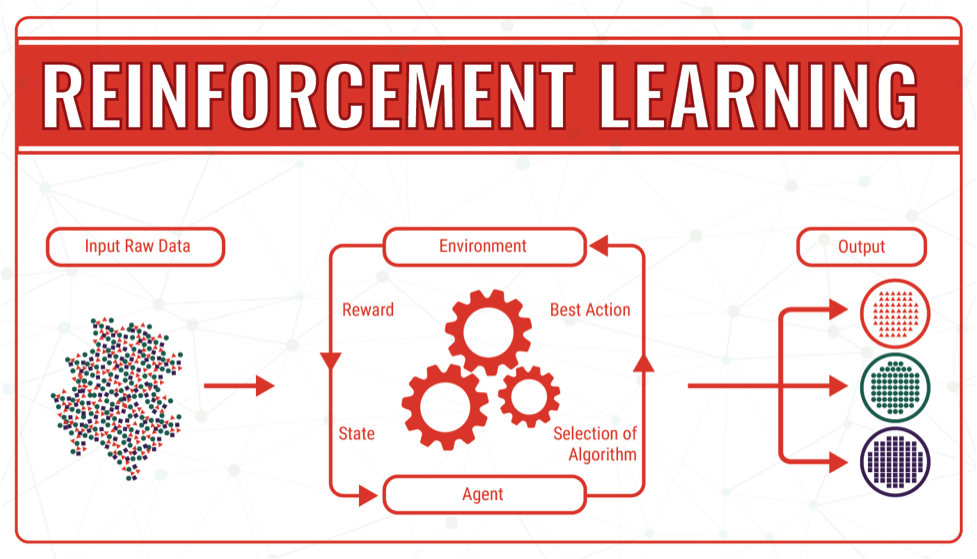

# Artificial Intelligence and Machine Learning

 Notes:

---

## Defining Artificial Intelligence

* AI is one of the fastest growing technologies in the digital transformation

* AI is a main driver of digital transformation

* AI is also the most misunderstood and unrealistically hyped of all the technologies

Notes:

Image Credit: https://i.ytimg.com/vi/kWmX3pd1f10/maxresdefault.jpg

---

## Defining Artificial Intelligence

Notes:

Image Credit: Rod Davison adapted from Norvig

This is the classic grouping of AI type systems that has been around since the early days.  Most of the students are probably associating AI with the systems on the left without often being aware of the applications on the right.

---

## Human Like AI Applications

* What most people think of as "AI"

* Interesting research is being done in these areas but there are few technologies in human like AI that have any current impact on digital transformation

* Human like AI is decades in the future

* One approach being explored is to "grow" AI to simulate human cognitive development

Notes:

Image Credit: https://memory-alpha.fandom.com/wiki/Data

There is a lot of interesting projects around trying to build human type AI by trying to duplicate biological maturation processes.  There have been some remarkable results but it is still in the research stage and unlikely to be commercial for some time.

---

## Where is the AI Market?

* The two right hand side quadrants account for almost all the AI applications in current use

* Machine Learning accounts for most of these applications

* The lower right quadrant is generally the integration of machine learning with other technologies such as robotics, process automation, 3d printing etc.

* Almost all digital transformation technologies rely on some form of machine learning

Notes:

---

## Bioneering

* Also called "Artificial Life" - copying natural algorithms to to build "intelligent" applications

* Slime mold is good at solving optimal path problems
  - In experiments, it produced a more efficient Tokyo subway plan than subway designers
  - These insights have led to the improvement in subway planning processes

* This area of AI is called "artificial life"
  - Solutions developed by natural systems are used as the basis for solving similar engineering and technology problems

Notes:

Image Credit: https://culturingscience.files.wordpress.com/2010/02/slime_mold_maps.jpg

---

## Swarming Robots

* Robot swarms are made up of a large number of low cost small robots that work together to accomplish tasks

* Derived from the study of swarming behavior of insects, birds and fish

* Display collaborative behavior but the technology still just starting to enter the marketplace

* Considered to be an area with many potential applications, cleaning up toxic spills or building swarms of nanobots for example

* A major area of research is using swarms of robots in 3d printing instead of monolithic printers

Notes:

Image Credit: https://newatlas.com/colias-swarm-robot/33897/

This is actually a very important area of research since there are many sorts of tasks that are difficult to accomplish except by using swarms

---

## Genetic Algorithms

* Genetic algorithms simulate the process of natural selection

* Used to generate high-quality solutions for optimization and search problems

* Best solutions or designs evolve over multiple generations of optimization

* The final result often is a solution a human would never come up with

Notes:

Image Credit: https://techeffigytutorials.blogspot.com/2015/02/the-genetic-algorithm-explained.html

This is often considered a form of machine Learning

---

## Genetically Designed Products

* Often produce totally novel and unexpected optimal solutions or designs

Notes:

Image Credit: https://www.newequipment.com/research-and-development/article/22059780/what-generative-design-is-and-why-its-the-future-of-manufacturing

---

## Machine Learning

* Definitely the major driving technology of digital transformation

* ML has explosive adoption rates across industries and in the Market

* ML powers or enables most of the other digital transformation technologies

Notes:

Image Credit: https://www.grandviewresearch.com/industry-analysis/machine-learning-market

---

## Types of Machine learning

* ML Applications are grouped into types based on the class of problems they solve

* Each type has specific algorithms and models optimized for the class of problems it is applied to

Notes:

Image Credit: https://nowenlightenme.com/2018/03/18/types-of-machine-learning/

---

## Reinforcement Learning

* An agent (robot for example) trying to achieve a goal
  - Takes an action
  - Receives feedback on whether the action moved it closer to its goal
  - Modifies its strategy accordingly according to the algorithm used

* Eventually the agent learns to reach its goal in an efficient manner

Notes:

Image Credit: https://bigdata-madesimple.com/machine-learning-explained-understanding-supervised-unsupervised-and-reinforcement-learning/

The overall approach is inspired by reinforcement learning, which was popularized by psychology in the 1970s.

---

## Reinforcement Learning

* Reinforcement learning is a critical part of autonomous agents like self-driving cars

Notes:

Image Credit: https://g.foolcdn.com/editorial/images/484538/self-driving-cars-getty.jpg

---

## Supervised Learning

* The ML algorithm is presented with sample input data labeled with the "correct" answers
  -  The algorithm creates a model that is optimized to predict the answers from the input data - this is called "training the model"
  -The model is then used to make predictions for new data in an operational environment

Notes:

Image Credit: https://bigdata-madesimple.com/machine-learning-explained-understanding-supervised-unsupervised-and-reinforcement-learning/

---

## Unsupervised Learning

* The ML algorithm is presented with sample input data without any correct answers provided
   - The algorithm creates a model that categorizes the data based on common features it discovers
   - The model is then used to make decisions for new data in an operational environment

Notes:

Image Credit:https://en.proft.me/media/science/ml_svlw.jpg

---

## Deep Learning

* Deep Learning is a set of ML techniques modeled after neural nets

* Neural nets were originally developed in the 1960s to try and simulate how human neurons worked

* The approach was revived and improved in the last number of years

Notes:

Image Credit:https://towardsdatascience.com/applied-deep-learning-part-1-artificial-neural-networks-d7834f67a4f6

---

## Deep Learning

* Deep Learning refers to neural nets with multiple hidden layers of neurons

* The more layers, the more powerful the net is, but the harder it is to train

* Deep learning algorithms can be used to improve the power of all the ML types of learning

Notes:

Image Credit:https://towardsdatascience.com/training-deep-neural-networks-9fdb1964b964

---

## Deep Learning

* There are different kind of neural nets classified by how they are organized and how the neurons interact

* Different types are suited for different sorts of problems, image recognition for example

Notes:

Image Credit:https://www.codeproject.com/Articles/1215045/Introduction-to-Artificial-Neural-Networks?display=Print

---

## ML Applications

Notes:

Image Credit: https://www.digitalpulse.pwc.com.au/

---

## ML Applications

Notes:

Image Credit: https://blog.aimultiple.com/marketing-analytics/

---

## ML Applications

* One major application is ML systems that can be trained to sort through medical images and identify possible pathologies

Notes:

Image Credit: https://www.digitalpulse.pwc.com.au/

---

## AI/ML Applications

* AI/ML applications are so pervasive now that you probably encounter many of them daily without realizing you are interacting with an AI application

Notes:

Image Credit: https://www.meee-services.com/what-are-the-top-ai-applications-in-2018/

---

## AI/ML Growth

* Like other digital technologies, AI is growing at an exponential rete, even more so than the other technologies

Notes:

Image Credit: https://www.meee-services.com/what-are-the-top-ai-applications-in-2018/

---

## AI/ML Adoption

* The adoption of other technologies is often the result of incorporating AI/ML into their operation

Notes:

Image Credit:https://www.pinterest.com/pin/763923155520647212/

---

##  

Notes:

Image Credit https://pt.slideshare.net/DatumLLC/top-10-quotes-about-artificial-intelligence/

---

##  

Notes:

Image Credit https://pt.slideshare.net/DatumLLC/top-10-quotes-about-artificial-intelligence/

---"
