# Blockchain and IoT

Notes:

---

## Blockchain

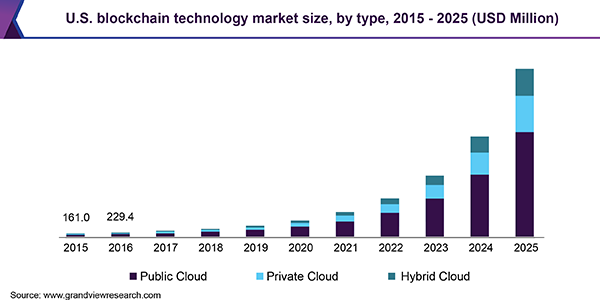

* BLockchain is a technology created by an anonymous developer to implement the Bitcoin crypto-currency

* However, Blockchain has many other important applications and the market for BLockchain technology is expanding rapidly   

Notes:
 Image Credit: https://www.grandviewresearch.com/static/img/research/us-blockchain-technology-market.png

---

## Defining Blockchain
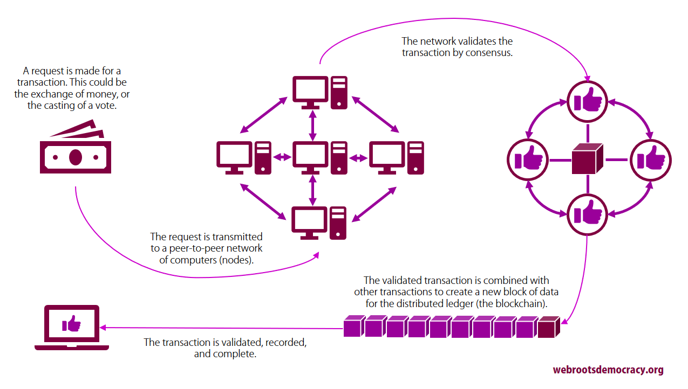

* Blockchain consists of:
  - A collection of peers or nodes
  - A cryptographically secure distributed ledger (the block chain)
  - A transaction validation algorithm

Notes:

Image Credit: https://webrootsdemocracy.files.wordpress.com/2017/12/blockchain-graphic-e1512661957968.png

---

## Blockchain Nodes
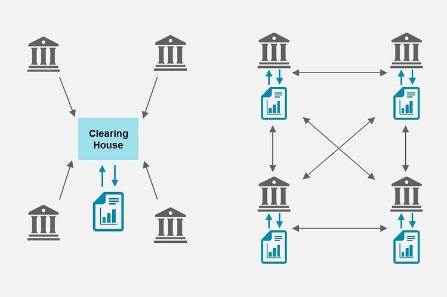

* The nodes can be any group concerned with a common interest
  - Institutions, banks, individuals, companies, etc

* The nodes are all "voting" members of that Blockchain
  - They collectively decide whether or not to allow new transactions to be added to the ledger

Notes:

Image Credit: https://blogs.wsj.com/cio/2016/02/02/cio-explainer-what-is-blockchain/

---

## Blockchain Ledger
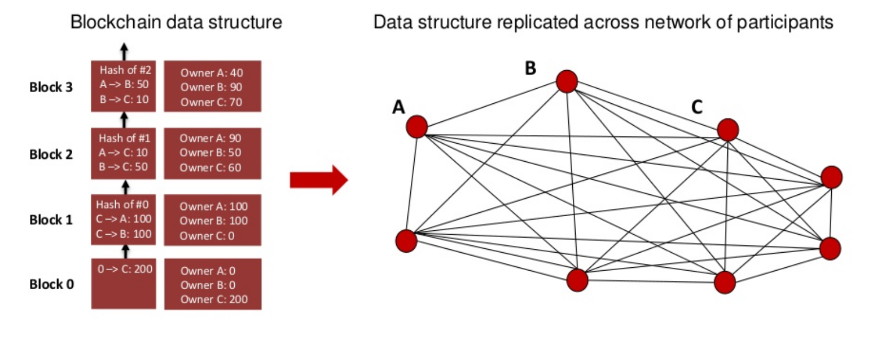

* The ledger (the Blockchain) is secure
  - Transactions cannot be altered once they are added
  - Each transaction is cryptographically integrated with previous transactions
  - Every participant has a copy of the ledger

Notes:

Image Credit: https://www.slideshare.net/arcatomia/anatomy-of-a-blockchain

---

## Blockchain Transaction

* A transaction is requested
  - The transaction is voted on by all of the peer nodes
  - Shared algorithms determine who can vote and how to validate a transaction
  - If validated, then the transaction is integrated into the Blockchain ledger

Notes:

Image Credit: https://webrootsdemocracy.files.wordpress.com/2017/12/blockchain-graphic-e1512661957968.png

---

## Smart Contracts

* Smart contracts are self executing contracts
  - The terms are written into a Blockchain
  - The computer code necessary to execute the contract is also part of the Blockchain
  - When the triggering event for the contract occurs, the contract executes

* Contract cannot be altered after being created, and a permanent record is kept

Notes:

---

## Blockchain Applications
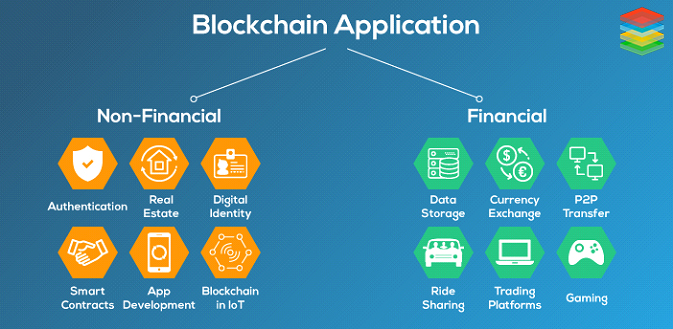

* Blockchain can be used anywhere that a secure transaction or authentication is needed

* Has the potential to revolutionize
  - Financial transactions of all types
  - Contract enforcement
  - Regulatory compliance
  - Intellectual and other property rights
  - Any system based on transactions

Notes:

Image Credit: https://www.xenonstack.com/blog/decentralized-applications/

---

## Blockchain as Disruptor
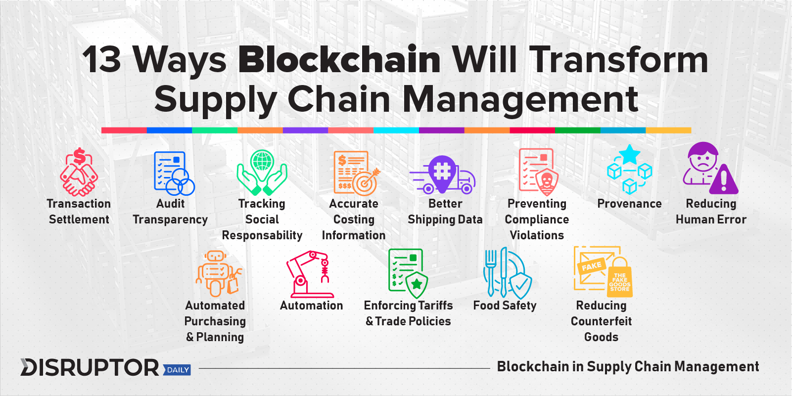

* One example of a segment of the economy that is being disrupted by Blockchain

Notes:

Image Credit:  https://www.disruptordaily.com/blockchain-use-cases-supply-chain-management/

The implications of BlockChain replacing the supply chain mechanisms are quite staggering

---

## Car Leasing

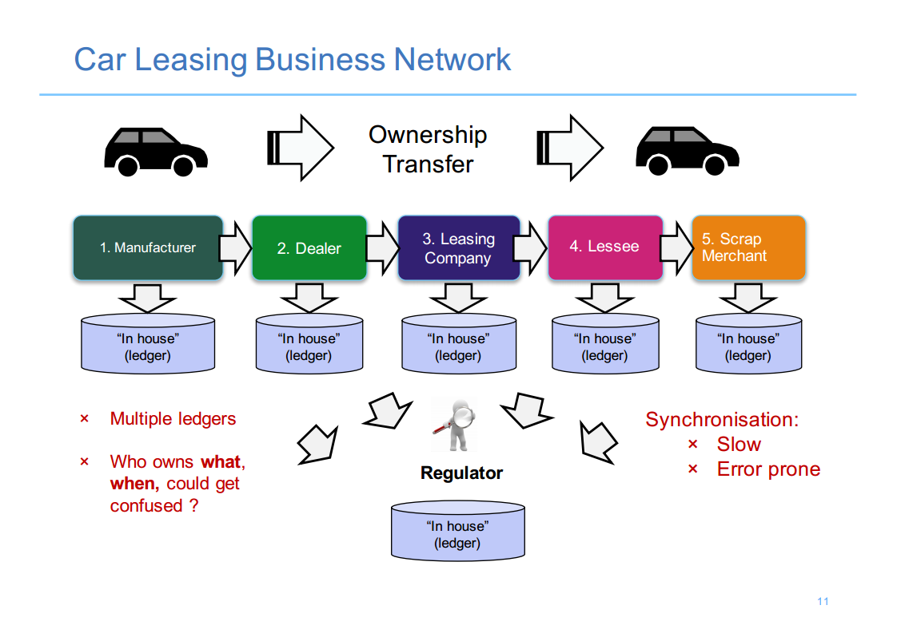

* Existing model - multiple parties with their own records
  - System is disjointed and requires constant reconciliation

Notes:

Image Credit: https://www.altoros.com/blog/the-difference-with-blockchain/

---

## Car Leasing

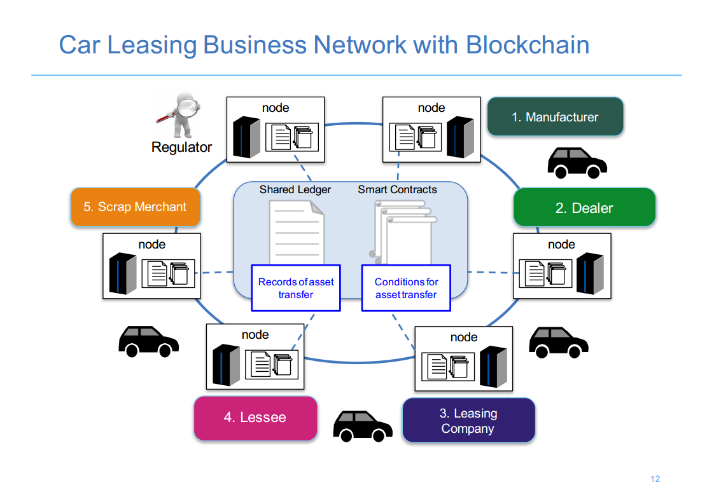

* Commonly held data, reduced risk, increased efficiency and smart contracts

Notes:

Image Credit: https://www.altoros.com/blog/the-difference-with-blockchain/

---

##  

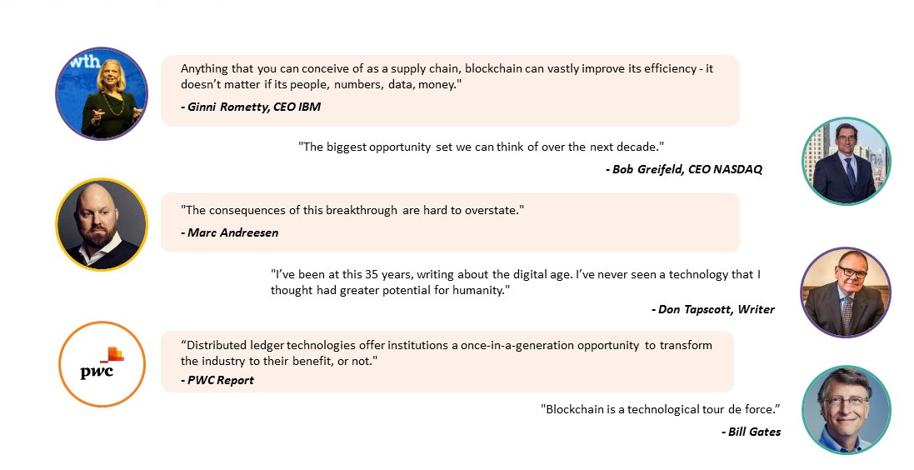

Notes:

Image Credit: https://www.kryptographe.com/blockchain-quotes-from-successful-leaders/

---

## Internet of Things (IoT)
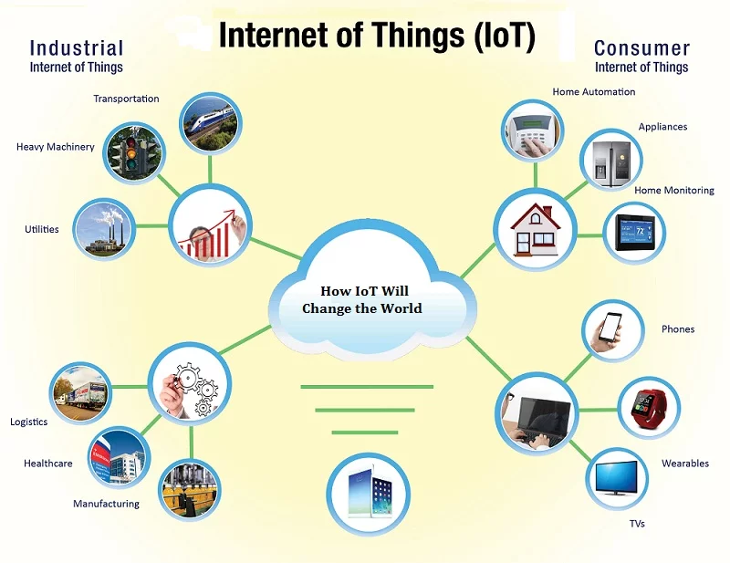

* The Internet first wave connected people and their applications

* The IoT is the Internet second wave: connecting "things"

Notes:

Image Credit: https://pioneerserviceinc.com/the-industrial-internet-of-things-iiot-and-what-it-means-to-precision-machining/

---

## Internet of Things (IoT)
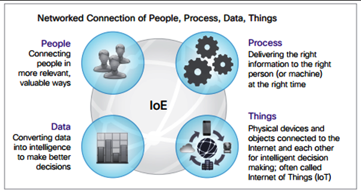

* Eliminates need for human intermediaries in automation

* Allows the direct interaction of devices indifferent locations

* Allows real time data collection about the real world to enable real time responses

* Connects data, devices, people and processing power

Notes:

Image Credit: https://virtualhrd.wordpress.com/2014/04/12/whats-the-internet-of-everything/

---

## Smart Cities
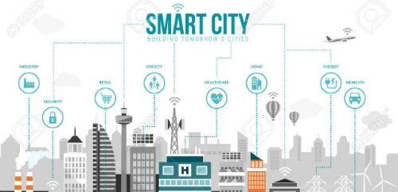

* Different types of IoT sensors collect data from multiple sources
  - cell phones, traffic cameras, sensors etc

* Data analytics produces insights to manage resources and services efficiently
  - Automated resources are issued instructions (changing traffic light timing for example)

Notes:

Image Credit: https://www.arcweb.com/industries/smart-cities

---

## Smart Cities - Amsterdam

* Smart city initiative started in 2009

* 170+ collaborative projects involving citizens, businesses and government
  - Smart traffic management
  - Intelligent street lighting
  - Smart energy meters to reduce consumption

Notes:

Image Credit: By Massimo Catarinella - Own work, CC BY-SA 3.0, https://commons.wikimedia.org/w/index.php?curid=4553808

---

## IoT in Industry

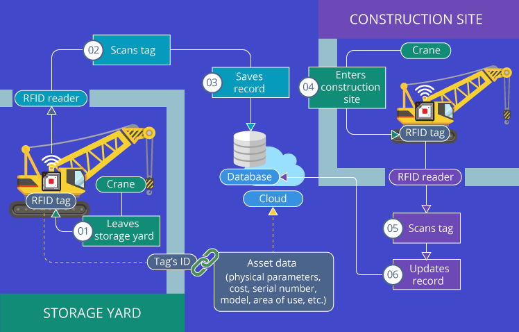

* Integration of sensors, smart tags, data analytics and device control

* Allows for more efficient manufacturing and other industrial processes

Notes:

Image Credit:https://www.scnsoft.com/blog/iot-in-manufacturing

This and the two slide following are just some use cases for IoT.  The topic is really far too big and far reaching for us to go into depth

---

## IoT in Industry

* Better quality control, response to incidents and fine tuning of operations

Notes:

Image Credit:https://www.scnsoft.com/blog/iot-in-manufacturing

---
## IoT in Industry

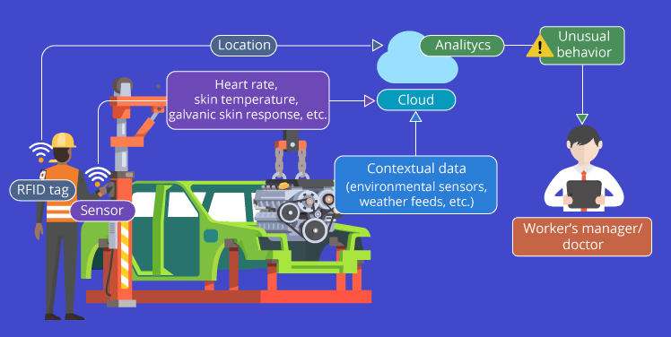

* Use of "wearables" allows immediate response to people in trouble or medical trouble

Notes:

Image Credit:https://www.scnsoft.com/blog/iot-in-manufacturing

---

## IoT Adoption

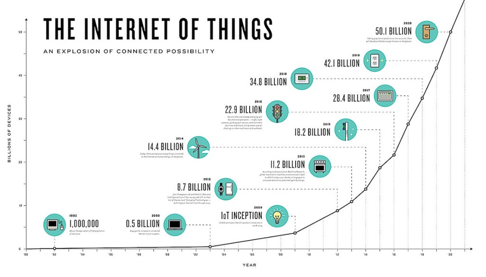

* The rate of growth of adoption is exponential

Notes:

Image Credit: https://hackernoon.com/internet-of-everything-the-iot-market-is-projected-to-expand-12x-from-2017-2023-175f845c2bcf

---

## IoT Adoption

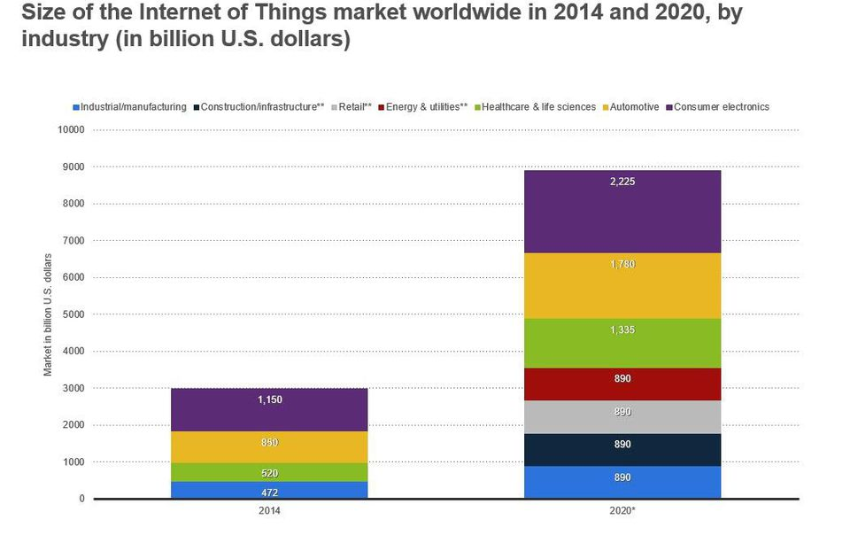

* The market for Iot is also growing exponentially

Notes:

Image Credit: https://www.forbes.com/sites/louiscolumbus/2017/12/10/2017-roundup-of-internet-of-things-forecasts/#53a07a5b1480

---

##  

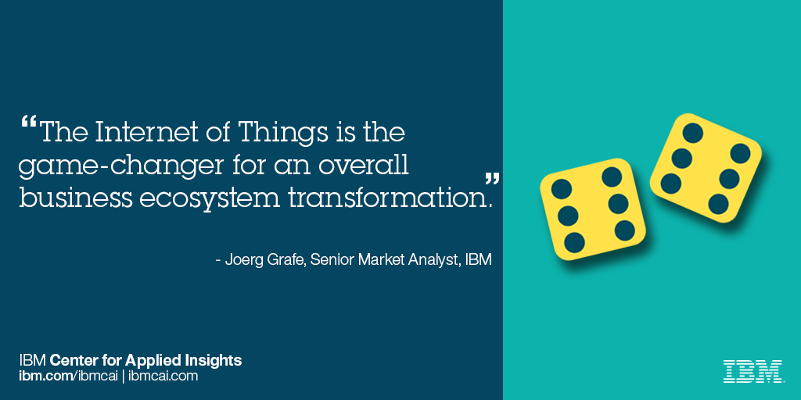

Notes:

Image Credit: https://ibmcai.wordpress.com/2016/01/26/internet-of-things-and-industrie-4-0-a-chat-with-two-ibm-experts/

---

##  

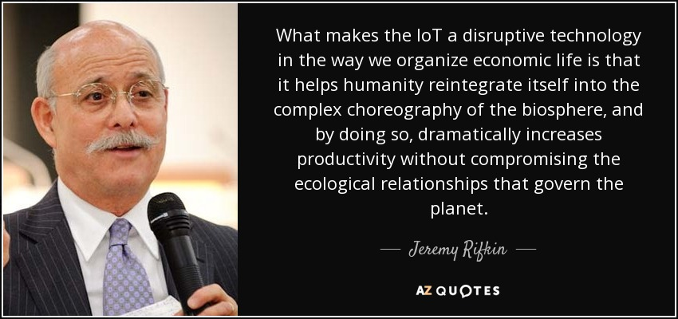

Notes:

Image Credit: https://www.azquotes.com/quote/604641

---
