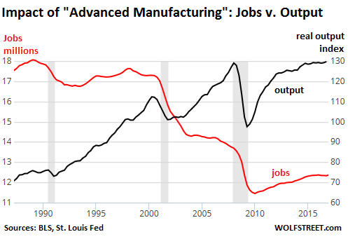

# Robotics Process Automation

Notes:

I took a few liberties with this and expanded the topic to more of a hyper-automation presentation.  That seems to be the hot topic nowadays.

---

## Classical Robotics

* Industrial robots automate repetitive physical tasks

* Industrial robots have been growing in use for decades

Notes:

Image Credit: http://assets.nydailynews.com/polopoly_fs/1.3816209.1518468946!/img/httpImage/image.jpg_gen/derivatives/article_750/ford-assembly-line-yellow-robots.jpg

---

## Industrial Automation

* Use of industrial robots has increased manufacturing output but eliminated manufacturing jobs

* Assembly line workers are going extinct

Notes:

Image Credit: https://wolfstreet.com/2017/05/04/apple-ceo-vows-to-bring-manufacturing-back-to-the-us-robots-to-fill-most-of-the-jobs/

The drop in output in 2008 is due to the effect of the great recession and was not something specific to manufacturing.  Although note that while the output has recovered, the number of jobs has not.  Experts predict RPA will have the same efect on office workers.

---

## Process Automation

* "Computerized Robots" means software that can perform tasks, not actual physical robots

Notes:

Image Credit: https://blog.aimultiple.com/what-is-robotic-process-automation/

Conceptually, the term robotic seem to give people the impression there are discrete  virtual entities doing the work that are just like real physical robots.  Robotic here refers to the repetitive nature of the work.  Read it as "the automation of robotic and monotonous processes" rather than "robots created for automating processes"

---

## Process Automation

* RPA is the knowledge work equivalent to using industrial robots

Notes:

Image Credit: https://blog.aimultiple.com/what-is-robotic-process-automation/

---

## Task Automation

* RPA can automate the routine and rote parts of a process allowing a worker to focus on the non routine tasks or those requiring judgment

Notes:

Image Credit: https://static01.m-square.com.au/wp-content/uploads/2017/11/robotic-process-automation-1.jpg

FTE = full time employed, POC = proof of concept, AHT = average handling time

---

## Creating RPA

* RPA involves recording the steps of the process, often by recording with software, then automating the process as executable software

* Once tested, the RPA software is integrated into the existing environment

Notes:

Image Credit: https://www.flynetviewer.com/content/robotic-process-automation

Recording software that captures the interactions with a user and in interface screen is often used -- called "screen scraping". In this example, the RPA is delpoyed as a web service, an common way of deploying RPAs

---

## Full RPA

* Often the distinction is made between task automation - the scripting of routine tasks in a process, and the full automation of the whole process

Notes:

Image Credit: https://www.flynetviewer.com/content/robotic-process-automation

---

## Hyper Automation

* Hyper automation is the term given to integrating AI, Virtual Reality, IoT and other technologies to produce advanced process robots.

* The "autonomous" solutions envisioned for the future not only automate a process but improve it based on experience, as well as developing new processes on their own

Notes:

Image Credit: https://tofasakademi.com/tr/robotic-process-automation-rpa-past-present-and-future/

---

## RPA Benefits

* Automated tools don't get bored, tired, distracted or or make random errors

* Employees generally appreciate not having to do tedious work

Notes:

Image Credit: https://www.laserfiche.com/ecmblog/what-is-robotic-process-automation-rpa/

---

## RPA ROI

* RPA demonstrates real savings and increases in productivity

Notes:

Image Credit: https://blog.aimultiple.com/robotic-process-automation-use-cases/

The slide says "if successful."  Very often RPA fails for a variety of reasons: the process was broken to begin with, the automated process is not actually want people do, the automation was done poorly, etc.

---

## RPA ROI

* RPA is showing significant return on investment which means as that adoption will continue to grow

Notes:

Image Credit: https://www.slideshare.net/suhasd/digital-transformation-strategy-artefacts-health-insurance-173638734

---
## RPA Growth

* The market shows exponential growth well into the near future

Notes:

Image Credit: https://tractica.omdia.com/newsroom/press-releases/robotic-process-automation-market-to-reach-5-1-billion-by-2025/?utm_content=buffercb22e&utm_medium=social&utm_source=twitter.com&utm_campaign=buffer

---

## RPA Future

* RPA is the starting point of the development of automated cognition once it is fully integrated with other technologies like AI and IoT

Notes:

Image Credit: https://medium.com/the-future-of-financial-services/the-fourth-industrial-revolution-cognitive-and-the-future-of-work-c07d4425c24f

---

##  

* RPA is the starting point of the development of automated cognition once it is fully integrated with other technologies like AI and IoT

Notes:

Image Credit: https://blog.walkme.com/robotic-process-automation/

---
