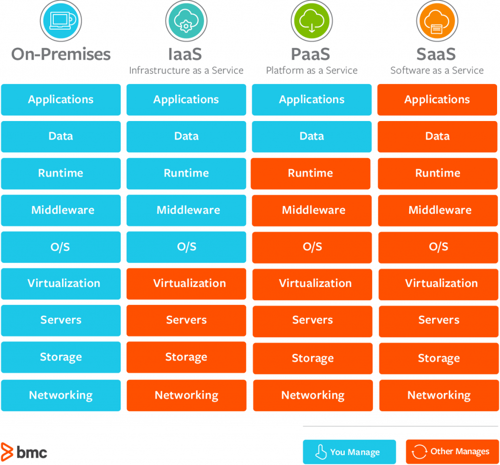
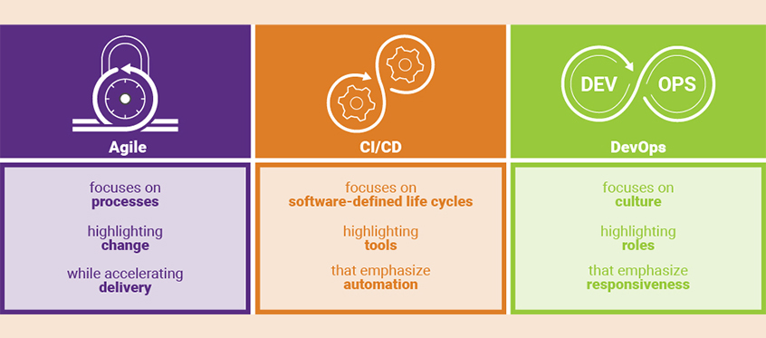

# Cloud and DevOps

---

## Cloud Computing

* Cloud computing refers to the use of the Internet or other remote services to performtasks that would otherwise be done on local computing resources

* Generic cloud computing can refer to any network, like a corporate network

* But now it usually refers to using a cloud service provider to provide remote computing

* Cloud services are generally dominated by large companies

Notes:

Image Credit: https://www.365tech.ca/the-pros-and-cons-of-using-the-cloud/

---

## Cloud Providers

* Large companies are often the only ones that have the resources to invest in large scale hardware data centers and server farms needed to host cloud computing

* Amazon, Microsoft and Google have traditionally been dominant

Notes:

Image Credit: https://www.pinterest.com/pin/486740672199867328/

---

## Cloud Providers

* Other measures put Microsoft ahead but the market is dominated by Amazon AWS and Microsoft Azure

Notes:

Image Credit: https://techblog.comsoc.org/2019/02/05/synergy-research-cloud-service-provider-rankings/

---

## Physical Sites

 * Cloud providers maintain a large number of geographically dispersed computing zones or regions

 * Each region often has multiple physically independent data centers - called "availability zones" in AWS (shown in map)

Notes:

Image Credit: https://lotops.com/wp-content/uploads/2018/07/aws-regions-560x298.png

---

## Site Transparency

* Generally where your services are hosted in a region is up to the provider

* Customers select regions often based on national regulatory compliance requirements (Azure regions show in map)

Notes:

Image Credit: https://theflyingmaverick.com/2018/04/29/know-your-azure-regions-and-locations/

Recall here that the services physically hosted in a country are subject to the laws of that country

---
## Data Center

* A typical cloud data center and server farm

Notes:

Image Credit: https://www.hoststar.ch/sites/default/files/Infra-1.jpg

Not sure whose it is

---

## Services Offered

* There are three levels of how much a customer can host in the cloud

* On-Premises means no cloud computing, SaaS means everything is in the cloud

Notes:

Image Credit: https://www.bmc.com/blogs/saas-vs-paas-vs-iaas-whats-the-difference-and-how-to-choose/

---

## Pizza Analogy

* The levels of service are familiar in other contexts

Notes:

Image Credit:

---

## Cloud Models

* Public cloud means that you are sharing resources with other customers
  - But each customer's resources are isolated from others while in use

* Private cloud means that resources are not shared with others

Notes:

Image Credit: http://axiomio.com/2015/04/03/private-cloud-vs-public-cloud/

---

## Cloud Services

* Services offered range from virtual computers to big data and advanced AI to supporting mobile services and enterprise level data processing

* The hardware used to deliver these services is state of the art and always leading edge - usually more than any company can afford

Notes:

Image Credit: https://fiverr-res.cloudinary.com/

---

## On-Demand Resources

* No infrastructure costs - resources are requested on an "as needed" basis
  - Customers only pay for what they use

* Microsoft Azure services shown

Notes:

Image Credit: https://www.comparex-group.com/web/microsites/microsoft/products/cloud/microsoft-azure/ms-azure.htm

---

## Government Computing

* Governments have moved significant portions on their operations to special secure cloud regions, mostly with Azure and AWS

* A main driver is to avoid computing infrastructure costs and have access to the latest technology on demand

Notes:

Image Credit: https://www.geekwire.com/2017/microsoft-azure-adds-new-data-analytics-voice-facial-recognition-government-cloud/

---

## Cloud Computing Revenue

* The amount organizations are spending on cloud computing is increasing

* But this is being offset by larger savings in capital costs and the operational costs of running their own computing facilities

Notes:

Image Credit:https://www.27machines.com/cloud-computing-growth-means-big-business/

---

## Cloud Adoption

* Cloud operations are generally part of most organizations' IT portfolio

Notes:

Image Credit:https://www.flexera.com/blog/cloud/2018/02/cloud-computing-trends-2018-state-of-the-cloud-survey/

---

##

Notes:

Image Credit:https://www.slideshare.net/Nerdio/20-cloud-computing-quotes-you-cant-miss

---

##  

Notes:

Image Credit:https://www.slideshare.net/Nerdio/20-cloud-computing-quotes-you-cant-miss

---

## DevOps

>"DevOps represents a change in IT culture, focusing on rapid IT service delivery through the adoption of agile, lean practices in the context of a system-oriented approach."

Notes:

Image Credit:https://www.atlassian.com/devops

Quote Credit: https://www.gartner.com/en/information-technology/glossary/devops

---

## DevOps

>" DevOps emphasizes people (and culture), and seeks to improve collaboration between operations and development teams. DevOps implementations utilize technology— especially automation tools that can leverage an increasingly programmable and dynamic infrastructure from a life cycle perspective."

Notes:

Image Credit:https://www.atlassian.com/devops

Quote Credit: https://www.gartner.com/en/information-technology/glossary/devops

---

## DevOps

* The goal of DevOps is not to create a new form of development process but to restructure teams so that they can use modern automation tools to work together more effectively and efficiently

Notes:

Image Credit:https://www.synopsys.com/blogs/software-security/agile-cicd-devops-difference/

---

## DevOps - Automation

* The whole DevOps process in integrated using a range to tools to achieve continuous integration (CI) and continuous delivery (CD)

* Like RPA, the CI/CD tools allow the team members to focus on their real work instead of managing process overhead and routine tasks

Notes:

Image Credit:https://www.synopsys.com/blogs/software-security/agile-cicd-devops-difference/

---

## DevOps - Pipeline

* DevOps uses technology to create efficiency in the actual software production process

* The DevOps process allows team members to work together and focus on the creative and complex tasks that cannot be automated (yet)

Notes:

Image Credit:https://community.pega.com/knowledgebase/articles/devops-release-pipeline-overview/devops-release-pipeline-overview

---

## DevOps Adoption

* Moving from 2017 to 2018, companies are moving from piloting DevOps to mainstreaming it in their organization

* Others are realizing that they are not ready for DevOps   

Notes:

Image Credit:https://dzone.com/articles/devops-trends-2019-what-you-need-to-know

---

## DevOps Growth

* DevOps is gaining ground even though many organizations have difficulty implementing it,often because they are not clear on what their own processes are that should be automated

Notes:

Image Credit:https://dzone.com/articles/devops-trends-2019-what-you-need-to-know

---

## DevOps In the Cloud

* All of the major cloud providers have full DevOps tool stacks so that an organization an implement DevOps in their cloud environment either wholly or partially

Notes:

Image Credit:https://www.slideshare.net/AmazonWebServices/devops-on-aws-accelerating-software-delivery

---

##  

Notes:

Image Credit:https://blog.contus.com/digital-transformation-through-devops/

---
