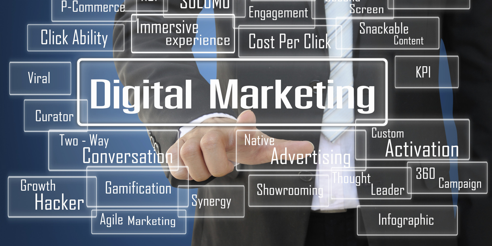
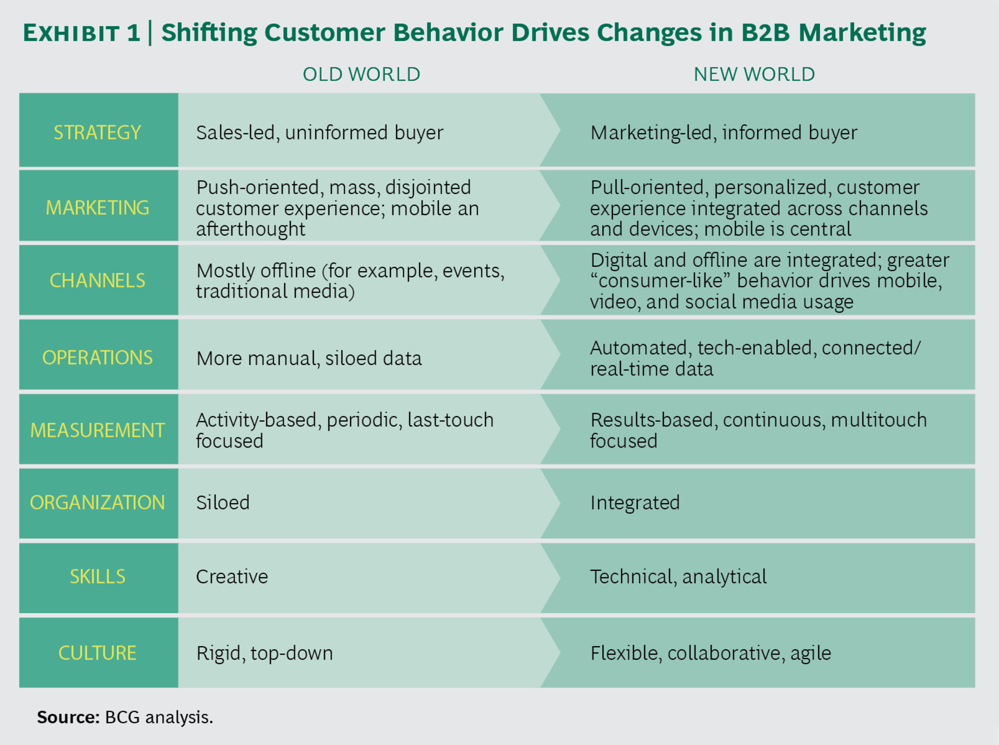

# Digital Marketing

---

## Digital Marketing

* The same digital transformations that are having an impact on manufacturing, finance, education and other business sectors are also impacting marketing

* With new ways to communicate, make choices, and reach people; and with massive volumes of data available with analytics, the digital transformation has created a new era of digital marketing
Notes:

Image Credit:http://www.huffingtonpost.com/aj-agrawal/what-will-drive-digital-m_b_12428298.html

---

## Traditional Marketing

* Uses legacy communications channels - mostly analog media like physical paper

* Can only address masses of people as opposed to singling out individuals

* Most marketing expenditures don't produce results, but there is no way to tell which those are

Notes:

Image Credit: https://786varun.wordpress.com/2015/06/03/traditional-marketing-vs-digital-marketing/

---

## Data Driven Marketing

* Leverages large amounts of data collected (big data) with analytics to generate detailed profiles of individuals or small segments of the market (eg. vegan Python programmers who own cats)

* Uses this data to tailor marketing and then deliver it through digital channels directly to the consumer

Notes:

Image Credit: https://blog.searchmetrics.com/us/data-driven-marketing-ultimate-guide/

---

## Data Driven Marketing

* Marketing data comes from a variety of sources and is most useful when data about a market segment can be correlated from different sources

Notes:

Image Credit: https://www.business2community.com/marketing/overview-data-driven-marketing-2016-01515729

---

## The 4 'R's of Data Driven Marketing

1. *The Right Person:* successfully identifying the right person to target

2. *The Right Channel:* get the marketing out over a combination of channels (eg. social media) so it actually gets to the person

3. *The Right Moment:* the message has to be delivered when the person is receptive

4. *The Right Answer:*  the message provides a way to meet the person's expectations

Notes:

Credit:  https://www.business2community.com/marketing/overview-data-driven-marketing-2016-01515729

---

## Marketing Channels

* A marketing channel is the way marketing is delivered to the customer

* Most of the traditional channels are dying out because of digital transformation
Notes:

Image Credit: http://driverlayer.com/img/traditional%20marketing%20channels/20/any

---

## Marketing Funnel

* The Funnel is a way to manage the messaging to the customer so that they are moved from the top (maybe heard of you) to becoming an advocate for you

* The message as to be constantly modified (the for 'R's) for each stage

* Data analytics and other tools give real time feedback as to the marketing effectiveness

Notes:

Image Credit:https://coolerinsights.com/2016/09/how-to-optimize-your-digital-marketing-funnel/

---

## Marketing Tools

* The new economy is highly interconnected but also has a diverse set of ways people communicate

* Digital marketing not only has to work with all of these digital tools but also respond to new channels (eg. Tik Tok) as they emerge and become popular

* The marketer also has to compete for the customer's attention by very careful crafting and delivery of the message so it doesn't get lost in all the rest of the information the customer is exposed to

Notes:

Image Credit: http://www.seoservicesusa.co/2016/10/03/understand-six-6-radical-trends-characterizing-todays-digital-marketing/

---

## The Changing Consumer

* The digital transformation also has changed how customers respond to marketing

Notes:

Image Credit:  https://www.bluecorona.com/blog/b2b-digital-marketing-strategy-millennials/

B2B - business to business

---

## Psychographic Analysis

* Using big data and analytics, marketers can divide up the population into specific types or groups that will respond to different marketing messages

Notes:

Image Credit:  https://www.barilliance.com/psychographic-segmentation/

---

## The Persona

* Personas are profiles representative of a typical member of a market segment

* A persona is used to try and understand the marketing strategies that would be effective for that market segment

Notes:

Image Credit: https://awkward-media.com/how-to-create-buyer-personas/

---

## Marketing Process

* The process deals not just with delivering a message but continuously monitoring collected data to understand how to make adjustments in the strategy or message

Notes:

Image Credit: http://darlenetr.blogspot.com/2017/10/marketing-communication-plan_5.html

---

## The Future

* The constant changes in technology create both opportunities for innovative marketing but also require that the marketer be constantly evolving and adapting
Notes:

Image Credit: http://www.marketinghub.today/digital-marketing-news-googles-take-on-url-structure-b2b-tech-marketing-trends-survey-nprs-rad-podcasting-decentralised-ai/

---

##  

Notes:

Image Credit: https://www.smartinsights.com/digital-marketing-strategy/marketing-quotes-strategy/

---
