# Virtual and Augmented Reality

Notes:

This section is going to try and avoid discussing the profusion of VR products out there including games since that is a vast topic.

---

## Virtual Reality

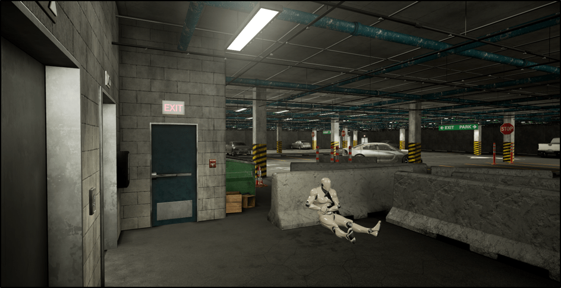

* The use of digital technology to create a simulated immersive environment

* The image is of a law enforcement training virtual environment

Notes:

Image Credit:  https://www.nist.gov/image/leenvironmentpng

It might be useful to try and define "immersive" in the sense that it completely envelops one and totally occupies a person's attention -- sort of like getting caught up in a great movie of book

---
## VR is Immersive

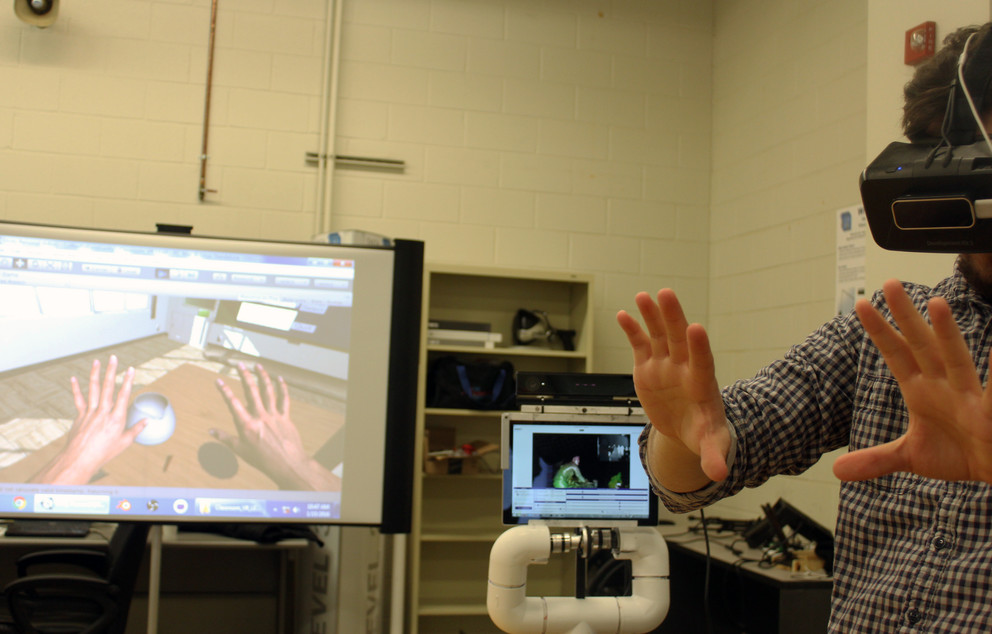

* Immersive means that the VR system provides computer-generated perceptual information

  - The most common are visual, auditory and tactile inputs
  - Can also include haptic, somatosensory, olfactory and other modalities
  - Any stimulus that be sensed that can also be simulated can be used

Notes:

Image Credit: https://news.psu.edu/story/388734/2016/01/25/research/engineer-receives-funding-support-teaching-virtual-environment

Image is of a Penn State VR training environment for engineers

---

## Augmented reality

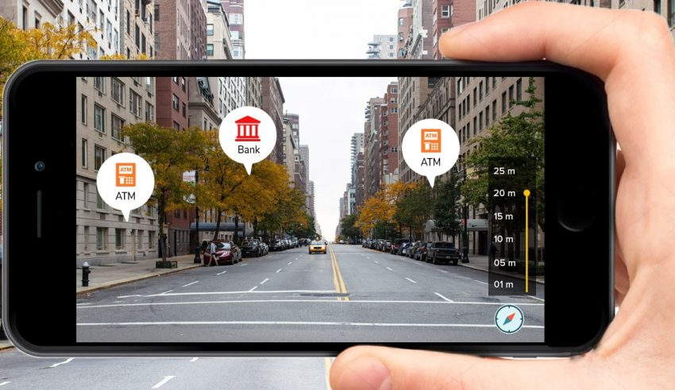

* Interactive experience in a real-world environment
  -  Augmented reality is not immersive

* Real objects may be enhanced with generated perceptual information
  - Communicated through any of the sensory modalities (usually visual)
  - Often takes the form of "tagging" information about the objects

Notes:

Image Credit: https://www.reviewsxp.com/blog/augmented-reality-apps/

There do seem to be two forms of augmented reality, the first is the tagging or adding of information or meta-information to real world objects

---
## Augmented Reality
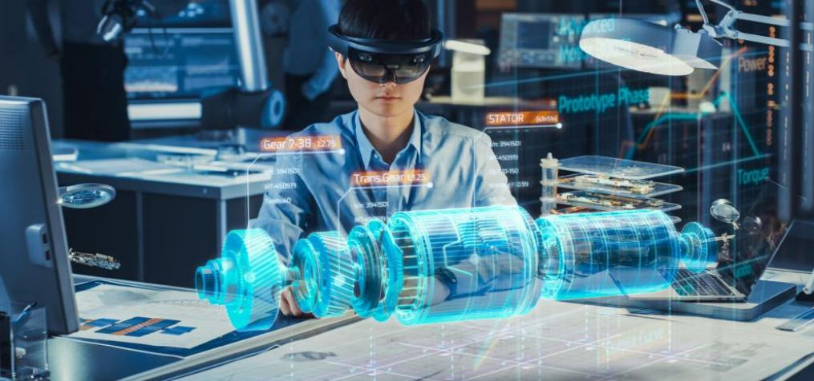

* Also refers to the virtual representation of data in some form
  - Used for visualization of designs, schematics, etc
  - Can be used as control systems but require sensors to detect input

* Not the same as holograms -- AR requires a device to perceive the image

Notes:

Image Credit: https://vrroom.buzz/vr-news/tech/infographic-history-and-future-ar-vr

Holograms are often confused with AR, especially since some forms of holography are used in VR and AR systems, however the basic rule is that holograms can be perceived directly while AR requires the use of an AR headset or device to see the virtual object.

---

## VR Application: Training

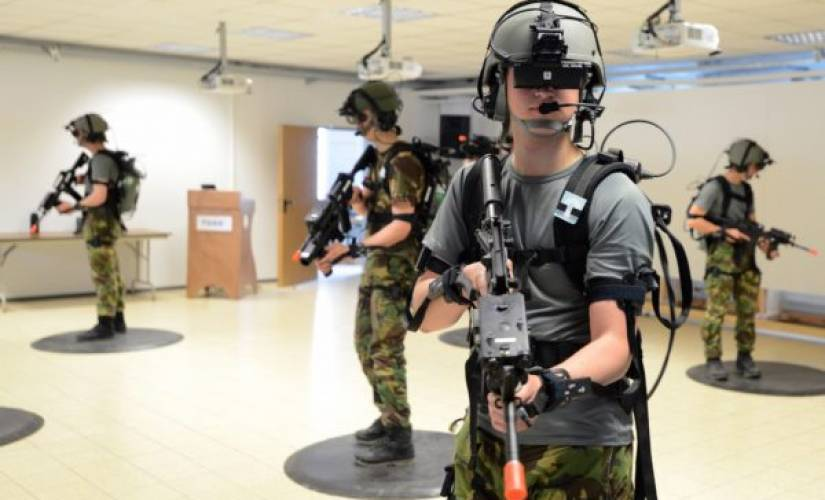

* VR is used extensively for training
  - Ideal for training in dangerous or remote environments
  - Scales very well
  - Highly cost effective with excellent results
  - Can be customized to new challenges and situations

Notes:

Image Credit: https://readwrite.com/2017/03/30/how-vr-training-apps-are-finally-becoming-a-reality-cl1/

---

## VR Application: Education

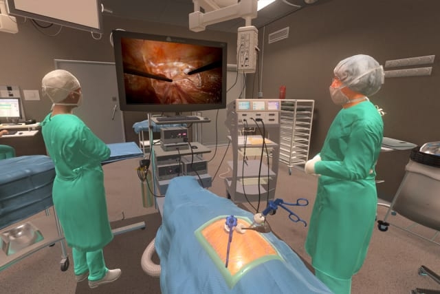

* Used to develop cost effective and safe education programs

* For example, training surgical teams
  - Safe: no patients are at risk
  - Scalable: not limited by resources
  - Cost Effective: No need for actual physical resources like ORs

Notes:

Image Credit: engineering.com/3DPrinting/3DPrintingArticles/ArticleID/14190/3D-Systems-Medical-Goes-Virtual-with-VR-OR-Surgical-Training.aspx

---

## VR Application: Consumer Industries

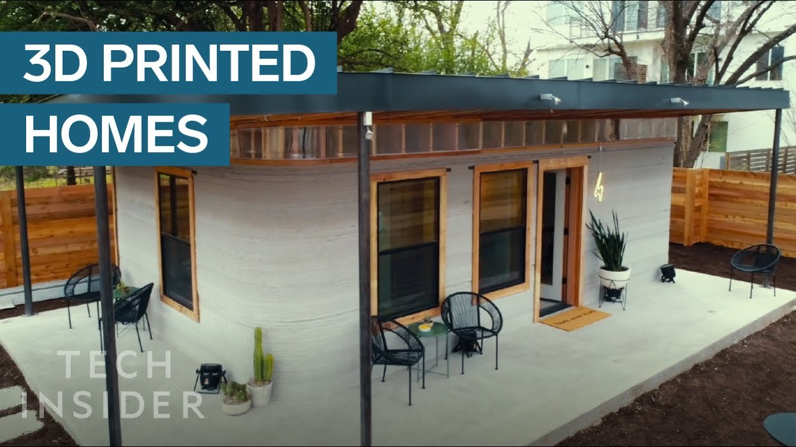

* Recreational market is massive
  - Already exists with immersive games

* Enables a "try it before you buy it" experience
  - Eg. Virtual test drives, virtual home showings

*

Notes:

Image Credit: https://www.youtube.com/watch?v=8yegJmlpfBA

---

## VR Application: Market Growth

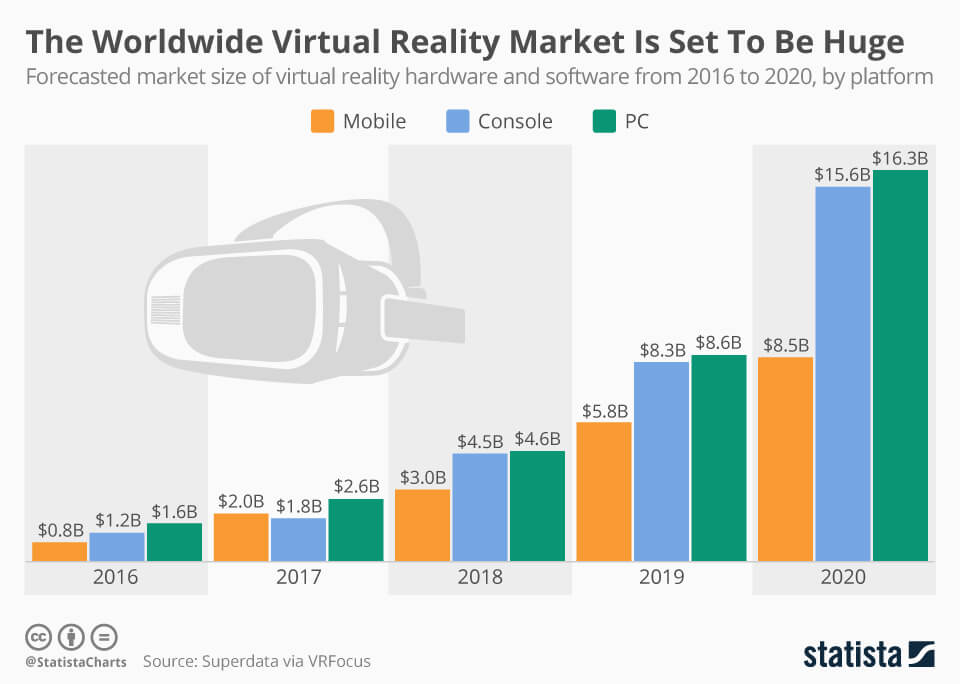

* Starting a period of exponential growth

* Costs are decreasing and integration with other technologies improving
  - Eg. Telepresence, data analytics, 3D printing, etc

Notes:

Image Credit: https://www.businessideainsight.com/wp-content/uploads/Virtual-Reality-market-growth.jpg

What needs to be stressed is that the growth of any of these technologies is also due to their integration with other tech.  For example, an immersive or augmented and interactive data visualization environment is possible with this tech.  

---

## VR Application: Market Diversity

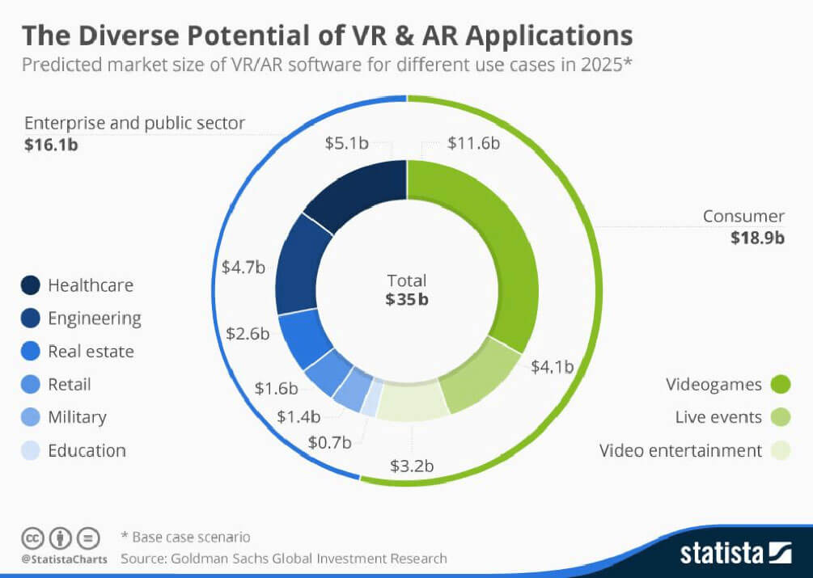

* VR's main impact is not as a stand alone products

* Instead it provides value added functionality within industry areas

Notes:

Image Credit: https://thinkmobiles.com/blog/how-much-vr-application-development-cost/

---

## Augmented Reality Application

Notes:

Image Credit:https://i1.wp.com/triotree.com/blog/wp-content/uploads/2017/02/vr-in-medicine.jpg

These next few slides are just some visuals of VR applications.  I think that can be talked to without any real script -- but it does make a better impact than just a bunch of text

---

## VR in Education

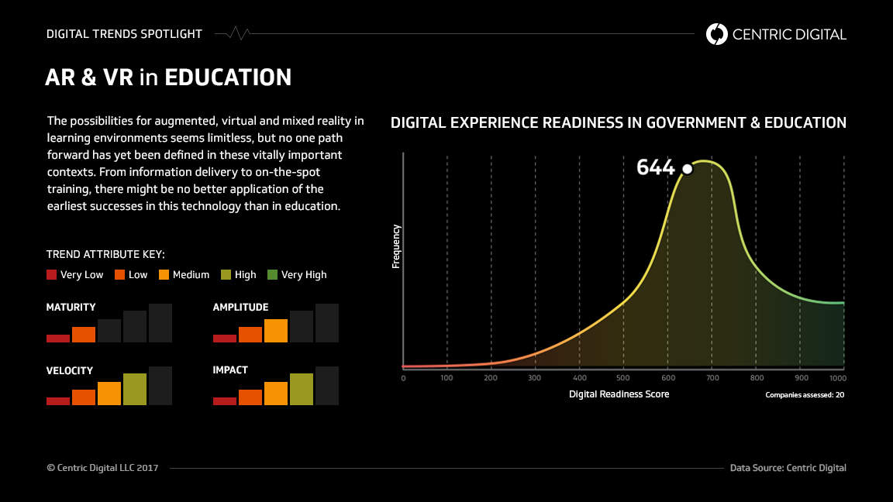

Notes:

Image Credit:https://cdn.centricdigital.com/wp-content/uploads/2017/09/Impactful-applications-of-AR-and-VR-in-Education-and-Government-Infographic.png

---

## VR in Education

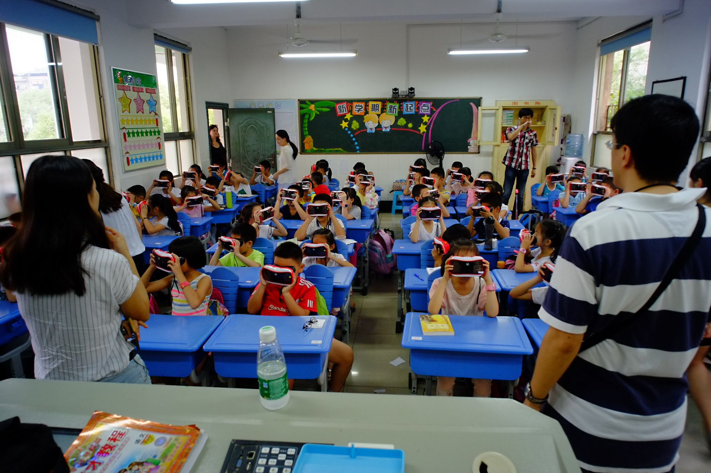

Notes:

Image Credit: https://www.newswise.com/images/uploads/2017/03/16/Changsha0916038_1920w1.jpg

However VR in classrooms is already happening

---

##  

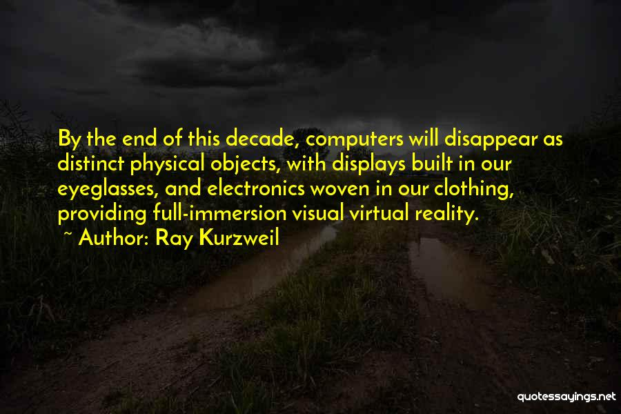
