# Three Dimensional Printing

Notes:  

This is a really important technology and it's a bit different than the others.  However, there does seem to be a consensus that 3d printing will have the most impact of all of the transformational technologies.

---

## A Different Type of Transformation

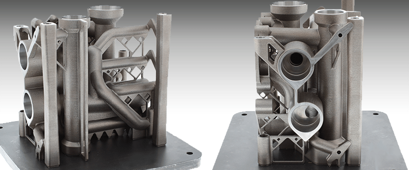

* 3d Printing is the major enabler of the 4th Industrial Revolution

* Transforms how we build and distribute physical products
  - Other digital technologies transform how information is used
  - 3d printing transforms how materials and products are made and customized

* Has more economically disruptive potential than any other digital technology

Notes:

Image Credit: https://3dprintingindustry.com/news/renishaw-launch-new-3d-metal-printer-imts-plan-industrialize-3d-printing-95713/

Image is of matal part manufactured through 3d metal printing.  The part was made as a single piece similar to how we get solid objects from casting.

---

## Additive Manufacturing

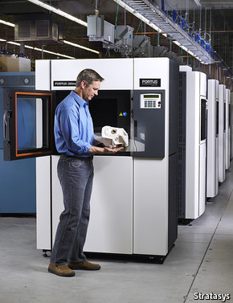

* 3d printing is a enhanced type of additive manufacturing
  - Product is built up in layers by adding material
  - Usually created as a single unit without needing assembly
  - Can be used with plastics, metal and even biological materials

* Subtractive manufacturing creates a product by removing material
  - For example, lathing and machining and other traditional methods
  - Usually involves waste and an assembly process

Notes:

Image Credit: https://www.economist.com/technology-quarterly/2013/09/05/3d-printing-scales-up

Industrial 3d printer

---

## 3d The Printing Process

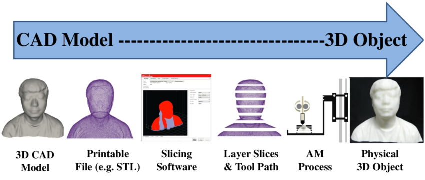

* An object is scanned or designed to produce a 3D digital model

* The model is sliced into layers that are used to determine the fabrication logic

* The fabrication logic guides the printer to construct the final object

Notes:  

Image Credit: https://www.researchgate.net/figure/General-3D-printing-process_fig2_283664754

There is a lot implied here.  In order for this to work, there needs to be a very robust algorithm to do the planning -- machine learning and AI are a critical part of this.

---

## Example: Printing Prostheses
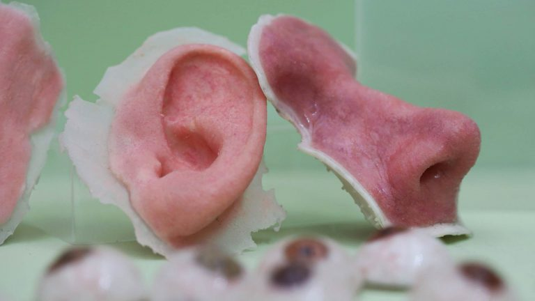

* Already used to make prosthetics, artificial skin, heart valves, veins and other body parts

* Each part can be custom designed for specific individuals even when being massed produced
  - This is possible using AI and Robotic Process Control

Notes:

Image Credit: https://insh.world/tech/3-d-printed-human-organs-making-future-transplant-wait-lists-shorter/

Image is of actual ear and nose prostheses custom designed for specific patients.  FYI, the prostheses are designed automatically from scans of the patient's body.

---

## Example: Bio-Printing
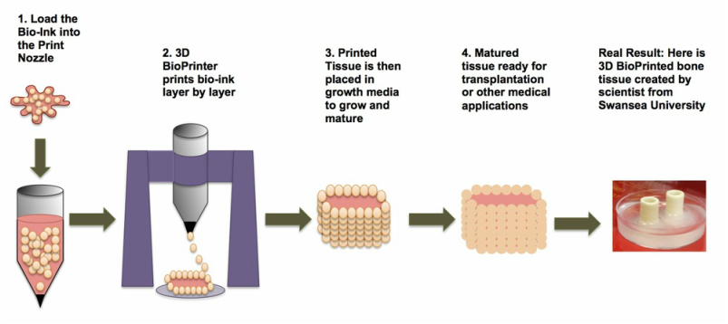

* Bio-printing (often called "meat printing") is in the early stages

* Possible uses are artificial replacement organs and mass food production

Notes:

Image Credit: https://3dbioprinting.weebly.com/how-it-works.html

---

## Example: Metal Fabrication
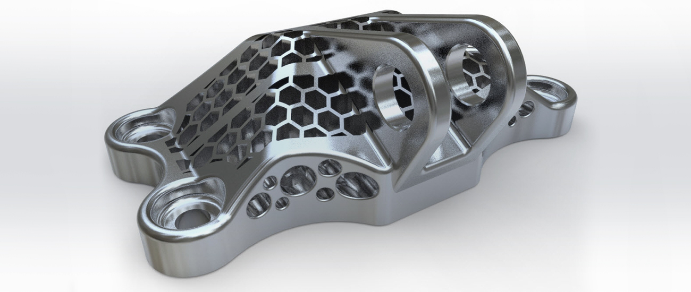

* Metal 3d printing allows for complex metal parts to be build in one piece

* Does not require an assembly process like welding or fastening  

* High levels of consistent quality for mass production

Notes:

Image Credit: https://newsroom.posco.com/en/future-manufacturing-metal-3d-printing/

3d printing also can use wood and concrete apparently although I did not find any examples.

---
## Example: Extreme Printing
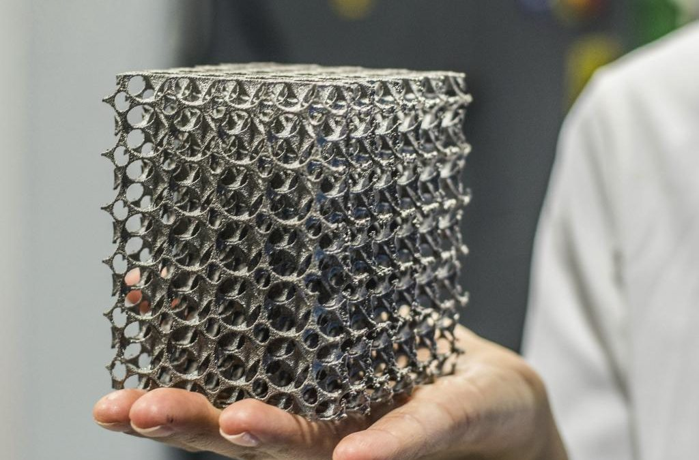

* Demonstration of how complex a metal part can be

* Allows more complex types of engineering since very complicated parts can be mass produced or custom produced to exact and consistent tolerances

Notes:

Image Credit: http://engatech.com/metal-3d-printing/

---

## Example: Industrial Production

* Relativity Space Inc. is 3d printing metal rocket fuel tanks

* The company goal is to 3d print whole rockets

* The tank normally takes a year to produce, 3d printing it takes only 7 days

* The image shows the tank being printed by the world's largest 3d metal printer

Notes:

Image Credit: https://3dprint.com/231703/relativity-space-3d-prints-fuel-tank/

---

## Rise of 3d Printing  

* Patents on 3d printing started to expire in 2009, opened up the market

* Advances in digital technology drove the 3d printing process

* Early uses were for prototyping, mostly in plastic

* Early 3d printing was very slow and very expensive

* Started to find niche market for custom and one-off items

Notes:

---

## Market is Expanding
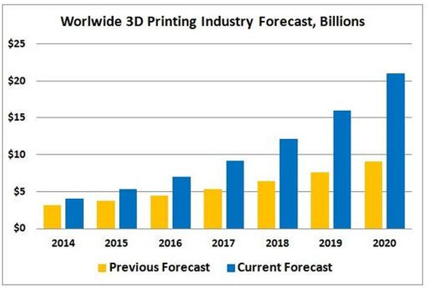

* Improvements in digital technology increased what 3d printing could do

* Cost of printing decreased, speed of production increased

* Growth of market is exceeding predictions

Notes:

Image Credit: https://www.forbes.com/sites/louiscolumbus/2015/03/31/2015-roundup-of-3d-printing-market-forecasts-and-estimates/#537c5c3c1b30

---

## Impact on Value Chain

* The growth of 3d printing will be one of the most turbulent changes to take place in the digital transformation

* Much of the current economy is based on a model of
  - Moving raw materials from source to factory
  - Storing parts and materials until needed
  - Moving finished goods to storage
  - Distributing goods to markets

* 3d printing makes all of that obsolete

Notes:

This is the reason for why 3d printing might be the most disruptive -- it makes a large part of the economy obsolete.

---

## Traditional Value Chain

Notes:

Image Credit: https://horizons.gc.ca/en/2019/06/20/the-next-digital-economy/

All following images in this series are from the same source.

The value chain represents a number of economic sectors like transportation, manufacturing, warehousing, etc.

---

## E-Commerce Value Chain

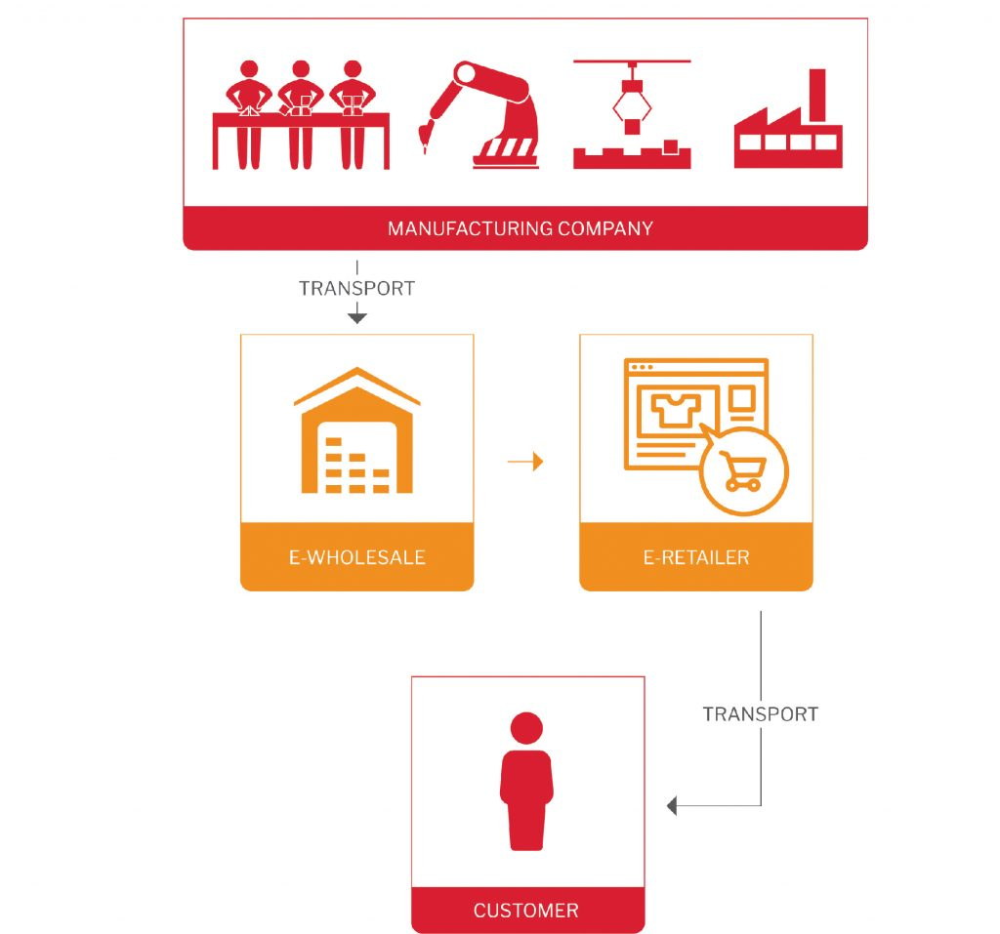

Notes:

Decrease of in-person front-line service provision and centralized inventory

Mass production based on economies of scale

This is the transitional model we are seeing currently

---

## Industry 4.0 First Stage

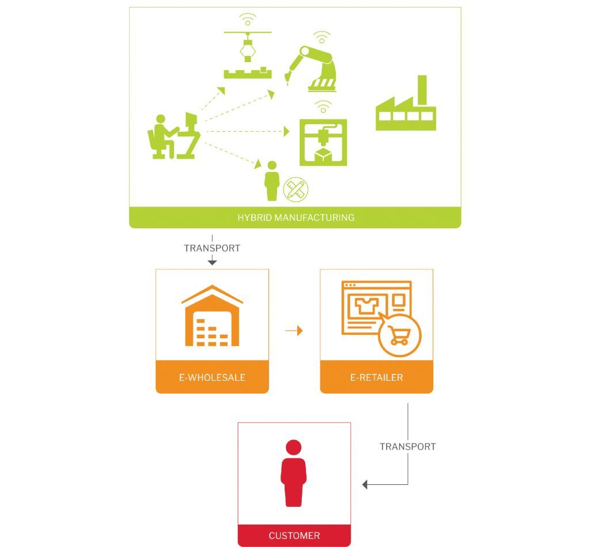

* Hybrid manufacturing uses flexible robotics and 3D printing to deliver affordable short-run and on-demand production

Notes:

---

## Distributed Manufacturing

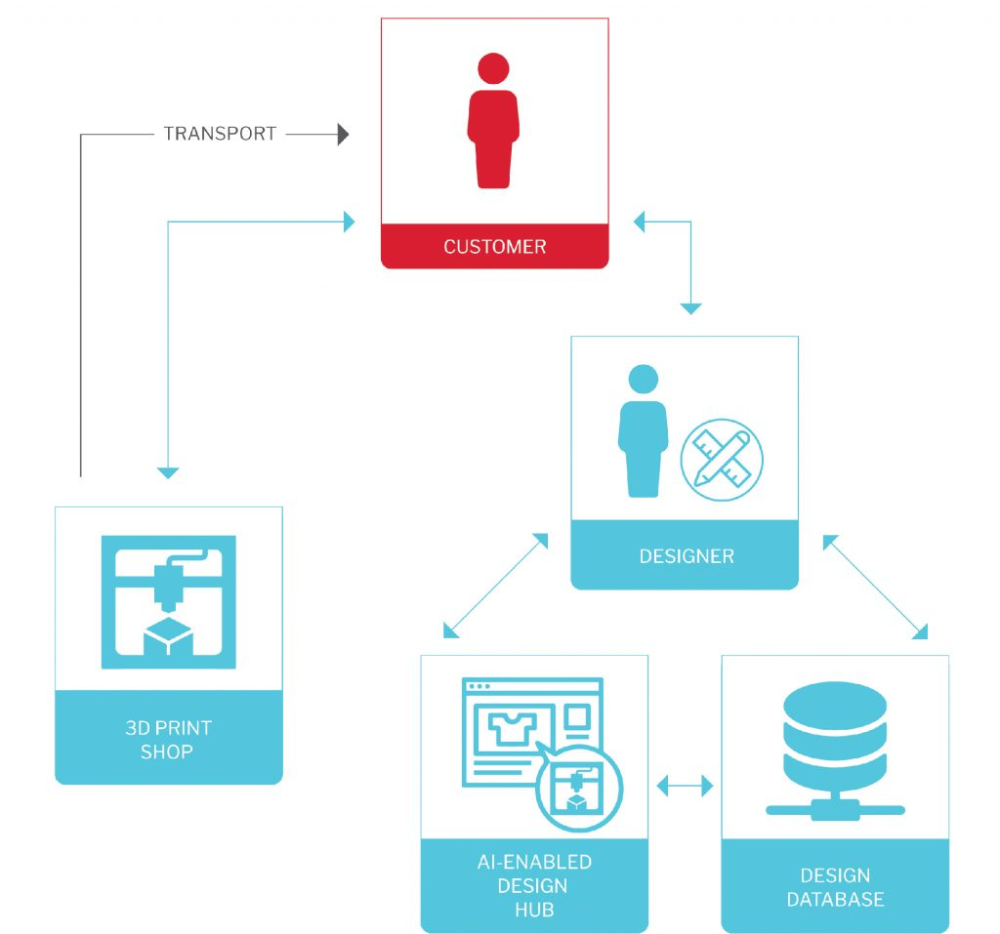

* Bypasses tradition manufacturers  

Notes:

Online platforms allow customers, designers, and 3D print shops to coordinate and even co-create, providing start-up entrepreneurs with a large customer base and bypassing traditional manufacturers

One-off customization

Ephemeral value chains based on economies of scope

---

## Full Digital Transformation

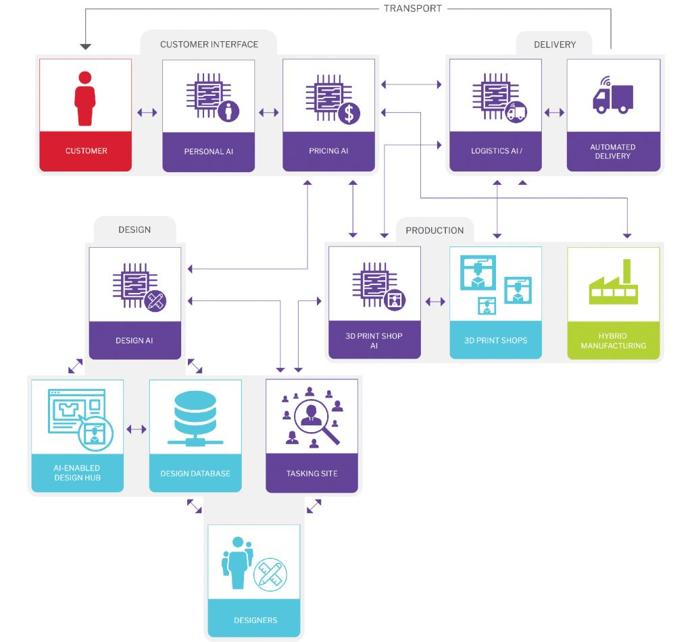

* Artificial Intelligence (AI) reduces the burden of considering many or all options

* AI manages rapid complex production negotiations between multiple actors and their AIs

Notes:

---

## It's Happening Now

* 3d Printer farm for mass production

Notes:

Image Credit: https://3dprintingindustry.com/wp-content/uploads/2014/12/Makerbot-farm-3d-printer.jpg

---

## Space Exploration

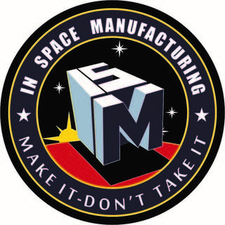

* 3d printing is being implemented by NASA as a way to avoid launching tons of supplies into space

* 3d printing is already being experimented with on the International Space Station

* The goal is to make space missions independent of a supply chain back to Earth

Notes:

Image Credit: https://www.nasa.gov/oem/inspacemanufacturing

---

##  

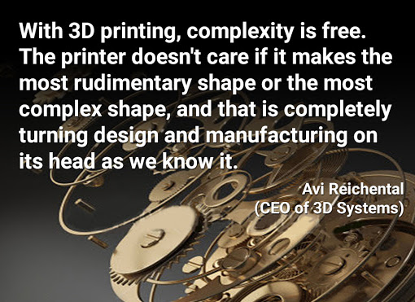

Notes:

---
