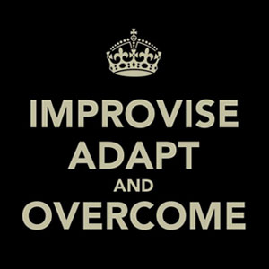
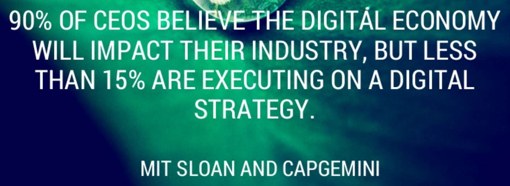

# Conclusion and Next Steps

---

## Lesson Objectives

* To understand:

  - How to respond to the digital transformation as an organization
  - How to respond to the digital transformation as an individual
  - How to thrive in the new economy

Notes:

---

## Fourth Industrial Revolution

* This new digital society is our current and future economic reality

* We cannot "opt out" of these changes

* The alternative is to determine how to adapt and thrive

Notes:

Image Credit: https://www.tritoninnovation.com/industry40

---

## Continuous Education

* Continuous education is required for both organizations and individuals

* Not reskilling and learning means obsolescence

* With increasing rates of change, obsolescence arrives very fast

Notes:

Image Credit: https://medium.com/predict/charting-your-own-pathway-to-professional-success-in-the-4th-industrial-revolution-ec5287a1b242

---

## Change Management

* Change is happening so rather than ignore it, manage it

* Planned change in the organization is critical to respond to economic change

* It will show where the organization is vulnerable

Notes:

Image Credit: https://www.slidebooks.com/products/digital-transformation-strategy?variant=23301759045
---

## Traditional Change Management

* Standard change management process - it works effectively

* Provided that the rate of change is not too fast

* It is more likely that the organization will be in a state of constant change

Notes:

Image Credit: https://www.pmi.org/learning/library/integrated-change-management-5954

---

## Agile Change Management

* Agile change management will probably be necessary

* A process for adapting to constant change

Notes:

Image Credit:https://blog.changefirst.com/change-insight-why-agile-organizations-need-agile-change-management

---

## Continuous Innovation

* Organization will need to continuously reinvent themselves to take advantage of the new opportunities

Notes:

Image Credit:https://stevensonfinancialmarketing.wordpress.com/category/skills-development/

---

## Career Planning

* There will be lots of work, but no jobs

* Stop thinking like an employee, think like a entrepreneur

* Understand the technologies that affect your career

* Be prepared to change careers often - what you work at in five years may not even exist now

* Constant learning

* Develop the skills technology can't do yet

* Focus on soft skills as well as hard skills

Notes:

Image Credit:https://weareosd.org/the-struggles-we-face-adapt-and-overcome/

---

## Career Planning

Notes:

Image Credit:https://stevensonfinancialmarketing.wordpress.com/category/skills-development/

---

##  

Notes:

Image Credit:https://www.slideshare.net/kintoneUS/11-digital-transformation-quotes-to-lead-change-inspire-action

---

##  

Notes:

Image Credit:https://www.slideshare.net/kintoneUS/11-digital-transformation-quotes-to-lead-change-inspire-action

---

##  

Notes:

Image Credit:https://www.slideshare.net/kintoneUS/11-digital-transformation-quotes-to-lead-change-inspire-action

---
