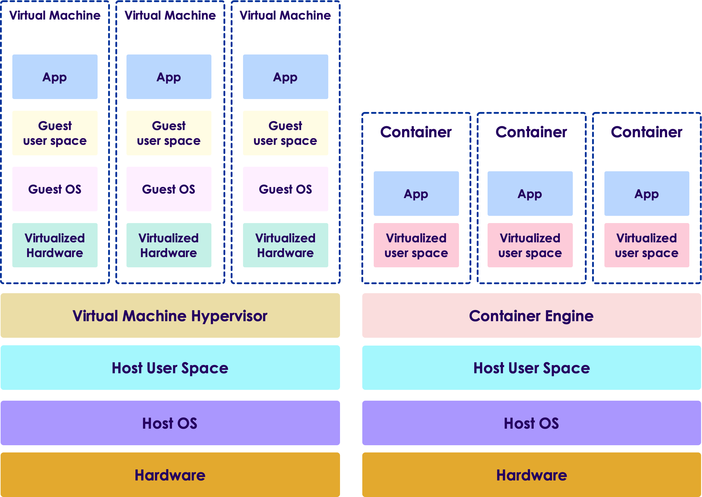
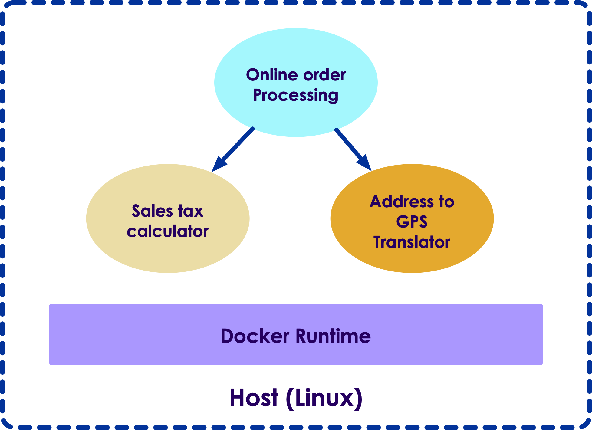

# Container Intro

---

# Deployment Problem

---

## Step 1 - Develop on Laptop

* You develop an app on your workstation

* You test it. Seems to run fine. Time to deploy

 <!-- {"left" : 1.02, "top" : 2.28, "height" : 4.42, "width" : 8.21} -->

Notes:

Instructor Notes :

Share some war stories

Participant Notes :

We are introducing the problem of deployment.  The problem here
is that as an application is far more than just code.  Code is
one small part of an application.  

We are introducing the "It worked on my computer" problem.  VMs
are one way to solve that problem, and Containers are another.

---

## Step 2: Deploy to the Server

 <!-- {"left" : 5.56, "top" : 1.56, "height" : 2.87, "width" : 4.49} -->

* We’re ready to deploy to the server

* Provision a new server 
    - Install OS
    - Install JDK
    - Install dependency libraries
    - Etc

* Oops… doesn’t work. Why not?
    - Missing file?
    - Wrong version? Path not right

* **"But it worked on MY computer!!"**

Notes:

Instructor Notes :

Participant Notes :

Setting up the environment right usually results in problems.  Developers
have implicit dependencies on libraries, versions, etc that are hidden.
It's often very difficult to figure out what these dependencies are.

Take, for example, a python application. The developer has already installed
dozens of packages for other apps.  So, this app "just works" because the
developer has certain assumptions.

On a server, those assumptions won't apply, and the app fails to run. 
Developers are famous for insisting that "It worked on my computer!"

---

## Step 3 - Much Later... Finally Working!

* Fix all the problems, now it’s finally working!

* Oops… Don’t Touch Anything!
   - Might Break!
   - Change Environment?
   - Install Another App?

* Fix Breakage
   - Make things work together
   - Set profiles

* "Write once, run anywhere?"
   - Not exactly!

Notes:

https://www.pexels.com/photo/interior-of-office-building-325229/

Instructor Notes :

Participant Notes :

Once we fix our problems, we’re by no means done.  Changes that happen can affect our application. If we install something else on the same server, it can break our application.  The problem is that there is no isolation.  One app on the server will affect others on the server.

We often have to walk on tiptoes on our server to make sure that we don’t break something else.   Hosting two apps on the same server is a non-starter.

The old Java maxim “Write Once, Run Anywhere” doesn’t really work.  Because, the Java app itself may run anywhere, but there’s so much else that comes into play that will either allow or prevent the app from working.

---

## Step 4 - Scale our App

 <!-- {"left" : 4.04, "top" : 3.27, "height" : 3.98, "width" : 5.98} -->

* Great News! Our App is very popular.  Need to scale up !

* Need to deploy on many servers

* Create New Server
    - Install OS
    - install dependencies
    - Fight fires
    - Fix Problems
    - **Rinse and repeat**

Notes:

Instructor Notes :

Participant Notes :

Here we come to the point where our deployment environment can take on a life
of its own, so we can get to a "but it worked on my server!" kind of mentality.
This makes it very difficult for us to move servers, especially if that server
is different in any way from the original one.

Some will rightly point out that this is the basic problems that VMs are trying
to solve, and, indeed, VMs are a reasonable solution to this.

---

## Can Cloud Help?

* Even deploying the cloud, we would encounter the same problems!

Notes:

Image credit: https://medium.com/skale-5/19-memes-about-kubernetes-86d4ee87ba1b 

Instructor Notes :

Participant Notes :

Cloud is yet another configuration compared to on-prem. How will that affect
things?  Likely, it will involve even more firefighting.

---

## Dependency Matrix

* Lot of the time, we need to keep track of dependencies for each component

 

|                  | Dev VM    | QA Server | Prod Instance | Prod Cluster | AWS       | Laptop    |
|------------------|-----------|-----------|---------------|--------------|-----------|-----------|
| HTML/CSS         |    ???    |    ???    |    ???        |    ???       |    ???    |    ???    |
| Back-End Code    |    ???    |    ???    |    ???        |    ???       |    ???    |    ???    |
| App DB           |    ???    |    ???    |    ???        |    ???       |    ???    |    ???    |
| Analytics DB     |    ???    |    ???    |    ???        |    ???       |    ???    |    ???    |
| Worker Processes |    ???    |    ???    |    ???        |    ???       |    ???    |    ???    |
| Queue            |    ???    |    ???    |    ???        |    ???       |    ???    |    ???    |

Notes:

Instructor Notes :

Participant Notes :

This “Matrix From Hell” is adapted from the website http://www.docker.com /  The idea here is that we have a number of different components to our app: front-end, back-end, various DBs, services, queues, etc.  These things all come together to make our app, like pieces of the puzzle.  Those pieces will have to be assembled in just the right way on each of our deployment platforms, from local to test, to QA.  How  do we ensure that our app works the same way on each of them?  There are many combinations of factors, which is why we call this the ”Matrix from Hell”.

It becomes a big headache to make sure that all the various components of our app, on the rows of the matrix, all work properly on the columns of our matrix, which are the various deployment platforms.

---

## Wouldn't It Be Nice?

<!-- {"left" : 5.05, "top" : 1.65, "height" : 3.29, "width" : 4.94} --> 

* What if we could move all of the following:
   - Application Code
   - Application Dependencies
   - Configuration Files
   - Local Database(s)
   - Environment Variables
   - File System
   - Service Processes

* All as a “sealed unit”
   - Without having to re-deploy
   - Reconfigure

Notes:

Image credit : https://www.pexels.com/photo/blackboard-business-chalkboard-concept-355988/

Instructor Notes :

Participant Notes :

Here we’re talking about the use case of taking all of our application components and delivering them all as a sealed unit, so that none of the components can be deployed without the others.

We are trying to communicate the value of having our application delivered as a whole.

---

# Virtual Machines (VMs)

---

## Virtualization

* Virtualization has taken the Datacenter by storm

* Virtualization allows a physical server to be segmented into multiple virtual servers

* With Virtualization, we can easily move a whole virtual environment from server to server.

* We can pause, stop, restart, and terminate instances on the fly.

* Frees datacenter ops to focus on server infrastructure and not application.

* Agility: much easier to get new VM instance than a new hardware server provisioned.

Notes:

Instructor Notes :

Participant Notes :

Virtualization has historically been the answer to these problems.  We’ll see in a minute the advantages and disadvantages of containerization versus virtualization

Virtualization allows us to easily start, stop, and move VMs between machines, simplifies many of our deployment headaches.

---

## History of Virtualization

* **1960s-present** Mainframes have done VMs for a long time
   - Thousands of VMs on a single mainframe
   - Achieves scalability and isolation on mainframe systems

* **1990s** PC Era
   - VMs a “Mainframe” technology and out of vogue.
   - Just run the app on the ”bare metal”

* **Late 19902 - 2000s** Application Servers
   - Deploy App to Application Server
   - SysAdmins managed deployment of application
   - Still ”Bare Metal”

* **2006 - Present** Intel/AMD Support Hardware Virtualization
   - Enables Isolation of VM processes
   - VM Security

Notes:

Instructor Notes :

Participant Notes :

VMs have been around since the mainframe era, and allow multi-tenancy much more effective.  As we can see, VMs became much more popular in the mid-2000s as VMWare and other providers came out and CPU vendors started to make hardware virtualization.

That said, there are disadvantages to virtualization.   “Bare Metal” undeniably runs faster.

In the modern era, virtualization is ubiquitous and assumed -- if I have a server instance I'm sure it's really a VM and not a "bare metal" instance. The ability to copy my instance and redeploy it is something that we normally take for granted in this day and age.

---

## Virtualization Providers

 <!-- {"left" : 3.55, "top" : 0.98, "height" : 0.95, "width" : 3} -->
&nbsp; &nbsp; <!-- {"left" : 2.73, "top" : 1.52, "height" : 2.3, "width" : 4.19} -->

 <!-- {"left" : 3.55, "top" : 3.7, "height" : 0.9, "width" : 3.16} -->
&nbsp; &nbsp;  <!-- {"left" : 3.83, "top" : 4.75, "height" : 1.07, "width" : 2.59} -->
&nbsp; &nbsp;   <!-- {"left" : 3.66, "top" : 6.08, "height" : 0.86, "width" : 2.78} -->

Notes:

Instructor Notes :

Participant Notes :

This is just a list of the common Virtualization providers.   VMWare is the industry leader in the space, especially for deployment.  Windows Hyper-V is used in Microsoft-centric deployment environments.  Xen/KVM  and others are open-source technologies used in some environments.

All basically work the same way – they the application team to create a VM Image, and then that image can be deployed at will to send the app (as long as licensing requirements are met).  Changes to the app can then go to the VM image, which can then be deployed properly.

---

## VM Architecture

* Virtualization works in layers:
    - Hypervisor : that allows virtualization
    - Virtual hardware: simulates hardware (CPU / memory  / disk)
    - Guest OS: This is the actual operating system (linux / windows, MacOS ..etc)

* There is a performance penalty for each VM having its own OS

* However, this provides complete isolation for each VM
    - We can run a windows VM and a linux VM on the same physical machine

* Large bare-metal servers can balance resources among several running VMs --> better hardware utilization

Notes:

Instructor Notes :

Participant Notes :

This image indicates the problem with virtualization.  We are virtualizing an entire machine, including the Operating System.

Of course, this has tremendous advantages in some cases.  We are isolating our VMs from each other completely.  It also allows us to run different OS platforms simultaneously, which is a primary motivator for desktop virtualization, especially on Mac and Linux platforms (to run windows apps, for instance).

But most of the time, this is just a waste.  The Host itself has an OS running in order to run, then, each of the guests have an OS as well.    Do we really need to run copies of the OS.

The solution is often to run the most stripped down, lightweight OS possible in each of the guests.   But why do we need the guest OS in the first place – we already have an OS – the host OS!

The performance is one thing, but what about the time it takes to start?

---

# Containers

---

## VMs vs. Containers

---

## What are Containers

* Only the "Userland" is virtualized

* 'Application Code + Filesystem Image code' are packaged together

* Kernel is shared with the host

* Both Host and Guest have to be the same OS
   - Usually Linux or Windows

Notes:

Instructor Notes :

Participant Notes :

Here we introduce containers.  Containers are a bit like a VM with no OS.  Strictly speaking, the containers DO have some of the OS, but NOT the OS kernel.

In order for this to work, the kernel has to be the same.  In the past, this has meant using Linux, but in modern versions of Docker Windows containers are supported as well.

---

## Containers Versus Virtual Machines

|                  | Container                                                 | Virtual Machine                                |
|------------------|-----------------------------------------------------------|------------------------------------------------|
| OS               | No OS Kernel, use Host's OS Kernel                        | Each Virtual Instance has its own OS           |
| Filesystem       | Dedicated File System                                     | Dedicated File System                          |
| Isolation        | Uses Virtualization API of host kernel for some isolation | Uses guest isolation for more robust isolation |
| Guest OS Support | Same as Host (usually Linux)                              | Can run any OS that supports host CPU.         |
| Start/Stop Time  | milliseconds                                              | seconds to minutes                             |

Notes:

Instructor Notes :

Participant Notes :

Here we compare the similarities and differences between the VM and the Container.  The main advantage of the container here is performance.  There’s minimal startup time for a container, and there’s no performance penalty to running on a container.

Note here that the filesystem, libraries, and other dependencies are handled very similarly for containers versus VMs – in both cases they are on the guest image rather than on the host.

---

## Containers Versus Package Managers

|                  | Container                                                 | Package Manager                                |
|------------------|-----------------------------------------------------------|------------------------------------------------|
| Filesystem       | All Dependencies installed to container filesystem.       | All Dependencies installed to local filesystem.|
| Isolation        | Userland isolation, kernel shared.                        | No Isolation. Processes run together.          |
| Dependencies     | Dependencies put in container                             | Can have circular dependency issues.           |

Notes:

Instructor Notes :

Participant Notes :

Containers in some ways resemble package management systems like apt on Ubuntu/Debian and rpm/yum on RedHat.  In both cases, they are designed to help improve deployment, and are in a sense different solutions to the same problem.

Package Managers, however, can and do have dependency issues, and are generally not suitable for deploying user developed applications across various platforms.

---

## Solving the Matrix from Hell

|                  | Dev VM    | QA Server | Prod Instance | Prod Cluster | AWS       | Laptop    |
|------------------|-----------|-----------|---------------|--------------|-----------|-----------|
| HTML/CSS         | Container | Container | Container     | Container    | Container | Container |
| Back-End Code    | Container | Container | Container     | Container    | Container | Container |
| App DB           | Container | Container | Container     | Container    | Container | Container |
| Analytics DB     | Container | Container | Container     | Container    | Container | Container |
| Worker Processes | Container | Container | Container     | Container    | Container | Container |
| Queue            | Container | Container | Container     | Container    | Container | Container |

Notes:

Instructor Notes :

Participant Notes :

This slide follows up with the Matrix From Hell, showing that the same container is able to run on all of our production, test, QA, staging, and development platforms.

---

## When NOT to use Containers

|                                 |                                                                                                                                                                               |
|---------------------------------|-------------------------------------------------------------------------------------------------------------------------------------------------------------------------------|
| Multiple OS                     | VMs allow a single computer to run multiple OS, such as Linux, Windows, etc. For example, we could run a Windows Guest on a Linux Host. This is not possible with containers. |
| Kernel-Level Isolation          | If you need various custom kernels or run kernel-level code, you need virtualization. Containers share the host kernel.                                                       |
| Root or Privileged instructions | Containers can run root, but it only applies to root within the container and not outside.                                                                                    |
| Tightly-Coupled Data            | When the application is tightly coupled to its own data, containers aren’t a good solution. This is not generally a good design principle, however.                           |
| Security Concerns               | Sharing the kernel means that kernel exploits in container will affect the host as well.  Containers should not be used for untrusted code execution.                         |

Notes:

Instructor Notes :

Participant Notes :

There are a number of use cases NOT to use containers.  Here is some explanation:

Multiple OS: One of the main use cases for desktop virtualization is to run various Operating Systems.   This can be because, say, Mac users want to run their favorite windows Application, or Windows users want to run something inside of Ubuntu Linux.  Containers don’t help in this regard, because they are mainly about sharing the host kernel. That said, we will see how docker will use a combination of virtualization and containerization on development platforms to allow running containers across different OS platforms.

Kernel Level Isolation.  Nothing can beat a VM’s isolation at the kernel level.  While it may be more efficient to share a kernel, it means we have to share the same kernel.  IF we want optional kernel modules in one app versus the other, only a VM can do that.

If we want to run privileged code, we can’t do that either in a VM or in a container.  Of course, in either case we can certainly run as root, but the results will only be seen inside the container or VM, and not outside.

If we have an application that is tightly coupled to its data, then containers will make life complicated.  What does it mean to be tightly coupled?  Let’s say, for example, that the application is designed to store data as local files in its run directory.  This is generally a really bad idea, but one that is extremely common.   Containers can complicated this because the app is generally designed to run from an immutable container image.  Changes to the state of the application are reserved fro changing the data, which we want in special attachable volumes.

Security: Running untrusted code is not a good use case for containers.  While containers do make it more secure to do so than without the container, code run in the container which involves a kernel exploit will then affect the host kernel, and with it the running kernel for all other containers.    On the other hand, an exploit running in a VM can at worst give the attacker control of the kernel within the VM itself, and in most cases will leave the host untouched.

---

## History of Containers

* 1982: Unix ”chroot” command: Allows filesystem-level isolation
    - Allows process and children access to an isolated filesystem.
    - Users, Processes, network, and other resources shared.
* 2000: BSD “jail” command: 
    - Allows filesystem, user, processes, and network isolation
    - Inspired Solaris Zones, which combines jail with dedicated ZFS filesystem  
* 2005: Linux namespaces: Process isolation
    - Segregate processes into groups
    - Processes can’t talk between groups
* 2007: Linux Cgroups: Resource Isolation
    - Control mem, CPU, resource allocation for running processes and groups

Notes:

Instructor Notes :

Participant Notes :

There is a long history of container building blocks in Unix systems.  It's important for
learners to remember that containers didn't come specifically out of nowhere
and Docker was by no means the first company to create containers.   Docker's 
ingenuity was mainly to create an attractive, easy-to-use ecosystem for containers.

It's a lot like the relationship between git and GitHub.  git was around long before
GitHub, but GitHub created a set of tools and integration that made git a lot 
easier to use.

Users should be familiar with "chroot" if they have used Linux.  chroot is for 
filesystem isolation.  chroot has been around since forever, and it gives the 
ability for a process to have a customized, usually restricted view of a filesystem.
It does not give users the ability to combine together different filesystems
or parts of filesystem.  To do that, you need OverlayFS or a similar tool.  

The Jail command only exists in BSD, and interestingly a variation of a BSD jail
is used in Apple's iOS.  Each app runs in a "jail", which is why installing
unauthorized Apps is called "jailbreaking."  Typically, breaking out of a jail
requires some sort of exploit, it's a bit like gaining root access to a computer.
Jails are good for running code which is not completely trusted, but it's not
as secure as running inside a VM.

Linux namespaces are design for process isolation.  This means that we can
develop groups of processes, each with their own PIDs, names, etc, and the
processes in one group cannot see or communicate with those in another group.  It
is called namespaces because we can have duplicate PIDs in different groups, and
that's OK, similar to namespaces in programming languages like C++ and Java.

Cgroups allow us to do resource isolation.  It's a bit like "nice" on steroids,
allowing us to be able to much more strictly partition resources such as memory,
CPU, I/O devices, much in the same way that we would partition for a VM. However,
Cgroups are NOT VMs, just merely a way to control existing process's resources.

---

## Linux Containers

* 2008: Linux Containers (LXC): Combines together:
    - chroot: (filesystem isolation) +
    - Namespaces (process isolation) +
    - Cgroups (resource isolation)

* 2013: LXC + Virtualization extensions
    - Allows hardware support for virtualized namespaces

* 2014: LXC + OverlayFS or UnionFS
    - Allows for multiple filesystems to be combined to one virtualized filesystem
    - Allows more practical overlay of containers than chroot

Notes:

Instructor Notes :

Participant Notes :

Linux Containers, or LXC is really the combination of chroot, namespaces, 
and Cgroups.  These three things together make up Linux Containers, which are
the Linux replacement for the BSD jail, which does not work on Linux.  As 
LXC is built into the Linux kernel, there is no need for any customization
to make it work in modern Linux.

Since docker containers were originally built on top of LXC, LXC is a good
basis for understanding how Docker works.  Since version 1.1 of Docker, all
LXC dependencies have been removed, though kernel namespaces and Cgroups
are still requirements for Docker.

LXC originally did not use hardware virtualization support at all, and is
still not required, strictly speaking for simply containerizing.  However, the
VT-x extensions can be useful for process isolation and so are used.

Docker as we know it today could not exist without OverlayFS or UnionFS. 
That's because the way we layer containers filesystems on top of one another
is not possible with chroot alone.  OverlayFS or UnionFS allows us to
put many  filesystems on top for each other to make a virtual filesystem for
the container.

---

## Docker

* 2013: Docker released

* Docker combines together the following:
     - Namespaces
     - Cgroups
     - LXC
     - OverlayFS

* Docker created a new container format
   - Docker Container format now the standard container format

* Developer Tools
   - Docker has developed developer toolchain to use its container format.

Notes:

Instructor Notes :

Participant Notes :

Docker has become the de-facto standard component for containers.  Interestingly,
prior to Docker's release, container management systems like Mesos and Kubernetes 
used other container formats.  However, given Docker's popularity most of the 
toolchains has converted to docker.

It's important to note that Docker relies on standard Linux kernel features 
in order to perform what it does, the same features that are done by LXC.  

Docker's main contribution has been its container format, which is now the 
standard.  Docker containers are also storable via Docker Hub or other Docker
repositories.

Docker's developer toolchain is its other main contribution.  Docker's tools
allow users to very easily create new containers using its Dockerfile format,
which is intentionally similar to Makefiles.

---

## Dockerizing Applications

* Here we are packaging applications into containers.

* Multiple containers can run on a same machine

* They each have their own application code and file system

* The containers are isolated from each other

* But they share host-os (linux)

---

## Microservices

* **Microservices** : Developing multiple smaller applications rather than ONE giant monolithic application

* This pattern allows developers to develop and deploy individual services much quicker

* For example, imagine a online shipping application
    - It can query one service to do a address to GPS translation
    - It can query another  webservice to calculate sales tax
    - ...etc

* Dockerization allows us to develop and deploy microservices easily

---

## Review and Q&A

<!-- {"left" : 8.56, "top" : 1.21, "height" : 1.15, "width" : 1.55} -->
<!-- {"left" : 6.53, "top" : 2.66, "height" : 2.52, "width" : 3.79} -->

* Let's go over what we have covered so far

* Any questions?
