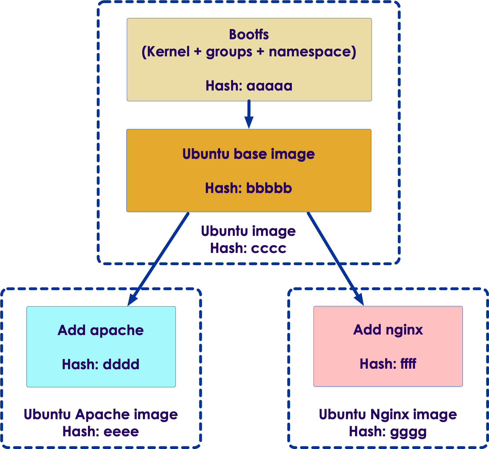
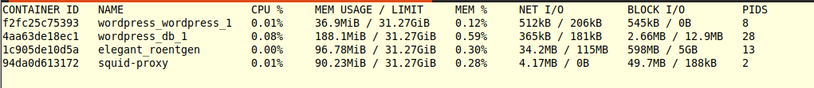
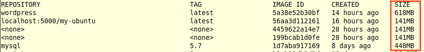

# Containers and Images

---

## Docker Images



* Docker images are composed of layers of file systems

* Each layer is **immutable** (can not be changed, once created)

* Each layer has a unique ID - it is a SHA256 hash
    - This is how layers are uniquely identified

* The final image is a collection of layers, it also has a unique ID

* Docker shares/reuses layers
    - Here we see the Apache image and Nginx images have base layers in common
    - When we download these images, docker will only download the base ubuntu image (cccc) and common layers ONCE

---

## Downloading Docker Images

* Before we run a docker container, we need a local copy of the image

* Docker images are hosted at registries like Dockerhub

* **`docker pull`** will download an image from registry to local machine

* Let's pull `alpine` - an ultra-lightweight Linux image, just 5MB in size (tiny).

```bash
$   docker pull alpine
```


Notes:

Instructor Notes :

Participant Notes :

Anyone who has used Github and Git will find the Docker syntax easy to remember.  Instead of using a copy of the source code repository, Docker will
store the binary container image (usually a hash) in a local place on the user's hard drive.

---

## Check Images

* **`docker images`** will show images we have _locally_

```bash
$   docker images
```

```text
REPOSITORY                  TAG                  IMAGE ID       CREATED         SIZE

alpine                      latest               14119a10abf4   12 days ago     5.6MB
ubuntu                      focal                f643c72bc252   9 months ago    72.9MB
nginx                       latest               f6d0b4767a6c   7 months ago    133MB
```

---

## Containers


* Containers have an extra 'writable layer' on top'

* Any filesystem changes made in the containers are saved in this top-RW layer
    - The underlying layers are read-only, and do not change

* So when we run multiple containers, they all share the common, immutable layers
    - This keeps the container sizes small
    - And their startup times are fast!

---

## Running a Container

* **`docker run`** is used to run containers

```bash
$   docker run alpine ls
```

* This will run `alpine` image and run `ls` command inside the container

* Here is the output

```console
bin    etc    lib    mnt    proc   run    srv    tmp    var
dev    home   media  opt    root   sbin   sys    usr
```

* The container will exit immediately

* Containers are designed to run a job and terminate

Notes:

Instructor Notes :

Participant Notes :

Docker containers can be started with "run" -- this is because it's better to look at running a container as more like an app than a VM.  

Alpine is extremely popular as mini-sized Linux to start containers.  While running with a starter like ubuntu certainly gives a lot more
power plus the familiarity with ordinary tools like "bash", alpine is great when all we really need is just enough of an OS to run our 
application.

---

## Running a Shell

* Here we are going to run a shell in interactive mode

```bash
$   docker container run -it --rm alpine /bin/ash
```

* Parameters explained:
   - -i : interactive mode
   - -t : terminal mode
   - --rm : remove container after we are done
   - /bin/ash : bash is big and needs to be installed.  ash (almquist shell) is small. We also have old-school sh.

* Output, we will see a shell prompt, displayed.

```console
/ #
```

* Execute a few commands

```console
/ # date
    Thu Sep  9 06:55:58 UTC 2021
/ # hostname
    fea51759ac90
```

Notes:

Instructor Notes :

Participant Notes :

Many users ask how to "ssh" to the container.  This isn't typically how we accomplish this, instead, what we do is to attach our terminal to the container.

Some containers we probably want to automatically stop when we are not longer using the container. This depends a lot of the use case.  If the container is
more of background service, then we probably do not want to do this.  However, if it is an interactive application then this is not a bad idea.

---

## See Running Containers

* **`docker ps`** will list all running containers

```bash
# Run two instances of alpine on two terminals
$   docker run -it alpine /bin/ash
$   docker run -it alpine /bin/ash

# list running containers
$   docker ps
```

* output

```console
CONTAINER ID   IMAGE   COMMAND    CREATED        STATUS     PORTS    NAMES 

80c43841fdb7   alpine  "/bin/ash" 10 seconds ago  Up 10 seconds        boring_franklin
fea51759ac90   alpine  "/bin/ash"  4 minutes ago  Up 4 minutes         brave_cannon
```

* Here we see 2 containers, running alpine image
    - Even though they are running the same image `alpine`, each container is a unique process
    - Each container has a unique **container id**

* `ps` will list running containers.  To see all containers, including stopped containers use **`docker ps -a`**

---

## Stopping the Containers

* Use **`docker stop`** to stop running containers

```bash
$   docker ps
```

```console
CONTAINER ID   IMAGE   COMMAND    CREATED        STATUS     PORTS    NAMES 

80c43841fdb7   alpine  "/bin/ash" 10 seconds ago  Up 10 seconds        boring_franklin
fea51759ac90   alpine  "/bin/ash"  4 minutes ago  Up 4 minutes         brave_cannon
```

* Stop 

```bash
$   docker stop 80c43841fdb7
$   docker ps
```

```console
CONTAINER ID   IMAGE   COMMAND    CREATED        STATUS     PORTS    NAMES 

fea51759ac90   alpine  "/bin/ash"  4 minutes ago  Up 4 minutes         brave_cannon
```

---

## Removing Containers

* **`stop`** just halts the containers
    - They are still in the system
    - Will use up storage 
    - it will also show up in **`docker ps -a`**

* To cleanup, use **`docker rm`**
    - This will delete all container related files from the system

* It is a good practice to call **`stop`** followed by **`rm`**

```bash
$   docker stop 80c43841fdb7
$   docker rm   80c43841fdb7
```

Notes:

Instructor Notes :

Participant Notes :

Running "docker rm" is a good way to clean up and de-clutter our container registry.  That said, one should not expect to save lots of space by running docker rm,
because even larger container images are stored in the base repository, and deleing our derived images from these will not save an extraordinary amount of space.  
Remember, Docker overlays changes from one filesystem to the next, so only the changes will be removed..

---

## Removing a Images

* **`docker rm`** only deletes the container instance (e.g. 80c43841fdb7)
    - It does **NOT** delete the container **image**.  (e.g. alpine)
    - The container image is from Docker Hub or another repo.
    - It is stored locally in our local repo.

* Use **`docker rmi`** to delete image

```bash
$   docker rmi alpine
```

Notes:

Instructor Notes :

Participant Notes :

We differentiate between the container image and the container instance.  The image is not going to be directly deleted this way, but the instance
will be. 

Knowing the difference between instance and image is extremely important.

---

## Monitoring Resource Usage

* **`docker stats`** will  display resource usage by all running containers



* **`docker images`** will show disk usage by images



---

## Cleanup

* Overtime, docker images accumulate and they will be consuming a bunch of disk space

* **`docker images`** can show disk usage by images

* **Dangling images** are not referenced by other images and are safe to delete
    - Find these by **`docker images -f "dangling=true"`**
    - They will usually have no tags
    - Use command: **`docker rmi -f $(docker images -f "dangling=true" -q)`**

```console
REPOSITORY                   TAG       IMAGE ID       CREATED        SIZE
<none>                       <none>    4459622a14e7   28 hours ago   141MB
<none>                       <none>    199bcab1d0fe   28 hours ago   141MB
```

* **`docker system prune`** is a very effective command to clean up dangling images, stopped containers and unused networks

---

## Lab Prep

<!-- {"left" : 6.76, "top" : 0.88, "height" : 4.37, "width" : 3.28} -->

* **Overview:**
  - Get access to lab environment

* **Approximate run time:**
  - 10 mins

* **Instructions:**
  - Instructor please distribute the lab environment details
  - Demo accessing lab machine

Notes:

---

## Lab: Installing Docker

<!-- {"left" : 6.76, "top" : 0.88, "height" : 4.37, "width" : 3.28} -->

* **Overview:**
  - Install docker

* **Approximate run time:**
  - 15 mins

* **Instructions:**
  - 01-Install
  - Follow the instructions for your platform

Notes:

---

## Lab: Running Containers

<!-- {"left" : 6.76, "top" : 0.88, "height" : 4.37, "width" : 3.28} -->

* **Overview:**
  - Run containers

* **Approximate run time:**
  - 20-30 mins

* **Instructions:**
  - complete all container labs

Notes:

---

## Lab: Images

<!-- {"left" : 6.76, "top" : 0.88, "height" : 4.37, "width" : 3.28} -->

* **Overview:**
  - Run images

* **Approximate run time:**
  - 20-30 mins

* **Instructions:**
  - complete all image labs

Notes:

---

## Review and Q&A

<!-- {"left" : 8.56, "top" : 1.21, "height" : 1.15, "width" : 1.55} -->
<!-- {"left" : 6.53, "top" : 2.66, "height" : 2.52, "width" : 3.79} -->

* Let's go over what we have covered so far

* Any questions?
