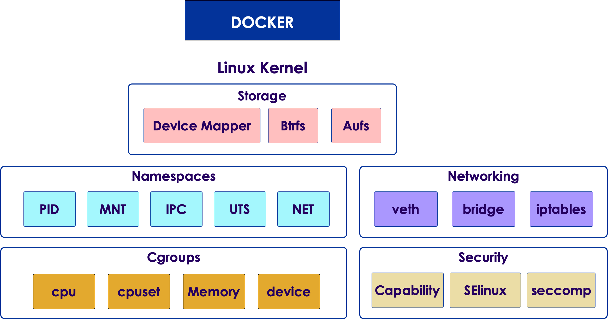

# Docker Introduction

---

## Docker

* Docker was introduced to the world with a very little fanfare by Solomon Hykes, founder and CEO of a company then called dotCloud, in a five-minute [lightning talk](https://www.youtube.com/watch?v=wW9CAH9nSLs) at the Python Developers Conference in Santa Clara, California on March 15, 2013  ([Source](https://learning.oreilly.com/library/view/docker-up/9781492036722/ch01.html#promise-of-docker))

* Since then, it has become one of the most influencing technologies for software development and deployment

* Docker at the core uses [Linux Containers](https://linuxcontainers.org/), which has been available publicly since 2008

* How ever, the way Docker combined multiple technologies and made them easy to use, is one of the reasons it became so popular, and made **Docker more powerful than sum of its all parts**

* [Docker.com](https://www.docker.com/)  ([formerly dotCloud](https://www.docker.com/docker-news-and-press/dotcloud-inc-now-docker-inc)) is the company that is commercially supporting Docker

---

## What is Docker?

* Docker is the current **industry standard container format**
    - Allows package and ship software in **self-contained containers**
    - Provides **isolation without performance hit**

* **What docker is NOT**
    - It is _not a virtualization platform_ like VMWare or KVM
    - It is _not a cloud platform_ like OpenStack
    - It is _not a configuration management tool_ like Chef, Puppet
    - It is _not a orchestration tool_ like Mesos, Kubernetes
    - It is _not a virtualization tool_ like VirtualBox, Vagrant

Notes:

Instructor Notes :

Participant Notes :

Docker's name is almost synonymous with containers.   While arguably Docker's contribution
is not the largest or the most significant to the container ecosystem, it is the one that
is closest to the developer -- as the developer relies on Docker tools to create container
application images.

---

## Docker Architecture

* Docker uses the host kernel on Linux, and thus runs natively

* Unlike virtual machines, docker containers do not have their own guest OS, **they share the host OS**

* Containers run **isolated, in user space**

* References: [1](https://www.docker.com/resources/what-container)

---

## Docker Internals

* Docker takes advantage of Linux kernel features like **namespaces**,  **cgroups**, **networking stack**  and **layered file systems**

* **Namespaces** allow an isolated workspace for each container

* Containers get isolated process ids, networking, storage ..etc

* Docker is written in [Go programming language](https://golang.org/)
    - Go was created at Google by the original C-language designers  (Rob Pike, and Ken Thompson), to be a modern and high performance language

* References
    - [Understanding the Docker Internals](https://medium.com/@BeNitinAgarwal/understanding-the-docker-internals-7ccb052ce9fe)
    - [Docker internals](http://docker-saigon.github.io/post/Docker-Internals/)

---

## Docker Desktop for Windows (Developer)

 * Docker Desktop for Windows has the following requirements:
   * Windows 10 Professional 64 Bit (or Higher)  (not Home, Not Home Pro)
   * Virtualization Extensions Available in CPU and turned on in BIOS.
   * Hyper-V (optional component) installed
   * Reasonable CPU / Memory requirements
 * Docker Toolbox
   * Windows Users unable to run Docker Desktop for Windows can run in Docker Toolbox
   * Toolbox requires Oracle VirtualBox for Virtualization.

Notes:

Instructor Notes :

Participant Notes :
Docker Desktop for Windows has fairly steep requirements.

Why does Docker require Hyper-V?  Because all containers on Windows require virtualization. Even windows containers require virtualization because those containers require Windows Server kernels which are different from Windows 10 (client) kernels.

Hyper-V does not run on Windows Home versions (most consumer-grade windows machines).  So, Docker Desktop for Windows will not run on those versions either.  One needs a Windows Professional.

Hyper-V will require that Virtualization extensions be turned on in the BIOS.  Typically, from the factory these are turned off on client machines for security reasons, as some exploits have targeted these instruction sets.

Docker Toolbox can be used together with Oracle VirtualBox to run Docker containers on older versions of windows such as 8.1 or 7 or on Home versions of Windows 10.  However, it’s a pretty painful developer experience, so it’s not recommended.

---

## Docker and Windows Server

* Docker for Windows Server is designed for App deployment rather than Development
  - Developers should use Docker Desktop for Windows instead.
  - Supports running Linux containers containers (via Hyper-V)
  - And Native Windows Containers (using Hyper-V or native Windows Containers)
* Native Windows Containers
  - Native Windows Containers must use the same Windows Server kernel as the host
  - Both host and guest must be Windows Server to run native (not Windows 10)
  - Native Windows Containers must use Windows Server kernel
  - Able to run native containers without virtualization
  - Minimal Performance Penalty

Notes:

Instructor Notes :

Participant Notes :

Native Windows Containers are not all that common at this time, but Microsoft is pushing them because they
realize that the Windows platform needs to be have this capability to continue to be relevant as a server-side
platform.  

---

## Docker and WSL 2

* Microsoft is including a full Linux kernel in the new Windows Subsystem For Linux 2
    - A bit of a "hell freezes over" moment considering history!
    - This is an **optional** install intended for developers only.

* This allows Windows users to install a full Ubuntu (or other distro) on top of Windows.

* This also allows Docker Users to run a native Linux conatiner on Windows (without using Hyper-V)!   - with the performance advantages of running native.

* Docker has a special Docker Desktop for WSL2 available for this.
    - It is a different product than Docker Desktop for Windows, and **beta** software
    - The two can be installed in parallel

* [Docker Desktop WSL 2 backend](https://docs.docker.com/desktop/windows/wsl/)

---

## Docker on Windows Use Cases

|                     | Windows 10 (Linux Kernel) | Windows 10 (Windows Server Kernel) | Windows Server (Virtualized Kernel) | Windows Server (Native Kernel) |
|---------------------|---------------------------|------------------------------------|-------------------------------------|--------------------------------|
| Use Case            | Developer                 | Developer                          | Deployment                          | Deployment                     |
| Container OS        | Linux                     | Windows Server                     | Linux or Windows Server             | Windows Server                 |
| Isolation from Host | Yes (via Hyper-V)         | Yes (via Hyper-V)                  | Yes (via Hyper-V)                   | Not Virtualized                |
| Startup Delay       | 500ms - 1s                | 500ms - 1s                         | 500ms - 1s                          | No Delay                       |

Notes:

Instructor Notes :

Participant Notes :

This slides shows the relative use cases of various use cases on Windows. Docker realizes that Windows is its most common platform for development, even for applications 
that will not be deployed on Windows.  Because of this, the Windows platform has the richest number of options.  Windows users need to choose between developing 
"native" Windows server containers or Linu containers.  The advantage of the native containers is that there is minimal delay in starting a native container,
similar to what one would expect on Linux platforms.

---

## Docker Desktop on Mac (Developer)

* Docker Desktop on Mac is only supported as a development platform.
  - There are no "native" mac containers as there are on Linux and Windows

* Docker for Mac uses only Linux containers
  - Windows containers can be run entirely inside a VM (but this is not common)
  - Linux Containers use a VM for the Linux kernel only (much like Windows)

* Docker for Mac uses Apple’s VM Hypervisor
  - Note the Mac's BSD-based darwin kernel is not Linux and therefore must run a virtualized Linux Kernel.
  - Usually turned on factory default (unlike most PCs), No special actions required.

Notes:

Instructor Notes :

Participant Notes :

Apple is an extremely popular platform for development, so it comes as no surprise that Docker has versions for this platform.  As Apple has no real presence in the 
data center, it is strictly for development.

While it's often thought that Apple is built on top of Unix, it has chosen BSD Unix as its base, which is not compatible with the Linux Kernel.  So, like Windows,
Mac users must run in a VM, though unlike Windows, all modern Mac systems are capable of running virtualization without any special actions. 

There is no way to run "native" Windows containers on Mac, except for in a VM.  This isn't a common use case.

---

# Docker Architecture

---

## Docker Architecture

---

## Docker Images

* **Docker Images** can be considered 'templates'

* Images can be hosted on registries

* Here we see images for Ubuntu, Nginx ..etc

* We only need  **one copy of image on host**

---

## Docker Containers

* **Docker Containers** are instances of images

* We can run multiple containers for a same image
    - Here we see 2 ubuntu instances and 2 nginx instances running

* Containers run in isolation

---

## Docker Clients

* Docker service/daemon runs on host computers

* We interact with docker daemon using client

* Here we see the client issuing commands (build/pull/run)

---

## Container Registry

* **Registries** are like _App Store_ for docker images

* **Docker Hub** is a popular registry of containers

* Developers can publish and share images with the world

* Thousands of Containers Available

* We rarely start from scratch

- Use an image from Docker Hub!

Notes:

Instructor Notes :

Participant Notes :

If Docker's container image format is its first great contribution, Docker Hub and similar container registries are the second. The fact that users can
share and get container images from Docker Hub is a huge catalyst to containers, as it allows code to be shared across multiple teams.  More importantly,
it means there's no reason to re-invent the wheel. In fact, Docker Hub is designed to minimize re-invention of any kind.

We will see later how Docker's build process allows us to leverage other people's work.

---

## Other Container Registries

* **Docker Hub** is the most popular registry
    - Like Github, has free and premium accounts
    - Has individual and organizational accounts

* Cloud vendors have their own registries as well:
    - Google Cloud : [Google Container Registry (GCR)](https://cloud.google.com/container-registry)
    - Amazon Cloud [Elastic Container Registry](https://aws.amazon.com/ecr/)
    - Microsoft [Azure Container Registry (ACR)](https://aws.amazon.com/ecr/)

* If you are running in the cloud, use the cloud providers' registries
    - Much higher bandwidth for publishing / downloading images --> faster upload/download times
    - You won't incur bandwidth charges

* Enterprises can host their own private registries as well

Notes:

Instructor Notes :

Participant Notes :

Corporate environments invariably have Docker Hub blocked, much like Maven repository coordinate and Github itself. Because of this, companies are able to use
private container registries.  In fact, this is encouraged in Docker and rarely will someone attempt to put something out on public Docker Hub unless there is a
very good reason to do so.

The doesn't mean that one can't use Docker Hub.  If you want to start with, say, a basic linux image, using something from Docker Hub as a start makes
a lot of sense. Many corporate container registries will also mirror some or all Docker Hub artifacts.

---

## Group Lab: Exploring Docker Hub

<!-- {"left" : 6.76, "top" : 0.88, "height" : 4.37, "width" : 3.28} -->

* **Overview:**
  - Explore DockerHub
  - Find some popular images

* **Approximate run time:**
  - 10 mins

* **Instructions:**
  - Look for these images
  - Operating systems: Ubuntu, alpine, busybox
  - Applications: nginx, httpd
  - Datastores : mysql, Oracle, redis
  - Development systems: python, jupyter, tensorflow
  - Discuss any other interesting images you find
  - Note the 'download count' for these images

Notes:

---

## Review and Q&A

<!-- {"left" : 8.56, "top" : 1.21, "height" : 1.15, "width" : 1.55} -->
<!-- {"left" : 6.53, "top" : 2.66, "height" : 2.52, "width" : 3.79} -->

* Let's go over what we have covered so far

* Any questions?
