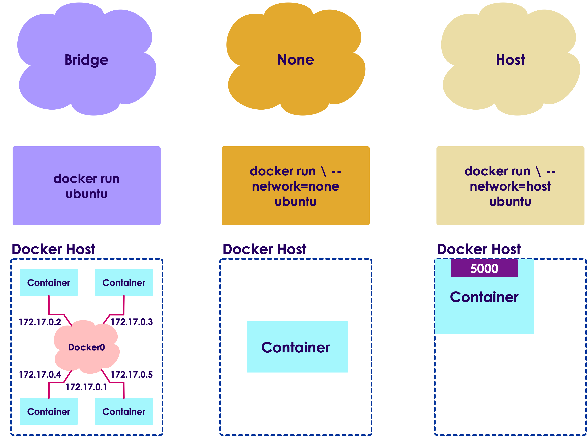
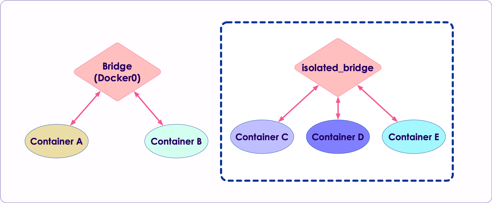

# Docker Networking and Storage

---

# Docker Networking

---

## Docker Networking


* Docker will create 3 networks by default

* **Bridge network** is the default one

* The **none network** is local to the container – it has localhost

* The **host network** gives the container the same network as the host


```bash
$   docker network ls
```

```console
NETWORK ID     NAME                DRIVER    SCOPE
dc09a3699c8f   bridge              bridge    local
71347a332fe7   host                host      local
d28a41f8631c   none                null      local
```

---

## Bridge Networking

* The Bridge network assigns IPs in the range of 172.17.x.x to the containers within it

* Here we see the network gateway **`docker0`** has 172.17.0.1

* And other containers are getting IPs 172.17.0.2 and so on

* On a bridge network, containers can reach other



Notes:

 Image credit : https://towardsdatascience.com/docker-networking-919461b7f498

---

## Bridge Networking

* Containers can access each other using names
    - So no need to hard-code IP addresses

* This is facilitated by Docker DNS, which runs on the address **`127.0.0.11`**

```bash
$   docker run -d  --name web   nginx
$   docker run -d  --name mysql mysql
```


Notes:

 Image credit : https://towardsdatascience.com/docker-networking-919461b7f498

---

## Port Mapping

* In bridge network mode, even though containers can access each other,  they can not be reached from outside

* On the left, we have nginx container running.  Nginx is listening on port 80 of the container, but not accessible from outside

* On right, we are mapping port 8000 on host to port 80 of nginx container

```bash
# map host:8000 --> containger:80
$   docker run -d  --name nginx  -p 8000:80   nginx

# access like this (on host)
$   curl  localhost:8000
```

<br clear="all"/>


---

## Host Networking

* A container attached to a host network has the same network as the host

* It has the same network configuration as the host

* Host networking is not widely used anymore

---

## None Network

* A container attached to a none network has no network

* It has only a localhost interface (itself)

* It can't communicate with other networked containers
    - isolated container

* It is not used much any more

---

## User Defined Network

* Docker allows custom defined network setup

* Here we have the default **bridge network**.  Containers A & B are attached to it

* Then we have a user-defined network **isolated_bridge**
    - Containers C, D, E are connected to it
    - They can only communicate among themselves
    - Can not reach A or B




---

## User Defined Networking

* Here is an example of user-defined-network

* Define network

```bash
$   docker network create --driver bridge alpine-net

$   docker network ls
```

```console
NETWORK ID     NAME              DRIVER    SCOPE
08a266c30831   alpine-net        bridge    local
dc09a3699c8f   bridge            bridge    local
71347a332fe7   host              host      local
d28a41f8631c   none              null      local
```

* Launch containers into network (`--network alpine-net`)

```bash
 $  docker run -dit --name alpine1 --network alpine-net alpine ash
 $  docker run -dit --name alpine2 --network alpine-net alpine ash
 $  docker run -dit --name alpine3 --network alpine-net alpine ash
```

---

## Lab: Networking - Port Mapping

<!-- {"left" : 6.76, "top" : 0.88, "height" : 4.37, "width" : 3.28} -->

* **Overview:**
  - Run nginx with port mapping

* **Approximate run time:**
  - 20 mins

* **Instructions:**
  - Network-1

Notes:

---

# Docker Storage

---

## Container Data


* By default all files created inside a container are stored on a writable container layer

* The data doesn’t persist when that container exits

* This is fine for most applications, the data created during container run, is 'scratch data' ; Doesn't need to be persisted

* How ever, certain container applications like a databases, will need to persist the data

---

## Persistent Storage

* 4 Options for Persistent Storage:
    - Volumes
    - Bind Mounts
    - tmpfs mount (only on Linux hosts)
    - Named Pipe (only on Windows Hosts)

---

## Bind Mounts


* Oldest way of sharing data with host and container (now usually discouraged)

* A directory on host machine is mounted into the container

* Advantages
    - Very performant

* Disadvantages:
    - Break isolation of container (container can modify host data)
    - Requires a specfic directory layout on host.
    - Unmanaged (No control of shared access to files)

---

## Bind Mount Use Cases


* Bind Mounts have some few use cases
    - configuration (`/etc`) type files
    - Shared build artifacts like `.jar` files or `.so` files
    - Sharing log files between host and container
    - secrets

* Syntax: **`-v host_dir_location:container_dir_location`**

```bash
# /mysql-data @ host --> /var/lib/mysql @ container
$   docker run -d -v /mysql-data:/var/lib/mysql  mysql

# /nginx-config @ host --> /etc/nginx @ container, 
# read-only, so the container can not modify the data
$   docker run -d -v /nginx-config:/etc/nginx:ro  nginx

# /var/log @ host --> /logs @ container, read-only
$   docker run -d -v /var/log:/logs:ro  fluentd
```

---

## Docker Volumes

* Volumes are managed and controlled By Docker

* 2 Types
   - named (user provides)
   - anonymous (generates a guaranteed unique name)

* Volume Drivers
   - allows storage on remote hosts such as Amazon S3
   - Can drive NAS/SAN remotely attached storage

* Recommended for **most** use cases
    - Sharing data among multiple running containers;  Automatically synchronizes access to shared resources
    - Decouple host filesystem from container
    - Can backup/snapshot volumes easily

---

## Using Docker Volumes

```bash
# create
$   docker volume create --name mysql-data

# use
$   docker run -it --rm -v mysql-data:/var/lib/mysql    mysql
```


---

## Volume Management

* Inspect a volume:

```bash
$ docker volume inspect my-vol
```

```json
[
    {
        "Driver": "local",
        "Labels": {},
        "Mountpoint": "/var/lib/docker/volumes/my-vol/_data",
        "Name": "my-vol",
        "Options": {},
        "Scope": "local"
    }
]
```

* Removing a volume

```bash
$ docker volume rm my-vol
```

---

## Docker Volumes

* Managed volumes are stored under `/var/lib/docker` directory


---

## Volume Summary

* Volumes are easier to back up or migrate than bind mounts.

* You can manage volumes using Docker CLI commands or the Docker API.

* Volumes work on both Linux and Windows containers.

* Volumes can be more safely shared among multiple containers.

* Volume drivers let you store volumes on remote hosts or cloud providers, to encrypt the contents of volumes, or to add other functionality.

* New volumes can have their content pre-populated by a container.

---

## TmpFS mounts


* `tmpfs` mounts are for whenver we need temporary storage such as `/tmp` directories

* TMPFS is allocated in host memory; when container stops the memory is removed

* This is good for
    - Sharing secrets data such as passwords, ssh keys
    - Also good for sensitive data or data protected by privacy regulatory constraints

* Limitations:
    - Can’t share tmpfs mounts between containers
    - Only available on Linux

```bash
# the '/tmp' dir within container is a tmpfs
$   docker run -d --tmpfs /tmp  nginx:latest
```

---

## Named Pipes

* Used on Windows Hosts (Container *itself* can be Linux or Windows)

* Allows communication between host Windows Services and Docker container applications

* Also good with interacting with Powershell Commands and .NET Runtime on host

* Easy to Deploy

---

## Docker Storage Summary

| Volumes                                | Bind Mounts                                      | Tmpfs                                        | Named Pipes  |
|----------------------------------------|--------------------------------------------------|----------------------------------------------|--------------|
| Easy to use                            | Easy to use                                      | Share secret data between host and container | Windows only |
| Easily sharable across many containers | Used for sharing data between host and container | Linux only                                   |              |
| Managed by docker                      |                                                  |                                              |              |

---

## Lab: Storage - Using Volumes

<!-- {"left" : 6.76, "top" : 0.88, "height" : 4.37, "width" : 3.28} -->

* **Overview:**
  - Define and use docker volumes

* **Approximate run time:**
  - 20 mins

* **Instructions:**
  - Storage-1

Notes:

---

## Lab: Storage - Using Bind Mounts

<!-- {"left" : 6.76, "top" : 0.88, "height" : 4.37, "width" : 3.28} -->

* **Overview:**
  - use bind mount feature

* **Approximate run time:**
  - 20 mins

* **Instructions:**
  - Storage-2

Notes:

---
## Lab: Storage - Sharing data with nginx

<!-- {"left" : 6.76, "top" : 0.88, "height" : 4.37, "width" : 3.28} -->

* **Overview:**
  - Sharing data with nginx

* **Approximate run time:**
  - 20-30 mins

* **Instructions:**
  - Storage-3

Notes:

---

## Review and Q&A

<!-- {"left" : 8.56, "top" : 1.21, "height" : 1.15, "width" : 1.55} -->
<!-- {"left" : 6.53, "top" : 2.66, "height" : 2.52, "width" : 3.79} -->

* Let's go over what we have covered so far

* Any questions?
