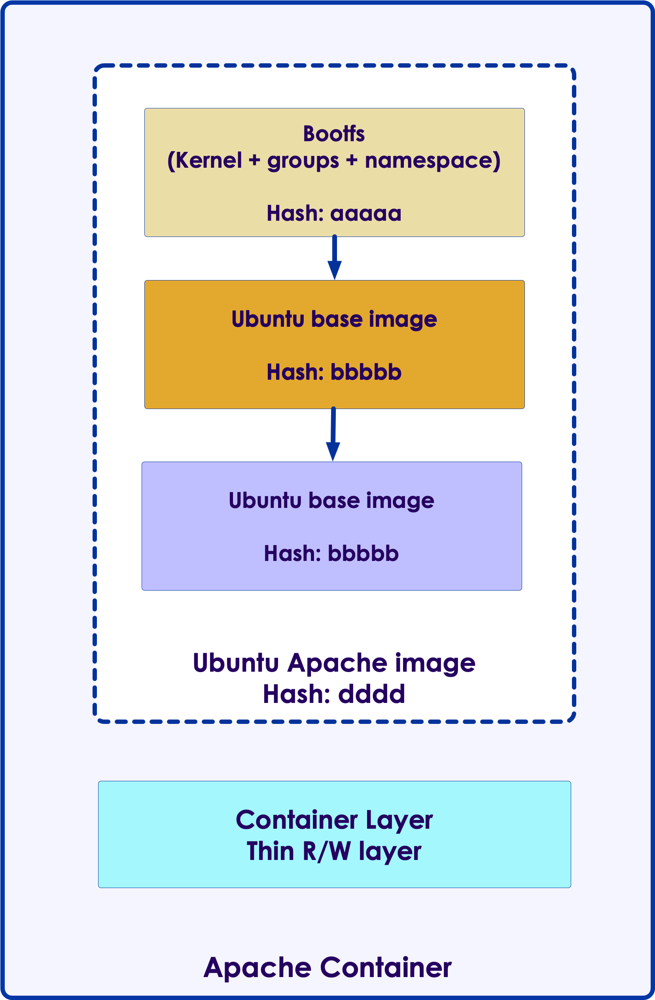

# Docker Networking and Storage

---

# Docker Storage

---

## Container Data



* By default all files created inside a container are stored on a writable container layer

* The data doesn’t persist when that container exits

* This is fine for most applications, the data created during container run, is 'scratch data' ; Doesn't need to be persisted

* How ever, certain container applications like a databases, will need to persist the data

---

## Persistent Storage

* 4 Options for Persistent Storage:
    - Volumes
    - Bind Mounts
    - tmpfs mount (only on Linux hosts)
    - Named Pipe (only on Windows Hosts)

---

## Bind Mounts


* Oldest way of sharing data with host and container (now usually discouraged)

* A directory on host machine is mounted into the container

* Advantages
    - Very performant

* Disadvantages:
    - Break isolation of container (container can modify host data)
    - Requires a specfic directory layout on host.
    - Unmanaged (No control of shared access to files)

---

## Bind Mount Use Cases


* Bind Mounts have some few use cases
    - configuration (`/etc`) type files
    - Shared build artifacts like `.jar` files or `.so` files
    - Sharing log files between host and container
    - secrets

* Syntax: **`-v host_dir_location:container_dir_location`**

```bash
# /mysql-data @ host --> /var/lib/mysql @ container
$   docker run -d -v /mysql-data:/var/lib/mysql  mysql

# /nginx-config @ host --> /etc/nginx @ container, 
# read-only, so the container can not modify the data
$   docker run -d -v /nginx-config:/etc/nginx:ro  nginx

# /var/log @ host --> /logs @ container, read-only
$   docker run -d -v /var/log:/logs:ro  fluentd
```

---

## Docker Volumes

* Volumes are managed and controlled By Docker

* 2 Types
   - named (user provides)
   - anonymous (generates a guaranteed unique name)

* Volume Drivers
   - allows storage on remote hosts such as Amazon S3
   - Can drive NAS/SAN remotely attached storage

* Recommended for **most** use cases
    - Sharing data among multiple running containers;  Automatically synchronizes access to shared resources
    - Decouple host filesystem from container
    - Can backup/snapshot volumes easily

---

## Using Docker Volumes

```bash
# create
$   docker volume create --name mysql-data

# use
$   docker run -it --rm -v mysql-data:/var/lib/mysql    mysql
```


---

## Volume Management

* Inspect a volume:

```bash
$ docker volume inspect my-vol
```

```json
[
    {
        "Driver": "local",
        "Labels": {},
        "Mountpoint": "/var/lib/docker/volumes/my-vol/_data",
        "Name": "my-vol",
        "Options": {},
        "Scope": "local"
    }
]
```

* Removing a volume

```bash
$ docker volume rm my-vol
```

---

## Volume Summary

* Volumes are easier to back up or migrate than bind mounts.

* You can manage volumes using Docker CLI commands or the Docker API.

* Volumes work on both Linux and Windows containers.

* Volumes can be more safely shared among multiple containers.

* Volume drivers let you store volumes on remote hosts or cloud providers, to encrypt the contents of volumes, or to add other functionality.

* New volumes can have their content pre-populated by a container.

---

## TmpFS mounts


* `tmpfs` mounts are for whenver we need temporary storage such as `/tmp` directories

* TMPFS is allocated in host memory; when container stops the memory is removed

* This is good for
    - Sharing secrets data such as passwords, ssh keys
    - Also good for sensitive data or data protected by privacy regulatory constraints

* Limitations:
    - Can’t share tmpfs mounts between containers
    - Only available on Linux

```bash
# the '/tmp' dir within container is a tmpfs
$   docker run -d --tmpfs /tmp  nginx:latest
```

---

## Named Pipes

* Used on Windows Hosts (Container *itself* can be Linux or Windows)

* Allows communication between host Windows Services and Docker container applications

* Also good with interacting with Powershell Commands and .NET Runtime on host

* Easy to Deploy

---

## Docker Storage Summary

| Volumes                                | Bind Mounts                                      | Tmpfs                                        | Named Pipes  |
|----------------------------------------|--------------------------------------------------|----------------------------------------------|--------------|
| Easy to use                            | Easy to use                                      | Share secret data between host and container | Windows only |
| Easily sharable across many containers | Used for sharing data between host and container | Linux only                                   |              |
| Managed by docker                      |                                                  |                                              |              |

---

# Docker Networking

---