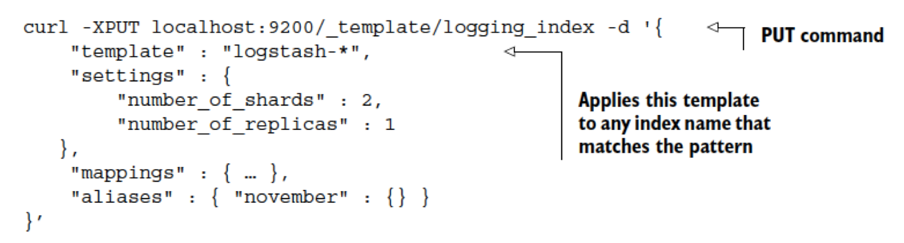
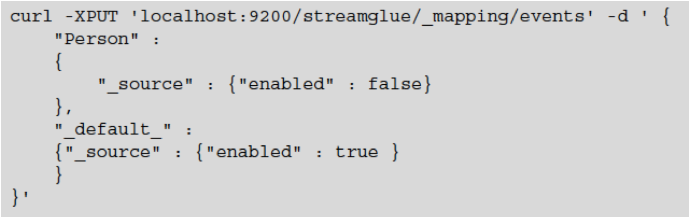

# Elasticsearch Administration
---
## ...

* Improving default configuration settings
  - Creating default index settings with templates
  - Monitoring for performance
  - Using backup and restore

---

## Improving Defaults

* Although the out-of-the-box Elasticsearch configuration will satisfy the needs of most users, it’s important to note that it’s a highly flexible system that can be tuned beyond
* its default settings for increased performance.
* Most uses of Elasticsearch in production environments may fall into the category of occasional full-text search, but a growing number of deployments are pushing formerly
* edge-case uses into more common installations, such as the growing trends of using Elasticsearch as a sole source of data, logging aggregators, and even using it in hybrid storage architectures where it’s used in conjunction with other database types.
* These exciting new uses open the door for us to explore interesting ways in which to tune and optimize the Elasticsearch default settings.

Notes:

---

## Index Templates - Reasons

* Creating new indices and associated mappings in Elasticsearch is normally a simple
* task once the initial design planning has been completed. But there are some scenarios
* in which future indices must be created with the same settings and mappings as
* the previous ones. These scenarios include the following:

Notes:

---

## Index Templates

* Log aggregation—In this situation a daily log index is needed for efficient querying
and storage, much as rolling log file appenders work. A common example of this is found in cloud-based deployments, where distributed systems push their logs onto a central Elasticsearch cluster. Configuring the cluster to handle automatic templating of log data by day helps organize the data and eases searching for the proverbial needle in the haystack.
* Regulatory compliance—Here blocks of data must be either kept or removed after
a certain time period to meet compliance standards, as in financial sector companies
where Sarbanes-Oxley compliance is mandated. These sorts of mandates require organized record keeping where template systems shine.
* Multi-tenancy—Systems that create new tenants dynamically often have a need to compartmentalize tenant-specific data.

Notes:

---

## Create New Index

<!-- {"left" : 0.26, "top" : 2.67, "height" : 2.62, "width" : 9.73} -->

Notes:

---
## Default Mappings

* As you learned in chapter 2, mappings enable you to define specific fields, their types, and even how Elasticsearch will interpret and store them. Furthermore, you learned
* how Elasticsearch supports dynamic mapping in chapter 3, removing the need to define your mappings at index-creation time; instead those mappings are dynamically generated based on the content of the initial document you index. This section, much
* like the previous one that covered default index templates, will introduce you to the
* concept of specifying default mappings, which act as a convenience utility for repetitive

---
## Default Mappings

* mapping creation.
* We just showed you how index templates can be used to save time and add uniformity across similar datatypes. Default mappings have the same beneficial effects and
* can be thought of in the same vein as templates for mapping types. Default mappings are most often used when there are indices with similar fields. Specifying a default
* mapping in one place removes the need to repeatedly specify it across every index.

Notes:

---

## Mappings are Not Retroactive

* Note that specifying a default mapping doesn’t apply the mapping retroactively.
* Default mappings are applied only to newly created types.

Notes:

---

## Non-Retroactive Mapping

* In this case, all new mappings will by default store the document _source, but any
* mapping of type Person, by default, will not. Note that you can override this behavior
* in individual mapping specifications.

 

<!-- {"left" : 1.02, "top" : 4.1, "height" : 2.59, "width" : 8.21} -->

Notes:

---

## Default is Dynamic Mapping

* By default, Elasticsearch employs dynamic mapping:  the ability to determine the datatype
* for new fields within a document. You may have experienced this when you first
* indexed a document and noticed that Elasticsearch dynamically created a mapping
* for it as well as the datatype for each of the fields. You can alter this behavior by
* instructing Elasticsearch to ignore new fields or even throw exceptions on unknown
* fields. You’d normally want to restrict the new addition of fields to prevent data pollution
* and help maintain control over the schema definition.

Notes:

---

## Adding-Dynamic Mapping.png

<!-- {"left" : 0.24, "top" : 2.73, "height" : 3.61, "width" : 9.77} -->

Notes:

---

## Performance Tricks

* Trading network trips for less data and better distributed scoring
* DISTRIBUTED SCORING

Notes:

---

## Summary of Admin Tricks 

* Use the bulk API to combine multiple index, create, update, or delete operationsin the same request. To combine multiple get or search requests, you can use the multiget or multisearchAPI, respectively. A flush operation commits in-memory Lucene segments to disk when the indexbuffer size is full, the transaction log is too large, or too much time has passedsince the last flush.

Notes:

---

## Summary of Admin Tricks 

* A refresh makes new segments—flushed or not—available for searching. Duringheavy indexing, it’s best to lower the refresh rate or disable refresh The merge policy can be tuned for more or less segments. Fewer segmentsmake searches faster, but merges take more CPU time. More segments makeindexing faster by spending less time on merging, but searches will be slower.

Notes:

---

## Summary of Admin Tricks 

* An optimize operation forces a merge, which works well for static indices thatget lots of searches. Store throttling may limit indexing performance by making merges fall behind.Increase or remove the limits if you have fast I/O. Combine filters that use bitsets in a bool filter and filters that don’t in and/or/not filters. Cache counts and aggregations in the shard query cache if you have static indices. Monitor JVM heap and leave enough headroom so you don’t experienceheavy garbage collection or out-of-memory errors, but leave some RAM for OScaches, too.

Notes:

---

## Summary of Admin Tricks 

* Use index warmers if the first query is too slow and you don’t mind slowerindexing. If you have room for bigger indices, using ngrams and shingles instead of fuzzy,wildcard, or phrase queries should make your searches faster. You can often avoid using scripts by creating new fields with needed data inyour documents before indexing them. Try to use Lucene expressions, term statistics, and field data in your scriptswhenever they fit.

Notes:

---

## Summary of Admin Tricks 

* If your scripts don’t need to change often, look at appendix B to learn how towrite a native script in an Elasticsearch plugin. Use dfs_query_then_fetch if you don’t have balanced document frequenciesbetween shards. Use the count search type if you don’t need any hits and the scan search type ifyou need many.

