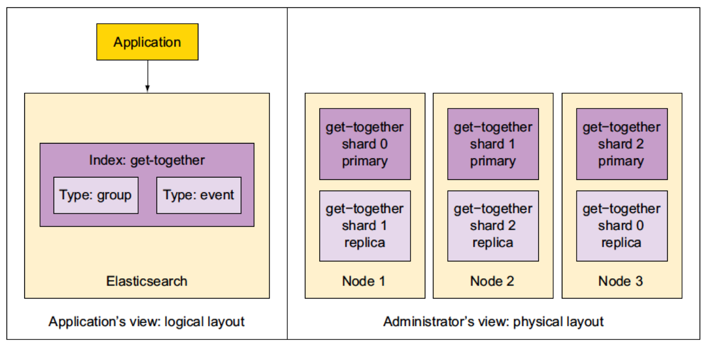
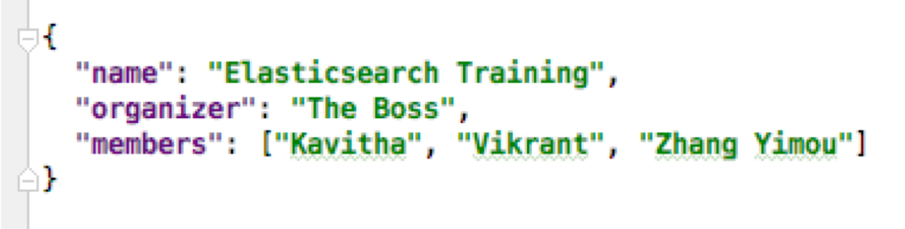
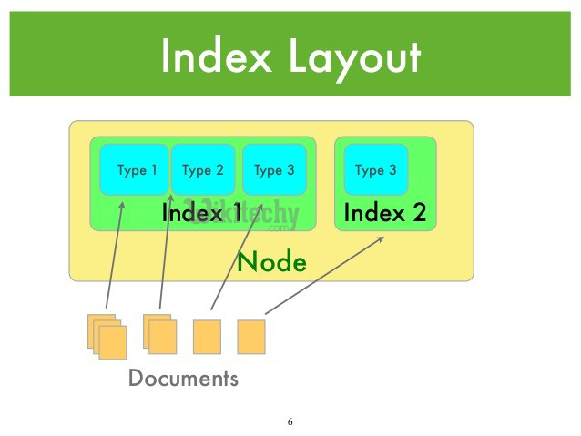
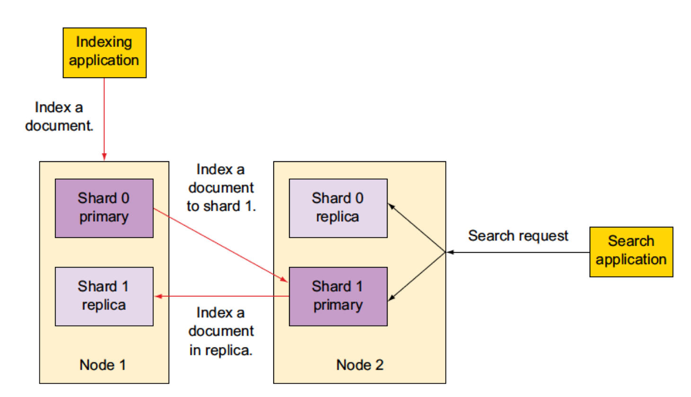
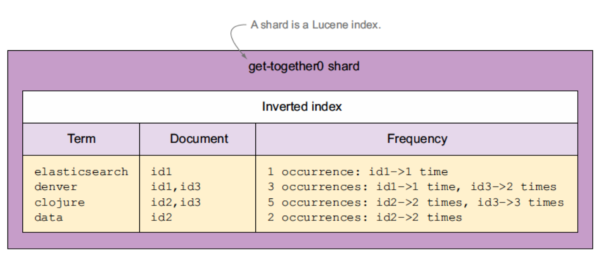
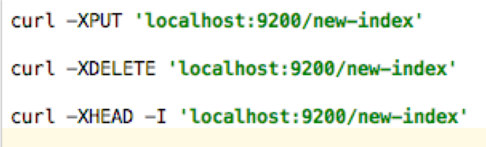

# Elasticsearch
---

## Section Objectives

* Understand search and Elasticsearch concepts
* Being able to install and run Elasticsearch, index data, run queries
* Understand and use Elasticsearch responses

Notes:

---

# Elasticsearch introduction

---

## Elasticsearch features

* Scalable
‫*‬ Ready to deploy
‫*‬ Optimized for search
‫*‬ Large volumes of documents (millions of documents)
‫*‬ Text-centric (natural-language text, like emails, web pages, resumes, PDF documents, and ‫*‬ social messages such as tweets or blogs)
‫*‬ Results sorted by relevance

Notes:

---

## Elasticsearch features cont’d

* Read-dominant.
  - Although, there is near real-time search (NRT)
* Document-oriented (not DB, not large file storage)
* Flexible schema (similar to NoSQL)

Notes:

---

## Elasticsearch Cluster Indices

Notes:
https://qbox.io/blog/optimizing-elasticsearch-how-many-shards-per-index

---

## Elasticsearch features – user experience

* Pagination
* Sorting
* Auto-suggest
* Spell-checking
* Hit highlighting
* Geospatial search

Notes:

---

## Elasticsearch Features for Developers

* Result grouping/field collapsing
* Flexible query support
* Joins
* Document clustering
* Importing rich document formats such as PDF and Word
* Importing data from relational databases
* Multilingual support

Notes:

---

## Elasticsearch Performance Features

* Near real-time search
* Atomic updates with optimistic concurrency
* Real-time get (before commit)
* Write durability using a transaction log
* Automatic sharding and replication using “ZooKeeper”

Notes:

---

## Who Uses Elasticsearch?

* Netflix 
  - millions of messages to customers across multiple channels
* Salesforce 
  - custom plugin for collection of Salesforce log data
  - insights into organizational usage trends and user behavior
* The New York Times
  - 15 million of its articles published over the last 160 years
* Microsoft
  - search and analytics across MSN, Social Listening, Azure 
  - Lucene for Outlook search
* EBay 	
  - flexible search 
  - data analytics

Notes:

---

## Lab: Getting Familiar with Elasticsearch

* Please do this lab: 

  - `elasticsearch/install.md`

Notes:

---

## Elasticsearch so far

* Open-source, distributed search engine built on top ofApache Lucene
* Typical use case:
  - index large amounts of data for full-text searches and real-time statistics on it
* Provides features that go well beyond full-text search
  - Tune the relevance of your searches
  - Offer search suggestions
* For indexing and searching data
  - JSON over HTTP API with JSON reply
* Doubles up as a NoSQL data store 
  - with real-time search and analytics capabilities
* Automatically divides data into shards for balancing
  - Shards are also replicated, making your cluster fault-tolerant.

Notes:

---

## Breaking Changes in Elasticsearch 6

* REST requests that include a body must also provide the correct content-type for that body
* Before
  - If content-type was missing or not recognized
  - The server would 
    - sniff the content
    - make an educated guess regarding the content-type
* To imitate this in Elasticsearch 5.3
  - `http.content_type.required` configuration setting

* This is important for the labs

Notes:

---

## Why Breaking Changes

* This used to work

 

* Not anymore
  - Clarity
  - Security

 

Notes:

---

# Elasticsearch functionality

---

## Functionality at a Glance

* Defining documents, types, and indices
* Understanding Elasticsearch
* Indexing documents with cURL and a data set
* Searching and retrieving data
* Configuration options
* Working with multiple nodes

Notes:

---

## Data Layout

* Logical
  - Index
  - Documents
* Physical
  - Shards
  - Replicas

Notes:

---

## Logical Layout

* Logical layout

| Search   | SQL      |
|----------|----------|
| Field    | Column   |
| Document | Row      |
| Type     | Table    |
| Index    | Database |

* Better yet

| Search   | SQL                           |
|----------|---------------                |
| Field    | Column name, column value.    |
| Document | Row (with any fields)         |
| Type     | Table (with schema or without)|
| Index    | Database                      |

Notes:

---

## Physical Layout

* Location of data
* Index has shards
* Shards are distributed to servers on the cluster
* Shards can change location
* Important to administrators
  - Performance
  - Scalability
  - Availability

Notes:

---

## Logical and Physical Layout

Notes:

---

## Elasticsearch Basic Units

* Documents
* Types
* Indices

Notes:

---

## Document

* Self-contained
  - Fields name
  - Field values
* Can be hierarchical
  - Documents within documents
  - Simple field: “Location” -> “Washington”
  - Compound field: “Location” -> (“Washington”, “123 Main”)
* Has a flexible structure
  - no predefined schema

| Field = DOC_ID | Field = Description | Fields = LatLong       |
|----------------|---------------------|------------------------|
| 0001           | Picnic              | (59.934280, 30.335099) |
| 0002           |                     | (55.755826, 37.6173)   |
| 0003           | Big Apple           |                        |

Notes:

---

## Think of Document as JSON

Notes:

---

## Hierarchical Document

Notes:

---

## Document Field can have an Array of Values

Notes:

---

## Document Types

* Field type = mapping

| Field name  | Field type |
|-------------|------------|
| Name        | string     |
| Geolocation | geo_point  |

* But Documents are schema-free!?
  - Documents do not have to have all fields
  - A new field? – Add it to the mapping!
  - What type? - Guess
* Best practice: define all mappings

Notes:

---

## Indices

* Indices contain mapping types
* Index ~= database
* Each index has its own settings
  - Important to break indices and optimize them separately

* Example: `refresh_interval`
  - Determines refresh for near-real time
  - Expensive is done often
  - Typical value: 1 second
  - Some indices may have more or less real-time

* Remember: you can search across indices

Notes:

---

## Sharding

* Number of shards is index-specific
* Shards live on servers
* Shards = Physical + Logical

Notes:

---

## Sharding Architecture

* Three nodes
* File shards
* One replica per shard

Notes:

---

# Indexing

---

## Indexing a Document

* When you index a document
  - It is sent to one of the primary shards
  - chosen based on a hash of the document’s ID
* The primary shard may be located on a different node
  - transparent to the application
* Then the document is indexed in all of that primary shard’s replicas
  - Replicas are in sync with data from the primary shards
  - Replicas can serve searches
* Replicas can be automatically promoted to primary shards
  - If the original primary becomes unavailable.

---

## What Happens in Indexing

Notes:

---

## What Happens in Search

* When you search an index
  - Elasticsearch looks in a complete set of shards for that index
  - Shards can be either primary or replicas 
  - Primary and replica shards contain the same documents S
* Search load 
  - Is distributed between the primary and replica shards
  - Help search performance
  - Helps fault tolerance

Notes:

---

## What is a Shard?

* A shard is a Lucene index
  - Directory with inverted index
  - We did this already
* Do not confuse Elasticsearch index and Lucene index
  - **Elasticsearch index** is logical
  - It consists of all shards and replicas
  - **Lucene index** is a directory with the inverted index
* Convention
  - Index = Elasticsearch index
  - Lucene index = Lucene index ;)

Notes:

---

## Shard = Lucene Index

Notes:

---

## Replicas and Shards

* You have to decide on the number of shards before creating the index
  - The default is 5
* Too few shards limit scalability
* Too many shards impact performance

* You can change the number of replicas per shard
* Replicas can be created or removed

Notes:

---

## One-Node Cluster

* Five shards
* One replica
* You can start more cluster nodes on the same server

Notes:

---

## Cluster Scaling

* When adding nodes to the cluster
  - shards get balanced between all nodes
* Indexing and search use all nodes
* Scaling = horizontal scaling
  - Adding nodes to the cluster
* Vertical scaling
  - Adding RAM
  - Adding hard drive
  - Helps performance 
  - Not always possible
  - Not cost-effective

Notes:

---

## Distributed Indexing

* Elasticsearch node receives your indexing request
  - Node selects the shard to index the document to
  - Default: even distribution
    - Accomplished with hashing by doc ID
    - All shards have an equal hash range
* Target node = node that contains the target shard
* Node sends request to target node
* Indexing operation is replayed by all the replicas of that shard
* Indexing command successfully returns
  - After all the available replicas finish indexing the document

Notes:

---

## Indexing with Sharding and Replicas

Notes:

---

## What Happens in Search

* Node that receives the request forwards it to a set of shards
  - Shards contain your data
* Select an available shard (primary or replica)
* Forwards the request to that
* Collect results from all shards
  - Aggregates results into a single reply
  - Return the reply back to the client application

Notes:

---

## Search with Shards and Replicas

Notes:

---

## Let Us Start Indexing

* Use cURL
* With REST API
* Send a JSON document
* Verify the reply

Notes:

---

## Index A Document

Notes:

---

## Index A Document - Reply

Notes:

---

## How Did Indexing Work?

* Elasticsearch automatically added an index
  - `get-together` 
* Create a new mapping for the type
  - `Group`
* The mapping contains definitions
  - default: all fields are strings

Notes:

---

## Index Operations

* Why create an index manually?
* Creating the index takes time 
  - You might want to have the index ready beforehand
* Specify different settings than the ones
  - Specific number of shards.

Notes:

---

## Viewing Mapping

* Mapping is automatically created with the new document
* Elasticsearch automatically detects your fields
* Add a new document with yet another new field?
  - Elasticsearch guesses its type
  - Appends the new field to the mapping
* To view the current mapping, do an HTTP GET
  - This would show you mappings for all types within that index
  - For a specific mapping, specify the type name

Notes:

---

## Mapping Reply

Notes:

---

## Essential Field Mapping

* Index name—get-together
* Type name—group
* Property list—name and organizer
* Property options—The type option is string for both properties

Notes:

---

## Lab: Indexing

* Please do this lab: 

- `elasticsearch/indexing.md`

Notes:

---

# Searching

---

## Search Example

* URL indicates where to search
  - in the group type of the get-together index
* URI parameters give the details of the search
  - find documents containing “elasticsearch”
  - But return only the name and location fields for the top result.
* Pretty
  - flag to print the JSON reply in a more readable format

Notes:

---

## Structure Your Query

* Where to search
* Contents of the reply
* What and how to search

Notes:

---

## Where to Search

* In a specific type of a specific index
* In multiple types in the same index
* In multiple indices
* In all indices

Notes:

---

## Search in Multiple Types

Use a comma-separated list
Example
Both group and event types

Notes:

---

## Multi-type Search Result

Notes:

---

## Search in All Types

* Search in all types of an index
* Send your request to the _search endpoint of the index’s URL

Notes:

---

## Search in Multiple Indices

* To search in multiple indices
* Separate them with a comma:
* (Question: why will the line below likely fail?)

Notes:

---

## Reading the Search Reply

Notes:
Elasticsearch in Practice

---

## Deleting Data

* Delete individual documents or groups of documents
  - Documents are marked as deleted
* Delete complete indices
  - Works almost instantly
  - Deletes a directory
* Close indices
  - Not removing
  - A closed index doesn’t allow read or write operations
  - Similar to removing but data remains on disk
  - Easy to restore: you open the closed index

Notes:

---

## Lab: Searching

* Please do this lab: 

  - `elasticsearch/searching.md`

Notes:

---

## Summary

* Mappings let you define fields in your documents and how those fields are indexed
* Elasticsearch is schema-free
  - Mappings are extended automatically
* In production you need to take control
  - What is indexed?
  - What is stored?
  - How it is stored?

Notes:

---

## Summary continued

* Most fields in your documents are core types
  - Strings 
  - Numbers
* Indexing impacts 
  - Performance 
  - Relevancy

Notes:

---

## Summary Continued

* A single field can also be a container
  - Multiple fields or values
* Examples
  - Arrays
  - Multi-fields
    - Multiple occurrences of the same core type in the same field

Notes:

---

## Summary Continued

* There are fields that are specific to your documents
* Predefined fields
  - _source 
  - _all
* These fields 
  - change data that you don’t explicitly provide in your documents Impacts on performance and functionality
* Example
  - Decide which fields need to be indexed in _all 

Notes:

---

## Summary Continued

* Elasticsearch stores data in Lucene segments
* Lucene indices are immutable
* Updating a document
  - Retrieving the existing one
  - Putting the changes in a new document 
  - Indexing the new document
  - Marking the old one as deleted

Notes:

---

## Summary Continued

* The removal of documents (cleanup)
  - happens when the Lucene segments are merged
  - This merge is asynchronous

* That is why 
  - deleting an entire index is fast
  - Removing one or more individual documents is slow
  - Deleting an index is removing files on disk, no merge.

Notes:

---

## Concurrency and Versions

* Lucene and Elasticsearch maintain document version
* For indexing, updating, and deleting
* Conflict?
  - you can use document versions to manage concurrency issues
* Updating?
  - you can tell Elasticsearch to retry automatically
  - if an update fails because of a concurrency issue

Notes:

