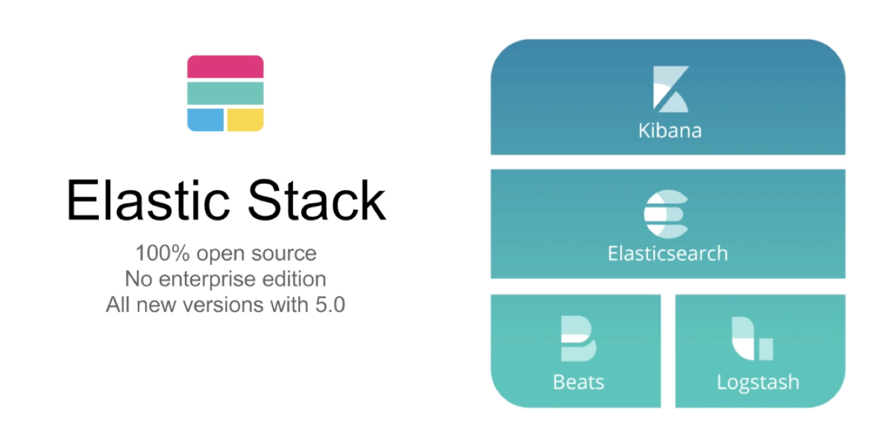
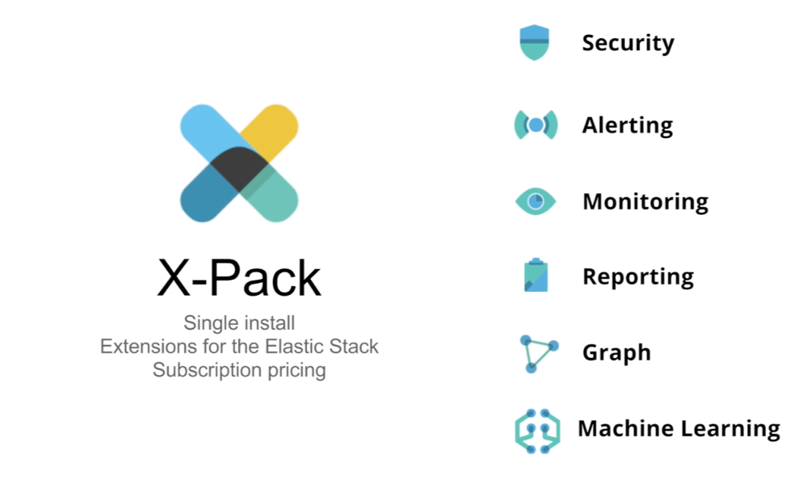
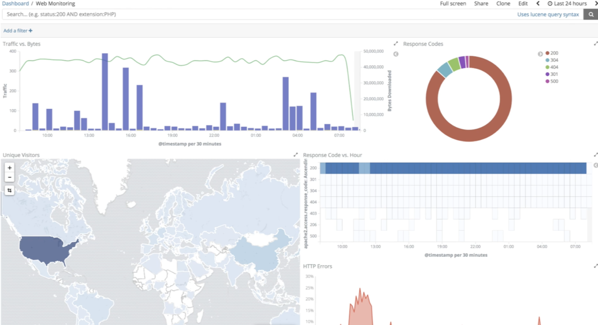
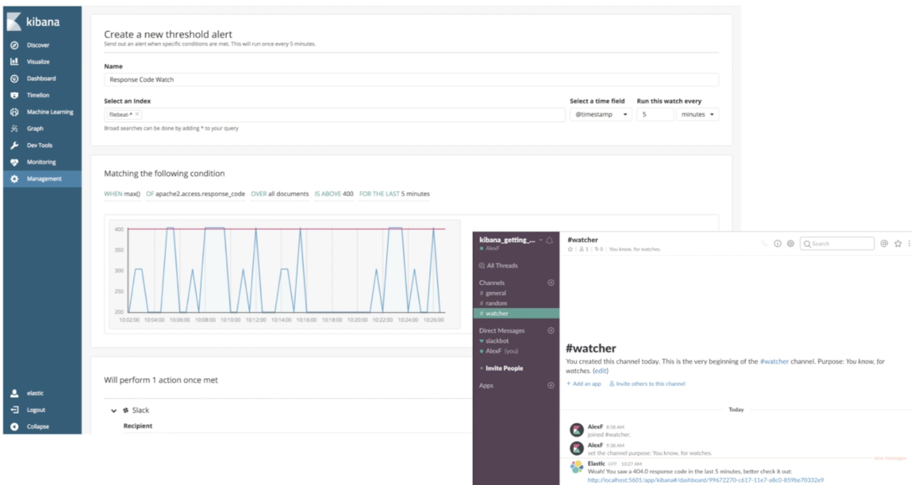
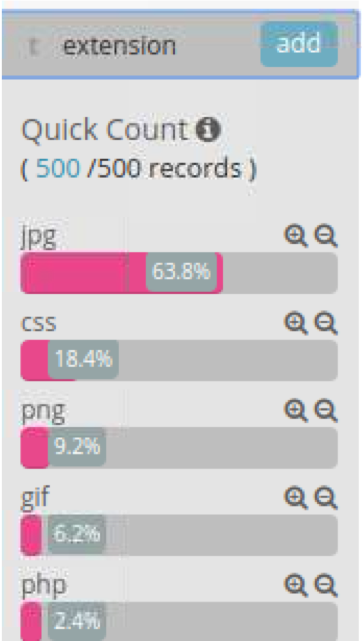
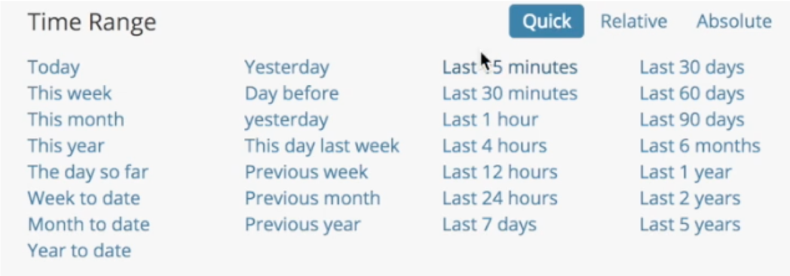
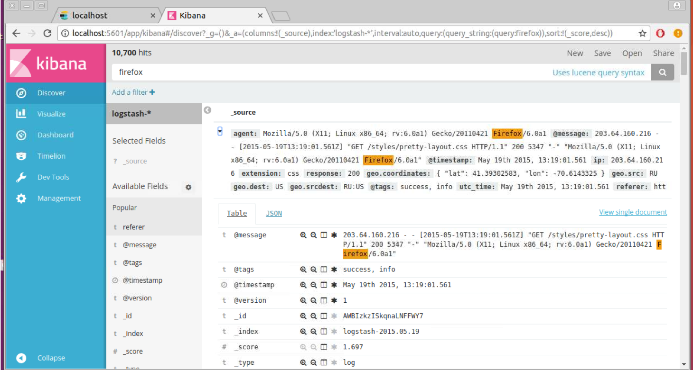
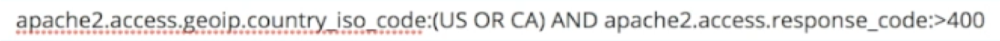
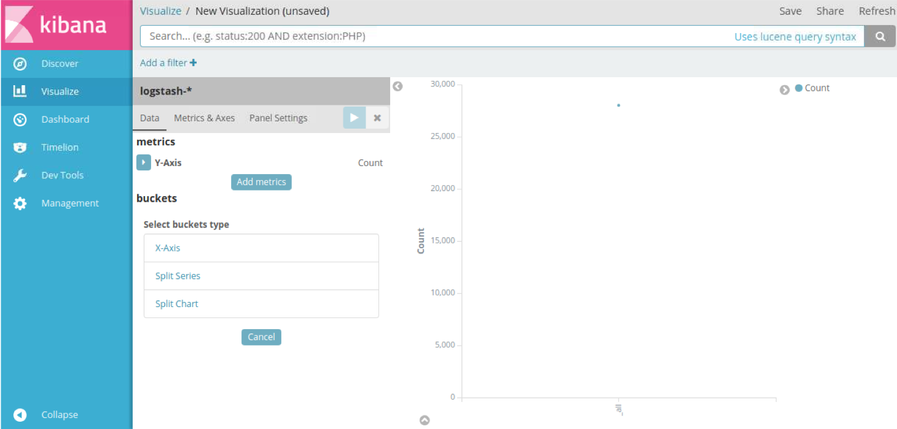
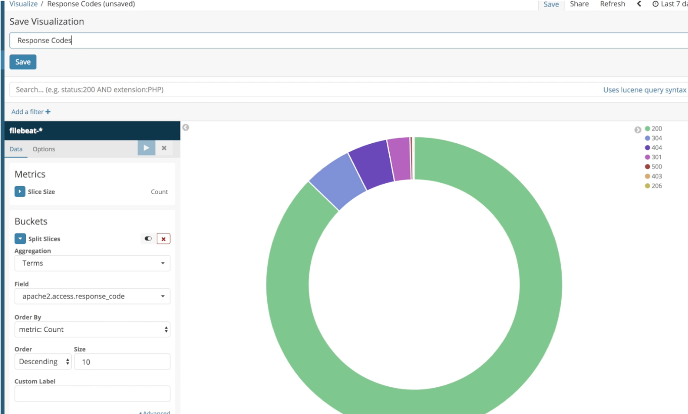

# Kibana
---

## Section Objectives

* Install Kibana
* Configure common Kibana tasks
* Get familiar with Kibana functionality

Notes:

---

## What is Kibana

* Kibana is an open source analytics and visualization platform
  - Works on top of Elasticsearch. 
* It can be used to 
  - Search
  - View
  - Interact 
* Data
  - Structured
  - Unstructured

Notes:

---

## Kibana UI

* Presentation types
  - Histograms
  - Charts
  - Graphs
  - Tables
  - Maps

Notes:

---

## Kibana Features

* Seamless integration with Elasticsearch 
* Understanding of data by representing it with
  - bar charts
  - line and scatter plots
  - Histograms
  - pie charts
  - maps
* Integrates with Elasticsearch analytics
* Allows to
  - Create
  - Save
  - Share
  - Export
  - Embed visualized data for

Notes:

---

## Kibana and Elastic Stack

Notes:

---

## What is What

* Beats is a lightweight importer of data directly into Elasticsearch
* Logstash is an ETL data pipeline
* Kibana is a user interface
  - Visualize
  - Slice and dice data
  - Manage and monitor the entire stack

Notes:

---

## Example of ELK Data Pipeline

Notes:

---

## X-Pack

* Commercial extension for Elasticsearch
* Subscription pricing
* More later

Notes:

---

## Now for Kibana. Say you have logs

Notes:

---

## Here is How You Would Like Them

Notes:

---

## With X-Pack You Can Do Even More

Notes:

---

## Lab: Install Kibana

* Please do this lab: 

  - `kibana/install.md`

Notes:

---

## For Kibana Configuration

Notes:

---

## Ways to Ingest Data

* Files
* Bulk ingest
* Beats
* Logstash
* But for our lab, we will use existing data

Notes:

---

## Configure Kibana File Pattern

Notes:

---

## Configure

* Click on “Configure”
* Observe the prominent fields and their value distribution
* Investigate fields, such as
  - geo.src
  - extension
  - Etc.

Notes:

---

## Time Range

* Time range control is at the top right
* Investigate the effect of time range controls

Notes:

---

## Time Picker

* Relative time picker
* Or absolute
* Or auto refresh

Notes:

---

## Search in Kibana with Lucene Syntax

Notes:

---

## Expand the Document and Analyze the Data

Notes:

---

## Filter for Specific Geography

Notes:

---

## Lucene Query Syntax

Notes:

---

## Experiment with Queries

* What would this query do?

* What other queries can you suggest?

Notes:

---

## Structured Filters

Notes:

---

## Structured Filters Capabilities

* Choose the field in the UI as a dropdown
* Choose condition, e.g. IS ONE OF
* Provide the value
* Save the query
* Add another filter:	
  - Field
  - Relationship
  - Value
* View surrounding documents (in time)

Notes:

---

## Visualizations

Notes:

---

## Visualization Types

* Basic charts
* Data
* Maps
* Time series

Notes:

---

## Counting the Document with a Line Chart

Notes:

---

## Visualize Traffic vs Bytes Count

Notes:

---

## Let us Change the Looks

Notes:

---

## Pie Chart – Response Codes

Notes:

---

## Dashboards – Just Add Visualizations

Notes:

---

## Sharing Kibana Dashboards

Notes:

---

## If You Have X-Pack

* (bin/kibana-plugin install xpack)

Notes:

---

## What is Added in X-Pack

* Machine Learning
* Graph
* Monitoring
* Management
  - Security
* Much more...

Notes:

---

## Security

Notes:

---

## Dashboard Sharing with Reporting

Notes:

---

## Lab: Configure Kibana

* Please do this lab: 

  - `kibana/configure.md`

