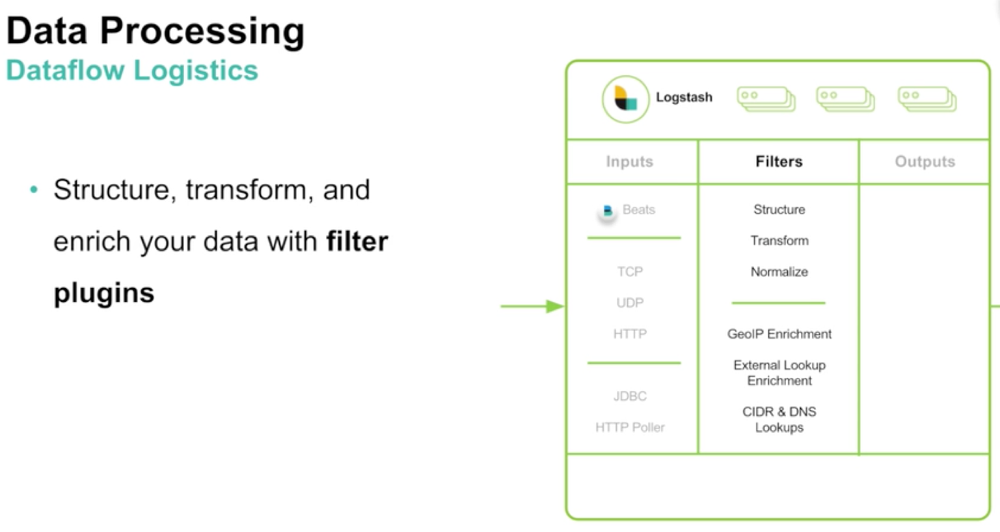
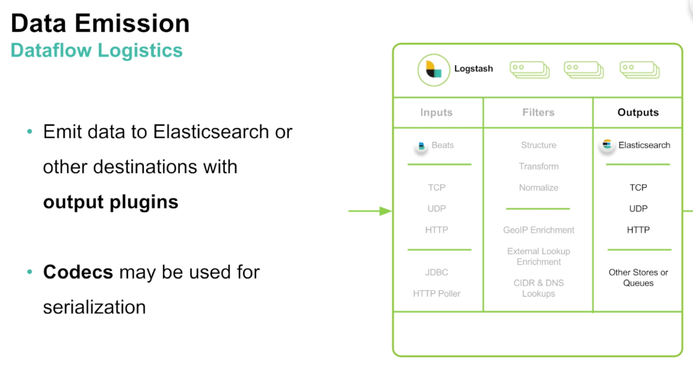
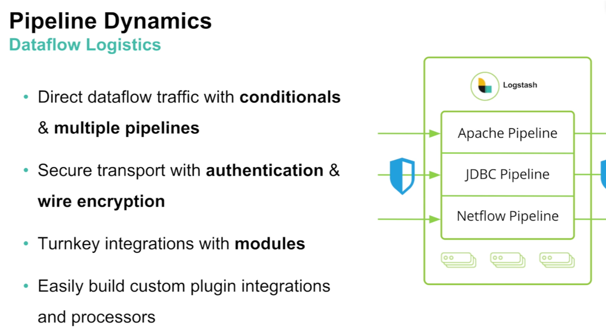

# Logstash
---

## Section Objectives

Notes:

---

## What is Logstash?

* The Dataflow Engine
* Open source **streaming ETL engine** for data logistics
* Allows to build data flow pipelines in minutes
* Horizontally scalable (with adaptive buffering)
* Data source agnostic
* 200+ plugins, integrations and processors
* Monitor and manage deployments in Elastic Stack

Notes:

---

## Logstash use cases

* Used for
  - Gathering
  - Enriching
  - Unifying 
* Works for
  - All of your data
  - Any format
  - Any schema
* For real-time processing – works best with
  - Elasticsearch
  - Kibana
  - Beats

Notes:

---

## Data Sources

<!-- {"left" : 1.02, "top" : 2.33, "height" : 4.41, "width" : 8.21} -->

Notes:

---

## Logstash Architecture

<!-- {"left" : 0.62, "top" : 2.65, "height" : 3.76, "width" : 9.01} -->

Notes:

---

## For Data Processing

* Filter plugins
data-processing.png

<!-- {"left" : 1.02, "top" : 2.35, "height" : 4.37, "width" : 8.21} -->

Notes:

---

## Data Emission

* Outputs

<!-- {"left" : 1.02, "top" : 2.34, "height" : 4.37, "width" : 8.21} -->

Notes:

---

## Stability

<!-- {"left" : 1.02, "top" : 2.34, "height" : 4.37, "width" : 8.21} -->

Notes:

---

## Pipelines

<!-- {"left" : 1.02, "top" : 2.34, "height" : 4.48, "width" : 8.21} -->

