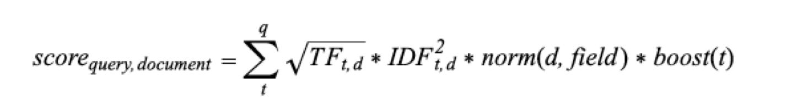
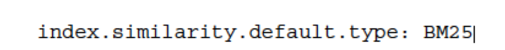

# What is Relevancy?
---

## Section Objectives

* How scoring works inside Lucene and Elasticsearch?
* Boosting the score of a particular query or field
* Understanding TF, IDF, and relevancy score
* Ways of scoring
* Query parser

Notes:

---

# How Scoring Works
---

## What is Relevancy?

* How is search different from 

* SELECT * FROM users WHERE name LIKE 'bob%'

* ??

Notes:

---

## How Scoring Works

* You could measure relevancy as
  - Yes
  - No
* But it is better to measure relevancy as
  - 63%
  - 80%
  - 95%

Notes:

---

## Term Frequency

* Term frequency 
  - how many times a term appears in a document

Notes:

---

## Inverse Document Frequency (IDF)

* What is Inverse Document Frequency? 
* A token
  - usually a word, but not always
* A token is less important 
  - the more times it occurs across all of the documents	
  - in the same index

Notes:

---

## IDF Explained

* The term “Elasticsearch” has a document frequency of 2
  - because it occurs in two documents
* The inverse part of the document frequency
  - the score being multiplied by 1/DF
  - where DF  is the document frequency of the term
  - For a term with higher document frequency
    - Its weight decreases
* Example
  - The term “the” has a document frequency of 3 because
  - It occurs in all 3 documents

Notes:

---

## Lucene Scoring Formula

* The higher the term frequency, the higher the score
* The higher the inverse document frequency the rarer is a term
* The coordination factor 
  - documents were searched
  - how many terms were found
* The query norm 
  - to make the results of queries comparable

Notes:

---

## More Scoring Formulae

* Okapi BM25
* Divergence from randomness, or DFR  similarity
* Information based, or IB  similarity
* LM  Dirichlet similarity
* LM  Jelinek Mercer similarity

Notes:

---

## How to Set Similarity

Notes:

---

## Global Scoring Setting

* In `elasticsearch.yml`

Notes:

---

## Testing Your Scoring

* When you tweak scoring
* Need to have have a good testing infrastructure
* To judge changes in the ranking and scoring
* Create benchmarks!
  - Manually
  - Mechanical Turk
  - JUNIT
* Need to evaluate your changes in a reproducible manner
* Or else, it is “feel” and “guess”

Notes:

---

# Field Boosting

---

## Boosting

* Boosting 
  - modifying the relevance of a document
* Two types of boosting
  - While indexing
  - When running a query

---

## Boosting at Index Time

* Boosting the name field
  - in the group type
  - at index time

---

## Boosting at Query Time

* Query-time boosting 
  - using the match query

---

## Explain Scoring

* `Explain` parameter
* Verbose output
---

## Explain Scoring Output

---

## Custom Score Structure

---

## Custom Score Example

---

# Query Syntax

---

## Default: Lucene Query Parser

* By example, what does this mean?
  - title:solr
  - title:"apache solr" content:(search engine)
* Are these the same:
  - solr
  - **content:**solr
  - (hint: “content” is default field)

---

## Default: Lucene Query Parser, cont’d

* **Do these mean the same?**
* +solr
* apache **AND** solr
* apache **&&** solr
* +apache +solr
* apache solr (assuming default operator is AND)

Notes:

---

## Default: Lucene Query Parser, cont’d

* **And these mean the same?**
* apache **OR** solr
* apache || solr
* apache solr (assuming default operator is OR))

Notes:

---

## Phrase queries

* **How is this implemented?**
  - "apache solr"
  - "apache software foundation“
  - (hint: think proximity)
* **Will this also fit?**
  - "apache foundation software “
  - And the answer is...

Notes:

---

## Phrase queries explained

* These are the same
  - "apache software foundation"
  - "apache software foundation"**~0**

Notes:

---

## Excluding terms

* What do queries below mean?
* solr –panel
* solr **NOT** panel
* solr **AND NOT** (panel OR electricity)

Notes:

---

## Range queries

* Is the meaning below obvious?
* What would be required of fields?
  - number:**[**12.5 **TO** 100**]**
  - date:**[**2013-11-04T10:05:00Z **TO** NOW-1DAY**]**
  - string:**[**ape **TO** apple**]**

Notes:

---

## Relevancy tuning

* Relevancy of query results is what differentiates between search and most databases
* Returning enormous amounts of data without highlighting the most relevant documents will prove frustrating
* ES provides a decent relevancy algorithm for keyword search 
* Additional benefit can be achieved by “tuning” and otherwise experimenting with the relevancy of ES searches.

Notes:

---

## Field weighting 

* If you can tell ES which fields in your document (such as a title field) are more important, for example, ES can weight them higher when calculating relevancy scores.

Notes:

---

## Field boosting at index time

Notes:

---

## Query-time field boosts 

* Manual query
  - http://localhost:8983/solr/no-title-boost/select?
  - q=restaurant_name:(red lobster)^10 OR description:(red lobster)
* eDisMax
  - http://localhost:8983/solr/no-title-boost/select?
  - defType=edismax&
  - q=red lobster&
  - qf=restaurant_name^10 description

Notes:

---

## Per-term boosting

* Manual query
  - http://localhost:8983/solr/no-title-boost/select?
  - q=restaurant_name:(red^2 lobster^8)^10
  - OR description:(red^2 lobster^8)
* eDisMax
  - http://localhost:8983/solr/no-title-boost/select?
  - defType=edismax&
  - q=red^2 lobster^8&
  - qf=restaurant_name^10 description

Notes:

---

## Function queries

* Use a function to provide a relevancy boost for more recent documents:
* Example: 
  - recip(rord(date),1,1000,1000)
  - (in short, this combination of functions increases the value when the document is more recent)

Notes:

---

## Functions in Lucene and ES

* Functions allow you to dynamically compute values for each document
* Can be added like keywords to a query
* Match all documents and return their function calculation as the score
* Example: 
  - q={!func}min($f1,$f2)&f1=sqrt(popularity)&f2=1

Notes:

---

## Frange ;) query parser

* Frange = function range
* Will compute a function
* But only return results that fall within limit
  - Different from using function for sort

Notes:

---

## Fuzzy searches

* Wildcards 
* Levenshtein Distance (a.k.a) Edit Distance algorithm. 
* To do a fuzzy search use the tilde, "~“
* Example:
  - roam~
  - Should find “foam” and “roams”
  - Try it! Experiment with various forms of
  - manu:samsuung~1

Notes:

---

## Scoring Summary

* IT/IDF 
  - The frequency of a term 
  - The number of times that term occurs in a documents
* Many tools to customize and modify scoring.
* Rescore in a subset of documents
* Use the explain API
  - understand how a document has been scored
* Function _score  query
  - ultimate control over scoring your documents

Notes:

---

## Lab: Practicing Lucene Queries

* Please do this lab:
* First 
  - `kibana/install.md`
* Then
  - Practice the above Lucene syntax

