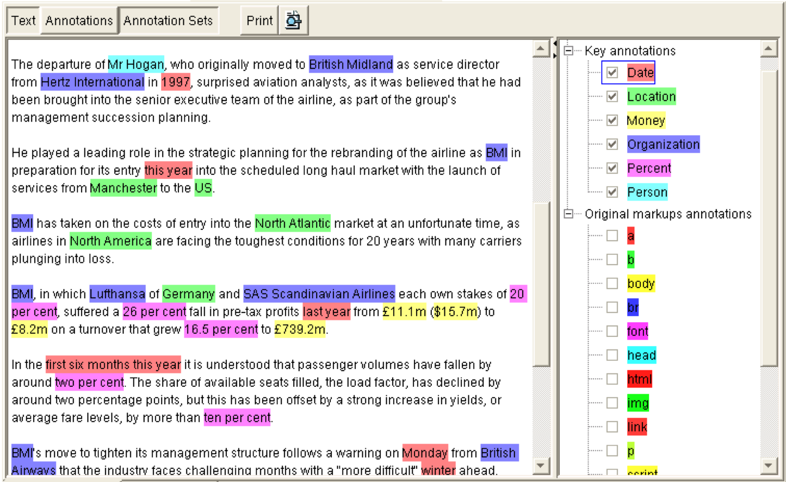

# Search Trends
---

## Section Objectives

* Provide an overview of modern development environment

* Make sure we are on the same page and compare notes ;)

* Ensure software development success

Notes:

---
# Beyond Lucene
---

## Beyond IR – Information Extraction

---

## GATE

* General Architecture for Text Engineering
* Entity extraction (people, places, organizations)
* Trainable
* Programmable
* Site: https://gate.ac.uk/
* Competing products (such as LingPipe)
* Commercial entities (such as Sintelix)

---

## What is Blur?

* Blur = Lucene + Hadoop (HDFS)
* Store Lucene indices in HDFS
* Serve Lucene indices in memory
* Blur orchestrates this 
* Top level Apache project
* Big implementation at Pearson training

---

## Elasticsearch and Spark

* What is Apache Spark?
* In-memory computation engine
* Can replace Hadoop, 100 time s faster
* Spark 2 offers DataFrames
  - Think of them as data with description
* Each query into Lucene, Elasticsearch, or Solr can be transformed into Spark DataFrame

