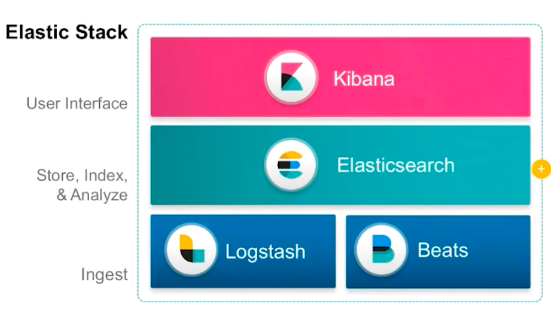
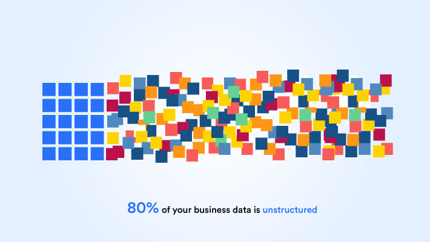
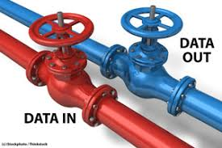
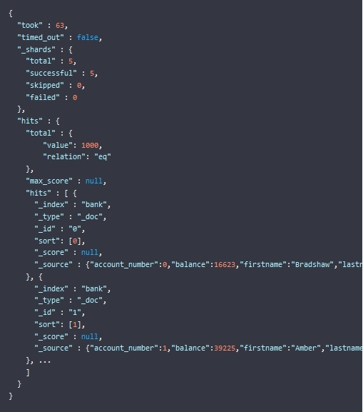
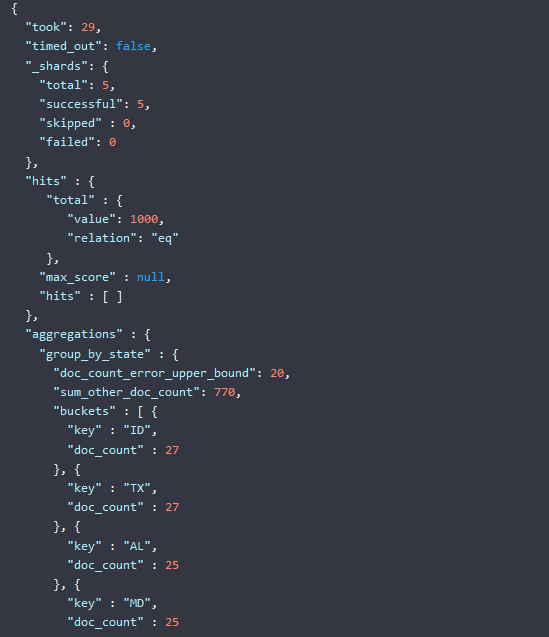

# Elasticsearch 

---

# Introduction
---

## What is it?

* Distributed search
* Analytics engine
* in the heart of Elastic Stack

<!-- {"left" : 1.02, "top" : 3.07, "height" : 4.62, "width" : 8.21} -->


---

## What does it do?

* Real-time search and analytics
* Efficiently stors data
* Indexes data so that it's possible fast search

---

## Data types

* All types of data accepted
  - Structured
  - Unstructured text
  - Numerical data
  - geospatial data

<!-- {"left" : 1.49, "top" : 3.75, "height" : 4.1, "width" : 7.28} -->


---

## Use cases

* As a search box to an app or website
* Store and analyze logs, metrics, and security event data
* Use machine learning to automatically model the behavior of your data in real time
* Automate business workflows using Elasticsearch as a storage engine 
* Manage, integrate, and analyze spatial information using Elasticsearch as a geographic information system (GIS) 
*  Store and process genetic data using Elasticsearch as a bioinformatics research tool 

---

# Data in: documents and indices

<!-- {"left" : 2.77, "top" : 7.79, "height" : 1.2, "width" : 1.81} -->


---

## Stor data

* Distributed document store
* Stores complex data structures that have been serialized as `JSON` documents
* With multiple nodes in a cluster, storing documents are distributed
* Can be accessed immediately from any node

---

## Data structure

* Inverted index
* Lists every word in documents
* Identifies all documents each word occurs in

---

## Adding indices

```
PUT /customer/_doc/1
{
  "name": "John Doe"
}
```
<!-- {"left" : 0, "top" : 1.45, "height" : 1.51, "width" : 4.3} -->

<br/>

* This creates the `customer` index if it doesn't exist
* Adds a new document with ID of `1`
* Stores and indexes the `name` field

---

## Information out: search and analyze

<!-- {"left" : 1.28, "top" : 2.15, "height" : 4.77, "width" : 7.69} -->


---

## Searching data

* Search capabilities built on the Apache Lucene search engine library
* Can be accessed by:
  - Direct queries from command line or `Developer Console` in `Kibana`
  - From applications using `Elasticsearch client`
---

## Supported queries

* Elasticsearch REST APIs support:
  - Structured queries
  - Full text queries
  - Complex queries consisting both

---

## Elasticsearch aggregations

* not finding the proverbial "needle in a haystack" 
* Enables answering questions like:
  - How many needles are in the haystack?
  - What is the average length of the needles?
  - What is the median length of the needles, broken down by manufacturer?
  - What are your most popular needle manufacturers? 
---

## Automatic analysis

* Using macine learning you can detect:
  - Anomalies related to temporal deviations in values, counts, or frequencies
  - Statistical rarity
  - Unusual behaviors for a member of a population
* Without having to specify algorithms, models, or other data science configs.

---

## Searching example

```
GET /bank/_search
{
  "query": { "match_all": {} },
  "sort": [
    { "account_number": "asc" }
  ]
}
```
<!-- {"left" : 0, "top" : 1.18, "height" : 2.23, "width" : 5.72} -->

<br/>

* Retrieves all documents in the `bank` index sorted by account number
---

## Result of the query

<!-- {"left" : 2.47, "top" : 1.82, "height" : 6.01, "width" : 5.3} -->


---

## Analyze results with aggregations
```
GET /bank/_search
{
  "size": 0,
  "aggs": {
    "group_by_state": {
      "terms": {
        "field": "state.keyword"
      }
    }
  }
}

```
<!-- {"left" : 0, "top" : 1.08, "height" : 2.36, "width" : 3.71} -->

<br/>

* The following request uses a `terms` aggregations to group all of the accounts in the `bank` index by state
* Returns the ten states with the most accounts in descending order

---

## Result of analysis

<!-- {"left" : 5.74, "top" : 1.08, "height" : 5.02, "width" : 4.33} -->

* The buckets in the response are the values of the state field. The doc_count shows the number of accounts in each state. For example, you can see that there are 27 accounts in ID (Idaho). Because the request set size=0, the response only contains the aggregation results.

---

# Scalability and resilience: clusters, nodes and shards

<!-- {"left" : 2.73, "top" : 8, "height" : 0.95, "width" : 2.1} -->


---

## Nodes

* Ensures high availability
* Automatically distributes data and query load across all of the available nodes

---

## Shards

* A self-contained index
* Redundnacy is available by:
  - Distributing the documents in an index across multiple shards
  - Distributing shards across multiple nodes

---

## Shard types

* There are two types of shards:
  - Primaries
  - Replicas
* Each document in an index belongs to one primary shard
* A replica shard is a copy of a primary shard
