# Elasticsearch


---

## Elastic

* Grok Filters
* Logstash with Filebeat to create resiliency
* Kafka, filebeat, logstash, elastic
* Elastic APM with microservice
* Jenkins data pipeline ES Automation w/ MetricBeat
* Kibana advanced DevOps visualization


Notes:
---

## Logistics

* **Class Hours:**
  - Start time is 8:30am
  - End time is 4:30pm
  - Class times may vary slightly for specific classes
  - Breaks mid-morning and afternoon (10 minutes)
* **Lunch:**
  - Lunch is 11:45am to 1pm
  - Yes, 1 hour and 15  minutes
  - Extra time for email, phone calls, or simply a walk.
* **Telecommunication:**
  - Turn off or set electronic devices to vibrate
  - Reading or attending to devices can be distracting to other students
* **Miscellaneous**
  - Courseware
  - Bathroom

---

## Course Objectives

* Get familiar with Elastic Stack as a distributed document storage, search and visualization Platform-as-a-Service (PaaS)
* Install and configure Elastic Stack
* Understand Query Domain-specific Language (DSL)
* Master key concepts for Elastic Stack
* Review how Elastic clusters work
* Work with end-to-end labs utilizing Elastic Stack for Application Performance Monitoring
* Learn data modeling concepts and key differences between Elastic and Database technology
* Utilize Elastic Stack in Public Cloud, On-premise and Hybrid environments


---

## course approach


---

## The training dilemma


---


## Introductions

* Name
* Title or Job Role if your title doesn't tell me what you do
* Which statement best describes your Elasticsearch experience?
- I am **currently working** with Elasticsearch on a project/initiative
- I **expect to work** with Elasticsearch on a project/initiative in the future
- I am **here to learn** about Elasticsearch outside of any specific work related project/initiative
* Expectations for course (please be specific, if possible)
* Why are you here?


---

# Elastic Stack Overview

---

## Elastic Stack – Evolution 


* 2010 - Released as Open Source project
* 2012 - Elasticsearch company founded 
* 2015 - Rebranded as Elastic
* Highly scalable
  - Open Source
* Enterprise support available 
* Built for searching and analyzing large datasets 

Notes:

Elasticsearch was released as an open source project in 2010, and gained a lot of popularity because it was easy to use and offered great indexing and powerful searching. 
In 2012 Elasticsearch the company was founded.  In 2015 they changed the name to Elastic, because the company developed and supported many additional products. 

GitHub uses it to let users search the repositories, StackOverflow indexes all of its questions and answers in Elasticsearch, and SoundCloud offers search in the metadata of the songs.


---

## Elastic Stack

* 2009 - Released as Open Source project
* 2015 - Added to Elastic family
* 2015 - Log forwarder released
* Open Source data collection engine
* Real-time pipelining capabilities 
* Collect logs from multiple input sources and send to Elasticsearch


 &nbsp; &nbsp; &nbsp; &nbsp; &nbsp; 


Notes:

Logstash is an open source data collection engine with real-time pipelining capabilities. 
2009 - open source release 
2013 - added to Elastic family. 

Logstash is a tool that can be used to collect, process and forward events and log messages. Collection is accomplished via number of configurable input plugins including raw socket/packet communication, file tailing and several message bus clients.

---

## Elastic Stack

* 2011 - Released as Open Source project
* 2013 - Added to Elastic family
* Browser based analytics & search dashboard for Elasticsearch
* Visualize Elasticsearch data 
* Highly customizable

 &nbsp; &nbsp; &nbsp;   &nbsp; &nbsp; &nbsp; 

---

## Elastic Stack


<br/>


<br/>


Notes:

Elasticsearch is a search and analytics engine. Logstash is a server‑side data processing pipeline that ingests data from multiple sources simultaneously, transforms it, and then sends it to a "stash" like Elasticsearch. Kibana lets users visualize data with charts and graphs in Elasticsearch, essentially creating dashboards.


---

## Elastic Stack

* 2015 - Beats tools released
* Open platform for single-purpose data shippers


 &nbsp; &nbsp; &nbsp; &nbsp; &nbsp; &nbsp;  &nbsp; &nbsp; &nbsp;

Notes:

Beats is the platform for single-purpose data shippers. They install as lightweight agents and send data from hundreds or thousands of machines to Logstash or Elasticsearch.
Log files
Metrics
Network data
Uptime monitoring 
etc...

---

## Elastic Stack

* 2016 - X-Pack released
* Renamed in 2018 to Elastic Stack Features
* Tools to enable monitoring, alerting, reporting, machine learning and much more

&nbsp; &nbsp;  &nbsp; &nbsp;&nbsp; &nbsp;  &nbsp; &nbsp; 


Notes:

X-Pack is a pay for service that provides many features 
Monitoring (Marvel)
Alerting (Watcher) trigger notifications on changes or schedule and ship recurring reports
Graph (explore the relationships between data) 
Machine learning  (automatically detect unusual changes in your data)
Reporting 
Security (Shield) i.e. Add a login screen to Kibana

https://www.elastic.co/guide/en/elasticsearch/reference/current/configuring-security.html
https://www.elastic.co/products/x-pack


---

## Elastic Stack


 &nbsp; &nbsp; &nbsp; &nbsp;


 &nbsp; &nbsp; &nbsp; &nbsp; &nbsp;


 &nbsp; &nbsp; &nbsp; &nbsp; &nbsp;

Notes:

https://www.elastic.co/elasticon/2015/sf/evolution-of-elasticsearch-at-yelp

https://www.elastic.co/elk-stack


---

## Elasticsearch - Hadoop


Notes:

https://www.elastic.co/elasticon/2015/sf/evolution-of-elasticsearch-at-yelp

https://www.elastic.co/elk-stack

---

## ES-Hadoop


* ES-Hadoop is a single distributable binary that allows the use of HDFS as a archive repo for Elastic Stack
* Works with open source and distributed versions of Hadoop, e.g. Cloudera & Databricks
* Index data from Hadoop into Elasticsearch for high performance querying and aggregation of Big Data

Notes:

X-Pack is a pay for service that provides many features 
Monitoring (Marvel)
Alerting (Watcher) trigger notifications on changes or schedule and ship recurring reports
Graph (explore the relationships between data) 
Machine learning  (automatically detect unusual changes in your data)
Reporting 
Security (Shield) i.e. Add a login screen to Kibana

https://www.elastic.co/guide/en/elasticsearch/reference/current/configuring-security.html
https://www.elastic.co/products/x-pack


---

## Elastic Stack Application Performance Monitoring


---

## Elastic Stack use cases

* **Ecommerce**
  - Utilize Elasticsearch as your storefront search mechanism storing product or service information and enabling features like typeahead 

* **DevOps**
  - Collect log and transactional data to identify patterns or anomalies in the day to day operations of your applications, processes, services and APIs

* **Alerting**
  - Pattern reverse search against queries to identify conditions that meet a certain criteria, e.g. tell me when a flight drops below X$ during a set timeframe

---

## Elastic Stack use cases

* **Internet of Things**
  - Store streams of device data in Elastic Stack and visualize that information for customers, e.g. show all the active snowplows in the city on an interactive map

* **Data Visualization**
  - Store data in Elasticsearch and build custom dashboards in Kibana to show the effects of changes, both expected and unexpected

* **Advanced Analytics**
  - Run analytics against existing data to enable the use of ad-hoc queries for decision support and business intelligence

Notes:

You run an online web store where you allow your customers to search for products that you sell. In this case, you can use Elasticsearch to store your entire product catalog and inventory and provide search and autocomplete suggestions for them.
You want to collect log or transaction data and you want to analyze and mine this data to look for trends, statistics, summarizations, or anomalies. In this case, you can use Logstash (part of the Elasticsearch/Logstash/Kibana stack) to collect, aggregate, and parse your data, and then have Logstash feed this data into Elasticsearch. Once the data is in Elasticsearch, you can run searches and aggregations to mine any information that is of interest to you.
You run a price alerting platform which allows price-savvy customers to specify a rule like "I am interested in buying a specific electronic gadget and I want to be notified if the price of gadget falls below $X from any vendor within the next month". In this case you can scrape vendor prices, push them into Elasticsearch and use its reverse-search (Percolator) capability to match price movements against customer queries and eventually push the alerts out to the customer once matches are found.
You have analytics/business-intelligence needs and want to quickly investigate, analyze, visualize, and ask ad-hoc questions on a lot of data (think millions or billions of records). In this case, you can use Elasticsearch to store your data and then use Kibana (part of the Elasticsearch/Logstash/Kibana stack) to build custom dashboards that can visualize aspects of your data that are important to you. Additionally, you can use the Elasticsearch aggregations functionality to perform complex business intelligence queries against your data.


---

## Elastic for Internet of Things (IoT)


Notes:

You run an online web store where you allow your customers to search for products that you sell. In this case, you can use Elasticsearch to store your entire product catalog and inventory and provide search and autocomplete suggestions for them.
You want to collect log or transaction data and you want to analyze and mine this data to look for trends, statistics, summarizations, or anomalies. In this case, you can use Logstash (part of the Elasticsearch/Logstash/Kibana stack) to collect, aggregate, and parse your data, and then have Logstash feed this data into Elasticsearch. Once the data is in Elasticsearch, you can run searches and aggregations to mine any information that is of interest to you.
You run a price alerting platform which allows price-savvy customers to specify a rule like "I am interested in buying a specific electronic gadget and I want to be notified if the price of gadget falls below $X from any vendor within the next month". In this case you can scrape vendor prices, push them into Elasticsearch and use its reverse-search (Percolator) capability to match price movements against customer queries and eventually push the alerts out to the customer once matches are found.
You have analytics/business-intelligence needs and want to quickly investigate, analyze, visualize, and ask ad-hoc questions on a lot of data (think millions or billions of records). In this case, you can use Elasticsearch to store your data and then use Kibana (part of the Elasticsearch/Logstash/Kibana stack) to build custom dashboards that can visualize aspects of your data that are important to you. Additionally, you can use the Elasticsearch aggregations functionality to perform complex business intelligence queries against your data.


---

## Elastic DevSecOps


---

## Elastic Stack Machine Learning


Notes:

Complex, fast-moving datasets make it nearly impossible to spot infrastructure problems, intruders, or business issues as they happen using rules or humans looking at dashboards. Elastic machine learning features automatically model the behavior of your Elasticsearch data — trends, periodicity, and more — in real time to identify issues faster, streamline root cause analysis, and reduce false positives.


---

# elasticsearch  basics

---

## logical concepts of elasticsearch


* Elasticsearch is moving away from 'types'. In Elasticsearch 6 only one type is allowed per index.


Notes:

3 main logical concepts behind Elasticsearch: 
Document
Structured data similar to a row in a database, something that you're searching for
Not just about text, any data can work. 
JSON format (way to encode text, objects etc..) 
Every document has a unique ID (auto assigned, or manually) 
Type: what this document is. 
Encyclopedia articles, log entries from web server etc.. 
Type
Many documents that belong to a certain type. 
schema or mapping between documents
Apache access log log type (timestamp, request URL, return status) 
Encyclopedia article (author, subject, title, text) 
Like a table, that defines the data in the document 
Indices 
Collection of types you can search across
contains a collection of types, which contain collection of documents

Database analogy
index = DB, type = table, document = row 

---

## what is an inverted index


Notes:

Inverted means we are mapping things searching for, to documents searching in. 
Inverted index is the mechanism by which all search engines work. 
Say we have 2 documents, inverted index doesn't store them directly, it flips on head
each document split up into individual search terms, split up by each word, lowercased to normalize 
maps each search term to documents they occur within. Here we can see “Space” shows up in document1 and document2.

---

## It's not  quite that simple.

* **TF-IDF** means Term Frequency **Inverse Document Frequency**
* **Term Frequency** is how often a term appears in a **given document**  Document Frequency is how often a term appears in **all documents**  Term Frequency / **Document Frequency** measures the **relevance**
of a term in a document


Notes:

How do I deal with concept of relevance?  
If I search for the word ”the” how do I make sure it returns documents where “the” is relevant?
TF-IDF 
Term Frequency is how often a word appears in a document, “the” “of” “space” etc.. 
Document Frequency: How often a term appears in all documents in index.
 ”Space” doesn't appear often in index, but “the” does.  
Divide Term Frequency by Document Frequency gives us measure of relevance.
How special is this term to this document? How often does it occur in this doc? How often does it occur in all documents?

---

## Using Indices


Notes:

How do we use an index in Elasticsearch? 
RESTful API 
Explain what REST is (same thing as when you request a page in browser etc) 
REST uses verbs to define what it's doing.. GET, POST, PUT.
Elasticsearch uses the same HTTP protocol, which makes it easy to communicate with. 
If you are requesting something from Elasticsearch you do so by just sending a GET request (same as any other web system)

client API's
Instead of worrying about constructing JSON data correctly, there's client APIs that make it much easier 
Python, Ruby, Java, etc.. 
analytic tools
Kibana 
Graphical Web-UI
Interact without needing to write any code 
Sometimes a better approach than sifting through JSON output.


---

## Near Real Time (NRT)

* Elasticsearch is a **near real time search** platform
* There is a slight **latency** latency (normally one second) from the time you index a document until the time it becomes searchable


---

# Sandbox Cluster
---

## Elasticsearch Cluster


Notes:

A node can be configured to join a specific cluster by the cluster name. By default, each node is set up to join a cluster named elasticsearch which means that if you start up a number of nodes on your network and—assuming they can discover each other—they will all automatically form and join a single cluster named elasticsearch.

In a single cluster, you can have as many nodes as you want. Furthermore, if there are no other Elasticsearch nodes currently running on your network, starting a single node will by default form a new single-node cluster named elasticsearch.


---

## Getting Started

* when you start an instance of Elasticsearch, you are starting a node
* If you are running a single instance of Elasticsearch, you have a cluster of one node
* All primary shards reside on the single node
* No replica shards can be allocated, therefore the cluster state remains yellow 
* The cluster is fully functional, but is at risk of data loss in the event of a failure

---

# REST: A Quick Intro.

---

## Anatomy of a HTTP  Request


* METHOD: the “verb” of the request. GET, POST, PUT, or DELETE
* PROTOCOL: what flavor of HTTP (HTTP/1.1)  HOST: what web server you want to talk to  URL: what resource is being requested
* BODY: extra data needed by the server

* HEADERS: user-agent, content-type, etc.


---

## Example: GET request for Google.com

```text
GET /index.html
Protocol: HTTP/1.1
Host: www.google.com  
No body
Headers:
User-Agent: Mozilla/5.0 (Windows; U; Windows NT 6.1; en-US; rv:1.9.1.5) Gecko/20091102 Firefox/3.5.5 (.NET CLR 3.5.30729)  Accept: text/html,application/xhtml+xml,application/xml;q=0.9,*/*;q=0.8
Accept-Language: en-us,en;q=0.5  Accept-Encoding: gzip,deflate
Accept-Charset: ISO-8859-1,utf-8;q=0.7,*;q=0.7  Keep-Alive: 300
Connection: keep-alive
Cookie: PHPSESSID=r2t5uvjq435r4q7ib3vtdjq120  Pragma: no-cache
Cache-Control: no-cache

```

---

## RESTful API's


* Pragmatic definition: using HTTP requests to communicate with web services

* Examples:

  - GET requests retrieve information (like search results)  PUT requests insert or replace new information  DELETE requests delete information


---

## REST fancy-speak


* **R**epresentational **S**tate **T**ransfer

* Six guiding constraints:
  - client-server architecture
  - statelessness
  - cacheability
  - layered system
  - code on demand (ie, sending Javascript)
  - uniform interface

Notes:


REST stands for Representational State Transfer. (It is sometimes spelled "ReST".) It relies on a stateless, client-server, cacheable communications protocol -- and in virtually all cases, the HTTP protocol is used. REST is an architecture style for designing networked applications.

Representational State Transfer (REST) is an architectural style that defines a set of constraints to be used for creating web services. Web Services that conform to the REST architectural style, or RESTful web services, provide interoperability between computer systems on the Internet.

Roy Fielding articulated ReST in his dissertation at UC Irvine in 2000

---

## Why REST?

* Language and system independent
* Highly scalable 

---

## The Curl Command

* A way to issue HTTP requests from the command line
* From code, you'll use whatever library you use for HTTP / REST in the same way.

```text
curl –H “Content-Type: application/json” <URL> -d '<BODY>'
```

---

## Examples


---

## Examples


---

## The Httpie Command

* A way to issue HTTP requests from the command line
* Simpler syntax than curl, defaults to 'pretty' output.

```text
http <VERB> <URL> -d '<BODY>'
```


---

## Examples


---

## Examples


---

## Experiment: Elastic Stack, Elastic Cloud, and Elastic APM

* Setup an Elastic Stack Cloud Environment
* Experiment in the environment
* Create a Sandbox VM
* Configure a sample Spring Application
* Wire that application to our Elastic Stack APM in AWS 

* Experiment: [Elastic Stack Cloud AppDev Observability](https://jruels.github.io/elastic/labs/01-install/
)


Notes:

https://jruels.github.io/elastic/labs/01-install/


---
# Elastic Stack SQL

---

## Common thoughts on "Elasticsearch + SQL"


* RDBMS
* Joins
* BI Tools like Tableau & PowerBI
* SQL 
* What about Query DSL?
* How/Where/Why/When?


---

## What is SQL?


---

## What is the evolution of Elastic Stack SQL?


---

## Experiment: Elastic Stack SQL Exploration 

* Open the Kibana Dev Console


---

## Querying Elastic Kibana Console Interface


---

## Queries to Explore

```text
# describe the data model for the table (AKA INDEX)
POST /_sql
{
  "query":"DESCRIBE company"
}

#deprecated syntax - old school
POST /_xpack/sql
{
  "query":"select * From company"
}
```

---

## Queries to Explore

```text
#return standard elasticsearch output format
POST /_sql
{
  "query":"select * From company"
}

#return CSV
POST /_sql?format=csv
{
  "query":"select * From company"
}
```

---

## Queries to Explore

```text
#return standard SQL query output format
POST /_sql?format=text/plain
{
  "query":"select * From company"
}

#Shorter syntax with limit
POST /_sql?format=txt
{
  "query":"select * From company limit 1"
}

```


---

## Queries to Explore

```text
# search fewer fields
POST /_sql
{
  "query":"select firstname, lastname from company"
}

# search fewer fields
POST /_sql
{
  "query":"select firstName, lastName from company"
}

```


---

## Queries to Explore


```text
# future
POST /_sql
{
  "query":"select distinct firstName, lastName from company"
}
#Math functions
POST /_sql?format=txt
{
  "query":"select round(8.2 + 12.2) * 2 as answer"
}
```

---

# How Elasticsearch Scales

---

## An Index is Split into Shards


Notes:

Every shard is a self-contained index of Lucene
Once it figured out the document it can map it to a shard and redirect to appropriate node. 

---

## Primary and Replica Shards

* This **index** has two **primary shards** and a **replication factor of 2.**
* Your application should round-robin requests amongst nodes.

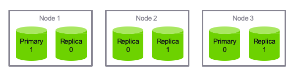

* **Write** requests are routed to the primary shard, then replicated  
* **Read** requests are routed to the primary or any replica


Notes:

Here we have 2 Primary and 4Replica shards. 
Writes will go to Primary shards (masters) and reads will hit any shard (primary or replica) 
This is how many different clustering solutions are setup. 
Elasticsearch figures all this out for you based on the configuration in the /etc/elasticsearch/elasticsearch.yml 


---

## Primary and Replica Shards


Notes:

Here we have 2 Primary and 3 Relica shards. 
Writes will go to Primary shards (masters) and reads will hit any shard (primary or replica) 
This is how many different clustering solutions are setup. 
Elasticsearch figures all this out for you. 


---

## Primary and Replica Shards


Notes:

Fault tolerant system. Highly redundant 
Have an odd node number of nodes so that you avoid split brain. 

Split-brain is a computer term, based on an analogy with the medical Split-brain syndrome. It indicates data or availability inconsistencies originating from the maintenance of two separate data sets with overlap in scope, either because of servers in a network design, or a failure condition based on servers not communicating and synchronizing their data to each other. This last case is also commonly referred to as a network partition.

Although the term split-brain typically refers to an error state, Split-brain DNS (or Split-horizon DNS) is sometimes used to describe a deliberate situation where internal and external DNS services for a corporate network are not communicating, so that separate DNS name spaces are to be administrated for external computers and for internal ones. This requires a double administration, and if there is domain overlap in the computer names, there is a risk that the same fully qualified domain name (FQDN), may ambiguously occur in both name spaces referring to different computer IP addresses.[1]


---

## The number of primary shards cannot be changed later.


* Not as bad as it sounds – you can add  **more replica shards** for more read  throughput.
* Worst case you can **re-index** your data.
* The number of shards can be set up front  via a PUT command via **REST** / HTTP


Notes:

Cannot change primary shards later on. Must define it when setting up cluster. 
Most applications require additional read capacity, not write. 
You can also re-index your data and copy it over but it's not a fun process 
Plan ahead so you have the correct number of primary shards.

By default, each index in Elasticsearch is allocated 5 primary shards and 1 replica which means that if you have at least two nodes in your cluster, your index will have 5 primary shards and another 5 replica shards (1 complete replica) for a total of 10 shards per index. Each Elasticsearch shard is a Lucene index.

This request says we want 3 in one replica,  we end up with 6 though.


---

## Number of Shards Quiz

* How many total shards does the code on the right create?


Notes:

How many shards are we creating here? 

Answer: 6, 3 primary and 1 replica of each. 


---

## Primary and Replica Shards


Notes:

We specified we wanted 3 shards and 1 replica but this really means 
3 - Primary shards 
1 replica per primary shard. 


---

# Quiz Time
---

## 1. The schema for  your documents are defined by...

* The index
* The type
* The document itself


---

## 1. The schema for  your documents are defined by...

* The index
* **The type**
* The document itself

---

## 2. What purpose do inverted indices serve?

* They allow you to search phrases in reverse order
* They quickly map search terms to documents
* They load balance search requests across your cluster


---

## 2. What purpose do  inverted indices serve?

* They allow you to search phrases in reverse order
* **They quickly map search terms to documents**
* They load balance search requests across your cluster

---

## 3. 

* 8
* 15
* 20

* **An index configured for 5 primary  shards and 3 replicas would have  how many shards in total?**

---


## 3. 

* 8
* 15
* **20**

* **An index configured for 5 primary  shards and 3 replicas would have  how many shards in total?**


Notes:
Remember that if we have 3 replicas for each primary that would be a total of 4 shards for each primary.  5 * 4

---

## 4. 

* True
* False

* **Elasticsearch is built only for full-text search of documents.**

---

## 4. 

* True
* **False**

* **Elasticsearch is built only for full-text search of documents.**


Notes:

In text retrieval, full text search refers to techniques for searching a single computer-stored document or a collection in a full text database. Full-text search is distinguished from searches based on metadata or on parts of the original texts represented in databases (such as titles, abstracts, selected sections, or bibliographical references).


---

## Lab01: Elastic Stack sandbox setup 

* Setup an Elastic Stack sandbox environment

* Walk through the environment 

* https://github.com/GeorgeNiece/elastic-stack


Notes:
https://jruels.github.io/elastic/labs/01-install/

---

# Self-healing

---

## Self-healing and Elastic Stack

* The key with self-healing is awareness
* Companies have created toolsets and configurations for this, e.g. LogIt.io
* APIs exist to check shards, indices, clusters, nodes
* Baselines are required to be able to correctly “heal” a given issue

* Identify
* Compare
* Act - Don't overreact
* Document
* Train

---

## Where is the Problem?


---

# Examining Movielens

---

## Movielens

* **Movielens** is a free dataset of movie ratings gathered from movielens.org. It contains user ratings, movie metadata, and user metadata. Let's download and examine  the data files from movielens.org


Notes:

Elasticsearch is all about interacting with a lot of data
So far we added Shakespeare's works but that's not enough to see the true power of Elasticsearch. 
Let's add this sample movie data to it as well. 


---

## Lab02: download MovieLens data


* Visit GroupLens website
* Download small data set 
* Look through sample data files
* https://github.com/GeorgeNiece/elastic-stack


---
# Creating Mappings
---

## What is a Mapping?

* A mapping is a **schema definition.**
* Elasticsearch has reasonable defaults, but sometimes you need to customize them.


* NOTE : Content-Type is now required in Elasticsearch 6.x+

Notes:
Mapping is a schema definition which tells Elasticsearch how to index your data.  
Most of the time it can figure out the correct type of mapping for your data (strings, floating point numbers, integers etc..) 
Sometimes we have to give it a hint.  We want the “release date” to specifically be a date field. 
Movie data type: year = type date, not just string
Preferred to explicitly tell Elasticsearch since that reduces instances of the implied mapping identifying a more generic or incorrect type.

---

## Elasticsearch 5 Syntax

* In Elasticsearch 5 it was possible to send a REST request without the Content-Type. Elasticsearch would then “sniff” the content and set the type based on that. 


Notes:

Mapping is a schema definition which tells Elasticsearch how to index your data.  
Most of the time it can figure out the correct type of mapping for your data (strings, floating point numbers, integers etc..) Some types such as timestamp and decimal, may not be correctly inferred
Sometimes we have to give it a hint.  We want the “release date” to specifically be a date field. 

This ability to enforce strict content-type checking has existed since Elasticsearch 5.3 via the http.content_type.required configuration setting. In 5.x it is optional, and defaults to false, in Elasticsearch 6.0, that setting defaults to true, and there is no way to disable it.

https://dzone.com/articles/elastic-stack-6-what-you-need-to-know
https://aws.amazon.com/about-aws/whats-new/2017/12/elasticsearch-6-0-now-available-on-amazon-elasticsearch-service/
https://www.elastic.co/guide/en/elasticsearch/reference/6.0/breaking-changes-6.0.html
https://www.elastic.co/guide/en/elasticsearch/reference/6.0/removal-of-types.html


---

## Elasticsearch Syntax


* There are two reasons this changed. 
* Clarity
  - Sending plain text content to API that doesn't support it returns.
* `Content-Type header [text/plain] is not supported`

* In Elasticsearch 5 if you sent plain text that started with a curly brace and the letter “a” it would assume it was JSON, but when it tried to parse that, it would fail and the error message would look more like: 

* `Unexpected character ('a' (code 97)): was expecting double-quote to start field name`

Notes:

Elasticsearch 5 did some magic to try and figure out what type of content you were sending. 
This led to bad error messages.
Plain text sent.. ES5 sees it has curly braces and assumes it's JSON but it isn't so get syntax error back.

As Elasticsearch has evolved the development team made a conscious decision to favor reliability and predictability over leniency. 


---

## Elasticsearch Syntax

* There are two reasons this changed. 
* Security


* JSON sent as text/plain
* Cross Origin Resource Sharing


Notes:

Security: 
Simple HTML page that posts a document to Elasticsearch without authenticating. 
Sending JSON as Plain Text

Strict checking of content-type is also useful as a layer of protection against Cross Site Request Forgery attacks.
If you run an out-of-the-box install of Elasticsearch 5 on your local computer, and then open up the page noted in the slide, in your web browser, it will add a new document in your Elasticsearch cluster that stores your browser's User Agent and the time that you loaded the page. That's not so scary, but with minimal changes we could make that same page overwrite or delete existing documents.


---

## Common Mappings


Notes:


Different field types
Text does NOT equal keyword.  Text is indexed and returns partial matches, keyword is only the full keyword.
Is a field indexed? true or false? 
Fields that are indexed for full text search, specify how it is broken up. 
broken up by whitespace, etc.. 


---

## More about Analyzers


* **Character Filters**
  - remove HTML encoding, convert & to and

* **Tokenizer**
  - split strings on whitespace / punctuation / non-letters

* **Token filter**
  - lowercasing, stemming, synonyms, stopwords

Notes:

Character filters: If apply same analyzer to search query and data that is indexed it will return better results. 
Example: Search for data using ampersand, or 'and' and get same results. 
tokenizer: Splits strings up certain ways, language specific tokenizing etc.. 
token filter: case insensitive (lowercase everything), stemming (box, boxed, boxing can all match).
stopwords (and, a, the) stops these words from being indexed. (stopwords can have side effects)


---

## Choices for Analyzers

* **Standard**
  - splits on word boundaries, removes punctuation,  lowercases. good choice if language is unknown

* **Simple**
  - splits on anything that isn't a letter, and lowercases

* **Whitespace**
  - splits on whitespace but doesn't lowercase

* **Language (i.e. english)**
  - accounts for language-specific stopwords and  stemming

Notes:

Standard: default
if you don't know language it's good to stick with. (supports foreign language)
Simple
Splits on anything that isn't a letter and it lowercases everything. 
Whitespace
Splits on whitespace, punctuation is preserved.
Language specific (specify in English, or any other language) 


---

## Lab03: Create Year Mapping

* Log into VM 
* Use curl to create mapping for year field.
* Confirm it was created successfully

---

# Hacking Curl

---

## Make Life Easier


* From your home directory:

* Two ways

* Alias 
`alias curl="/usr/bin/curl -H 'Content-type: application/json' "`

* **Or wrap the command** 

```text
mkdir bin  cd bin
vi curl (Hit I for insert mode)

#!/bin/bash
/usr/bin/curl –H "Content-Type: application/json" "$@"

Esc – wq! – enter

chmod a+x curl
```

Notes:

As I mentioned in Elasticsearch 6 they started requiring Content-Type every single type you connect to the API. This can become tedious 

There are a couple ways to get around this. 
Install httpie and use it 
Create a shell script that automatically passes JSON Content-Type to curl. 


---

## Make Life Easier

* Delete an index
* **curl -XDELETE 127.0.0.1:9200/movies** 

Notes:

As I mentioned in Elasticsearch 6 they started requiring Content-Type every single type you connect to the API. This can become tedious 

There are a couple ways to get around this. 
Install httpie and use it 
Create a shell script that automatically passes JSON Content-Type to curl. 


---

## Remember


* Without this hack, you need to add

* `-H "Content-Type: application/json"`

* to every curl command!

* The rest of the course assumes you have  this in place.

Notes:

Don't do this in production, it is a hack that is only applicable to this course. 


---

# Import **one document**

---

## Insert


Notes:

Now that we have our mapping created let's go ahead and insert a movie

---

## 


Notes:

Now that we have our mapping created let's go ahead and insert a movie

---

# Import Many Documents
---

## Ison Bulk Import

* **`curl -XPUT	127.0.0.1:9200/_bulk –d '`**

```text
{ "create" : { "_index" : "movies", "_type" : "movie", "_id" : "135569" } }
{ "id": "135569", "title" : "Star Trek Beyond", "year":2016 , "genre":["Action", "Adventure", "Sci-Fi"] }
{ "create" : { "_index" : "movies", "_type" : "movie", "_id" : "122886" } }
{ "id": "122886", "title" : "Star Wars: Episode VII - The Force Awakens", "year":2015 , "genre":["Action", "Adventure", "Fantasy", "Sci-Fi", "IMAX"] }
{ "create" : { "_index" : "movies", "_type" : "movie", "_id" : "109487" } }
{ "id": "109487", "title" : "Interstellar", "year":2014 , "genre":["Sci-Fi", "IMAX"] }
{ "create" : { "_index" : "movies", "_type" : "movie", "_id" : "58559" } }
{ "id": "58559", "title" : "Dark Knight, The", "year":2008 , "genre":["Action", "Crime", "Drama", "IMAX"] }
{ "create" : { "_index" : "movies", "_type" : "movie", "_id" : "1924" } }
{ "id": "1924", "title" : "Plan 9 from Outer Space", "year":1959 , "genre":["Horror", "Sci-Fi"] } '
```

Notes:

This is an example of importing multiple documents at once. 
The format is kinda funny because if you remember every document gets hashed to a specific shard. 
Elasticsearch goes through this one document at a time, sends it off to whatever shard is storing data related to this type. 

---

## lab04: import documents

* Log into VM 
* Index a document in Elasticsearch
* Index a collection of documents in Elasticsearch

---

# Updating Documents

Notes:

We've covered indexing new documents using JSON format in REST API. 
We tried to insert Interstellar twice and it gave us an error. 
Elasticsearch documents are immutable, they can not be changed after creation. 


---

## versions


* Every document has a _version field Elasticsearch documents are immutable. When you update an existing document:
  - a new document is created with an incremented _version
the old document is marked for deletion

Notes:

So while you can't change the original document, you can update it and Elasticsearch will create a new version.
New version created with incremented version number, old version is marked for deletion, and Elasticsearch deletes it in the future.


---

## Partial Update API 

* Lab: 
  - Look at document for Interstellar
  - Run curl command to output Interstellar document data


<br/>


Notes:

Point out the _version and other fields. 

To update we need to run a POST command 


---

## Partial Update apAPIi


* Send data to REST API using `POST` verb Update title for movie with id 109487 
* New version of document created
* Old version deleted (eventually)

Notes:

When a POST command is run to update the document some fun stuff happens. 


---

## Lab05: updates on documents

* Log into VM 
* Index a document in Elasticsearch
* Index a collection of documents in Elasticsearch


---

# Deleting Documents

---

## It couldn't be easier.

* Just use the DELETE method:

* `curl -XDELETE 127.0.0.1:9200/movies/movie/12345`

Notes:

Just like with PUT, GET and POST, REST has a verb for DELETE and it does exactly what you might think.. deletes things. 

This command will delete movie with id 58559

---

## Lab: delete document

* **Now let's delete the Dark Knight**

* First: Find out movie ID

 

* Second: Delete it!
 
 

* Third: Confirm it was deleted

 

Notes:

Now let's do a class lab where we find out the ID of the "Dark Knight" and then delete it. 

After deleting it let's confirm it is gone by running our search query again. 

---

## Exercise

* **Insert, Update,** and then **delete** a movie  of your choice into the movies index!

Notes:

Create a fictitious movie about whatever you want
Dog
Friends
Family
Vacation.. whatever 
Then search to confirm it was created 
After that update it, any of the fields (title, year, genre) 
Finally delete it, search to confirm it was deleted. 

---

# Dealing with Concurrency

Notes:

Distributed systems can mess up concurrency. what happens when two clients are trying to do the same thing at same time? 
Who wins? 

---

## The Problem


Notes:

Two different clients both running distributed web sites 
Check page count at same time and see 10
Both check page count through Elasticsearch 
Both send update of view count 11 to Elasticsearch at same time….  this is wrong, should be 12 for 2nd client.
]If there's a lot of people hitting your Elasticsearch at the same time this kind of issue can happen. 

Also known as eventually consistency. 


---

## Optimistic Concurrency Control


Notes:

optimistic concurrency control uses the version field to avoid this situation. 
So we have 2 clients that are viewing the page count at the same time, they both see 10, _version: 9
When they POST a new page count value, it specifies it's for version 9, so one of the clients updates it to 11
2nd client tries to update it explicitly for version 9, but Elasticsearch says "Nope, I'm on version 10 now"
Client then starts over, pulls current page count, version 10, POSTS 12. 
Retry on conflicts (automatically retry if it fails) 

---

## Lab 6

* Lab6: Versions & Conflict Resolution

---
# Controlling **full-text search**

---

## Using Analyzers

* **sometimes text fields should be exact-match**
  - use keyword mapping type to suppress analyzing (exact match only)
  - Use text type to allow analyzing

* **search on analyzed fields will return anything  remotely relevant**
  - depending on the analyzer, results will be  case-insensitive, stemmed, stopwords  removed, synonyms applied, etc.
  - searches with multiple terms need not
match them all

Notes:

New in Elasticsearch 6 you need to make a decision when a field contains text. 
Define as 2 types
searched as exact text
returns partial match. (analyzers) 


---

## Changing Mappings


* Can not change mapping on existing index
* Have to delete index and start over 

* New mapping of "keyword" for "genre"


* New analyzer of "english" for "title"

Notes:

Now that we changed the type to "keyword" for genre we will NOT get partial matches. 


---

# Data Modeling

Notes:

In distributed systems the advice is to 'de-normalize' your data. 
Cassandra 
MongoDB 
etc.. 

Why is this? 
Elasticsearch gives you options.. either way works. 


---

## Strategies for Relational Data


Notes:

Traditional normalized data..
Ratings data only had userID, movieID rating & timestamp. 
Look up rating -> find movieID, but doesn't include Title. 
2 requests per look-up, this is because we don't want to duplicate all titles for each rating. 
Very easy to update or change data (will movie titles change frequently?) 
Clusters (don't worry about storage, it's cheap) 
Additional latency for 2 queries can be a problem. 


---

## Strategies for Relational Data


Notes:

Here I have Title in every single rating
takes up disk space but who cares
Single query pulls down all info we want. 
Changing title would suck, have to look through all rating and update it. 
Only need to change title if there is a typo or mistake. 
Much faster (single query) 


---

## Strategies for **Relational Data**

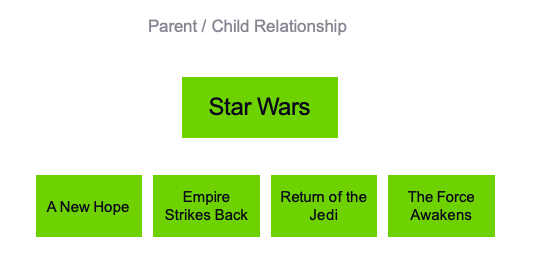


Notes:
How do we do relationships in Elasticsearch? 
Model relationship between Star Wars Franchise and movies that are part of it. 
Parent/Child relationship


---

## Strategies for Relational Data

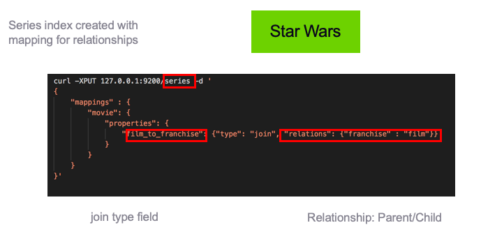

Notes:

Create a new index called "series" and add a new mapping for relationships. 


---

## Strategies for **Relational Data**

* ES6: Parents/Children all in same shard
* Forcing everything to be indexed to shard 1. 
* Use relationships minimally.

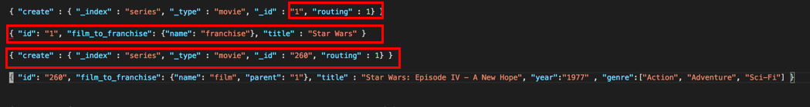

* Parent created: Franchise
* Fields for child created 

Notes:

Routing forces Elasticsearch to store the documents in the same shard.
First line creates the parent relation. 
Each child "film_to_franchise" field is set to 1, which is the ID of the parent. 
You'll see the field is "film" and it's parent is '1', which we defined originally.. 

---

## Lab: Analyzers & Relational data

* Lab 7:  Create new index mapping
* Lab 8: Create index for relational data

---

# Query-line Search

Notes:

Shortcut for playing around with Elasticsearch. 
Query-lite 


---

## “Query Lite”


* Proper JSON query 


* Proper JSON query 


Notes:

Sometimes it's easier to query the API by adding options to the URL directly. 

GET request Search 'movie' index, 'movie' type, q= <query> in this case it's title with term 'star'
Can be more complex also.. q=Year greater than 2010 and title 'Trek'
If you understand query lite syntax there's not a lot you can do with it. 


---

## It's not Always Simpler.


* Spaces etc. need to be URL encoded.


Notes:

It looks much easier to use the top query instead of writing a JSON block, but there's actually a lot more to it.
Sometimes it makes sense to use query lite, but most the time JSON block is much cleaner. 
Makes it much more difficult to read and understand what's going on. 


---

## And it Can be Dangerous.

* **Cryptic** and tough to debug
* Can be a **security issue** if exposed to end users
* **Fragile** – one wrong character and you're hosed.
* **But it's handy for quick experimenting.**

Notes:

Don't use it in production! 
Tough to read, and debug: powerful but challenging 
Security issue if end users are inputting data to server, possibly bringing down your cluster. 
Fragile, mess up a character and things happen that you aren't expecting. 


---

## Learn More.

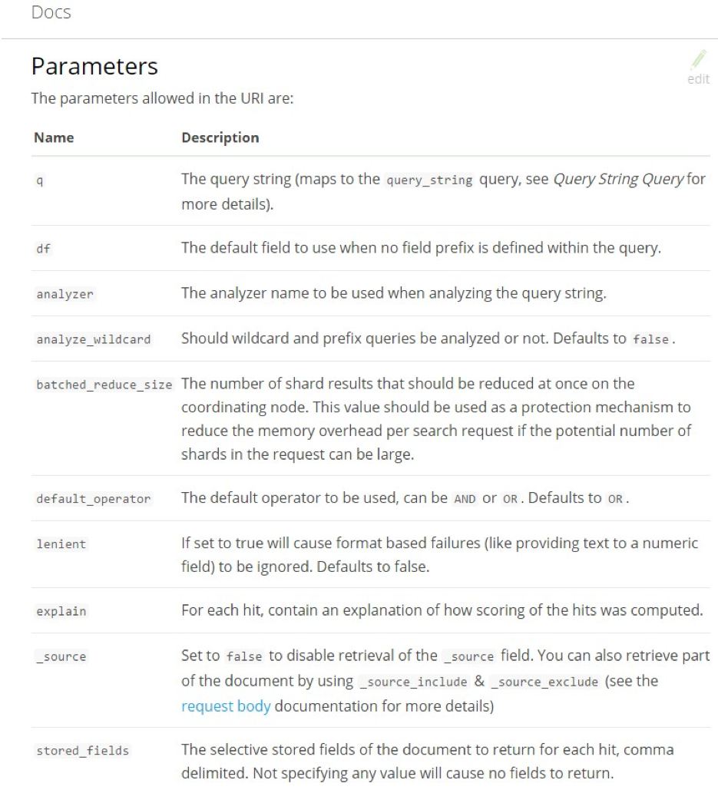

* This is formally called “URI  Search”. Search for that on the Elasticsearch  documentation.

* It's really quite powerful, but again is only appropriate for quick “curl tests”.


---

# Request Body Search


---

## Request Body Search

* How you're supposed to do  it

* Query DSL is in the request body as JSON
(yes, a GET request can have a body!)

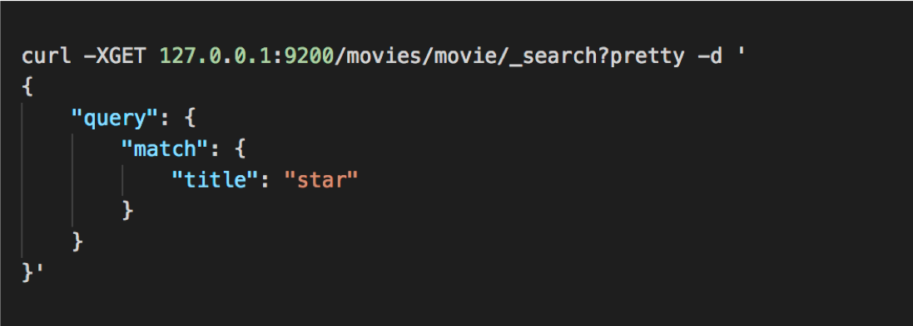

Notes:

Same search we did in last section, but this time we're going to use the proper JSON 
Takes a little bit to get used to JSON syntax but much easier to read.


---

## Queries and Filters

* **Filters** ask a yes/no question of your data  **queries** return data in terms of relevance

* use filters when you can – they are faster and cacheable.


Notes:

Filters and queries are different! 

queries: When search for term "Trek" you would use query, because you want results in terms of relevance. 

filters: when all you need is a yes or not,   much faster, cacheable results. 

---

## Example: Boolean Query with a Filter


Notes:

using the same search as last time to find movies 
bool = combines things together.
year greater than 2010, and has trek in the title.

in our last search we used '&' to search for newer than 2010 and title trek 
must does that.  
---

## Some Types of Filters

```text
term: filter by exact values
{“term”: {“year”: 2014}}

terms: match if any exact values in a list match
{“terms”: {“genre”: [“Sci-Fi”, “Adventure”] } }

range: Find numbers or dates in a given range (gt, gte, lt, lte)
{“range”: {“year”: {“gte”: 2010}}}

exists: Find documents where a field exists
{“exists”: {“field”: “tags”}}

missing: Find documents where a field is missing
{“missing”: {“field”: “tags”}}

bool: Combine filters with Boolean logic (must, must_not, should)
```

---

## Some Types of Queries

```text
match_all: returns all documents and is the default. Normally used with a filter.
{“match_all”: {}}

match: searches analyzed results, such as full text search.
{“match”: {“title”: “star”}}

multi_match: run the same query on multiple fields.
{“multi_match”: {“query”: “star”, “fields”: [“title”, “synopsis” ] } }

bool: Works like a bool filter, but results are scored by relevance.

```

Notes:

query bool: instead of filtering results that don't match it will score results by relevance 


---

## Boosting Results

* When searching across multiple fields, we may want to boost the scores in a certain field. In the example below, we boost scores from the summary field by a factor of 3 in order to increase the importance of the summary field.

```text
POST /shakespeare/_search
{
    "query": {
        "multi_match" : {
            "query" : “lear",
            "fields": ["title", "summary^3"]
        }
    },
    "_source": ["title", "summary", "publish_date"]
}

```

Notes:

query bool: instead of filtering results that don't match it will score results by relevance 


---

## Syntax Reminder

* queries are wrapped in a “query”: { } block,  filters are wrapped in a “filter”: { } block.

* you can combine filters inside queries, or queries inside filters too.

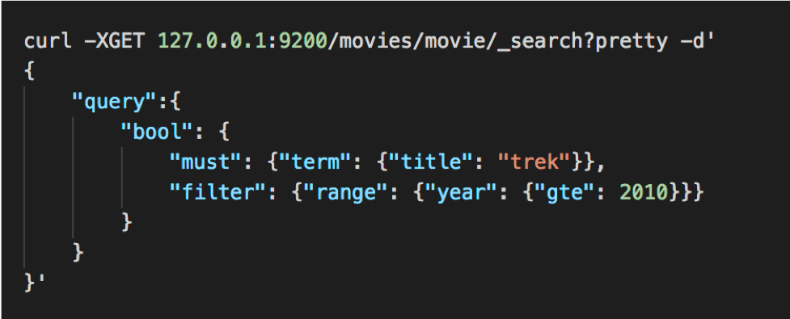


Notes:

We're going to have a boolean within our query, with a must clause and term query where title must be trek
Also passing range filter where we test to make sure year is greater than or equal to 2010.


---

# Phrase Search
---

## Phrase Matching

* Must find all terms, in the right order.

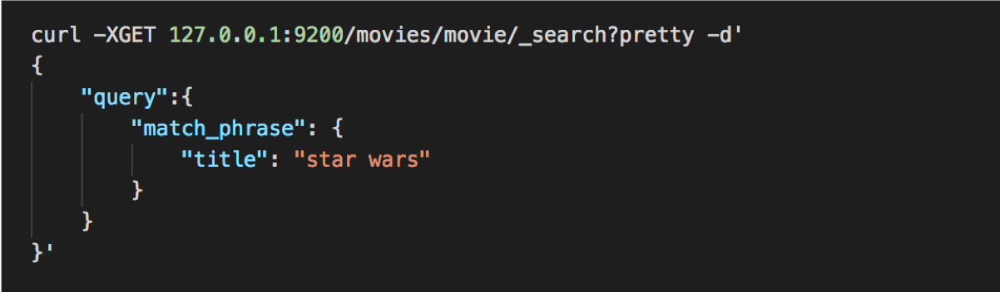


Notes:

This example does a phrase match against title "star wars"
In inverted index it doesn't just store that a given search term occurs inside a document, it stores the order they occur in.
That allows for phrase searches and not just single words or partial word searches. 


---

## Slop

* Order matters, but you're OK with some words being in between the terms:


* The **slop** represents how far you're willing to let a term move to satisfy a
phrase (in either direction!)

* Another example: “quick brown fox” would match “quick fox” with a slop of 1.

Notes:

If you want a little more flexibility and have different words within phrase. 
Slop defines how far you want it to move in any direction. 
Star beyond with slop=1 would match Start Trek beyond, or Star Wars beyond. 
It allows reversal also, so you can match "beyond star, or beyond trek"


---

## Proximity Queries

* Remember this is a query – results are sorted by relevance.

* Just use a really high slop if you want to get any documents that contain the words in your phrase, but want documents that have the words closer together scored higher.


Notes:

Higher relevance if terms are closer together. 
Star and beyond appear close together, returns all of them, but assigned higher relevance if the terms are closer together. 


---

## Lab: Phrase & Slop

* Lab 9: URI, JSON, Phrase and Slop searches

---

## Exercise

* Search for “Star Wars” movies  released after 1980, using both a **URI search** and **a request body search.**

---

# Pagination

Notes:

Building a big website, with lots of results and you want to return them 1 page at a time
Amazon
Google
Reddit
more! 

---

## Specify “From” and  “Size”


Notes:

From starts from 0, size of 3 means just display 3 results. 
Paginate to page 2, query would have "from =3", size = 3" 
Page 3 = "from = 6, size of 3 


---

## Pagination Syntax

* URI Search 


* JSON body

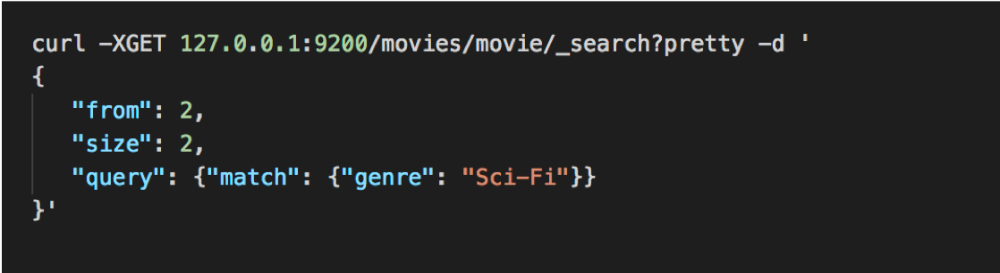

---

## Beware

* Deep pagination can **kill performance.**

* Every result must be **retrieved, collected, and sorted.**

* Enforce an **upper bound** on how many results you'll return to users.


Notes:

10373 - 10383 does not only collect 10 results. It has to figure out everything before it can do that. 
Enforce an upper bound (so no one overloads your system) 
---
# Sorting

Notes:

Sorting by alphabetical or numerical, is something that we want to do sometimes. 

---

## Sorting your results is  usually quite simple.


Notes:

This command sorts the movies by release date.


---

## Unless you're dealing with strings.

* A **text** field that is **analyzed** for full-text search can't be used to sort document
* This is because it exists in the inverted index as individual terms, not as the entire string.

Notes:

Text field provides partial matching, fuzzy queries etc, can't be used for sorting documents.
Full text stores everything so we can do partial matching so it can't sort by it. 


---

## Unanalyzed copy using the keyword type.

* To sort analyzed field you must make a copy using keyword type and sort by that.

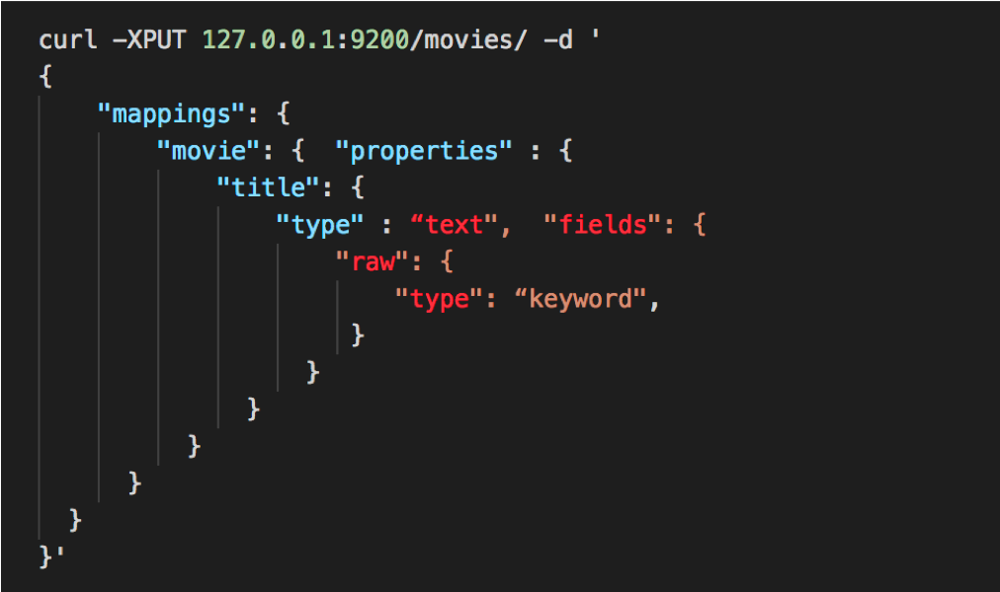


Notes:

To sort an analyzed field make an unanalyzed copy so you can sort that using Keyword type.
Create a subfield that is not analyzed, so you would have 2 copies. 
Title field = analyzed text, and a field called raw which is keyword, not analyzed 
There are many reasons you would want an unanalyzed field and sorting is just one of them.

---

## Raw keyword field

* Now you can sort on the unanalyzed raw field. 


* Sadly, you cannot change the mapping on an existing index.

* You'd have to delete it, set up a new mapping, and re-index it.

* Like the number of shards, this is something you should think
about before importing data into your index.

Notes:

To apply this we would have to delete our index and re-create it with raw mapping. 
Plan for this before importing data. 

---

# More with Filters

Notes:

Let's take a look at more complex filter queries. 

---

## Complex Filtered Query

* Science fiction movies without term "trek" in the title, released between the years of 2010 and 2015


---

## Exercise

* Search for science fiction movies  before 1960, sorted by title.

Notes:

boolean query searching for sci-fi genre, filter for movies before 1960, and sorting by title. 
Remember the trick for sorting non-analyzed data. 


---
# Fuzziness

Notes:
Fuzziness is a way to deal with typo's and misspellings 

---
## Fuzzy matches

* A way to account for typos and misspellings

* The **levenshtein distance** accounts for:

  - **Substitutions** of characters (interstellar -> intersteller)
  - **Insertions** of characters (interstellar -> insterstellar)
  - **Deletion** of characters (interstellar -> interstelar)

* All of the above have an edit distance of 1.


Notes:

Most search engines can deal with typo's misspellings etc.. .

levenshtein edit distance - Quantifies common typos and misspellings
3 different classes: substitutions, insertions and deletions. 
If we had an edit distance of 1, means 1 extra character is added, changed, or removed.  

---

## The Fuzziness Parameter

* Example of Interstellar being misspelled by 2 characters. 
  - fuzziness = 2, so we can tolerate 2 errrors.


Notes:

In this example we are specifying fuzziness = 2, which means we will tolerate 2 typos. 

---

## AUTO fuzziness

* Fuzziness: AUTO

  - **0** for **1-2** character strings
  - **1** for **3-5** character strings
  - **2** for **anything else**

Notes:

There's also an auto fuzziness option which works for most things. 
1-2 characters you don't want to tolerate any misspellings because you won't be able to figure out original word. 
3-5 characters we will tolerate 1 wrong 
and 2 for anything above that. 


---

# Partial Matching
---

## Prefix Queries on Strings

* If we remapped **year** field to be a string, we could do a simple query as below. 

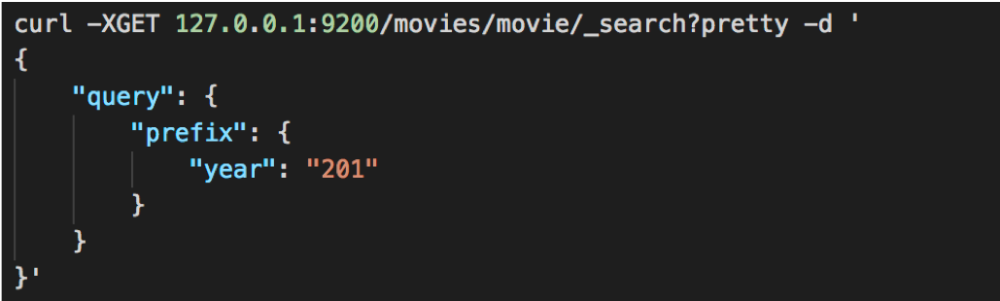

Notes:

For the above query to work we would need to remap the year field to a string type. 

201 would match 2011, 2012, 2013 etc.. 

---

## Wildcard Queries

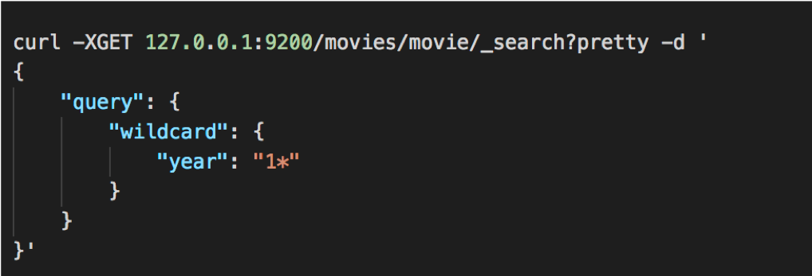


Notes:

wildcard query of year "1*" would return hits for anything beginning with 1. 

Could also do something like 
"year": "19*3“ or “year”:”19?3”

---

## Regexp Queries

```text
curl -H 'Content-Type: application/json' -XGET '10.0.2.15:9200/shakespeare/_search?pretty' -d '
{
"query" : {
"regexp" : {
"play_name" : "H[a-z]*t"
}
},
    "_source": ["play_name"]
}
'
```


