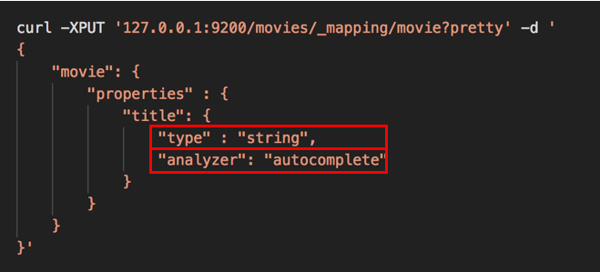
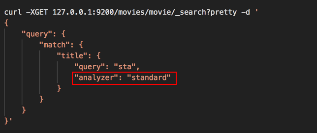
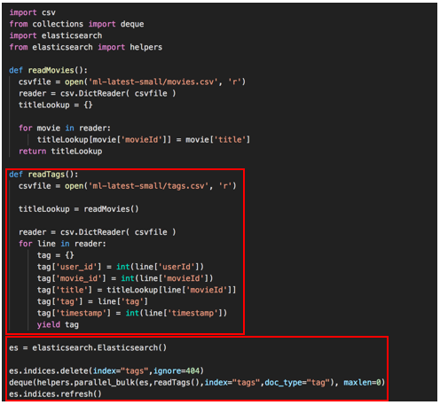
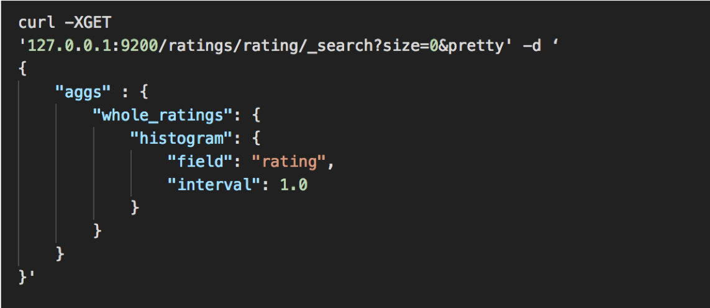
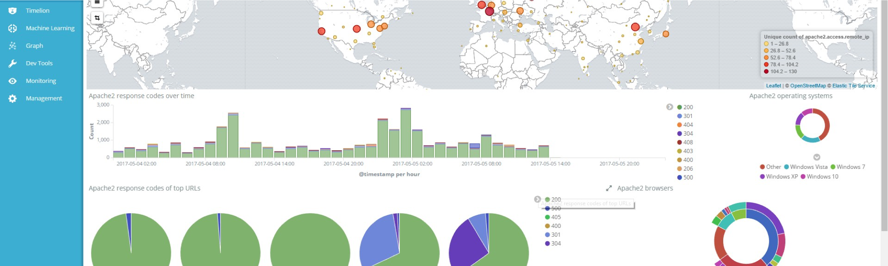
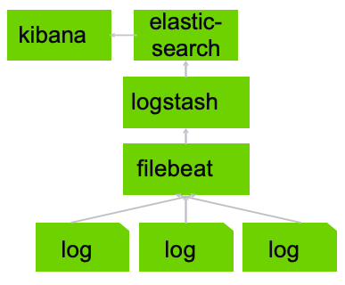

# Elasticsearch


---
# Node Type Basics


Notes:

Cluster, Node, Index, Shard, Document, ID

---

## Elasticsearch Node Types

* **Master Eligible**
  - Nodes only responsible for lightweight cluster-wide actions such as creating or deleting an index, tracking which nodes are part of the cluster, and deciding which shards to allocate to which nodes. 
* **Data**
  - Data nodes hold the shards that contain the documents we have indexed. Data nodes handle data related operations like CRUD, search, and aggregations. 
* **Ingest** 
  - Ingest nodes are dedicated to the execution of data pre-processing pipelines, composed of one or more ingest processors. 
* **Coordinating**
  - Nodes that can only route requests, handle the search reduce phase, and distribute bulk indexing. 

Notes:

It is important for cluster health to have a stable master node. Master nodes must have access to the data/ directory (just like data nodes) as this is where the cluster state is persisted between node restarts.
Data nodes perform operations that are I/O-, memory-, and CPU-intensive. It is important to monitor these resources and to add more data nodes if they are overloaded. The main benefit of having dedicated data nodes is the separation of the master and data roles.
Depending on the type of operations performed by the ingest processors and the required resources, it may make sense to have dedicated ingest nodes, that will only perform this specific task.
If we take away the ability to be able to handle master duties, to hold data, and pre-process documents, then we are left with a coordinating node that can only route requests, handle the search reduce phase, and distribute bulk indexing. Essentially, coordinating only nodes behave as smart load balancers.


---

## Elasticsearch Node Settings

* **Master Eligible**
  - node.master: true 
  - node.data: false 
  - node.ingest: false
* **Data**
  - node.master: false 
  - node.data: true 
  - node.ingest: false
* **Ingest**
  - node.master: false 
  - node.data: false 
  - node.ingest: true
* **Coordinating**
  - node.master: false 
  - node.data: false 
  - node.ingest: false


Notes:

These settings are noted in the /etc/elasticsearch/elasticsearch.yml

---
# ttl
---

## Time to live

* When we set up ingestion we can set a TTL on the log stash connections and beats so that they're restarted periodically and don't overload one connection.

```text
{
    "webservers" : {
        "_ttl" : { "enabled" : true, "default" : "30s" }
    }
}

```

---

# Search as You Type


Notes:

search as you type wikipedia, google etc.. 

---

## Search-as-you-type


Notes:

don't have to index data, just using prefix search like in last lab. 
Resource intensive, if large scale you want to index the solution. 


---

## Index with N-grams


* Edge n-grams are built only on the beginning of each term.

Notes:

All we care about for autocomplete are the beginning of the term. 
if computing just the edge n-grams for star, only a single,  s, st, sta, star 


---

## Indexing N-grams

* Create an "autocomplete" analyzer


* filter for edge n-grams min = 1 max = 20 

* custom analyzer, in addition to standard lowercase filter also has autocomplete filter (n-grams)


Notes:

Create custom analyzer/filter 
up to 20 letters long 


---

## Map your Field  




* Title is of type "string" and uses our custom analyzer "autocomplete


Notes:


Now creating a mapping, tell it to use autocomplete analyzer 


---

## N-grams only on Index

* Use n-grams only on the index side or query will also get split into n-grams, and we'll get results for  everything that matches 's', 't', 'a', 'st', etc.



* Analyzer = standard so don't split up what was typed into n-grams.

Notes:

want to use standard for queries, don't want it split up into n-grams.

---

## Completion Suggester


* You can also upload a list of all possible completions ahead of time  using **completion suggester.**

  - Most customizable 
  - Reliable results
  - Most control

* Suggesters
  - Completion – auto-complete/search-as-you-type
  - Term – spell correction
  - Phrase – did-you-mean


---

## Lab: Query tips

* Lab 10: Pagination, sorting, filtering and fuzzy matching
* Lab 11: Prefix/wildcard and auto-completion

---

# Importing Data
---

## Importing Data


* Stand-alone **scripts** can submit bulk documents via REST API

* **Logstash** and **beats** can stream data from logs, S3, databases, and more
AWS systems can stream in data via **lambda** or **kinesis firehose** **kafka, spark,** and more have Elasticsearch integration add-ons


---

# Importing **via script / json**
---

## Python Import

* Read in data from some distributed filesystem
* Transform it into JSON bulk inserts
* Submit via HTTP / REST to your elasticsearch cluster


  

---

## Python Example:


---

# Importing **via client api's**


---

## Client Libraries

* Free elasticsearch client libraries are available for pretty much any language.

  - Java has a client maintained by elastic.co
  - Python has an elasticsearch package
  - Elasticsearch-ruby
  - Several choices for scala
  - Elasticsearch.pm module for perl

* You don't have to wrangle JSON.


* `es = elasticsearch.Elasticsearch()`

* `es.indices.delete(index="ratings",ignore=404)  deque(helpers.parallel_bulk(es,readRatings(),index="ratings",doc_t  es.indices.refresh()`


---

## Python Full Script


* Function to read Movies
  - Open csv
  - Build dictionary
  - Match movieid with title
* Function to read Ratings
  - Open csv
  - Build dictionary
  - Match movieid with title
* Create ES instance, 
* Delete ratings table 
* Load ratings into "ratings" index. 


---

## Lab: Python Scripts


* Lab 12: Python scripts to import data

* We will also do the exercise on the next slide. 


---

## Python - Tags

* Exercise
  - write a script to import the tags.csv  data from ml-latest-small into a new  "tags" index.

---

## One Solution



* tag = line ['tag'] instead of float line (no longer a number) 

---

# Introducing Logstash

---

## Logstash


* Logstash is very powerful 
  - supports many systems
  - multiple in/out simultaneously.

---

## Powerful Features


* Logstash **parses, transforms,** and **filters** data as it passes through.
* It can **derive structure** from unstructured data
* It can **anonymize** personal data or exclude it entirely
* It can do **geo-location** lookups
* It can scale across many nodes
* It guarantees at-least-once delivery
* It absorbs throughput from load spikes

* See https://www.elastic.co/guide/en/logstash/current/filter-plugins.html  for the huge list of filter plugins.


* Can serve as buffer between source and destination


---

## Logstash - Input Sources


* elastic beats – cloudwatch – couchdb – drupal – elasticsearch –  windows event log – shell output – local files – ganglia – gelf –  gemfire – random generator – github – google pubsub – graphite –  heartbeats – heroku – http – imap – irc – jdbc – jmx – kafka –  lumberjack – meetup – command pipes – puppet – rabbitmq –  rackspace cloud queue – redis – relp – rss – s3 – salesforce –  snmp – sqlite – sqs – stdin – stomp – syslog – tcp – twitter – udp
– unix sockets – varnish log – websocket – wmi – xmpp – zenoss
– zeromq

---

## Logstash - Output

* boundary – circonus – cloudwatch – csv – datadoghq –  elasticsearch – email – exec – local file – ganglia – gelf –  bigquery – google cloud storage – graphite – graphtastic –  hipchat – http – influxdb – irc – jira – juggernaut – kafka –  librato – loggly – lumberjack – metriccatcher – mongodb –  nagios – new relic insights – opentsdb – pagerduty – pipe  to stdin – rabbitmq – rackspace cloud queue – redis –  redmine – riak – riemann – s3 – sns – solr – sqs – statsd
– stdout – stomp – syslog – tcp – udp – webhdfs –
websocket – xmpp – zabbix - zeromq


---

## Typical Usage


---

# Installing Logstash

---

## Installing Logstash


---

## Configuring Logstash


* Input = log location
* Start_position
* Ignore_older
* Set timestamp format being used in access_log
* Send to Elasticsearch & standard out


Notes:

sudo vi /etc/logstash/conf.d/logstash.conf


---

## Running Logstash

* cd /usr/share/logstash/

* sudo bin/logstash -f /etc/logstash/conf.d/logstash.conf

---

# Logstash XML Processing

---

## Logstash – XML Filter


* Takes an XML and parses to a data structure, or alternatively patterned into fields
* Currently maintained plugin for Logstash
* Lots of online examples of using it to do tasks based on XML from a variety of sources 


---

## XML Filter Xpath example

* Assume you have the following XML 
- <note date="2018-09-01"> <to>someone@gmail.com</to> <from>another.person@email.com</from> </note> 


```text
xpath => [ "xpath-syntax", "destination-field" ]
```

```text
xpath => [
  "/note/from/text()", "from,
  "/note/to/text()", "to,
  "/note/@date", "date"
]

```

* Values returned by XPath parsing from xpath-syntax will be put in the destination field
* Multiple values returned will be pushed onto the destination field as an array.


---

## Preprocess Example w/ Ruby

```text

ruby {  
     code => "
	require 'nokogiri'def iterative(ele)
        	ele.children.each do |tempNode|
        		if tempNode.text?
        			puts tempNode.content
        		else
        			iterative(tempNode)
        		end
        	end
        end
        xml_doc = Nokogiri::XML.parse(event.get('xml-data'))
        iterative(xml_doc)"
      }

```

Note:

If you want to mask data prior to processing into Elasticsearch


---

# Logstash with Mysql


---

## Jdbc Driver

* Get a mysql connector from https://dev.mysql.com/downloads/connector/j/

* Wget https://dev.mysql.com/get/Downloads/Connector-J/mysql-connector-java-5.1.42.zip

* Unzip mysql-connector-java-5.1.42.zip


---

## Configure Logstash


---

## Lab: Logstash & Mysql


* Lab 13: Install Logstash and integrate with MySQL


---

# Logstash with s3

---

## What is s3

* Amazon web services' **simple storage service** cloud-based distributed storage system

---

## Integration is Easy


---

# Logstash with Kafka

Notes:

https://docs.confluent.io/current/connect/connect-elasticsearch/docs/elasticsearch_connector.html

---

## What is **Kafka**

* Apache kafka
* Open-source stream processing platform
* High throughput, low latency
* Publish/subscribe
* Process streams
* Store streams
* Has a lot in common with logstash, really.

---

## Integration is Easy


---

# Aggregations
---

## Not just for search anymore


---

## Aggregations are Amazing

* **elasticsearch aggregations can sometimes take the place of hadoop / spark / etc – and return results instantly!**


---

## It Gets Better

* You can even nest aggregations  together!

* Pair aggregations with search queries
---

## Let's Learn by Example


* Bucket by rating value:


* Sum up all documents that have a "rating" value.


---

## Let's Learn by Example


* Count only 5-star ratings:


* Query narrows down movies to only 5.0 rating
* Aggregates sum up all those values.

---


## Let's Learn by Example

* Average rating for Star Wars:


* Find Star Wars Episode IV
* Return average rating for that specific movie.


---

# Histograms

---

## What is a Histogram


* Display totals of documents bucketed by some **interval range.**


---

## Rating Intervals

* Group ratings together by whole number.




---

## Sort by Decade


---

# Using Kibana

---

## What is Kibana?




---

## Installing Kibana

```text
sudo apt-get install kibana  sudo vi /etc/kibana/kibana.yml
change server.host to 0.0.0.0

sudo /bin/systemctl daemon-reload
sudo /bin/systemctl enable kibana.service
sudo /bin/systemctl start kibana.service
```

* Kibana is now available on port 5601


---

# Playing with Kibana
---


* Let's analyze the works of william shakespeare...

* Because we can.


---

## Lab: Aggs & Kibana

* Lab 14: Using aggregates and histograms
* Lab 15: Installing and using Kibana

---

## Elasticsearch

* Exercise

  - find the longest shakespeare plays –  create a vertical bar chart that  aggregates the count of documents by  play name in descending order.


---

# Using Filebeat


---

## Filebeat: Lightweight Shipper



* Filebeat can optionally talk directly to elasticsearch. when using logstash, elasticsearch is just one of many  possible destinations!

* Logstash and filebeat can communicate to  maintain "backpressure" when things back up

* Filebeat maintains a read pointer on the logs.  every log line acts like a queue.

* Logs can be from apache, nginx, auditd, or mysql


---

## This is Called the Elastic Stack


* prior to beats, you'd hear about the "ELK stack" – elasticsearch, logstash, kibana.


---

## Filebeat vs Logstash

* Wrong question: Use them together.
* It won't let  you overload your pipeline.
* You get more flexibility on scaling your cluster.


---

# Installing Filebeat
---

## Lab: Kibana & Filebeats

* Lab 16: Install filebeats and configure with Kibana

---

# Elasticsearch Operations


---

# Choosing your Shards

---

## An Index is Split into Shards


---

## Primary and Replica Shards

* This **index** has two **primary shards** and two **replicas.**
* Your application should round-robin requests amongst nodes.


* **Write** requests are routed to the primary shard, then replicated  
* **Read** requests are routed to the primary or any replica

---

## How many shards do I need?

* You can't add more shards later without re-indexing
* But shards aren't free – you can't just make 1,000 of them and stick them on one node at first.
* You want to overallocate, but not too much
* Consider scaling out in phases, so you have time to  re-index before you hit the next  phase.


---

## Shard Planning

* The "right" number of shards depends on your data
and your application. there's no secret formula.
* Start with a single server using the same hardware  you use in production, with one shard and no  replication.
* Fill it with real documents and hit it with real queries.
* Push it until it breaks – now you know the capacity of  a single shard.


---

## Remember Replica shards can be Added

* Read-heavy applications can add more replica shards without re-indexing.
* Note this only helps if you put the new replicas on extra hardware!
* Shards have a limit of 2B documents


---

# Adding an Index

---

## Creating a New Index

* **Remember this is an important step for production clusters!**

```text
PUT /new_index
{
"settings": {
"number_of_shards":	10,
"number_of_replicas":	1
}
}
```

* You can use index templates to automatically  apply mappings, analyzers, aliases, etc.


---

## Scaling Strategies

* Adding a new shard is not only option for scaling. 

* Multiple-indices:
  - Make a new index to hold new data
  - Search both indices
  - Use index aliases to make this easy to do
  - Much easier than re-indexing

---

## Scaling Strategies

* multiple-indices:
  - with time-based data, you can have one index per time frame
  - common strategy for log data where you usually just  want current data, but don't want to delete old data  either
  - again you can use index aliases, ie "logs_current",  "last_3_months", to point to specific indices as they rotate


---

## Alias Rotation Example

```text
POST /_aliases
{
"actions": [
{ "add":       { "alias": "logs_current", "index": "logs_2017_06" }},
{ "remove":    { "alias": "logs_current", "index": "logs_2017_05" }},
{ "add":       { "alias": "logs_last_3_months", "index": "logs_2017_06" }},
{ "remove":    { "alias": "logs_last_3_months", "index": "logs_2017_03" }}

]
}
optionally….
DELETE /logs_2017_03

```


---

# Choosing your Hardware
---

## 


* RAM is likely your bottleneck

* 64GB per machine is the sweet spot  (32GB to elasticsearch, 32GB to the  OS / disk cache for lucene)

* Under 8GB not recommended


---

## Other Hardware Considerations

* Fast disks are better – SSD's if possible
* Use RAID0 – your cluster is already redundant
* Cpu not that important
* Need a fast network
* Don't use NAS
* Use medium to large configurations; too big is bad, and too many small boxes is bad too.


---

# Heap sizing
---

## Your Heap Size is Wrong

* The default heap size is only 1GB!
* Half or less of your physical memory should be allocated to elasticsearch

- The other half can be used by lucene for caching
- If you're not aggregating on analyzed string fields, consider using less  than half for elasticsearch
- Smaller heaps result in faster garbage collection and more
memory for caching

* `Export ES_HEAP_SIZE=10g` or

* `ES_JAVA_OPTS="-Xms10g –Xmx10g" ./bin/elasticsearch`

* Don't cross 32GB! pointers blow up then.


---

# Monitoring with Elastic Stack
---

## What was X-pack?

* An elastic stack extension
* Security, monitoring, alerting, reporting, graph, and machine  learning
* Formerly shield / watcher / marvel
* Only parts can be had for free – requires a paid Platinum license or trial  otherwise


---

## Install x-pack on Earlier Versions of Elastic Stack (pre 6.5)


* cd /usr/share/elasticsearch
* sudo bin/elasticsearch-plugin install	x-pack

* sudo vi /etc/elasticsearch/elasticsearch.yml  (Add xpack.security.enabled:false)
* sudo /bin/systemctl	stop elasticsearch.service  sudo /bin/systemctl	start elasticsearch.service
* cd /usr/share/kibana/
* sudo -u kibana bin/kibana-plugin install x-pack  sudo /bin/systemctl	stop kibana.service

* sudo /bin/systemctl	start kibana.service

---

## Lab: Install X-Packs

* Lab 17: Install X-Packs


---

# Using Snapshots
---

## Back Up your Indices

* Store backups to NAS, Amazon S3, HDFS, Azure

* Smart enough to only store changes since last snapshot


---

## Create a Repository

* Add it into elasticsearch.yml: path.repo: ["/home/<user>/backups"]

```text

PUT _snapshot/backup-repo
{
"type": "fs",
"settings": {
"location": "/home/<user>/backups/backup-repo"
}
}
```


---

## Using Snapshots


* snapshot all open indices:
  - PUT _snapshot/backup-repo/snapshot-1

* get information about a snapshot:
  - GET _snapshot/backup-repo/snapshot-1

* monitor snapshot progress:
  - GET _snapshot/backup-repo/snapshot-1/_status

* restore a snapshot of all indices:
  - POST /_all/_close
  - POST _snapshot/backup-repo/snapshot-1/_restore


---

# Rolling Restarts

---

## Restarting your Cluster


* Sometimes you have to… OS updates, elasticsearch version updates, etc.

* To make this go quickly and smoothly, you want to disable index  reallocation while doing this.

---

## Rolling Restart Procedure

1. Stop indexing new data if possible
2. Disable shard allocation
3. Shut down one node
4. Perform your maintenance on it and restart, confirm it joins the cluster.
5. Re-enable shard allocation
6. Wait for the cluster to return to green status
7. Repeat steps 2-6 for all other nodes
8. Resume indexing new data


---

## Cheat Sheet


* Disable shard allocation

```text
PUT _cluster/settings
{
"transient": {
"cluster.routing.allocation.enable":	"none"
}
}
```
* Stop elasticsearch safely

```text
sudo /bin/systemctl	stop elasticsearch.service
```
* Enable shard allocation

```text

PUT _cluster/settings
{
"transient": {
"cluster.routing.allocation.enable":	"all"
}
}
```


---

# Cluster Basics

---

## Elasticsearch Cluster


* A cluster is a collection of one or more nodes (servers) 
* Together the cluster holds your entire data and provides federated indexing and search 
* Capabilities across all nodes
* Clusters are identified by a unique name 
* Default cluster naming is "elasticsearch"
* Nodes join clusters automatically on startup
* Nodes join clusters using their configured naming


Notes:

Make sure that you don't reuse the same cluster names in different environments, otherwise you might end up with nodes joining the wrong cluster. For instance you could use logging-dev, logging-stage, and logging-prod for the development, staging, and production clusters.


---

## Elasticsearch Cluster


---

## Putting It all Together

* When you start an instance of Elasticsearch, you are starting a node
* An Elasticsearch cluster is a group of nodes that have the same cluster.name attribute 
* As nodes join or leave a cluster, the cluster automatically reorganizes itself to evenly
* Distribute the data across the available nodes
* Nodes can host primary and/or replica depending on configuration
* Configuration is contained in the elasticsearch.yml, a YAML file 
* Nodes are both data and master-eligible, by default
* New nodes can be configured for a specific purpose, such as handling data ingestion


---

## Cluster Monitoring 

* Marvel, an Elastic Stack Feature, is the default option for monitoring Elasticsearch clusters
* Monitoring should be done with a separate node or cluster to avoid impacts on monitoring
* When there are cluster issues
* InfluxDB can be utilized with an Elasticsearch Telegraf agent for monitoring
* Three Elastic Stack APIs form the basis for monitoring 
  - Node stats API for cluster node statistics.
  - Cluster health API retrieves status of cluster node health
  - Cluster stats API retrieves status from a cluster wide perspective


---

# Features
---

## Elastic Stack Features


---

# Cloud Configuration
---

## Elastic Cloud


---

## Elastic Cloud Enterprise


---

## Open Distro for Elasticsearch


---

## Amazon Elasticsearch Service


---

## Amazon ES Service Architecture


---

# Query Performance 

---

## To Optimize Performance of Our Queries

1. Design your data model based on your queries
2. Utilize nested documents versus parent-child
3. Tune the refresh interval, which as we noted earlier is 1s
4. Use force merge to reduce the number of segments
5. Understand the global ordinals where you use term aggregation
6. Consider pre-indexing when using range aggregations
7. Avoid memory to disk swapping
8. Always test against production-like data sets
9. Use bulk for insert queries when possible


---

## Give memory to the filesystem cache


* At least half the available memory goes to the filesystem cache so that Elasticsearch can keep hot regions of the index in physical memory.

---

## Use Faster Hardware


* Test to validate that you're not I/O or CPU bound.  Virtualized storage is much less performant than local storage.  Ex: Amazon Web Services EBS

---

## Document Modeling


* Documents should be modeled so that search-time operations are as cheap as possible.

* In particular, joins should be avoided, and denormalization of documents is optimal.


---

# Wrapping Up


