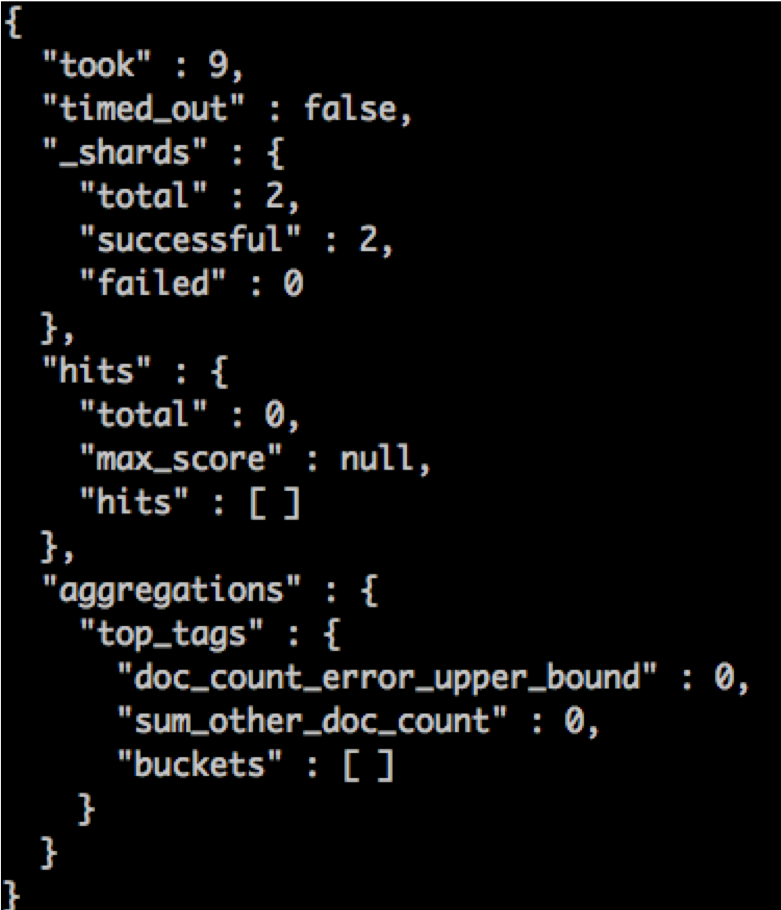
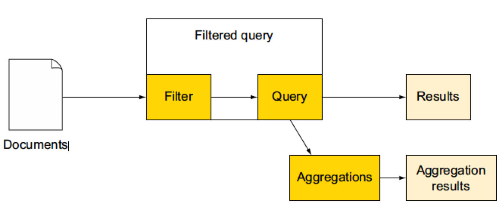

# Analytics with Elasticsearch
---
# Analytics or Aggregations?

---

## Search for Documents

* Usually, Search is about 
  - Indexing
  - Searching
* Out of a large document collection
  - find the most relevant
  - match to keywords

* A different use case
  - Analyze the collection itself

Notes:

---

## Analytics or Aggregation?

<!-- {"left" : 7.22, "top" : 1.07, "height" : 4.98, "width" : 2.89} -->

* Aggregation or Analytics
  - Aggregation is an older term
  - Analytics is more fashionable today

* In Apache Spark
  - **agg**.sum (etc.)

* Or
  - Analytics is more marketing
  - Aggregation – SQL, data warehousing

Notes:

Image: http://www.visionsoftravel.org/

---

## Analytics Use Cases

* Statistics
  - Hot topics for news
  - Revenue trends for different products
  - The number of unique visitors to your website

* Questions
  - What happened?
  - Why did it happen?
  - How did it happen?

* Down the road
 - What will happen (Machine Learning)

Notes:

---

## Aggregations in Elasticsearch

* Load the documents that match your search
* Then
  - Counting the terms of a string field
  - Calculate the average on a numeric field
  - MIN
  - MAX
  - Etc.

Notes:

---

## Aggregation Example

* Training grouped by subject
* Showing locations for a selected subject

<!-- {"left" : 0.01, "top" : 2.24, "height" : 2.65, "width" : 9.26} -->

Notes:

---

## How was it done?

* To get such a list of popular
  - Use aggregations
  - Terms aggregation on the tags field
  - Count occurrences of each term in that field
  - Return the most frequent terms
* Many other types of aggregations are available
  - We will cover it later
* Examples
  - date_histogram aggregation 
    - How many events by month 
  - avg aggregation	
    - average number of attendees for each event
  - significant_terms aggregation
    - which users have similar taste for events

Notes:

---

## NoSQL and Data Analytics

* NoSQL is for point access
* Analytics is better handled in Hadoop and Spark
* But if all your data is in a Elasticsearch or Cassandra

 

<!-- {"left" : 0.58, "top" : 3.55, "height" : 3.08, "width" : 9.09} -->

Notes:

---

## Why not use Facets?

* You may have heard about **facets** in Elasticsearch or Solr
* But you can’t nest multiple types of facetsL
  - Limits the possibilities for exploration 
* Examples: can do
  - On a blogging site
  - Facets -> hot topics this year
  - Date histogram facet -> how many articles are posted each day 
* Examples: cannot do
  - Find the number of posts per day
  - Separately for each topic

Notes:

---

## Types of Aggregation

* Metrics
  - Statistics
* Buckets
  - Histograms

Notes:

---

## Metrics Aggregation

* Metrics
  - Statistical analysis of a group of documents -> metrics
    - Minimum value
    - Maximum value
    - Standard deviation
    - Etc.
  - Examples
    - average price of items from an online shop
    - number of unique users logging on

Notes:

---

## Bucket Aggregation

* Buckets
  - Divide matching documents into one or more buckets
  - Give the number of documents in each bucket
* Example
  - `terms` aggregation
  - Give the most popular tags
  - Makes a bucket of documents for each tag
  - Gives you the document count for each bucket.

Notes:

---

## Bucket Aggregation Illustrated

<!-- {"left" : 0.74, "top" : 2.62, "height" : 3.84, "width" : 8.76} -->

Notes:

---

## Aggregation Rule #1

* Defined them in the same JSON request as your querie
* Mark them by the key aggregations, or aggs
* Give each one a name
* Specify the type and the options specific to that type

Notes:

---

## Aggregation Rule #2

* Aggregations run on the results of your query
* Documents that don’t match your query aren’t accounted for
* Exception: global aggregation (more later)

Notes:

---

## Aggregation Rule #3

* The results of your query can be filtered
  - Without influencing aggregations
* This is done with post filters
* Example
  - Search in an online store..
  - Search for a keyword
  - Build statistics on all items matching...
  - Then use post filters to show only results that are in stock

Notes:

---

## Aggregate by Tag

<!-- {"left" : 0.25, "top" : 2.64, "height" : 2.04, "width" : 9.75} -->

Notes:

---

## Aggregation Request

* At the top level there’s the aggregations key (aggs)
* Aggregation name
* Aggregation type terms and the specific options
* In our case, the field name

Notes:

---

## Aggregate by Tag - Response

<!-- {"left" : 0.72, "top" : 2, "height" : 5.65, "width" : 8.8} -->

Notes:

---

## Aggregation Internals

* Regular search is fast
  - Inverted index is for fast look-up on specific terms
* Aggregation is hard work
  - Works with the terms of each document matching the query 
  - Maps between document IDs and termsU
  - Un-inverts the inverted index into field data
  - The more terms – the more memory
  - Elasticsearch needs a large heap
    - Especially for large numbers of documents
    - Or for more than one term per document

Notes:

---

## Top Tags for Group in a Location

<!-- {"left" : 0.43, "top" : 2.12, "height" : 3.92, "width" : 9.4} -->

Notes:

---

## Reply for Location

<!-- {"left" : 2.34, "top" : 1.28, "height" : 6.5, "width" : 5.58} -->

Notes:

---

## Filtered Query

<!-- {"left" : 0.26, "top" : 1.88, "height" : 2.29, "width" : 9.73} -->

Notes:

---

## Filtered Query Result

<!-- {"left" : 2.54, "top" : 1.28, "height" : 6.5, "width" : 5.17} -->

Notes:

---

## How Filter Query Works

<!-- {"left" : 1.02, "top" : 2.83, "height" : 3.42, "width" : 8.21} -->

Notes:

---

## Aggregation Summary

* Provide view of query results
  - Count terms, compute statistics
* Aggregations are the new facets :)
* Two main types of aggregations: bucket and metrics
* Metrics aggregations: statistics over a set of documents
  - Min, Max, Avg
* Some metrics aggregations are approximations
  - Better scaling
  - Examples: percentiles and cardinality

Notes:

---

## Aggregation Summary Continued

* Bucket aggregations
  - put documents into one or more buckets
  - return counters for those buckets
  - Example: the most frequent posters in a forum
* Nest sub-aggregations
  - Example: average number of comments for blogposts per tag
* `top_hits -` sub-aggregation for grouping
* `terms` - for top frequent users/locations/items
* `significant_terms`
  - words that appear more often in the query results than in the overall index.

Notes:

---

## Aggregation Summary Completed

* `range` and `date_rang -` categorizing numericand date fields
  - `histogram` and `date_histogram –` for fixed intervals
* Single-bucket aggregations
  - `global, filter, filters`, and `missing` 
  - change the document set on which other aggregations run
  - defaults to the documents returned by the query.

Notes:

---

## Lab: Aggregation Queries

* Please do this lab: 

- `analytics/aggregations.md`

