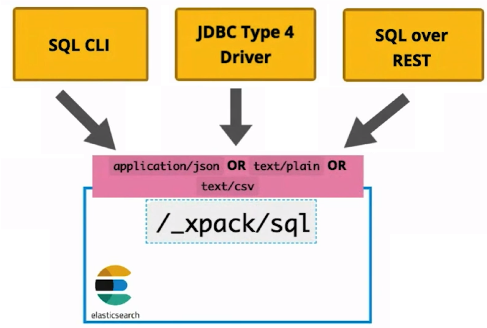
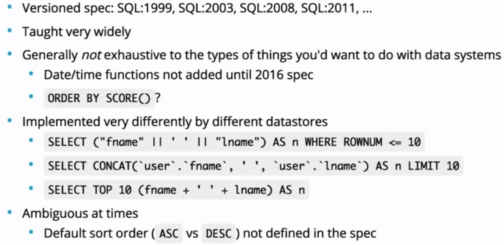
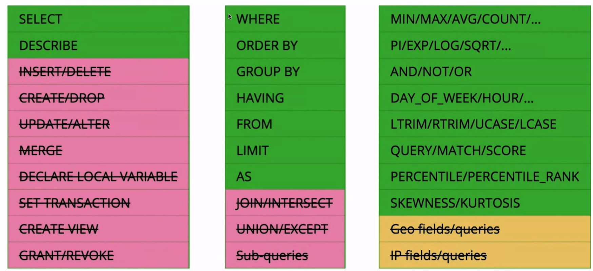
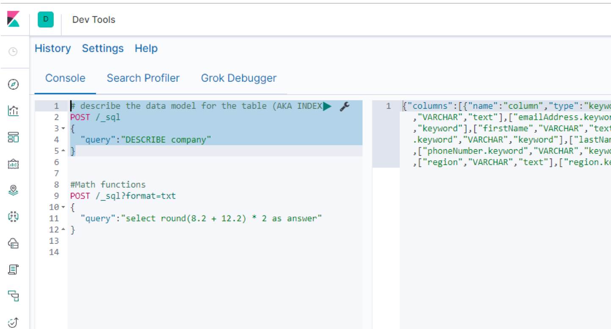

# Elasticsearch SQL

---

## Common thoughts on "Elasticsearch + SQL"



* RDBMS
* Joins
* BI Tools like Tableau & PowerBI
* SQL 
* What about Query DSL?
* How/Where/Why/When?


---

## What is SQL?



---

## What is the evolution of Elastic Stack SQL?





---

## Experiment: Elastic Stack SQL Exploration 

* Open the Kibana Dev Console


---

## Querying Elastic Kibana Console Interface





---

## Queries to Explore

```text
# describe the data model for the table (AKA INDEX)
POST /_sql
{
  "query":"DESCRIBE company"
}

#deprecated syntax - old school
POST /_xpack/sql
{
  "query":"select * From company"
}
```

---

## Queries to Explore

```text
#return standard elasticsearch output format
POST /_sql
{
  "query":"select * From company"
}

#return CSV
POST /_sql?format=csv
{
  "query":"select * From company"
}
```

---

## Queries to Explore

```text
#return standard SQL query output format
POST /_sql?format=text/plain
{
  "query":"select * From company"
}

#Shorter syntax with limit
POST /_sql?format=txt
{
  "query":"select * From company limit 1"
}

```


---

## Queries to Explore

```text
# search fewer fields
POST /_sql
{
  "query":"select firstname, lastname from company"
}

# search fewer fields
POST /_sql
{
  "query":"select firstName, lastName from company"
}

```


---

## Queries to Explore


```text
# future
POST /_sql
{
  "query":"select distinct firstName, lastName from company"
}
#Math functions
POST /_sql?format=txt
{
  "query":"select round(8.2 + 12.2) * 2 as answer"
}
```

