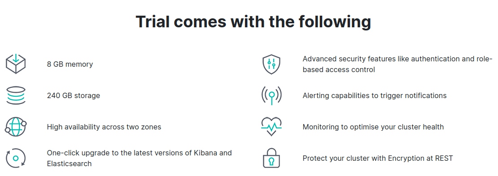
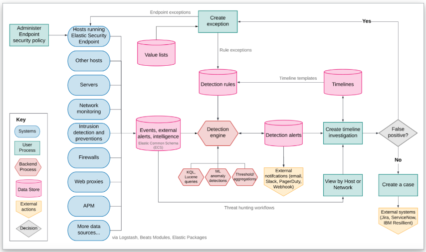

# Elasticsearch Security

---

## License for full Machine Learning

---

## Unify security on an open platform

* Elastic Security analyzes years of data, automates key processes, and protects every host.
* **SIEM** - System Integration and Event Management
  * Detect and respond to advanced threats at cloud speed and scale
* **Endpoint security**
  (Prevent, collect, detect, and respond — all via a single agent
* **XDR** - Extended Detection and Response
  * Power SecOps across your endpoints, cloud, network, and beyond
* **Cloud security**
  * Assess your cloud posture and protect cloud workloads, all with one solution

---

## SIEM

* Elastic Security equips analysts to prevent, detect, and respond to threats. The free and open solution helps analysts address critical security use cases such as SIEM, endpoint security, threat hunting, cloud monitoring, and more.

---

## SIEM trial

* Elastic Security equips analysts to prevent, detect, and respond to threats. The free and open solution helps analysts address critical security use cases such as SIEM, endpoint security, threat hunting, cloud monitoring, and more.

---

## XDR

* Thwart complex attacks
  * Block unknown and polymorphic malware and ransomware. Stop advanced threats with host-based behavior analytics.

* Alert in high fidelity
  * Bolster team efficacy by detecting threats centrally and minimizing false positives via extensive corroboration.

* Respond at scale
  * Perform ad-hoc correlation. Gather rich context with osquery. Invoke remote response actions across distributed endpoints.

---

## Elastic security

---

