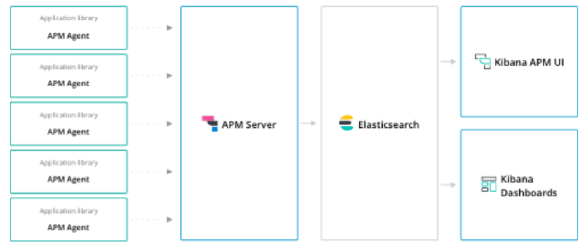
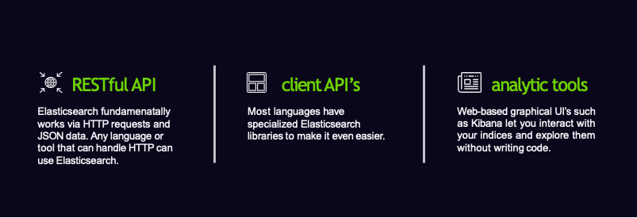
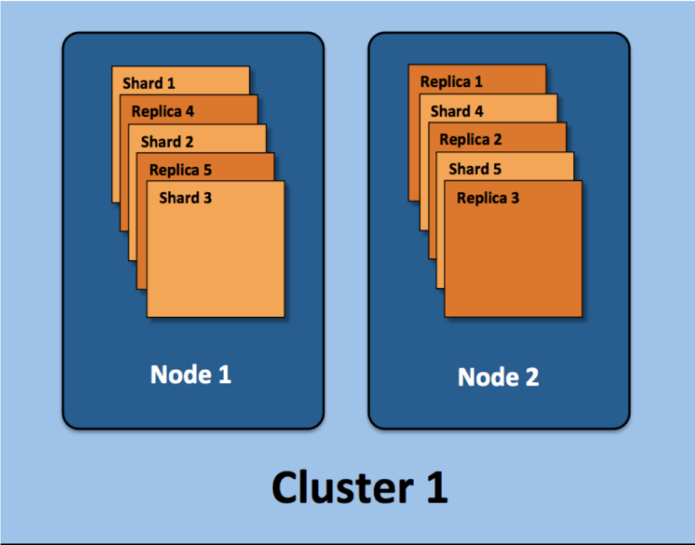

# Elasticsearch
---

## Section Objectives

* Understand search and Elasticsearch concepts
* Being able to install and run Elasticsearch, index data, run queries
* Understand and use Elasticsearch responses

Notes:

---

# Elasticsearch introduction

---

## Elastic Stack – Evolution 

* 2010 - Released as Open Source project
* 2012 - Elasticsearch company founded 
* 2015 - Rebranded as Elastic
* Highly scalable
  - Open Source
* Enterprise support available 
* Built for searching and analyzing large datasets 

Notes:

Elasticsearch was released as an open source project in 2010, and gained a lot of popularity because it was easy to use and offered great indexing and powerful searching. 
In 2012 Elasticsearch the company was founded.  In 2015 they changed the name to Elastic, because the company developed and supported many additional products. 

GitHub uses it to let users search the repositories, StackOverflow indexes all of its questions and answers in Elasticsearch, and SoundCloud offers search in the metadata of the songs.

---

## Elastic Stack

* 2009 - Released as Open Source project
* 2015 - Added to Elastic family
* 2015 - Log forwarder released
* Open Source data collection engine
* Real-time pipelining capabilities 
* Collect logs from multiple input sources and send to Elasticsearch

 &nbsp; &nbsp; &nbsp; &nbsp; &nbsp; 

Notes:

Logstash is an open source data collection engine with real-time pipelining capabilities. 
2009 - open source release 
2013 - added to Elastic family. 

Logstash is a tool that can be used to collect, process and forward events and log messages. Collection is accomplished via number of configurable input plugins including raw socket/packet communication, file tailing and several message bus clients.

---

## Elastic Stack

* 2011 - Released as Open Source project
* 2013 - Added to Elastic family
* Browser based analytics & search dashboard for Elasticsearch
* Visualize Elasticsearch data 
* Highly customizable

 &nbsp; &nbsp; &nbsp;   &nbsp; &nbsp; &nbsp; 

---

## Elastic Stack

 

 

Notes:

Elasticsearch is a search and analytics engine. Logstash is a server‑side data processing pipeline that ingests data from multiple sources simultaneously, transforms it, and then sends it to a "stash" like Elasticsearch. Kibana lets users visualize data with cha
rts and graphs in Elasticsearch, essentially creating dashboards.

---

## Elastic Stack

* 2015 - Beats tools released
* Open platform for single-purpose data shippers

 &nbsp; &nbsp; &nbsp; &nbsp; &nbsp; &nbsp;  &nbsp; &nbsp; &nbsp;

Notes:

Beats is the platform for single-purpose data shippers. They install as lightweight agents and send data from hundreds or thousands of machines to Logstash or Elasticsearch.
Log files
Metrics
Network data
Uptime monitoring 
etc...

---

## Elastic Stack

* 2016 - X-Pack released
* Renamed in 2018 to Elastic Stack Features
* Tools to enable monitoring, alerting, reporting, machine learning and much more

&nbsp; &nbsp;  &nbsp; &nbsp;&nbsp; &nbsp;  &nbsp; &nbsp; 

Notes:

X-Pack is a pay for service that provides many features 
Monitoring (Marvel)
Alerting (Watcher) trigger notifications on changes or schedule and ship recurring reports
Graph (explore the relationships between data) 
Machine learning  (automatically detect unusual changes in your data)
Reporting 
Security (Shield) i.e. Add a login screen to Kibana

https://www.elastic.co/guide/en/elasticsearch/reference/current/configuring-security.html
https://www.elastic.co/products/x-pack

---

## Elastic Stack

 &nbsp; &nbsp; &nbsp; &nbsp;

 &nbsp; &nbsp; &nbsp; &nbsp; &nbsp;

 &nbsp; &nbsp; &nbsp; &nbsp; &nbsp;

Notes:

https://www.elastic.co/elasticon/2015/sf/evolution-of-elasticsearch-at-yelp

https://www.elastic.co/elk-stack

---

## Elasticsearch - Hadoop

Notes:

https://www.elastic.co/elasticon/2015/sf/evolution-of-elasticsearch-at-yelp

https://www.elastic.co/elk-stack

---

## ES-Hadoop

* ES-Hadoop is a single distributable binary that allows the use of HDFS as a archive repo for Elastic Stack
* Works with open source and distributed versions of Hadoop, e.g. Cloudera & Databricks
* Index data from Hadoop into Elasticsearch for high performance querying and aggregation of Big Data

Notes:

X-Pack is a pay for service that provides many features 
Monitoring (Marvel)
Alerting (Watcher) trigger notifications on changes or schedule and ship recurring reports
Graph (explore the relationships between data) 
Machine learning  (automatically detect unusual changes in your data)
Reporting 
Security (Shield) i.e. Add a login screen to Kibana

https://www.elastic.co/guide/en/elasticsearch/reference/current/configuring-security.html
https://www.elastic.co/products/x-pack

---

## Elastic Stack Application Performance Monitoring

---

## Elastic Stack use cases

* **Ecommerce**
  - Utilize Elasticsearch as your storefront search mechanism storing product or service information and enabling features like typeahead 

* **DevOps**
  - Collect log and transactional data to identify patterns or anomalies in the day to day operations of your applications, processes, services and APIs

* **Alerting**
  - Pattern reverse search against queries to identify conditions that meet a certain criteria, e.g. tell me when a flight drops below X$ during a set timeframe

---

## Elastic Stack use cases

* **Internet of Things**
  - Store streams of device data in Elastic Stack and visualize that information for customers, e.g. show all the active snowplows in the city on an interactive map

* **Data Visualization**
  - Store data in Elasticsearch and build custom dashboards in Kibana to show the effects of changes, both expected and unexpected

* **Advanced Analytics**
  - Run analytics against existing data to enable the use of ad-hoc queries for decision support and business intelligence

Notes:

You run an online web store where you allow your customers to search for products that you sell. In this case, you can use Elasticsearch to store your entire product catalog and inventory and provide search and autocomplete suggestions for them.
You want to collect log or transaction data and you want to analyze and mine this data to look for trends, statistics, summarizations, or anomalies. In this case, you can use Logstash (part of the Elasticsearch/Logstash/Kibana stack) to collect, aggregate, and p
arse your data, and then have Logstash feed this data into Elasticsearch. Once the data is in Elasticsearch, you can run searches and aggregations to mine any information that is of interest to you.
You run a price alerting platform which allows price-savvy customers to specify a rule like "I am interested in buying a specific electronic gadget and I want to be notified if the price of gadget falls below $X from any vendor within the next month". In this ca
se you can scrape vendor prices, push them into Elasticsearch and use its reverse-search (Percolator) capability to match price movements against customer queries and eventually push the alerts out to the customer once matches are found.
You have analytics/business-intelligence needs and want to quickly investigate, analyze, visualize, and ask ad-hoc questions on a lot of data (think millions or billions of records). In this case, you can use Elasticsearch to store your data and then use Kibana 
(part of the Elasticsearch/Logstash/Kibana stack) to build custom dashboards that can visualize aspects of your data that are important to you. Additionally, you can use the Elasticsearch aggregations functionality to perform complex business intelligence querie
s against your data.

---

## Elastic for Internet of Things (IoT)

Notes:

You run an online web store where you allow your customers to search for products that you sell. In this case, you can use Elasticsearch to store your entire product catalog and inventory and provide search and autocomplete suggestions for them.
You want to collect log or transaction data and you want to analyze and mine this data to look for trends, statistics, summarizations, or anomalies. In this case, you can use Logstash (part of the Elasticsearch/Logstash/Kibana stack) to collect, aggregate, and p
arse your data, and then have Logstash feed this data into Elasticsearch. Once the data is in Elasticsearch, you can run searches and aggregations to mine any information that is of interest to you.
You run a price alerting platform which allows price-savvy customers to specify a rule like "I am interested in buying a specific electronic gadget and I want to be notified if the price of gadget falls below $X from any vendor within the next month". In this ca
se you can scrape vendor prices, push them into Elasticsearch and use its reverse-search (Percolator) capability to match price movements against customer queries and eventually push the alerts out to the customer once matches are found.
You have analytics/business-intelligence needs and want to quickly investigate, analyze, visualize, and ask ad-hoc questions on a lot of data (think millions or billions of records). In this case, you can use Elasticsearch to store your data and then use Kibana 
(part of the Elasticsearch/Logstash/Kibana stack) to build custom dashboards that can visualize aspects of your data that are important to you. Additionally, you can use the Elasticsearch aggregations functionality to perform complex business intelligence querie
s against your data.

---

## Elastic DevSecOps

---

## Elastic Stack Machine Learning

Notes:

Complex, fast-moving datasets make it nearly impossible to spot infrastructure problems, intruders, or business issues as they happen using rules or humans looking at dashboards. Elastic machine learning features automatically model the behavior of your Elastics
earch data — trends, periodicity, and more — in real time to identify issues faster, streamline root cause analysis, and reduce false positives.

---

# elasticsearch  basics

---

## logical concepts of elasticsearch

* Elasticsearch is moving away from 'types'. In Elasticsearch 6 only one type is allowed per index.

Notes:

3 main logical concepts behind Elasticsearch: 
Document
Structured data similar to a row in a database, something that you're searching for
Not just about text, any data can work. 
JSON format (way to encode text, objects etc..) 
Every document has a unique ID (auto assigned, or manually) 
Type: what this document is. 
Encyclopedia articles, log entries from web server etc.. 
Type
Many documents that belong to a certain type. 
schema or mapping between documents
Apache access log log type (timestamp, request URL, return status) 
Encyclopedia article (author, subject, title, text) 
Like a table, that defines the data in the document 
Indices 
Collection of types you can search across
contains a collection of types, which contain collection of documents

Database analogy
index = DB, type = table, document = row 

---

## what is an inverted index

Notes:

Inverted means we are mapping things searching for, to documents searching in. 
Inverted index is the mechanism by which all search engines work. 
Say we have 2 documents, inverted index doesn't store them directly, it flips on head
each document split up into individual search terms, split up by each word, lowercased to normalize 
maps each search term to documents they occur within. Here we can see "Space" shows up in document1 and document2.

---

## It's not  quite that simple.

* **TF-IDF** means Term Frequency **Inverse Document Frequency**
* **Term Frequency** is how often a term appears in a **given document**  Document Frequency is how often a term appears in **all documents**  Term Frequency / **Document Frequency** measures the **relevance**
of a term in a document

Notes:

How do I deal with concept of relevance?  
If I search for the word "the" how do I make sure it returns documents where "the" is relevant?
TF-IDF 
Term Frequency is how often a word appears in a document, "the" "of" "space" etc.. 
Document Frequency: How often a term appears in all documents in index.
 "Space" doesn't appear often in index, but "the" does.  
Divide Term Frequency by Document Frequency gives us measure of relevance.
How special is this term to this document? How often does it occur in this doc? How often does it occur in all documents?

---

## Using Indices

Notes:

How do we use an index in Elasticsearch? 
RESTful API 
Explain what REST is (same thing as when you request a page in browser etc) 
REST uses verbs to define what it's doing.. GET, POST, PUT.
Elasticsearch uses the same HTTP protocol, which makes it easy to communicate with. 
If you are requesting something from Elasticsearch you do so by just sending a GET request (same as any other web system)

client API's
Instead of worrying about constructing JSON data correctly, there's client APIs that make it much easier 
Python, Ruby, Java, etc.. 
analytic tools
Kibana 
Graphical Web-UI
Interact without needing to write any code 
Sometimes a better approach than sifting through JSON output.

---

## Near Real Time (NRT)

* Elasticsearch is a **near real time search** platform
* There is a slight **latency** latency (normally one second) from the time you index a document until the time it becomes searchable

---

## Elasticsearch features

 * Scalable
 * ready to deploy
 * Optimized for search
 * Large volumes of documents (millions of documents)
 * Text-centric (natural-language text, like emails, web pages, resumes, PDF documents, and social messages such as tweets or blogs)
 * Results sorted by relevance

Notes:

---

## Elasticsearch features cont'd

* Read-dominant.
  - Although, there is near real-time search (NRT)
* Document-oriented (not DB, not large file storage)
* Flexible schema (similar to NoSQL)

Notes:

---

## Elasticsearch Cluster Indices

<!-- {"left" : 1.02, "top" : 1.6, "height" : 6.44, "width" : 8.21} -->

Notes:
https://qbox.io/blog/optimizing-elasticsearch-how-many-shards-per-index

---

## Elasticsearch features – user experience

* Pagination
* Sorting
* Auto-suggest
* Spell-checking
* Hit highlighting
* Geospatial search

Notes:

---

## Elasticsearch Features for Developers

* Result grouping/field collapsing
* Flexible query support
* Joins
* Document clustering
* Importing rich document formats such as PDF and Word
* Importing data from relational databases
* Multilingual support

Notes:

---

## Elasticsearch Performance Features

* Near real-time search
* Atomic updates with optimistic concurrency
* Real-time get (before commit)
* Write durability using a transaction log
* Automatic sharding and replication using "ZooKeeper"

Notes:

---

## Who Uses Elasticsearch?

* Netflix 
  - millions of messages to customers across multiple channels
* Salesforce 
  - custom plugin for collection of Salesforce log data
  - insights into organizational usage trends and user behavior
* The New York Times
  - 15 million of its articles published over the last 160 years
* Microsoft
  - search and analytics across MSN, Social Listening, Azure 
  - Lucene for Outlook search
* EBay 	
  - flexible search 
  - data analytics

Notes:

---

## Lab: Getting Familiar with Elasticsearch

* Please do this lab: 

  - `elasticsearch/install.md`

Notes:

---

## Elasticsearch so far

* Open-source, distributed search engine built on top ofApache Lucene
* Typical use case:
  - index large amounts of data for full-text searches and real-time statistics on it
* Provides features that go well beyond full-text search
  - Tune the relevance of your searches
  - Offer search suggestions
* For indexing and searching data
  - JSON over HTTP API with JSON reply
* Doubles up as a NoSQL data store 
  - with real-time search and analytics capabilities
* Automatically divides data into shards for balancing
  - Shards are also replicated, making your cluster fault-tolerant.

Notes:

---

## Breaking Changes in Elasticsearch 6

* REST requests that include a body must also provide the correct content-type for that body
* Before
  - If content-type was missing or not recognized
  - The server would 
    - sniff the content
    - make an educated guess regarding the content-type
* To imitate this in Elasticsearch 5.3
  - `http.content_type.required` configuration setting

* This is important for the labs

Notes:

---

## Why Breaking Changes

* This used to work

 <!-- {"left" : 0, "top" : 1.73, "height" : 2.29, "width" : 6.57} -->

* Not anymore
  - Clarity
  - Security

 <!-- {"left" : 0, "top" : 6.39, "height" : 0.75, "width" : 7.63} -->

