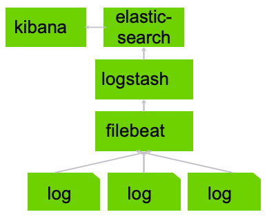

# Filebeat

---

## Filebeat: Lightweight Shipper

* Filebeat can optionally talk directly to elasticsearch. when using logstash, elasticsearch is just one of many  possible destinations!

* Logstash and filebeat can communicate to  maintain “backpressure” when things back up

* Filebeat maintains a read pointer on the logs.  every log line acts like a queue.

* Logs can be from apache, nginx, auditd, or mysql

---

## This is Called the Elastic Stack

* prior to beats, you'd hear about the “ELK stack” – Elasticsearch, Logstash, Kibana.

---

## Filebeat vs Logstash

* Wrong question: Use them together.
* It won't let  you overload your pipeline.
* You get more flexibility on scaling your cluster.

---

# Installing Filebeat
---

## Lab: Kibana & Filebeats

* Lab 16: Install filebeats and configure with Kibana

---

