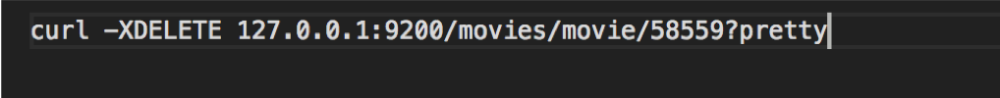
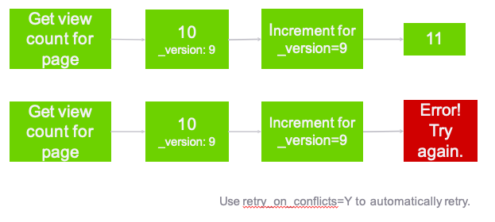

# Indexing


# Importing a Document 

---

## Insert


Notes:

Now that we have our mapping created let’s go ahead and insert a movie

---

## 


Notes:

Now that we have our mapping created let’s go ahead and insert a movie

---

# Import Many Documents
---

## Ison Bulk Import

* **`curl -XPUT	127.0.0.1:9200/_bulk –d ‘`**

```text
{ "create" : { "_index" : "movies", "_type" : "movie", "_id" : "135569" } }
{ "id": "135569", "title" : "Star Trek Beyond", "year":2016 , "genre":["Action", "Adventure", "Sci-Fi"] }
{ "create" : { "_index" : "movies", "_type" : "movie", "_id" : "122886" } }
{ "id": "122886", "title" : "Star Wars: Episode VII - The Force Awakens", "year":2015 , "genre":["Action", "Adventure", "Fantasy", "Sci-Fi", "IMAX"] }
{ "create" : { "_index" : "movies", "_type" : "movie", "_id" : "109487" } }
{ "id": "109487", "title" : "Interstellar", "year":2014 , "genre":["Sci-Fi", "IMAX"] }
{ "create" : { "_index" : "movies", "_type" : "movie", "_id" : "58559" } }
{ "id": "58559", "title" : "Dark Knight, The", "year":2008 , "genre":["Action", "Crime", "Drama", "IMAX"] }
{ "create" : { "_index" : "movies", "_type" : "movie", "_id" : "1924" } }
{ "id": "1924", "title" : "Plan 9 from Outer Space", "year":1959 , "genre":["Horror", "Sci-Fi"] } ‘
```

Notes:

This is an example of importing multiple documents at once. 
The format is kinda funny because if you remember every document gets hashed to a specific shard. 
Elasticsearch goes through this one document at a time, sends it off to whatever shard is storing data related to this type. 

---

## lab04: import documents

* Log into VM 
* Index a document in Elasticsearch
* Index a collection of documents in Elasticsearch

---

# Updating Documents

Notes:

We’ve covered indexing new documents using JSON format in REST API. 
We tried to insert Interstellar twice and it gave us an error. 
Elasticsearch documents are immutable, they can not be changed after creation. 


---

## versions


* Every document has a _version field Elasticsearch documents are immutable. When you update an existing document:
  - a new document is created with an incremented _version
the old document is marked for deletion

Notes:

So while you can't change the original document, you can update it and Elasticsearch will create a new version.
New version created with incremented version number, old version is marked for deletion, and Elasticsearch deletes it in the future.


---

## Partial Update API 

* Lab: 
  - Look at document for Interstellar
  - Run curl command to output Interstellar document data


<br/>


Notes:

Point out the _version and other fields. 

To update we need to run a POST command 


---

## Partial Update apAPIi


* Send data to REST API using `POST` verb Update title for movie with id 109487 
* New version of document created
* Old version deleted (eventually)

Notes:

When a POST command is run to update the document some fun stuff happens. 


---

## Lab05: updates on documents

* Log into VM 
* Index a document in Elasticsearch
* Index a collection of documents in Elasticsearch


---

# Deleting Documents

---

## It couldn’t be easier.

* Just use the DELETE method:

* `curl -XDELETE 127.0.0.1:9200/movies/movie/12345`

Notes:

Just like with PUT, GET and POST, REST has a verb for DELETE and it does exactly what you might think.. deletes things. 

This command will delete movie with id 58559

---

## Lab: delete document

* **Now let's delete the Dark Knight**

* First: Find out movie ID

 

* Second: Delete it!
 
 

* Third: Confirm it was deleted

 

Notes:

Now let's do a class lab where we find out the ID of the "Dark Knight" and then delete it. 

After deleting it let's confirm it is gone by running our search query again. 

---

## Exercise

* **Insert, Update,** and then **delete** a movie  of your choice into the movies index!

Notes:

Create a fictitious movie about whatever you want
Dog
Friends
Family
Vacation.. whatever 
Then search to confirm it was created 
After that update it, any of the fields (title, year, genre) 
Finally delete it, search to confirm it was deleted. 

---

# Dealing with Concurrency

Notes:

Distributed systems can mess up concurrency. what happens when two clients are trying to do the same thing at same time? 
Who wins? 

---

## The Problem


Notes:

Two different clients both running distributed web sites 
Check page count at same time and see 10
Both check page count through Elasticsearch 
Both send update of view count 11 to Elasticsearch at same time….  this is wrong, should be 12 for 2nd client.
]If there's a lot of people hitting your Elasticsearch at the same time this kind of issue can happen. 

Also known as eventually consistency. 


---

## Optimistic Concurrency Control




Notes:

optimistic concurrency control uses the version field to avoid this situation. 
So we have 2 clients that are viewing the page count at the same time, they both see 10, _version: 9
When they POST a new page count value, it specifies it's for version 9, so one of the clients updates it to 11
2nd client tries to update it explicitly for version 9, but Elasticsearch says "Nope, I'm on version 10 now"
Client then starts over, pulls current page count, version 10, POSTS 12. 
Retry on conflicts (automatically retry if it fails) 

---

## Lab 6

* Lab6: Versions & Conflict Resolution


