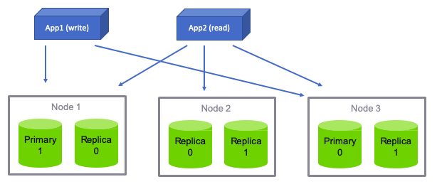
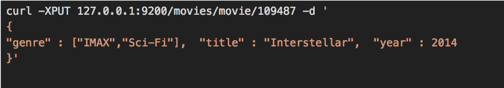
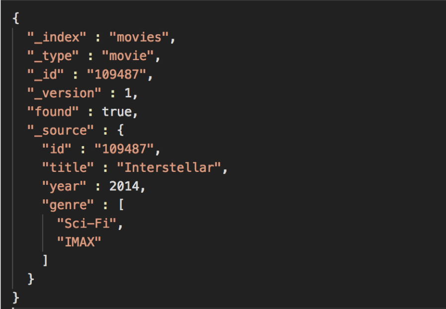
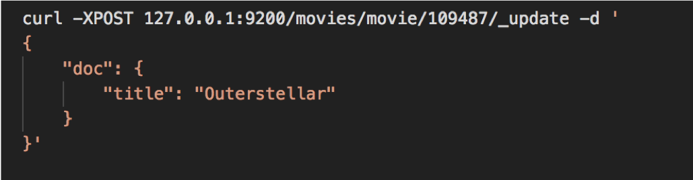

# Indexing


---

# Indexing Intro

---

## Functionality at a Glance

* Defining documents, types, and indices
* Indexing documents with cURL and a data set
* Working with multiple nodes

Notes:


---

## Data Layout

* Logical
  - Index
  - Documents
* Physical
  - Shards
  - Replicas


Notes:


---

## Logical Layout

* Logical layout

| Search   | SQL      |
|----------|----------|
| Field    | Column   |
| Document | Row      |
| Type     | Table    |
| Index    | Database |


* Better yet

| Search   | SQL                           |
|----------|---------------                |
| Field    | Column name, column value.    |
| Document | Row (with any fields)         |
| Type     | Table (with schema or without)|
| Index    | Database                      |


Notes:


---

## Physical Layout

* Location of data
* Index has shards
* Shards are distributed to servers on the cluster
* Shards can change location
* Important to administrators
  - Performance
  - Scalability
  - Availability

Notes:


---

## Logical and Physical Layout


<!-- {"left" : 0.66, "top" : 2.34, "height" : 4.39, "width" : 8.92} -->


Notes:


---

## Elasticsearch Basic Units

* Documents
* Types
* Indices


Notes:


---

## Document

* Self-contained
  - Fields name
  - Field values
* Can be hierarchical
  - Documents within documents
  - Simple field: "Location" -> "Washington"
  - Compound field: "Location" -> ("Washington", "123 Main")
* Has a flexible structure
  - no predefined schema


| Field = DOC_ID | Field = Description | Fields = LatLong       |
|----------------|---------------------|------------------------|
| 0001           | Picnic              | (59.934280, 30.335099) |
| 0002           |                     | (55.755826, 37.6173)   |
| 0003           | Big Apple           |                        |


Notes:


---

## Think of Document as JSON

<!-- {"left" : 0.21, "top" : 1.36, "height" : 2.33, "width" : 7.23} -->


Notes:


---

## Hierarchical Document

<!-- {"left" : 0.21, "top" : 1.36, "height" : 3.05, "width" : 7.58} -->


Notes:


---

## Document Field can have an Array of Values


<!-- {"left" : 0.21, "top" : 1.36, "height" : 2.25, "width" : 8.86} -->


Notes:


---

## Document Types

* Field type = mapping

| Field name  | Field type |
|-------------|------------|
| Name        | string     |
| Geolocation | geo_point  |

<!-- {"left" : 0.25, "top" : 1.84, "height" : 1, "width" : 9.75} -->

* But Documents are schema-free!?
  - Documents do not have to have all fields
  - A new field? – Add it to the mapping!
  - What type? - Guess
* Best practice: define all mappings


Notes:


---

## Indices

* Indices contain mapping types
* Index ~= database
* Each index has its own settings
  - Important to break indices and optimize them separately

<!-- {"left" : 6.9, "top" : 2.31, "height" : 2.14, "width" : 3.2} -->

* Example: `refresh_interval`
  - Determines refresh for near-real time
  - Expensive is done often
  - Typical value: 1 second
  - Some indices may have more or less real-time

* Remember: you can search across indices


Notes:


---

## Sharding

* Number of shards is index-specific
* Shards live on servers
* Shards = Physical + Logical


Notes:


---

## Sharding Architecture

* Three nodes
* File shards
* One replica per shard

<!-- {"left" : 0.67, "top" : 3.12, "height" : 3.49, "width" : 8.91} -->


Notes:


---

# Indexing

---

## Indexing a Document

* When you index a document
  - It is sent to one of the primary shards
  - chosen based on a hash of the document's ID
* The primary shard may be located on a different node
  - transparent to the application
* Then the document is indexed in all of that primary shard's replicas
  - Replicas are in sync with data from the primary shards
  - Replicas can serve searches
* Replicas can be automatically promoted to primary shards
  - If the original primary becomes unavailable.


---

## What Happens in Indexing

<!-- {"left" : 0.59, "top" : 1.93, "height" : 5.21, "width" : 9.07} -->


Notes:


---

## What Happens in Search

* When you search an index
  - Elasticsearch looks in a complete set of shards for that index
  - Shards can be either primary or replicas
  - Primary and replica shards contain the same documents S
* Search load
  - Is distributed between the primary and replica shards
  - Help search performance
  - Helps fault tolerance


Notes:


---

## An Index is Split into Shards


Notes:

Every shard is a self-contained index of Lucene
Once it figured out the document it can map it to a shard and redirect to appropriate node.

---

## What is a Shard?

* A shard is a Lucene index
  - Directory with inverted index
  - We did this already
* Do not confuse Elasticsearch index and Lucene index
  - **Elasticsearch index** is logical
  - It consists of all shards and replicas
  - **Lucene index** is a directory with the inverted index
* Convention
  - Index = Elasticsearch index
  - Lucene index = Lucene index ;)


Notes:


---

## Shard = Lucene Index


<!-- {"left" : 0.75, "top" : 2.6, "height" : 3.87, "width" : 8.76} -->


Notes:


---

## Replicas and Shards

* You have to decide on the number of shards before creating the index
  - The default is 5
* Too few shards limit scalability
* Too many shards impact performance

* You can change the number of replicas per shard
* Replicas can be created or removed

Notes:


---


## Primary and Replica Shards

* This **index** has two **primary shards** and a **replication factor of 2.**
* Your application should round-robin requests amongst nodes.


* **Write** requests are routed to the primary shard, then replicated
* **Read** requests are routed to the primary or any replica


Notes:

Here we have 2 Primary and 4Replica shards.
Writes will go to Primary shards (masters) and reads will hit any shard (primary or replica)
This is how many different clustering solutions are setup.
Elasticsearch figures all this out for you based on the configuration in the /etc/elasticsearch/elasticsearch.yml


---

## Primary and Replica Shards




Notes:

Here we have 2 Primary and 3 Relica shards.
Writes will go to Primary shards (masters) and reads will hit any shard (primary or replica)
This is how many different clustering solutions are setup.
Elasticsearch figures all this out for you.


---

## Primary and Replica Shards


Notes:

Fault tolerant system. Highly redundant
Have an odd node number of nodes so that you avoid split brain.

Split-brain is a computer term, based on an analogy with the medical Split-brain syndrome. It indicates data or availability inconsistencies originating from the maintenance of two separate data sets with overlap in scope, either because of servers in a network
design, or a failure condition based on servers not communicating and synchronizing their data to each other. This last case is also commonly referred to as a network partition.

Although the term split-brain typically refers to an error state, Split-brain DNS (or Split-horizon DNS) is sometimes used to describe a deliberate situation where internal and external DNS services for a corporate network are not communicating, so that separate
 DNS name spaces are to be administrated for external computers and for internal ones. This requires a double administration, and if there is domain overlap in the computer names, there is a risk that the same fully qualified domain name (FQDN), may ambiguously
occur in both name spaces referring to different computer IP addresses.[1]


---

## The number of primary shards cannot be changed later.


* Not as bad as it sounds – you can add  **more replica shards** for more read  throughput.
* Worst case you can **re-index** your data.
* The number of shards can be set up front  via a PUT command via **REST** / HTTP


Notes:

Cannot change primary shards later on. Must define it when setting up cluster.
Most applications require additional read capacity, not write.
You can also re-index your data and copy it over but it's not a fun process
Plan ahead so you have the correct number of primary shards.

By default, each index in Elasticsearch is allocated 5 primary shards and 1 replica which means that if you have at least two nodes in your cluster, your index will have 5 primary shards and another 5 replica shards (1 complete replica) for a total of 10 shards
per index. Each Elasticsearch shard is a Lucene index.

This request says we want 3 in one replica,  we end up with 6 though.


---

## One-Node Cluster

* Five shards
* One replica
* You can start more cluster nodes on the same server

Notes:


---

## Cluster Scaling

* When adding nodes to the cluster
  - shards get balanced between all nodes
* Indexing and search use all nodes
* Scaling = horizontal scaling
  - Adding nodes to the cluster
* Vertical scaling
  - Adding RAM
  - Adding hard drive
  - Helps performance
  - Not always possible
  - Not cost-effective

Notes:


---

## Distributed Indexing

* Elasticsearch node receives your indexing request
  - Node selects the shard to index the document to
  - Default: even distribution
    - Accomplished with hashing by doc ID
    - All shards have an equal hash range
* Target node = node that contains the target shard
* Node sends request to target node
* Indexing operation is replayed by all the replicas of that shard
* Indexing command successfully returns
  - After all the available replicas finish indexing the document


Notes:


---

## Indexing with Sharding and Replicas

<!-- {"left" : 1.61, "top" : 1.44, "height" : 6.77, "width" : 7.02} -->


Notes:


---

## What Happens in Search

* Node that receives the request forwards it to a set of shards
  - Shards contain your data
* Select an available shard (primary or replica)
* Forwards the request to that
* Collect results from all shards
  - Aggregates results into a single reply
  - Return the reply back to the client application


Notes:


---

## Search with Shards and Replicas


<!-- {"left" : 0.39, "top" : 2.16, "height" : 5.33, "width" : 9.46} -->


Notes:


---

## Let Us Start Indexing

* Use cURL
* With REST API
* Send a JSON document
* Verify the reply

Notes:


---

## Index A Document

<!-- {"left" : 0.04, "top" : 1.53, "height" : 1.69, "width" : 10.21} -->


Notes:


---

## Index A Document - Reply

<!-- {"left" : 0.19, "top" : 1.53, "height" : 5.98, "width" : 6.88} -->


Notes:


---

## How Did Indexing Work?

* Elasticsearch automatically added an index
  - `get-together`
* Create a new mapping for the type
  - `Group`
* The mapping contains definitions
  - default: all fields are strings


Notes:


---

## Index Operations

<!-- {"left" : 1.02, "top" : 1.53, "height" : 2.49, "width" : 8.21} -->

* Why create an index manually?
* Creating the index takes time
  - You might want to have the index ready beforehand
* Specify different settings than the ones
  - Specific number of shards.

Notes:


---

## Viewing Mapping

* Mapping is automatically created with the new document
* Elasticsearch automatically detects your fields
* Add a new document with yet another new field?
  - Elasticsearch guesses its type
  - Appends the new field to the mapping
* To view the current mapping, do an HTTP GET
  - This would show you mappings for all types within that index
  - For a specific mapping, specify the type name

<!-- {"left" : 0.22, "top" : 5.18, "height" : 0.87, "width" : 9.81} -->


Notes:


---

## Mapping Reply

<!-- {"left" : 0.21, "top" : 1.17, "height" : 7.3, "width" : 5.21} -->


Notes:


---

## Essential Field Mapping

* Index name—get-together
* Type name—group
* Property list—name and organizer
* Property options—The type option is string for both properties


Notes:


---

## Lab: Indexing

* Please do this lab:

- `elasticsearch/indexing.md`


Notes:


---

## Concurrency and Versions

* Lucene and Elasticsearch maintain document version
* For indexing, updating, and deleting
* Conflict?
  - you can use document versions to manage concurrency issues
* Updating?
  - you can tell Elasticsearch to retry automatically
  - if an update fails because of a concurrency issue

Notes:


---

# Importing a Document 

---

## Insert




Notes:

Now that we have our mapping created let's go ahead and insert a movie

---

## 


Notes:

Now that we have our mapping created let's go ahead and insert a movie

---

# Import Many Documents
---

## Ison Bulk Import

* **`curl -XPUT	127.0.0.1:9200/_bulk –d '`**

```text
{ "create" : { "_index" : "movies", "_type" : "movie", "_id" : "135569" } }
{ "id": "135569", "title" : "Star Trek Beyond", "year":2016 , "genre":["Action", "Adventure", "Sci-Fi"] }
{ "create" : { "_index" : "movies", "_type" : "movie", "_id" : "122886" } }
{ "id": "122886", "title" : "Star Wars: Episode VII - The Force Awakens", "year":2015 , "genre":["Action", "Adventure", "Fantasy", "Sci-Fi", "IMAX"] }
{ "create" : { "_index" : "movies", "_type" : "movie", "_id" : "109487" } }
{ "id": "109487", "title" : "Interstellar", "year":2014 , "genre":["Sci-Fi", "IMAX"] }
{ "create" : { "_index" : "movies", "_type" : "movie", "_id" : "58559" } }
{ "id": "58559", "title" : "Dark Knight, The", "year":2008 , "genre":["Action", "Crime", "Drama", "IMAX"] }
{ "create" : { "_index" : "movies", "_type" : "movie", "_id" : "1924" } }
{ "id": "1924", "title" : "Plan 9 from Outer Space", "year":1959 , "genre":["Horror", "Sci-Fi"] } '
```

Notes:

This is an example of importing multiple documents at once. 
The format is kinda funny because if you remember every document gets hashed to a specific shard. 
Elasticsearch goes through this one document at a time, sends it off to whatever shard is storing data related to this type. 

---

## lab04: import documents

* Log into VM 
* Index a document in Elasticsearch
* Index a collection of documents in Elasticsearch

---

# Updating Documents

Notes:

We've covered indexing new documents using JSON format in REST API. 
We tried to insert Interstellar twice and it gave us an error. 
Elasticsearch documents are immutable, they can not be changed after creation. 


---

## versions


* Every document has a _version field Elasticsearch documents are immutable. When you update an existing document:
  - a new document is created with an incremented _version
the old document is marked for deletion

Notes:

So while you can't change the original document, you can update it and Elasticsearch will create a new version.
New version created with incremented version number, old version is marked for deletion, and Elasticsearch deletes it in the future.


---

## Partial Update API 

* Lab: 
  - Look at document for Interstellar
  - Run curl command to output Interstellar document data


<br/>




Notes:

Point out the _version and other fields. 

To update we need to run a POST command 


---

## Partial Update apAPIi



* Send data to REST API using `POST` verb Update title for movie with id 109487 
* New version of document created
* Old version deleted (eventually)

Notes:

When a POST command is run to update the document some fun stuff happens. 


---

## Lab05: updates on documents

* Log into VM 
* Index a document in Elasticsearch
* Index a collection of documents in Elasticsearch


---

# Deleting Documents

---

## It couldn't be easier.

* Just use the DELETE method:

* `curl -XDELETE 127.0.0.1:9200/movies/movie/12345`

Notes:

Just like with PUT, GET and POST, REST has a verb for DELETE and it does exactly what you might think.. deletes things. 

This command will delete movie with id 58559

---

## Lab: delete document

* **Now let's delete the Dark Knight**

* First: Find out movie ID

 

* Second: Delete it!
 
 

* Third: Confirm it was deleted

 

Notes:

Now let's do a class lab where we find out the ID of the "Dark Knight" and then delete it. 

After deleting it let's confirm it is gone by running our search query again. 

---

## Exercise

* **Insert, Update,** and then **delete** a movie  of your choice into the movies index!

Notes:

Create a fictitious movie about whatever you want
Dog
Friends
Family
Vacation.. whatever 
Then search to confirm it was created 
After that update it, any of the fields (title, year, genre) 
Finally delete it, search to confirm it was deleted. 

---

# Dealing with Concurrency

Notes:

Distributed systems can mess up concurrency. what happens when two clients are trying to do the same thing at same time? 
Who wins? 

---

## The Problem


Notes:

Two different clients both running distributed web sites 
Check page count at same time and see 10
Both check page count through Elasticsearch 
Both send update of view count 11 to Elasticsearch at same time….  this is wrong, should be 12 for 2nd client.
]If there's a lot of people hitting your Elasticsearch at the same time this kind of issue can happen. 

Also known as eventually consistency. 


---

## Optimistic Concurrency Control


Notes:

optimistic concurrency control uses the version field to avoid this situation. 
So we have 2 clients that are viewing the page count at the same time, they both see 10, _version: 9
When they POST a new page count value, it specifies it's for version 9, so one of the clients updates it to 11
2nd client tries to update it explicitly for version 9, but Elasticsearch says "Nope, I'm on version 10 now"
Client then starts over, pulls current page count, version 10, POSTS 12. 
Retry on conflicts (automatically retry if it fails) 

---

## Lab 6

* Lab6: Versions & Conflict Resolution


