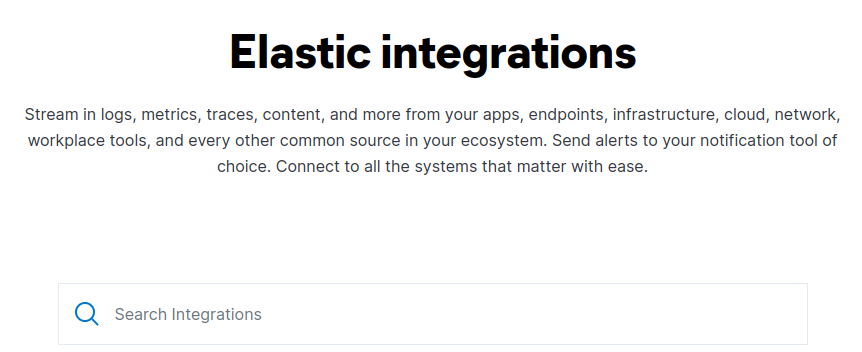
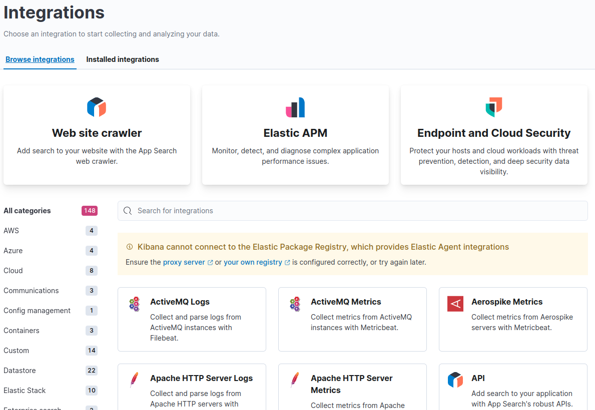

# Integrations

---

## What are "Integrations"?

* Integrations are not plugins, but are external tools or modules that make it easier to work with Elasticsearch.

Notes:

---

## CMS: Supported by Community

* ElasticPress: Elasticsearch WordPress Plugin
* Tiki Wiki CMS Groupware: Tiki has native support for Elasticsearch. This provides faster & better search (facets, etc), along with some Natural Language Processing features (ex.: More like this)
* XWiki Next Generation Wiki: XWiki has an Elasticsearch and Kibana macro allowing to run Elasticsearch queries and display the results in XWiki pages using XWiki’s scripting language as well as include Kibana Widgets in XWiki pages

---

## Data Import/Export and Validation

* Supported by Elastic
  * Logstash output to Elasticsearch: The Logstash elasticsearch output plugin.
  * Elasticsearch input to Logstash The Logstash elasticsearch input plugin.
  * Elasticsearch event filtering in Logstash The Logstash elasticsearch filter plugin.
  * Elasticsearch bulk codec The Logstash es_bulk plugin decodes the Elasticsearch bulk format into individual events.

---

## Data Import/Export and Validation

* Supported by the community
  * Ingest processor template: A template for creating new ingest processors.
  * Kafka Standalone Consumer (Indexer): Kafka Standalone Consumer [Indexer] will read messages from Kafka in batches, processes(as implemented) and bulk-indexes them into Elasticsearch. Flexible and scalable. More documentation in above GitHub repo’s Wiki.
  * Scrutineer: A high performance consistency checker to compare what you’ve indexed with your source of truth content (e.g. DB)
  * FS Crawler: The File System (FS) crawler allows to index documents (PDF, Open Office…​) from your local file system and over SSH. (by David Pilato)
  * Elasticsearch Evolution: A library to migrate elasticsearch mappings.
  * PGSync: A tool for syncing data from Postgres to Elasticsearch.
  
---

## Deployment

* Supported by the community
  * Ansible: Ansible playbook for Elasticsearch.
  * Puppet: Elasticsearch puppet module.
  * Chef: Chef cookbook for Elasticsearch

---

## Framework integrations
  * Supported by the community
    * Apache Camel Integration: An Apache camel component to integrate Elasticsearch
    * Catmandu: An Elasticsearch backend for the Catmandu framework.
    * FOSElasticaBundle: Symfony2 Bundle wrapping Elastica.
    * Grails: Elasticsearch Grails plugin.
    * Hibernate Search Integration with Hibernate ORM, from the Hibernate team. Automatic synchronization of write operations, yet exposes full Elasticsearch capabilities for queries. Can return either Elasticsearch native or re-map queries back into managed entities loaded within transaction from the reference database.
    * Spring Data Elasticsearch: Spring Data implementation for Elasticsearch
    * Spring Elasticsearch: Spring Factory for Elasticsearch

---

## Framework integrations, cont'd
* Supported by the community
  * Spring Data Elasticsearch: Spring Data implementation for Elasticsearch
  * Spring Elasticsearch: Spring Factory for Elasticsearch
  * Zeebe: An Elasticsearch exporter acts as a bridge between Zeebe and Elasticsearch
  * Apache Pulsar: The Elasticsearch Sink Connector is used to pull messages from Pulsar topics and persist the messages to a index.
  * Micronaut Elasticsearch Integration: Integration of Micronaut with Elasticsearch
  * Apache StreamPipes: StreamPipes is a framework that enables users to work with IoT data sources.
  * Apache MetaModel: Providing a common interface for discovery, exploration of metadata and querying of different types of data sources.
  * Micrometer: Vendor-neutral application metrics facade. Think SLF4j, but for metrics.

---

## Hadoop Integrations

* Supported by Elastic
  * es-hadoop: Elasticsearch real-time search and analytics natively integrated with Hadoop. Supports Map/Reduce, Cascading, Apache Hive, Apache Pig, Apache Spark and Apache Storm.
* Supported by the community
  * Garmadon: Garmadon is a solution for Hadoop Cluster realtime introspection.

---

## Health and Performance Monitoring

* Supported by the community
  * SPM for Elasticsearch: Performance monitoring with live charts showing cluster and node stats, integrated alerts, email reports, etc.
  * Zabbix monitoring template: Monitor the performance and status of your Elasticsearch nodes and cluster with Zabbix and receive events information.

---

## Introduction to plugins

* Plugins are a way to enhance the core Elasticsearch functionality in a custom manner. They range from adding custom mapping types, custom analyzers, native scripts, custom discovery and more.

* Plugins contain JAR files, but may also contain scripts and config files, and must be installed on every node in the cluster. After installation, each node must be restarted before the plugin becomes visible.

---

## Integrations illuminated

---

## Integrations ready to go

---

